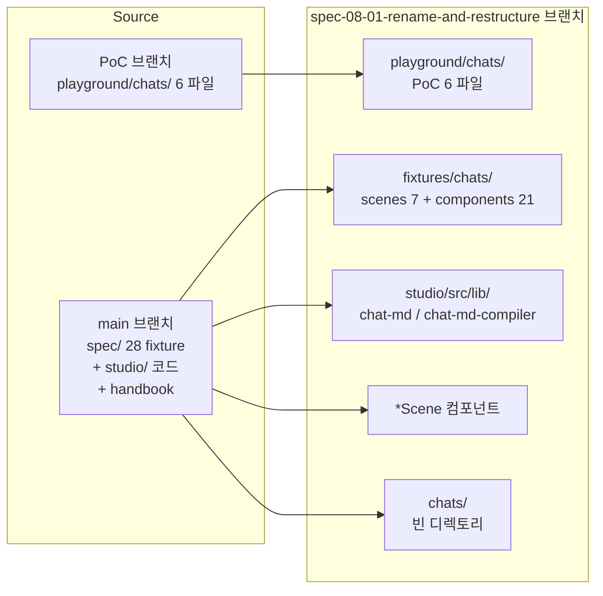

# Implementation Plan: spec-08-01

## 📋 Branch Strategy

- 신규 브랜치: `spec-08-01-rename-and-restructure`
- 시작 지점: **`main`** (phase-08 첫 spec — base branch `phase-08-chat-agent-flow` 가 ship 시 자동 생성)
- 첫 task 가 브랜치 생성 + PoC 6 파일 cherry-pick

## 🛑 사용자 검토 필요 (User Review Required)

> [!IMPORTANT]
> - [ ] **`*Page` → `*Scene` rename (7 templates)**: catalog 외부 export 컴포넌트 이름 변경 — 잠재 breaking. 현재 외부 사용자 0 명이라 OK. 단 catalog.json 의 templates 영역 + spec.md grammar 의 알려진 컴포넌트 셋 둘 다 갱신.
> - [ ] **`*.spec.md` → `*.chat.md` 확장자**: 28 fixture + Studio fixtures.generated.ts 의 import 경로 + 모든 테스트 fixture 참조 일괄 갱신. *미세 누락 위험*.
> - [ ] **PoC 6 파일 채택**: `poc-chat-agent-flow` 의 `playground/chats/` 6 파일 *형식 그대로* 채택. spec-8-04 (chat-md-grammar) 가 grammar 정착 후 *frontmatter / 섹션 강제 검증* 추가될 때 채울 수 있도록 우회 — 즉 *지금* 은 parser 가 무시 가능한 마크다운으로만.

> [!WARNING]
> - [ ] **회귀 검증 3 게이트**: `pnpm test` 724/724 + `pnpm build` exit 0 + ts-diagnose 28-fixture critical 0. 하나라도 실패 시 즉시 stop + report.
> - [ ] **시맨틱 변경 0 약속**: rename + move 만. 컴파일러 *출력* / parser *AST* / grammar *의미* 변경 0. 발견 시 별 spec 분리.
> - [ ] **CLI script 변경 시 사용자 환경 영향**: `pnpm spec-react` 가 *지금 사용자 손 또는 다른 도구가 호출* 한다면 deprecate 알림 필요. 현재 외부 호출 0 가정.

## 🎯 핵심 전략 (Core Strategy)

### 아키텍처 컨텍스트



### 주요 결정

| 컴포넌트 | 전략 | 이유 |
|:---|:---|:---|
| **fixture 분류** | scene 7 (페이지 단위) + component 21 | 파일명에 *page* 들어가면 scenes/, 그 외 components/. *VariantWrapper* 는 templates → components/ (페이지 아님) |
| **`*Page` → `*Scene`** | git mv + grep -rl 일괄 substitute | *VariantWrapper* 도 함께 (이름 자체는 안 바꾸되, templates → composites 위치 이동? — 결정: 위치 그대로, 이름 그대로 — *Page suffix 가 없는 templates 는 손대지 않음*) |
| **확장자 변경** | `git mv` 후 모든 참조 grep | sed 위험 회피 — 한 번에 한 파일씩 검증 |
| **import 갱신** | TypeScript path alias (`@/`) 우선 활용 | 절대 경로 import 가 깨질 위험 ↓ |
| **catalog.json** | cva extractor (`pnpm fixtures:gen` + extract-vocabulary.ts) 재실행 | *Page → *Scene 이 컴포넌트 코드에서 갱신되면 자동 반영 |
| **handbook 본문** | grep 단순 substitute | full 재작성은 spec-8-02 — 본 spec 은 *어휘 일관성* 만 |

## 📂 Proposed Changes

### [디렉토리 구조]

#### [NEW] `fixtures/chats/scenes/` (7)
- `dashboard.chat.md` ← 기존 `spec/dashboard-page.spec.md`
- `error.chat.md` ← `error-page.spec.md`
- `login.chat.md` ← `login-page.spec.md`
- `my.chat.md` ← `my-page.spec.md`
- `settings.chat.md` ← `settings-page.spec.md`
- `signup.chat.md` ← `signup-page.spec.md`
- `variant-wrapper.chat.md` ← `variant-wrapper.spec.md` (templates 이지만 *page* 아닌 케이스 — components/ 가 더 자연 — 결정: components/variant-wrapper.chat.md)

#### [NEW] `fixtures/chats/components/` (21)
- 28 - 7 = 21 (button / login-form / activity-summary / 등)

#### [NEW] `playground/chats/` (PoC 6 파일 cherry-pick)
- `_shell.chat.md`, `scenes/main.chat.md`, `scenes/login.chat.md`
- `components/empty-state.chat.md`, `components/brand-header.chat.md`, `components/app-footer.chat.md`

#### [NEW] `chats/.gitkeep`
- 빈 디렉토리 시작 — 정식 산출물 위치

#### [DELETE] `spec/` 전체
- 28 파일 모두 위 두 위치로 이동 후 디렉토리 자체 제거

### [코드 rename]

#### [MOVE] `studio/src/lib/spec-md/` → `studio/src/lib/chat-md/`
- 하위 모든 파일 그대로 이동
- import 경로 업데이트 (다른 모듈에서 `@/lib/spec-md` → `@/lib/chat-md`)

#### [MOVE] `studio/src/lib/spec-md-compiler/` → `studio/src/lib/chat-md-compiler/`
- 동일 패턴

#### [MODIFY] `studio/src/lib/paper-inference/infer.ts`
- `inferSpec` → `inferChat` (export name + 호출부)

#### [MOVE] 7 templates 컴포넌트 파일
- `studio/src/components/templates/LoginPage.tsx` → `LoginScene.tsx`
- `studio/src/components/templates/DashboardPage.tsx` → `DashboardScene.tsx`
- (... 7 개)
- `VariantWrapper.tsx` 는 *유지* (이름에 Page 없음)

#### [MODIFY] `studio/src/lib/spec-md-compiler/paper/component-registry.ts`
- import statements + COMPONENT_REGISTRY 키 + COMPONENT_IMPORT_PATHS 키 — *Page → *Scene 일괄

#### [MODIFY] `studio/package.json` scripts
- `spec-react` → `chat-react`
- `spec-paper` → `chat-paper`
- `paper-to-spec` → `paper-to-chat`
- `fixtures:gen` 의 입력 경로 갱신 (`spec/` → `fixtures/chats/`)

### [Studio fixtures.generated.ts 입력 경로]

#### [MODIFY] `studio/scripts/generate-fixtures-index.ts`
- 입력 source: `spec/*.spec.md` → `fixtures/chats/{scenes,components}/*.chat.md`
- 출력 그대로 (`studio/src/features/preview/fixtures.generated.ts`)
- *동적 fetch 로의 전환* 은 spec-8-10 — 본 spec 은 *경로만* 갱신

### [handbook + README]

#### [MODIFY] `docs/handbook.md`
- §2 / §3 / §4 / §6 R5 / §7 의 *spec.md* 등장 → *chat.md*
- *디자인 도구의 spec* → *chat*
- *Page → Scene* 어휘 갱신
- 단 *full 재작성* (시나리오 추가 / 새 컴포넌트 워크플로 / agent 도서관 절) 은 spec-8-02

#### [MODIFY] `README.md`
- handbook 진입점 추가 (PoC 통증 #1) 는 spec-8-02. 본 spec 은 어휘만.

## 🧪 검증 계획 (Verification Plan)

### 단위 테스트 (필수)
```bash
cd studio && pnpm test
```
- 기대: 724/724 PASS (시맨틱 변경 0 → 회귀 0)
- 실패 시 즉시 stop + 원인 분석

### 통합 테스트 (Integration Test Required = yes)
```bash
# in-process tsc 진단 (spec-7-10 도입)
cd studio && pnpm test src/lib/spec-md-compiler/react/__tests__/ts-diagnose.test.ts
# rename 후: chat-md-compiler/react/__tests__/ts-diagnose.test.ts
```
- 기대: 28/28 critical 0
- spec/ → fixtures/chats/ rename 후 fixture 인식이 잘 되는지가 핵심

### 빌드
```bash
pnpm --filter studio build
```
- 기대: exit 0 (TS6133 / 미해소 import / 경로 깨짐 모두 0)

### 수동 검증 시나리오
1. `pnpm chat-react fixtures/chats/scenes/login.chat.md` → 결과 TSX 가 기존 `spec-react spec/login-page.spec.md` 과 *완전 동일* (rename 만 적용된 것 외 차이 0)
   - 비교 방법: 두 출력의 hash diff. 단 함수명은 LoginPage → LoginScene 차이 정상.
2. Studio 실행 (`pnpm dev`) → spec editor 패널이 28 fixture 모두 인식 + 미리보기 정상

## 🔁 Rollback Plan

- 모든 변경 한 PR. 머지 후 문제 발견 시 `git revert <merge-commit>`
- 단 rename 의 광범위 영향으로 partial revert 어려움 — 발견 즉시 신규 fix-spec 권장

## 📦 Deliverables 체크

- [ ] task.md 작성 (다음 단계)
- [ ] 사용자 Plan Accept 받음
- [ ] (실행 후) 모든 task 완료
- [ ] (실행 후) walkthrough.md / pr_description.md ship
