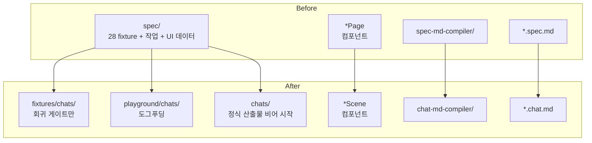

# spec-08-01: 어휘 / 디렉토리 / 코드 일괄 rename — `spec` → `chat`, `Page` → `Scene`

## 📋 메타

| 항목 | 값 |
|---|---|
| **Spec ID** | `spec-08-01` |
| **Phase** | `phase-8` (chat-agent-flow) |
| **Branch** | `spec-08-01-rename-and-restructure` |
| **상태** | Planning |
| **타입** | Refactor |
| **Integration Test Required** | yes (회귀 게이트: 724 tests + build + ts-diagnose 28-fixture critical 0) |
| **작성일** | 2026-05-10 |
| **소유자** | dennis |

## 📋 배경 및 문제 정의

### 현재 상황

phase-7 ship 직후 도그푸딩 시뮬레이션 (`poc-chat-agent-flow` 브랜치) 이 *어휘 충돌* 을 critical 차단점으로 식별:

| 어휘 | 의미 (현재) |
|---|---|
| **harness-kit spec** | SDD 작업 흔적 (`specs/spec-X-Y/`) — 작업 종료 시 동결 |
| **우리 도구의 spec** | 디자인 산출물 (`spec/login-page.spec.md`) — 살아있는 소통 채널 |

신규 디자이너가 첫 5분에 *어떤 spec 인지* 헷갈림. handbook §4 의 가이드를 그대로 따르면 회귀 fixture 와 작업물이 같은 디렉토리에 섞임 (PoC 통증 #4 — Critical 차단점).

### 문제점

1. **어휘 두 의미** — 시스템이 영원히 헷갈림
2. **`spec/` 디렉토리 3 역할** — 회귀 fixture (28) + handbook §4 작업 산출물 + Studio UI 데이터 source
3. **`*Page` 컴포넌트명** — page 가 *routing/URL* 함의 → 화면 의미 모호 (PoC 결과 *scene* 이 정확)
4. **신규 디자이너 도그푸딩 차단** — 위 셋이 동시 발생

### 해결 방안 (요약)

- *어휘*: 디자인 산출물 = **chat** 으로 rename. *Page* 컴포넌트명 → *Scene*.
- *디렉토리*: `spec/` → 셋으로 분리:
  - `fixtures/chats/{scenes,components}/` — 회귀 게이트 (28 분류)
  - `playground/chats/{scenes,components}/` — 도그푸딩 (PoC 6 파일 채택)
  - `chats/{scenes,components}/` — 정식 산출물 (비어 시작)
- *코드*: `spec-md/` → `chat-md/`, `spec-md-compiler/` → `chat-md-compiler/`, `inferSpec` → `inferChat` 등.
- *시맨틱 변경 0* — rename + 디렉토리 이동만. grammar 확장 / 컴파일러 의미 변경은 후속 spec (8-04, 8-07).

## 📊 개념도

## 🎯 요구사항

### Functional Requirements

1. **`spec/` 디렉토리 분리**:
   - `fixtures/chats/scenes/` — `dashboard-page → scenes/dashboard.chat.md` 등 7 scene
   - `fixtures/chats/components/` — `button → components/button.chat.md` 등 21 component
2. **`playground/chats/` 채택** — PoC 의 6 파일 (`empty-state`, `brand-header`, `app-footer`, `_shell`, `main`, `login`) 그대로
3. **`chats/` 신규 빈 디렉토리** — 정식 산출물 위치 (`.gitkeep`)
4. **컴포넌트 rename**: `*Page` (templates 7) → `*Scene` — `LoginPage`/`DashboardPage`/`MyPage`/`SignupPage`/`SettingsPage`/`ErrorPage`/`VariantWrapper` → `LoginScene` 등
5. **코드 rename**:
   - `studio/src/lib/spec-md/` → `chat-md/`
   - `studio/src/lib/spec-md-compiler/` → `chat-md-compiler/`
   - `inferSpec` → `inferChat` (paper-inference)
   - 모든 import / export 일관 갱신
6. **CLI rename** (`studio/package.json` scripts):
   - `spec-react` → `chat-react`
   - `spec-paper` → `chat-paper`
   - `paper-to-spec` → `paper-to-chat`
7. **확장자 일관**: `*.spec.md` → `*.chat.md` (28 fixture)
8. **Catalog auto-extract 갱신**: `*Page` → `*Scene` cva extractor 자동 반영. `catalog.json` 의 templates 영역 갱신.
9. **handbook + README 어휘 grep**: *spec* (디자인 의미) 등장 모두 *chat* 으로. 단 *full handbook 재작성* 은 spec-8-02.

### Non-Functional Requirements

1. **시맨틱 변경 0**: rename + move 만. 컴파일러 출력 / parser AST / grammar 의미 변경 0.
2. **회귀 0**: `pnpm test` 724/724 PASS, `pnpm build` exit 0, ts-diagnose 28/28 critical 0.
3. **git blame 보존**: `git mv` 활용.
4. **PoC 채택**: `poc-chat-agent-flow` 브랜치의 6 chat.md merge — 디렉토리 안 형식 그대로 (형식 정착은 spec-8-04).

## 🚫 Out of Scope

- **chat.md grammar 확장** (frontmatter / Narrative / Structure / History / shell) — spec-8-04
- **handbook full 재작성** — spec-8-02 (본 spec 은 *grep 단순 갱신* 만)
- **컴파일러 의미 변경** (shell inherit, scene 통짜) — spec-8-07
- **Paper MCP 어댑터** — spec-8-03
- **Studio runtime fetch** — spec-8-10
- **ADR-010 작성** — spec-8-05
- **외부 alpha** — spec-8-11

## ✅ Definition of Done

- [ ] 28 fixture `fixtures/chats/{scenes,components}/` 분류 + rename
- [ ] `playground/chats/` PoC 6 파일 채택
- [ ] `chats/` 빈 디렉토리 (`.gitkeep`)
- [ ] `studio/src/lib/spec-md/` → `chat-md/` rename + import 갱신
- [ ] `studio/src/lib/spec-md-compiler/` → `chat-md-compiler/` rename
- [ ] `inferSpec` → `inferChat` rename
- [ ] 7 templates `*Page` → `*Scene` rename
- [ ] CLI script 이름 갱신 (package.json)
- [ ] handbook + README 의 spec → chat grep 갱신 (full 재작성 제외)
- [ ] `pnpm --filter studio test` 724/724 PASS
- [ ] `pnpm --filter studio build` exit 0
- [ ] ts-diagnose 28/28 critical 0
- [ ] `walkthrough.md` + `pr_description.md` ship commit
- [ ] PR 생성 + 사용자 검토 요청
