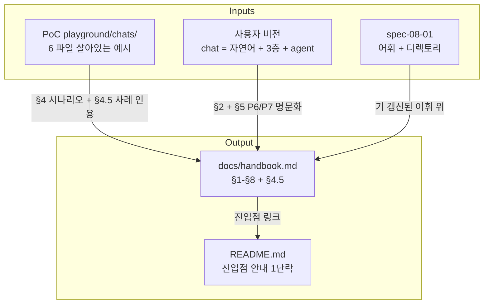

# Implementation Plan: spec-08-02

## 📋 Branch Strategy

- 신규 브랜치: `spec-08-02-handbook-and-conventions`
- 시작 지점: **`phase-08-chat-agent-flow`** (phase base branch — spec-08-01 머지 후 origin push 됨)
- 첫 task 가 브랜치 생성

## 🛑 사용자 검토 필요 (User Review Required)

> [!IMPORTANT]
> - [ ] **handbook 분량 증가**: 320 → 700~900 줄. *5 분 안에 §1-§4 통독* 약속 유지하기 위해 §5-§7 압축 / 부록 활용.
> - [ ] **agent 도서관 사서 역할의 *공식화***: P6 원칙으로 명문화 — agent.md 의 operating rules 와 별도. *디자인 도구의 agent* (Claude in MCP) 의 약속.
> - [ ] **layer-name 컨벤션 R7**: Paper 측 강제 X (Paper MCP 가 임의 layer-name 허용). *디자이너 컨벤션* 으로만. spec-08-03 (paper-mcp-adapter) 가 파싱.
> - [ ] **playground 인용**: PoC 6 파일을 *살아있는 예시* 로 §4 시나리오 + §4.5 사례에 직접 인용 + 링크. 후속 spec 진행 시 playground 변경되면 handbook 도 함께.

> [!WARNING]
> - [ ] **회귀 안전**: 코드 변경 0 — `pnpm test` 회귀 0 약속. 단 README 갱신은 *외부 빌드* (예: GitHub README 표시) 영향 없음.
> - [ ] **ADR-010 자리 예약 vs 본문 부재**: §8 인덱스에 ADR-010 행 추가하되 *작성 예정 (spec-08-05)* 명시. 링크는 *future placeholder*.

## 🎯 핵심 전략 (Core Strategy)

### 아키텍처 컨텍스트



### 주요 결정

| 컴포넌트 | 전략 | 이유 |
|:---|:---|:---|
| **README 진입점** | 첫 단락 끝에 *"신규 디자이너 → docs/handbook.md"* 한 줄 + handbook 의 §1-§4 5분 통독 약속 | PoC 통증 #1 직접 해소. 최소 변경 |
| **handbook 분량 분배** | §1 (50줄) / §2 (180줄) / §3 (80줄) / §4 (200줄) / §4.5 신규 (100줄) / §5 (60줄) / §6 (60줄) / §7 (80줄) / §8 (60줄) — 약 870줄 | §2 (Glossary) + §4 (워크플로) 가 핵심 학습 자료. 나머지는 참조 |
| **mermaid 신규** | §1 (1, 갱신) + §3 (1, 갱신) + §4 (1, 신규 — agent 도서관 흐름) = 3 개 | §4 의 agent 매개 흐름은 텍스트만으론 어려움. mermaid 가 시각 통신 |
| **playground 인용 형식** | §4 각 Day 마지막에 *"📁 살아있는 예시: [chats/components/empty-state.chat.md](../playground/chats/components/empty-state.chat.md)"* 링크 | 추상 설명 + 구체 사례 결합. 디자이너가 *이렇게 적힌 거구나* 즉시 확인 |
| **§4.5 새 컴포넌트 워크플로** | EmptyState 사례 단계별 — Paper 그림 → catalog hint → studio 코드 (cva) → chat.md narrative → catalog auto-extract | EmptyState 가 *catalog 미등재 신규* 였던 PoC 의 사례. 추상 가이드보다 구체 |
| **P6 / P7 / R7 신규** | 짧고 강력한 한 문장씩 + 1~2 단락 부연 | 원칙은 길어지면 약함 |
| **ADR-010 자리 예약** | §8 인덱스에 행 추가 + *상태: 작성 예정 (spec-08-05)* | 미래 ADR 의 *위치 약속* — 후속 spec 의 표지 |
| **회귀 안전** | 코드 변경 0 — handbook 갱신만. studio test / build 영향 0 | 단순 docs spec 의 정직한 약속 |

## 📂 Proposed Changes

### [README]

#### [MODIFY] `README.md`
- 첫 단락 끝에 한 단락 추가:
  ```markdown
  ## 🚀 신규 진입자
  처음 본 프로젝트를 보신다면 **[`docs/handbook.md`](docs/handbook.md)** 부터 읽어주세요.
  §1 (한 줄 요약) → §4 (디자이너 워크플로) 까지 5 분 안에 통독 가능.
  ```

### [handbook §1-§8 + §4.5]

#### [REWRITE] `docs/handbook.md`
- 현재 320 줄 → 약 700-900 줄
- 어휘 (chat / scene / component) 는 spec-08-01 결과 위에 유지
- 8 섹션 + §4.5 신규
- 3 mermaid (§1, §3 갱신 + §4 신규 agent 흐름)
- playground/chats/ 6 파일 *링크 + 인용*
- ADR 9 + ADR-010 자리 예약

세부 변경:

**§1 한 줄 + 시각**:
- 한 줄 정의 유지 ("chat markdown ...")
- mermaid 갱신: 자연어 input → MCP agent → 3층 chat.md → Paper visual + React TSX
- 4 축 어휘 정합 박스 유지

**§2 Glossary** (가장 큰 갱신):
- SSOT 4 문서 + 디렉토리 (fixtures/playground/chats — 3 분리) — 갱신
- chat = 3층 구조 (Narrative + Structure + History) — 신규 정의 + 의미
- shell — 모든 scene 의 공통 외각 (`_shell.chat.md`)
- scene / component — 화면 단위 vs 부분 단위
- agent (도서관 사서) — Claude in MCP, 매 chat 갱신 시 컨텍스트 읽고 재사용 / 승격 / 제약 능동 제안
- layer-name 컨벤션 — Paper 의 식별성 anchor
- Tier 1-3 / L1-L4 (기존 유지)
- Canonical / Round-trip (기존 유지)

**§3 매트릭스**:
- 행 추가: `playground/chats/` (도그푸딩 — 가변), `chats/` (정식 — 변동), `fixtures/chats/` (회귀 — 거의 안 변함)
- 디렉토리 결정 (ADR-008) 갱신 — 옵션 B 의 *현재 상태* + chat 흐름의 자동 정리는 spec-08-08 후보

**§4 워크플로 (Profile Scene)**:
- 기존 Profile Page → Profile Scene
- Day 1 Paper MCP 직접 — *Studio Paper preview 패널은 phase-9 후보, 현재 디자이너 환경 = Claude Code + Paper MCP*
- Day 2 agent 자연어 추출 — PoC 세션 1 패턴
- Day 3 chat.md 확정 + Paper preview 검증 (재실행 — 양방향)
- Day 4 글로벌 SSOT 직접 편집 (ADR-008 옵션 B)
- Day 5 검증 + PR — `pnpm chat-react` + `pnpm --filter studio build`
- 새 mermaid 추가 (agent 도서관 흐름)
- 각 Day 마지막에 playground 링크

**§4.5 새 컴포넌트 추가** (신규):
- EmptyState 사례 단계 (PoC 출처)
- vocabulary-first 원칙 (P3) 적용
- catalog hint frontmatter (`status: new` → 채택 후 `existing`)
- studio 컴포넌트 코드 작성 (cva 패턴) → `pnpm vocab` 으로 catalog 자동 갱신
- chat.md narrative 의 *디자인 의도* 기록
- 후속 scene 에서 재사용 가능

**§5 원칙**:
- P1 ~ P5 유지
- **P6 신규**: agent 도서관 사서 — *매 chat 갱신 시 catalog + 기존 chats 컨텍스트 읽고 재사용 / 승격 / 제약 능동 제안*
- **P7 신규**: chat 은 살아있다 — *재편집 가능, 명령 + 부산물 동시*

**§6 룰**:
- R1 ~ R6 유지
- **R7 신규**: layer-name 식별성 컨벤션 — *Paper artboard / 주요 frame 의 layer-name 에 `[chat:scenes/<slug>]` 또는 `[chat:components/<slug>]`*

**§7 도구**:
- sdd CLI 표 유지
- gen-design CLI 표 갱신:
  - **`gen-design paper-import`** (⭐ 0, **phase-8 도그푸딩 첫 게이트**) — 신규 행
  - 기존 lint / diff / paper / react / merge 5 명령 그대로
- 기존 부분 CLI 표 — `pnpm chat-react` 등 spec-08-01 의 새 이름 반영 (이미 spec-08-01 에서 갱신)

**§8 ADR 인덱스**:
- ADR-001 ~ 009 유지
- **ADR-010 행 추가**: 슬러그 = `chat-promotion-policy`. 상태 = *작성 예정 (spec-08-05)*. 1줄 요약 = "chat 의 글로벌 승격 정책 + ADR-008 reconsider".

### [회귀 안전]

#### 코드 변경 0
- studio/ 변경 X
- catalog.json 변경 X
- 28 fixture 변경 X
- README + handbook 만

#### 검증
```bash
cd studio && pnpm test     # 725/725 PASS 유지 기대
pnpm --filter studio build  # exit 0 유지
```

## 🧪 검증 계획 (Verification Plan)

### 단위 테스트
- 코드 변경 0 → 단위 테스트 직접 영향 없음
- 회귀 안전 확인: `pnpm test` 그대로 통과

### 통합 테스트
- 본 spec 의 통합 테스트 = *handbook reading test* (수동)
- 다음 시나리오 — 신규 디자이너 페르소나로:
  1. README 첫 5줄 → handbook 진입점 발견
  2. handbook §1 5초 안에 한 줄 정의 이해
  3. handbook §2 1분 안에 chat / scene / component / 3층 / shell / agent 어휘 이해
  4. handbook §4 5분 안에 Profile Scene 시나리오 통독 (Day 1-5)
  5. handbook §4.5 EmptyState 사례 — 새 컴포넌트 추가 흐름 이해

### 수동 검증 시나리오
1. **링크 정합성**: handbook §8 의 ADR-001 ~ 009 + ADR-010 자리 예약 + playground 6 파일 링크 모두 실재 매칭
2. **mermaid 렌더링**: GitHub PR preview 에서 §1 / §3 / §4 의 mermaid 정상 표시
3. **분량 검증**: `wc -l docs/handbook.md` → 700-900 범위
4. **회귀 0**: 위 자동 테스트 그대로

## 🔁 Rollback Plan

- 단일 PR. 머지 후 문제 발견 시 `git revert <merge-commit>`
- 코드 변경 0 → revert 영향 0

## 📦 Deliverables 체크

- [ ] task.md 작성 (다음 단계)
- [ ] 사용자 Plan Accept 받음
- [ ] (실행 후) 모든 task 완료
- [ ] (실행 후) walkthrough.md / pr_description.md ship
