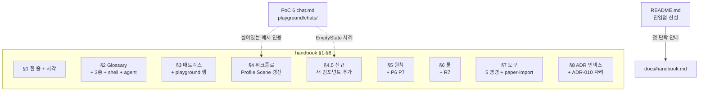

# spec-08-02: handbook full 재작성 + README 진입점 + 새 컴포넌트 워크플로

## 📋 메타

| 항목 | 값 |
|---|---|
| **Spec ID** | `spec-08-02` |
| **Phase** | `phase-8` (chat-agent-flow) |
| **Branch** | `spec-08-02-handbook-and-conventions` |
| **상태** | Planning |
| **타입** | Docs |
| **Integration Test Required** | no (코드 변경 0, 회귀 안전 확인만) |
| **작성일** | 2026-05-10 |
| **소유자** | dennis |

## 📋 배경 및 문제 정의

### 현재 상황

spec-08-01 이 *어휘 grep substitute* 까지 완료. handbook 은 *형태 정합* 되어 있으나:

1. **PoC 통증 #1**: README 가 handbook 진입점을 가리키지 않음 — 신규 디자이너 진입 0 분 막힘.
2. **PoC 통증 #2**: handbook §4 의 *"Paper preview 패널"* 설명 모호 — Paper MCP 직접 사용인지, Studio 내 정적 미리보기인지 불명. 사용자 재프레임 (디자이너 = MCP 환경 직접) 후 명확화 필요.
3. **PoC 통증 #6**: 새 컴포넌트 추가 워크플로 부재 — handbook §4 가 *기존 컴포넌트 재사용 시나리오* 만. EmptyState 처럼 *catalog 미등재* 컴포넌트 추가 흐름 미가이드.
4. **사용자 비전 (3 세션 시뮬레이션 검증)**: chat = 자연어 input + 3층 정리 출력 + agent 의 도서관 사서 역할 — handbook 에 명문화 부재.
5. **playground/chats/ 6 파일** (PoC) 이 *살아있는 예시* 로 활용 가능 — 추상 설명보다 강력한 학습 자료.

### 문제점

- 신규 디자이너가 handbook *만* 읽고 도그푸딩 시작 불가 (W10 alpha 의 전제 미달성)
- agent 매개 흐름의 *기대치* 미명시 — 디자이너가 *agent 에게 무엇을 기대* 해야 하는지 모름
- Paper layer-name 식별성 컨벤션 (`[chat:type/slug]`) 비공식 — PoC 에서만 사용

### 해결 방안 (요약)

handbook 8 섹션 *full 재작성* + README 진입점 추가 + §4.5 새 컴포넌트 워크플로 신규.

## 📊 개념도

## 🎯 요구사항

### Functional Requirements

1. **README**: 첫 단락에 *"신규 디자이너는 `docs/handbook.md` 부터"* 진입점 명시 + 5분 안에 §1-§4 도달 가능 안내.
2. **handbook §1 시각**: mermaid 갱신 — *디자이너 자연어 → MCP agent → 3층 chat.md → Paper 시각* 흐름 반영.
3. **handbook §2 Glossary**:
   - 3층 구조 (Narrative + Structure + History) 정의 + 의미
   - *shell* / *scene* / *component* 어휘
   - *agent 도서관 사서* 역할 (Claude Code in MCP)
   - *layer-name 식별성 컨벤션* (`[chat:type/slug]`)
4. **handbook §3 매트릭스**:
   - `playground/chats/` 행 추가 (도그푸딩 영역)
   - `chats/` 행 추가 (정식 산출물)
   - `fixtures/chats/` 행 갱신 (회귀 게이트 명시)
5. **handbook §4 워크플로**: Profile *Scene* 시나리오 갱신
   - Day 1: Paper MCP 직접 (디자이너 환경 = Claude Code) — handbook 미가이드 부분 명확화
   - Day 2: agent 자연어 추출 (PoC 세션 1 패턴)
   - Day 3: chat.md 확정 + Paper preview 검증
   - Day 4: 글로벌 SSOT 직접 편집 (ADR-008 옵션 B)
   - Day 5: 검증 + PR — `pnpm chat-react` + 빌드
6. **handbook §4.5 신규** — *새 컴포넌트 추가* 워크플로 (EmptyState 사례 인용):
   - vocabulary-first 원칙 (P3) 적용
   - catalog hint frontmatter (`status: new`)
   - studio 컴포넌트 코드 작성 → cva extractor 자동 catalog
   - chat.md narrative 의 *디자인 의도* 기록
7. **handbook §5 원칙**:
   - **P6 (신규)**: *agent 가 도서관 사서* — 매 chat 갱신 시 catalog + 기존 chats 컨텍스트 읽기 → 재사용 / 승격 / 제약 능동 제안
   - **P7 (신규)**: *chat 은 살아있다* — 재편집 가능, 명령 + 부산물 동시
8. **handbook §6 룰**:
   - **R7 (신규)**: *layer-name 식별성 컨벤션* — Paper artboard / 주요 frame 의 layer-name 에 `[chat:scenes/x]` 또는 `[chat:components/x]` 박기
9. **handbook §7 도구**:
   - gen-design 명령 갱신 — `paper-import` (⭐ 0, phase-8 도그푸딩 첫 게이트) 추가
10. **handbook §8 ADR 인덱스**: ADR-010 (chat 승격 정책) *자리 예약* — "spec-08-05 에서 작성 예정"
11. **playground/chats/ 6 파일 인용**: §4 시나리오에 *링크 + 발췌* 형태로 — 추상 설명 + 구체 사례 결합

### Non-Functional Requirements

1. **분량**: 320 줄 → 약 700-900 줄 (3층 구조 + agent 도서관 + 새 컴포넌트 워크플로 추가)
2. **가독성 우선**: *5 분 안에 §1-§4 통독 가능* 유지. 절 내 분량 균등.
3. **링크 정합성**: handbook 의 모든 ADR 링크 + playground 파일 링크 *실재 매칭* 검증.
4. **회귀 안전**: 코드 변경 0 → `pnpm test` 그대로 PASS, build OK.

## 🚫 Out of Scope

- **ADR-010 본문 작성** — spec-08-05
- **chat-md grammar 형식 강제** (frontmatter 검증 / 섹션 의무) — spec-08-04
- **Paper MCP 어댑터 *코드*** — spec-08-03 (handbook 은 *명령 인용* 만)
- **외부 alpha 진행** — spec-08-11
- **Studio runtime fetch** — spec-08-10
- **gen-design CLI 실제 구현** — spec-08-08/09 등 (handbook 은 *설계 인용* 만)

## ✅ Definition of Done

- [ ] README 의 진입점 한 단락 추가 (handbook 으로 안내)
- [ ] handbook 8 섹션 + §4.5 신규 모두 갱신
- [ ] PoC playground/chats/ 6 파일 *링크 + 인용*
- [ ] 9 ADR 링크 + ADR-010 자리 예약 검증
- [ ] 분량 700-900 줄 도달
- [ ] `pnpm test` 회귀 0 — 725/725 PASS 그대로
- [ ] `pnpm --filter studio build` exit 0
- [ ] `walkthrough.md` + `pr_description.md` ship commit
- [ ] PR 생성 (base = `phase-08-chat-agent-flow`) + 사용자 검토
