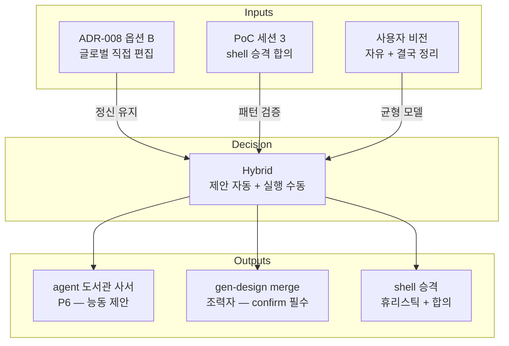

# Implementation Plan: spec-08-03

## 📋 Branch Strategy

- 신규 브랜치: `spec-08-03-adr-010-chat-promotion-policy`
- 시작 지점: `phase-08-chat-agent-flow`
- 첫 task 가 브랜치 생성

## 🛑 사용자 검토 필요 (User Review Required)

> [!IMPORTANT]
> - [ ] **Hybrid (옵션 C) 채택 정당성** — ADR-008 옵션 B 의 *수동* 정신을 깨지 않으면서 chat-매개 흐름의 *자동 제안* 가치 보존. 풀 자동 (옵션 A) 의 *잘못 mv 위험* 회피.
> - [ ] **gen-design merge 명령 의미** — *조력자* (제안 + confirm) — 디자이너 *합의 없이는 mv 0*. spec-08-08 에서 이 의미로 구현.
> - [ ] **ADR-008 의 위치** — ADR-010 가 ADR-008 *재해석* (Hybrid) 이지 *대체* X. ADR-008 의 *글로벌 직접 편집* 정신 유지.

> [!WARNING]
> - [ ] **handbook 의 일관성** — §3 / §7 / §8 모두 ADR-010 결정 반영 일관 갱신. *부분 갱신* 시 후속 spec 의 혼란.
> - [ ] **회귀 안전** — 코드 변경 0. studio test / build 영향 0.

## 🎯 핵심 전략 (Core Strategy)

### 결정 모델



### 주요 결정

| 컴포넌트 | 전략 | 이유 |
|:---|:---|:---|
| **ADR-010 의 ADR-008 관계** | *재해석* (수정 X, Hybrid 명시) | ADR-008 의 *글로벌 직접 편집* 정신 유지. ADR-010 은 *부속* — chat 흐름의 *자동 제안* 추가 |
| **D-1 chat 승격 (playground → chats)** | *디자이너 git mv 직접* + agent 제안 *조력* | 자동 mv 의 *잘못 승격 위험* 회피. 디자이너의 *명시 의도* 가 영구 기록 |
| **D-2 shell 승격 (component → shell)** | *agent 휴리스틱* (3+ scene 공통) → 제안 → *디자이너 합의* → 실행 | PoC 세션 3 검증된 패턴. *agent 가 잘 발견* + *디자이너 가 잘 결정* |
| **D-3 글로벌 SSOT 자동 정리** | *agent 가 글로벌 갱신 제안* + *디자이너 confirm* → 실행 | templates/{DESIGN,FRONT,TOKEN}.md 의 자동 mv 는 *디자인 결정 자동화* 와 동치 — 위험. 합의 후만 |
| **D-4 gen-design merge 명령** | *조력자* — 휴리스틱 후보 제시 + 변경 preview + confirm | 자동 mv 명령은 *위험*. 조력자 형태가 ADR-010 결정과 일치 |
| **D-5 agent 책임 분리** | *제안 (자동 / 매번)* + *실행 (수동 / 합의 후)* | P6 (도서관 사서) 의 의무는 *제안*. *실행* 은 디자이너 |
| **Reconsider trigger** | (a) 디자이너 이동 부담이 *주 1회 이상* 반복 / (b) 외부 alpha 3+ 명 *수동 mv 마찰* 보고 / (c) 자동 mv 가 *진짜 안전한 것 같다* 는 데이터 5+ 사례 | *측정 가능 데이터* 기반 — ADR-008 D-4 패턴 차용 |

## 📂 Proposed Changes

### [ADR-010 신규]

#### [NEW] `docs/decisions/ADR-010-chat-promotion-policy.md`

ADR-007 양식 정확 준수. 약 100-130 줄. 구조:

```markdown
# ADR-010: chat 승격 정책 — Hybrid (제안 자동 + 실행 수동)

> **상태**: 승인 (Accepted)
> **날짜**: 2026-05-10
> **의사결정자**: Dennis
> **연관 문서**: ADR-006 / 007 / 008 / 009 (gen-design CLI), docs/handbook.md §3 / §7
> **선행 ADR**: ADR-008 (per-spec design = 옵션 B). 본 ADR 은 *재해석* — 옵션 B 의 정신 위에 chat-매개 자동 제안 추가.

## 컨텍스트
... (PoC 세션 3 사례 + 사용자 비전 + 옵션 B 의 부분 충돌)

## 결정
### D-1: chat 승격 (playground → chats) = *수동 git mv + agent 조력 제안*
### D-2: shell 승격 = *agent 휴리스틱 + 디자이너 합의*
### D-3: 글로벌 SSOT 자동 정리 = *agent 제안 + confirm*
### D-4: gen-design merge 명령 = *조력자*
### D-5: agent 책임 분리 = *제안 (자동) + 실행 (수동)*

## 대안
- 옵션 A (풀 자동): 거부 — 잘못 mv 위험
- 옵션 B (자동 0): 거부 — chat-매개 가치 약화
- 옵션 C (Hybrid): 채택

## 결과
... (즉시 영향 + 장기 영향 + Out of scope)

## Reconsider trigger
... (3 측정 가능 조건)

## 회고
... (ADR-008 의 정신 유지 + chat 흐름의 자연 발전)
```

### [handbook 갱신]

#### [MODIFY] `docs/handbook.md` §3

디렉토리 결정 절에 ADR-010 의 *Hybrid* 명시:

```diff
+ ### chat 승격 / shell 승격 정책 (ADR-010)
+
+ - **제안 자동**: agent 가 매 chat 갱신 시 컨텍스트 (chats/ + catalog) 읽기 → *재사용 / 승격 / 정리* 후보 능동 제안
+ - **실행 수동**: 디자이너가 *합의* 후 git mv / 글로벌 SSOT 갱신
+ - **gen-design merge 명령**: *조력자* — 휴리스틱 후보 제시 + 변경 preview + confirm
```

#### [MODIFY] `docs/handbook.md` §7

`gen-design merge` 행 갱신:

```diff
- | `gen-design merge` | chat.md 슬라이스 → 글로벌 SSOT 누적 (shell 승격 휴리스틱 포함) | (보류) | ADR-010 결정 (spec-08-05) 후 — 옵션 B 유지 시 보류, 옵션 A 시 도입 |
+ | `gen-design merge` | *조력자* — chat → 글로벌 SSOT + shell 승격 후보 제시 + 변경 preview + 디자이너 confirm | ⭐ 5 | phase-8 후보 (`spec-08-08`) — ADR-010 결정 (Hybrid) 따라 도입 확정 |
```

#### [MODIFY] `docs/handbook.md` §8

ADR-010 자리 예약 → *작성 완료* :

```diff
- | **010** | **chat 승격 정책** *(작성 예정 — `spec-08-05`)* | ADR-008 옵션 B reconsider — chat 흐름의 자동 정리 (gen-design merge) 필요성 | (TBD) |
+ | 010 | [chat 승격 정책](decisions/ADR-010-chat-promotion-policy.md) | Hybrid — 제안 자동 + 실행 수동. ADR-008 옵션 B 의 정신 유지 위에 agent 능동 제안 추가 | 2026-05-10 |
```

결정 history 타임라인:

```diff
- phase-8  ──  ADR-010 (예정 — spec-08-05)
-                 ↑ ADR-008 reconsider — chat 흐름의 자동 정리 정책
+ phase-8  ──  ADR-010 (Hybrid — 제안 자동 + 실행 수동)
+                 ↑ ADR-008 의 옵션 B 정신 유지 + chat-매개 능동 제안
```

## 🧪 검증 계획

### 단위 테스트
- 코드 변경 0 → 직접 영향 X
- 회귀 안전: `pnpm test` 그대로 PASS

### 수동 검증
1. ADR-010 형식 — ADR-007/008 와 비교 (헤더 / 절 구조)
2. handbook §3 / §7 / §8 일관 — *Hybrid* 결정 모든 곳 반영
3. 링크 정합성 — ADR-010 자체 + 연관 ADR 4건 (006/007/008/009)

## 🔁 Rollback Plan

- 단일 PR. 머지 후 발견 시 `git revert <merge-commit>`
- 코드 변경 0 → revert 영향 0

## 📦 Deliverables 체크

- [ ] task.md 작성
- [ ] 사용자 Plan Accept 받음
- [ ] (실행 후) 모든 task 완료
- [ ] (실행 후) walkthrough.md / pr_description.md ship
