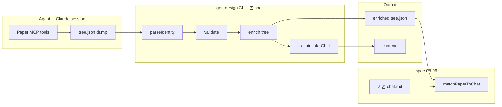

# Implementation Plan: spec-08-05

## 📋 Branch Strategy

- 신규 브랜치: `spec-08-05-paper-mcp-adapter`
- 시작 지점: `phase-08-chat-agent-flow`
- 첫 task 가 브랜치 생성

## 🛑 사용자 검토 필요 (User Review Required)

> [!IMPORTANT]
> - [ ] **MCP client 도입 X** — 본 spec 은 tree.json *입력 후 처리* 만. Paper MCP 직접 호출은 agent 책임 (Claude session 안). 향후 디자이너 마찰 보고 시 재검토
> - [ ] **gen-design.ts 단일 CLI 진입점 신설** — ADR-009 D-1 의 첫 코드 구현. subcommand 라우터 패턴 정착 (lint / merge / react 등 후속 spec 의 기반)
> - [ ] **identity 컨벤션 정착** — `[chat:scenes/login]` 가 *유일한* 표준. 다른 형식 (`[scenes:login]`, `chats/scenes/login`) 은 인식 X
> - [ ] **PaperTreeNode 확장 = 비파괴** — 기존 `name`, `id`, `component` 등 그대로. `identity?` 필드 추가만

> [!WARNING]
> - [ ] **fixture 6 개 신규** — `playground/chats/` 와 1:1 대응. 수동 작성 (Paper MCP 자동 추출 X). 일관성 검증 필수
> - [ ] **기존 paper-to-spec CLI 영향 0** — 별도 진입점 (`gen-design`) 으로 분리. 두 CLI 동시 존재 (subset alias 형태)

## 🎯 핵심 전략 (Core Strategy)

### 아키텍처 컨텍스트



### 주요 결정

| 컴포넌트 | 전략 | 이유 |
|:---:|:---|:---|
| **CLI 진입점** | `studio/scripts/gen-design.ts` 단일 라우터 (ADR-009 D-1) | YAGNI — 별도 kit 분리는 후속. 본 프로젝트 의존성 (peggy / typescript / vocabulary) 그대로 활용 |
| **subcommand 모듈화** | `studio/scripts/gen-design/{paper-import.ts, ...}` 디렉토리 — 명령마다 1 파일 | 후속 명령 (lint / merge / react) 추가 시 라우터만 수정. 명령간 격리 |
| **identity 컨벤션** | `[chat:(scenes|components|_shell)/<kebab-slug>]` | R7 (handbook) 의 layer-name 정체성. `_shell` 은 prefix 로 shell 의 *암시적 동의어* (kind = "shell") |
| **MCP 직접 호출 X** | 본 spec 은 tree.json *입력 후 처리* 만. agent 가 MCP tool 사용 → 파일 dump | YAGNI + 의존성 최소화. MCP client 라이브러리 도입은 마찰 발생 시 |
| **PaperTreeNode 확장** | `identity?: IdentityRef` 추가. 기존 필드 그대로 (비파괴) | 기존 paper-inference / paper compiler 영향 0 |
| **chain 모드** | `--chain inferChat` 옵션 — 한번에 chat.md 까지 | dogfooding 마찰 ↓ (한 명령으로 끝) |
| **fixture 6 개** | `fixtures/paper-trees/` 신규 — playground/chats/ 와 1:1 | round-trip 검증 + 후속 spec (08-06) 의 입력 |
| **기존 CLI 보존** | `paper-to-spec` (paper-to-chat) script 그대로 — `gen-design paper-import` 가 추가 진입점 | 기존 사용자 / 테스트 영향 0. 통합은 후속 spec |

## 📂 Proposed Changes

### CLI 진입점 신설

#### [NEW] `studio/scripts/gen-design.ts`

```ts
#!/usr/bin/env node
// ADR-009 D-1 단일 CLI — subcommand 라우터.

import { runPaperImport } from "./gen-design/paper-import";

const COMMANDS = {
  "paper-import": runPaperImport,
  // 후속: "lint" / "merge" / "react" / "diff" / "paper"
};

function main(): void {
  const [cmd, ...rest] = process.argv.slice(2);
  if (!cmd || cmd === "--help" || cmd === "-h") {
    printHelp(); process.exit(0);
  }
  const handler = COMMANDS[cmd];
  if (!handler) {
    process.stderr.write(`Unknown command: ${cmd}\n`);
    printHelp(); process.exit(2);
  }
  handler(rest);
}

if (import.meta.url === `file://${process.argv[1]}`) main();
```

#### [NEW] `studio/scripts/gen-design/paper-import.ts`

```ts
// gen-design paper-import <tree.json> [--validate-only] [--chain inferChat] [--output path]
//   [--from-stdin] [--threshold 0-1]

export async function runPaperImport(argv: string[]): Promise<void> {
  const args = parsePaperImportArgs(argv);
  const tree = await loadTree(args);
  const errors = validate(tree);
  if (errors.length > 0) reportAndExit(errors);

  const enriched = enrichWithIdentity(tree);

  if (args.validateOnly) {
    process.stdout.write("✓ valid\n"); return;
  }

  if (args.chain === "inferChat") {
    const text = await runInferChat(enriched, args.threshold);
    writeOutput(text, args.output);
  } else {
    writeOutput(JSON.stringify(enriched, null, 2), args.output);
  }
}
```

### Identity 파서

#### [NEW] `studio/src/lib/paper-inference/identity.ts`

```ts
const IDENTITY_RE = /\[chat:(scenes|components|_shell)\/([a-z0-9-]+)\]/;
const SHELL_RE    = /\[chat:_shell\]/;

export interface IdentityRef {
  kind: "scene" | "component" | "shell";
  slug: string;
  raw: string;
  expectedPath: string; // chats/scenes/login.chat.md
}

export function parseIdentity(layerName: string): IdentityRef | null {
  const shell = SHELL_RE.exec(layerName);
  if (shell) return { kind: "shell", slug: "_shell", raw: shell[0], expectedPath: "chats/_shell.chat.md" };
  const m = IDENTITY_RE.exec(layerName);
  if (!m) return null;
  const kindRaw = m[1];
  const slug = m[2];
  const kind = kindRaw === "scenes" ? "scene" : kindRaw === "components" ? "component" : "shell";
  const expectedPath = `chats/${kindRaw}/${slug}.chat.md`;
  return { kind, slug, raw: m[0], expectedPath };
}
```

### 통합 헬퍼

#### [NEW] `studio/src/lib/paper-inference/match.ts`

```ts
export type MatchResult =
  | { status: "match"; identity: IdentityRef; chatPath: string }
  | { status: "tree-only"; identity: IdentityRef; expectedPath: string }
  | { status: "chat-only"; chatPath: string };

export function matchPaperToChat(tree: PaperTreeNode, chatRoot: string): MatchResult[] {
  // tree 안 모든 identity 추출 → chats/ 디렉토리와 매칭
  // 본 spec 은 헬퍼만, sync 액션은 spec-08-06 의 책임
}
```

### tree.json 검증

#### [NEW] `studio/src/lib/paper-inference/validate.ts`

```ts
export function validateTree(tree: unknown): ValidationError[] {
  // 1. 구조 검증 (id / name / component / children)
  // 2. identity 컨벤션 (kind ∈ {scenes, components, _shell})
  // 3. 중복 identity 검출 (한 tree 안 같은 [chat:scenes/login] 두번 등장 시 경고)
}
```

### 타입 확장

#### [MODIFY] `studio/src/lib/paper-inference/tree-types.ts`

```diff
export interface PaperTreeNode {
   id: string;
   name: string;
   component: string;
   styles?: Record<string, string>;
   fills?: PaperFill[];
   children?: PaperTreeNode[];
+  /** spec-08-05 추가 — paper-import 가 자동 채움. 신규 입력에는 부재. */
+  identity?: IdentityRef;
 }
```

### Fixture

#### [NEW] `fixtures/paper-trees/scenes/login.tree.json`
#### [NEW] `fixtures/paper-trees/scenes/main.tree.json`
#### [NEW] `fixtures/paper-trees/components/{brand-header,app-footer,empty-state}.tree.json`
#### [NEW] `fixtures/paper-trees/_shell.tree.json`

각 fixture 는 *최소* PaperTreeNode 구조 — 실제 Paper 추출 결과 흉내 (id 무작위 / layer name 에 `[chat:type/slug]` 마커).

### 통합 테스트

#### [NEW] `studio/src/lib/paper-inference/__tests__/round-trip.test.ts`

- fixture tree → paper-import → inferChat → chat.md
- chat.md ≈ playground/chats/<slug>.chat.md (frontmatter 일치 + Structure 본문 ComponentInstance 일치)
- 6 fixture 모두 PASS

### package.json

#### [MODIFY] `studio/package.json`

```diff
"scripts": {
+  "gen-design": "tsx scripts/gen-design.ts",
   ...
}
```

## 🧪 검증 계획

### 단위 테스트
```bash
pnpm --filter studio test identity
pnpm --filter studio test paper-import
pnpm --filter studio test validate
pnpm --filter studio test match
```

### 통합 테스트 — round-trip
```bash
pnpm --filter studio test round-trip
```

### 수동 검증
1. `pnpm gen-design --help` — 도움말 출력
2. `pnpm gen-design paper-import fixtures/paper-trees/scenes/login.tree.json` — enriched JSON 출력
3. `pnpm gen-design paper-import fixtures/paper-trees/scenes/login.tree.json --chain inferChat` — chat.md 출력
4. `--validate-only` + 잘못된 tree → exit 1 + 친화 에러

## 🔁 Rollback Plan

- 단일 PR. `git revert <merge-commit>` 안전 — 신규 파일 추가 + 1 타입 확장 (비파괴) + 1 script 추가.
- 기존 `paper-to-spec` CLI 영향 0 → 회귀 위험 0.

## 📦 Deliverables 체크

- [ ] task.md 작성
- [ ] 사용자 Plan Accept
- [ ] (실행 후) 모든 task 완료
- [ ] (실행 후) walkthrough.md / pr_description.md ship
