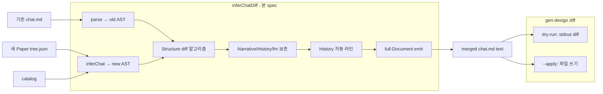

# Implementation Plan: spec-08-06

## 📋 Branch Strategy

- 신규 브랜치: `spec-08-06-infer-chat-diff`
- 시작 지점: `phase-08-chat-agent-flow`
- 첫 task 가 브랜치 생성

## 🛑 사용자 검토 필요 (User Review Required)

> [!IMPORTANT]
> - [ ] **Narrative / History / frontmatter 가 *불변 보존* 원칙** — Paper sync 시 디자이너의 자연어 의도는 *절대* 자동 수정 X. Structure 만 갱신.
> - [ ] **History 자동 라인** = ADR-010 D-3 의 *자동 갱신* 영역 — 디자이너 confirm 없이 그대로 추가. 단순 통계 라인 (의미 추론 X).
> - [ ] **dry-run 기본** — `gen-design diff` 는 *제안* 만. `--apply` 명시 시 실제 쓰기. ADR-010 D-3 호응.
> - [ ] **Structure 비교 키 = name + 첫 axis** — name 같고 variant 같으면 *동일 component*. 더 정교한 rename 검출은 후속.

> [!WARNING]
> - [ ] **full-Document emit 신규 필요** — 기존 `emit()` 은 body 만. inferChatDiff 의 결과 (4-layer) 를 텍스트로 serialize 하려면 frontmatter / sections emit 추가 필수
> - [ ] **playground/chats dogfood 시뮬레이션** — 실제 tree.json 변경 → diff → 적용 시뮬. login.chat.md 의 Narrative 보존 확인 — *핵심 검증*

## 🎯 핵심 전략 (Core Strategy)

### 아키텍처 컨텍스트



### 주요 결정

| 컴포넌트 | 전략 | 이유 |
|:---:|:---|:---|
| **불변 보존** | Narrative / History / frontmatter / title 은 *그대로 복사* | 디자이너 자연어 의도는 자동 수정 대상 아님. ADR-010 D-3 |
| **Structure 만 갱신** | inferChat 결과의 Structure.body 로 *교체* | Paper 가 *권위 source* 인 영역만 갱신 |
| **diff 키** | ComponentInstance.name + props.variant | 간단 + 충분. rename 은 add+remove 로 회피 |
| **History 자동 라인** | `**YYYY-MM-DD** Paper sync — texts X, variants Y, +A / -B` | 단순 통계 — 의미 추론 X. 디자이너가 후속 chat 갱신 시 의미 추가 |
| **변경 0 → History 추가 X** | no-op 경우 history line skip | git diff 깔끔 |
| **dry-run 기본** | `gen-design diff` 는 *제안만*. `--apply` 명시 필수 | ADR-010 D-3 호응 |
| **full-Document emit 신규** | `emitDocument(doc): string` — frontmatter + title + sections + body | inferChatDiff 의 결과 serialize 필수 |
| **playground dogfood** | login.chat.md + 변경된 tree.json → diff 통합 테스트 | 실제 흐름 검증 — 가장 가치 큰 단일 시나리오 |

## 📂 Proposed Changes

### diff 알고리즘

#### [NEW] `studio/src/lib/paper-inference/diff.ts`

```ts
export function inferChatDiff(
  existingChatText: string,
  newTree: PaperTreeNode,
  options: DiffOptions,
): DiffResult {
  const old = parse(existingChatText, { skipSchema: true });
  if (!old.ok || !old.ast) {
    throw new Error("Failed to parse existing chat.md");
  }
  const newResult = inferChat(newTree, options.catalog, {
    confidentThreshold: options.threshold ?? 0.8,
  });
  const stats = diffStructure(
    old.ast.structure?.body ?? old.ast.body ?? [],
    newResult.ast.structure?.body ?? newResult.ast.body ?? [],
  );
  const merged = mergeDocs(old.ast, newResult.ast, stats, options);
  const text = emitDocument(merged);
  return { text, stats, historyLineAdded, preserved };
}

function diffStructure(oldBody, newBody): Stats { ... }
function mergeDocs(old, new, stats, opts): Document { ... }
```

### full-Document emit

#### [NEW] `studio/src/lib/paper-inference/emit-document.ts`

```ts
export function emitDocument(doc: Document): string {
  const parts: string[] = [];
  if (doc.frontmatter) parts.push(emitFrontmatter(doc.frontmatter));
  if (doc.title) parts.push(`# ${doc.title}\n`);
  if (doc.narrative) parts.push(`## 💬 Narrative\n\n${doc.narrative.markdown}\n`);
  if (doc.structure) parts.push(`## 🧩 Structure\n\n\`\`\`jsx\n${emit(doc)}\n\`\`\`\n`);
  if (doc.history) parts.push(`## 📜 History\n\n${doc.history.markdown}\n`);
  return parts.join("\n");
}

function emitFrontmatter(fm: ChatFrontmatter): string { ... }  // YAML-lite serialize
```

### CLI

#### [NEW] `studio/scripts/gen-design/diff.ts`

```ts
export function parseDiffArgs(argv: string[]): DiffArgs | { error };
export async function runDiff(argv, opts): Promise<RunResult>;
```

#### [MODIFY] `studio/scripts/gen-design.ts`

router 에 `diff` 추가.

### 통합 시나리오 fixture

#### [NEW] `fixtures/diff-scenarios/{A,B,C,D,E}/{before.chat.md, new.tree.json, expected.chat.md}`

5 시나리오 × 3 파일 = 15 fixture.

### dogfood 시뮬레이션

#### [NEW] `studio/src/lib/paper-inference/__tests__/diff-dogfood.test.ts`

`playground/chats/scenes/login.chat.md` + 변형 tree → diff → Narrative 보존 확인.

## 🧪 검증 계획

### 단위 테스트
```bash
pnpm --filter studio test diff
```

기대: 13+ (diff 알고리즘 10 + 보존 3) + 6 CLI + 5+ 시나리오 + 2 dogfood = ≥ 26.

### 통합 테스트
```bash
pnpm --filter studio test diff-scenarios
pnpm --filter studio test diff-dogfood
```

### 수동 검증
1. `pnpm gen-design diff fixture-a/before.chat.md fixture-a/new.tree.json` — diff preview
2. `pnpm gen-design diff fixture-a/before.chat.md fixture-a/new.tree.json --apply --output /tmp/out.chat.md` — 적용
3. Narrative 영역 비교 — bit-for-bit 같음 (보존 검증)

## 🔁 Rollback Plan

- 단일 PR. revert 안전 — 신규 파일만 + 1 router 행 추가.
- 기존 `inferChat` / `paper-import` 영향 0.

## 📦 Deliverables 체크

- [ ] task.md 작성
- [ ] 사용자 Plan Accept
- [ ] (실행 후) 모든 task 완료
- [ ] (실행 후) walkthrough.md / pr_description.md ship
