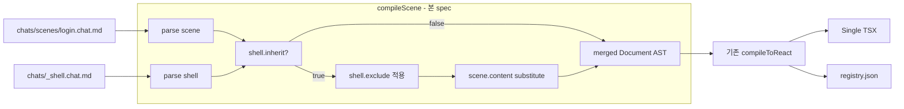

# Implementation Plan: spec-08-07

## 📋 Branch Strategy

- 신규 브랜치: `spec-08-07-chat-react-compiler`
- 시작 지점: `phase-08-chat-agent-flow`
- 첫 task 가 브랜치 생성

## 🛑 사용자 검토 필요 (User Review Required)

> [!IMPORTANT]
> - [ ] **shell 해석 위치 = AST 합성 (compile *전*)** — shell + scene 두 Document AST 를 *합성* 한 단일 AST 를 만든 후 기존 compileToReact 에 넘김. jsx-emitter 등 *재사용 극대화*.
> - [ ] **shell.exclude = ComponentInstance 제거 (재귀)** — shell.Structure.body 의 walk + 이름 매칭 시 *통째 제거* (자식 포함). 후속 spec 에서 *부분 exclude* (특정 axis 만) 가능성.
> - [ ] **`{{scene.content}}` 다중 placeholder = 동일 scene body 복제** — shell 의 inject 포인트가 여러 곳이면 모두 같은 body. *변형* 은 후속 spec.
> - [ ] **shell.inherit 부재 / false → 기존 compileToReact 동등** — 본 spec 은 *통합 진입점* (compileScene) 만 추가. 기존 path 영향 0.

> [!WARNING]
> - [ ] **gen-design react 의 입력 변경** — 기존 `chat-react` CLI 는 chat *파일* 입력. 새 `gen-design react <slug>` 는 *slug* 입력 (chats/scenes/<slug>.chat.md 자동 로드). 두 진입점 동시 존재 — 기존 영향 0
> - [ ] **catalog 사용** — 본 spec 은 shell merge *만*. 어휘 매칭은 기존 jsx-emitter 에 위임 — 결과는 기존 compileToReact 와 동일 catalog 규칙 따름.

## 🎯 핵심 전략 (Core Strategy)

### 아키텍처 컨텍스트



### 주요 결정

| 컴포넌트 | 전략 | 이유 |
|:---:|:---|:---|
| **shell 해석 위치** | AST 합성 단계 (compile *전*) | 기존 jsx-emitter / imports-builder / variant-emitter 등 *재사용 극대화*. emit 단계 수정 0 |
| **shell.exclude** | 재귀 walk + 이름 매칭 시 통째 제거 (children 포함) | 단순 + 디자이너 의도 일치 (자식만 남기는 부분 exclude 는 후속) |
| **placeholder substitute** | `Placeholder { kind:"scene", path:"content" }` → scene.structure.body 로 *교체* | grammar 의 의미 정보 1:1 활용. shell body walk 시 placeholder 발견 → splice |
| **다중 placeholder** | 동일 body 복제 (변형 X) | 단순 + 일반적 use case 만 지원. 변형은 후속 |
| **scene 단독 컴파일** | shell.inherit ≠ true 면 scene.structure 만 사용 | 기존 compileToReact 와 동등 |
| **CLI = slug 입력** | `<scene-slug>` (예: "login") → chats/scenes/login.chat.md 자동 로드 | dogfooding 의 자연 명령형 — 파일 경로 X |
| **catalog 위임** | 기존 jsx-emitter 의 catalog 매칭 규칙 그대로 | 일관성 + 회귀 0 |
| **scene compile 진입점 분리** | `compileScene` (slug 기반) ≠ `compileToReact` (text/ast 기반) | 책임 분리. 후속 spec 의 진입점 다양화 가능 |

## 📂 Proposed Changes

### shell merge 알고리즘

#### [NEW] `studio/src/lib/chat-md-compiler/react/shell-merge.ts`

```ts
export interface ShellMergeOptions {
  sceneDoc: Document;
  shellDoc: Document;
  exclude: string[];
}

export function mergeShellAndScene(opts: ShellMergeOptions): Document {
  // 1. shell.structure.body 를 deep clone
  // 2. exclude 안 component 제거 (재귀 walk)
  // 3. {{scene.content}} placeholder → scene.structure.body 로 교체
  // 4. frontmatter = scene.frontmatter (메타 정보)
  // 5. narrative / history = scene 의 것
  // 6. 결과 Document 반환
}
```

### compile entry

#### [NEW] `studio/src/lib/chat-md-compiler/react/compile-scene.ts`

```ts
export interface CompileSceneOptions {
  chatRoot: string;
  catalog?: CatalogMap;
}

export function compileScene(sceneSlug: string, opts: CompileSceneOptions): CompileSceneResult {
  const scenePath = path.join(opts.chatRoot, "scenes", `${sceneSlug}.chat.md`);
  const sceneText = readFileSync(scenePath, "utf-8");
  const sceneParsed = parse(sceneText, { skipSchema: true });
  if (!sceneParsed.ok || !sceneParsed.ast) return { ok: false, errors: ... };

  const sceneFm = sceneParsed.ast.frontmatter;
  const shouldMerge = sceneFm?.shell?.inherit === true;
  let mergedDoc = sceneParsed.ast;

  if (shouldMerge) {
    const shellPath = path.join(opts.chatRoot, "_shell.chat.md");
    const shellText = readFileSync(shellPath, "utf-8");
    const shellParsed = parse(shellText, { skipSchema: true });
    if (!shellParsed.ok || !shellParsed.ast) return { ok: false, errors: ... };

    mergedDoc = mergeShellAndScene({
      sceneDoc: sceneParsed.ast,
      shellDoc: shellParsed.ast,
      exclude: sceneFm.shell?.exclude ?? [],
    });
  }

  return compileToReact({ ast: mergedDoc, componentName: sceneFm?.name ?? "Scene" });
}
```

### CLI

#### [NEW] `studio/scripts/gen-design/react.ts`

```ts
export function parseReactArgs(argv: string[]): ReactArgs | { error };
export async function runReact(argv, opts): Promise<RunResult>;
```

#### [MODIFY] `studio/scripts/gen-design.ts`

router 에 `react` 추가.

### 테스트

- `shell-merge.test.ts` (8+) — exclude / placeholder / 재귀 / 다중 placeholder / no-inherit
- `compile-scene.test.ts` (5+) — slug 로드 / shell merge 호출 / no-shell / 오류
- `react-cli.test.ts` (5+) — args + runtime
- `react-dogfood.test.ts` (3+) — playground/chats/scenes/login → TSX (BrandHeader X, AppFooter O, LoginForm inject, 결정성)

## 🧪 검증 계획

### 단위 테스트
```bash
pnpm --filter studio test shell-merge compile-scene
pnpm --filter studio test react-cli
```

### 통합 테스트
```bash
pnpm --filter studio test react-dogfood
```

### 수동 검증
1. `pnpm gen-design react login --chat-root playground/chats` → stdout TSX
2. TSX 안 BrandHeader 텍스트 X (exclude 적용 확인)
3. TSX 안 AppFooter 포함 (inherit)
4. TSX 안 LoginForm 포함 (scene content inject)
5. 2회 실행 hash 비교 (결정성)

## 🔁 Rollback Plan

- 단일 PR. revert 안전 — 신규 파일만 + router 1 행 추가.
- 기존 `compileToReact` / `chat-react` CLI 영향 0.

## 📦 Deliverables 체크

- [ ] task.md 작성
- [ ] 사용자 Plan Accept
- [ ] (실행 후) 모든 task 완료
- [ ] (실행 후) walkthrough.md / pr_description.md ship
