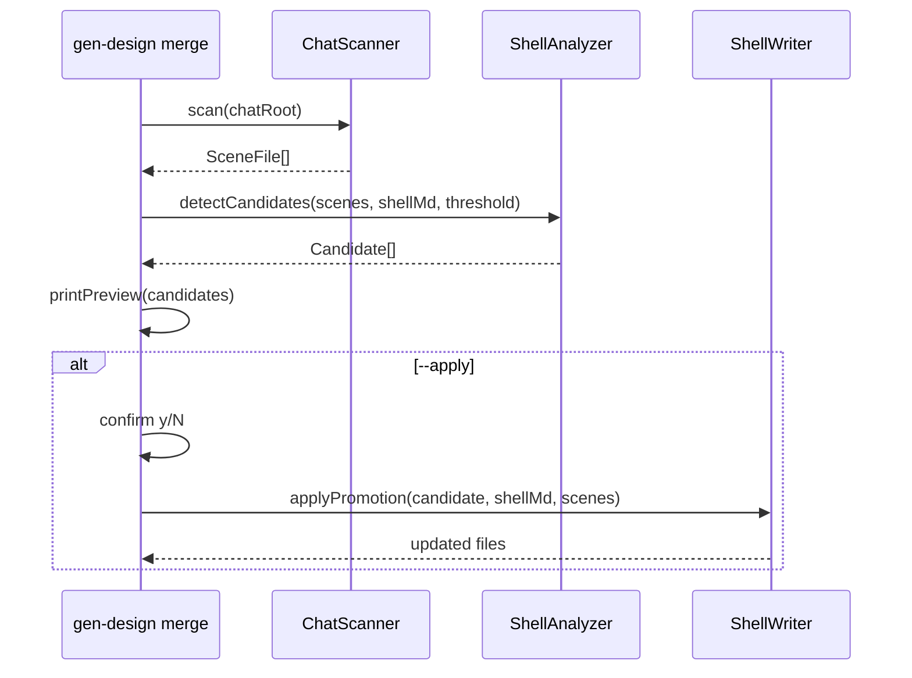

# Implementation Plan: spec-09-01

## 📋 Branch Strategy

- 신규 브랜치: `spec-09-01-gen-design-merge` (브랜치 이름 = spec 디렉토리 이름, `feature/` prefix 없음)
- 시작 지점: `main` (phase-09-gen-design-live base branch 는 첫 hk-ship 시 자동 생성)
- 첫 task 가 브랜치 생성을 수행함

## 🛑 사용자 검토 필요

> [!IMPORTANT]
> - [ ] `--apply` 시 `_shell.chat.md` 와 scene frontmatter 를 직접 수정함 — 영향 범위 preview 후 confirm.

## 🎯 핵심 전략 (Core Strategy)

### 아키텍처 컨텍스트



### 주요 결정

| 컴포넌트 | 전략 | 이유 |
|:---:|:---|:---|
| **Structure 파싱** | 정규식으로 JSX 태그 추출 (`<ComponentName`) | peggy parser 불필요 — 태그명 추출만 필요, 단순 regex 로 충분 |
| **_shell.chat.md 갱신** | 텍스트 패치 (Structure 섹션 append) | AST 재생성 대신 마커 기반 삽입 — shell.chat.md 는 수동 편집 파일이므로 원본 구조 보존 우선 |
| **scene frontmatter 갱신** | yaml-like 텍스트 패치 (`shell.inherit: true` 설정) | gray-matter 라이브러리 활용 (이미 의존성) |

### 📑 ADR 후보

- [x] 없음 (ADR-009 D-4 + ADR-010 D-4 이 이미 정책 정의)

## 📂 Proposed Changes

### [신규] merge 서브명령

#### [NEW] `studio/scripts/gen-design/merge.ts`

ADR-010 D-4 의 조력자 형태 구현:
- `parseMergeArgs(argv)` — CLI 인수 파싱
- `scanScenes(chatRoot)` — scenes/*.chat.md 전체 읽기
- `extractComponents(structureSection)` — JSX 태그명 추출 (정규식)
- `detectCandidates(scenes, shellComponents, threshold)` — 임계값 초과 컴포넌트 필터
- `printPreview(candidates)` — stdout 프리뷰
- `applyPromotion(candidates, chatRoot)` — `_shell.chat.md` + scene frontmatter 갱신
- `runMerge(argv)` — RouterResult 반환 (기존 패턴 준수)

```typescript
interface MergeArgs {
  chatRoot?: string;   // 기본: process.cwd()
  apply?: boolean;     // 기본: false (dry-run)
  yes?: boolean;       // non-interactive confirm
  threshold?: number;  // 기본: 3
  help?: boolean;
}

interface Candidate {
  component: string;        // 컴포넌트명
  scenes: string[];         // 후보를 참조하는 scene 파일 목록
  alreadyInShell: boolean;  // 이미 shell 에 있으면 제외
}
```

#### [NEW] `studio/scripts/gen-design/__tests__/merge-args.test.ts`

`parseMergeArgs` 단위 테스트:
- `--apply` / `--yes` / `--threshold` / `--chat-root` 파싱
- 잘못된 threshold 값 오류 처리

#### [NEW] `studio/scripts/gen-design/__tests__/merge-runtime.test.ts`

핵심 로직 단위 테스트 (fs mock):
- `extractComponents`: JSX 태그 정상 추출 / 태그 없는 섹션 처리
- `detectCandidates`: threshold 경계값 (2 scene = 제외, 3 scene = 포함)
- `detectCandidates`: 이미 shell 에 있는 컴포넌트 제외
- `applyPromotion`: dry-run 이면 파일 변경 없음 (기본)
- `applyPromotion`: --apply 시 _shell.chat.md Structure 에 컴포넌트 추가 + History 라인 추가

#### [MODIFY] `studio/scripts/gen-design.ts`

`COMMANDS` 와 `COMMAND_DESCRIPTIONS` 에 `merge` 등록.

## 🧪 검증 계획 (Verification Plan)

### 단위 테스트 (필수)
```bash
cd studio && pnpm test scripts/gen-design/__tests__/merge
```

### 전체 회귀
```bash
cd studio && pnpm test
```

### 수동 검증 시나리오

1. `pnpm gen-design merge` (dry-run) — 기대 결과: playground/chats 스캔 → 현재 후보 없음 (BrandHeader/AppFooter 이미 shell 에 포함)
2. `pnpm gen-design merge --threshold 1` — 기대 결과: 적어도 1 scene 이상 참조된 컴포넌트 모두 후보 표시
3. `pnpm gen-design merge --threshold 1 --apply --yes` — 기대 결과: _shell.chat.md 갱신 확인 (git diff 로)

## 🔁 Rollback Plan

- `--apply` 실행 후 원복: `git checkout playground/chats/_shell.chat.md` + 영향 scene 파일 복원
- merge.ts 가 기존 명령에 영향 없으므로 기존 명령 롤백 불필요

## 📦 Deliverables 체크

- [x] task.md 작성
- [ ] 사용자 Plan Accept 받음
- [ ] (실행 후) 모든 task 완료
- [ ] (실행 후) walkthrough.md / pr_description.md ship
