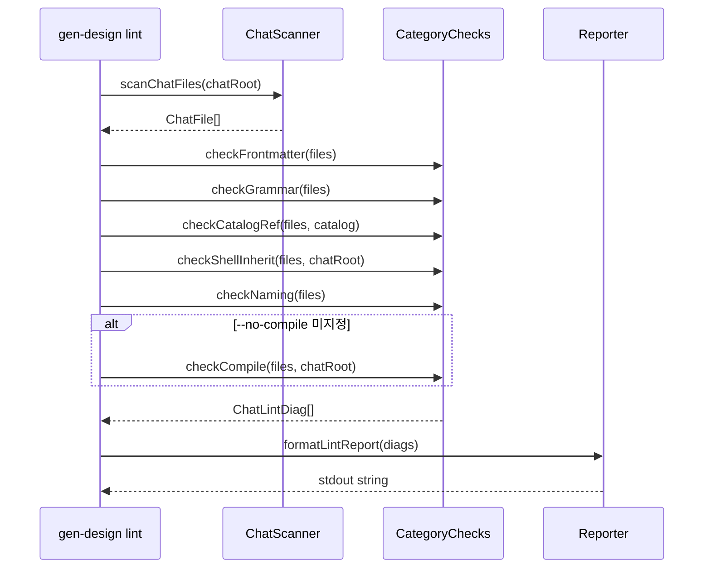

# Implementation Plan: spec-09-02

## 📋 Branch Strategy

- 신규 브랜치: `spec-09-02-gen-design-lint` (브랜치 이름 = spec 디렉토리 이름, `feature/` prefix 없음)
- 시작 지점: `phase-09-gen-design-live` (base branch — spec-09-01 머지 후 최신)
- 첫 task 가 브랜치 생성을 수행함

## 🛑 사용자 검토 필요

> [!IMPORTANT]
> - [ ] GitHub Actions `.github/workflows/ci.yml` 신규 생성 — 기존 CI 없음을 확인 (첫 CI 파일 생성)
> - [ ] compile 카테고리는 `runReact` 성공 여부만 확인 (TypeScript tsc 타입 검사 없음) — 범위 동의

## 🎯 핵심 전략 (Core Strategy)

### 아키텍처 컨텍스트



### 주요 결정

| 컴포넌트 | 전략 | 이유 |
|:---:|:---|:---|
| **grammar + catalog-ref** | 기존 `lintFile()` (studio/src/lib/chat-md/lint) 재활용 | 동일 4-stage 파이프라인 — 중복 구현 불필요 |
| **frontmatter 파싱** | gray-matter (이미 의존성) | 기존 merge.ts 에서도 사용, 일관성 |
| **ChatLintDiag** | 독립 인터페이스 (ParseError 와 분리) | chat.md linting 은 line:col 위치가 frontmatter/naming 에서 의미 없음 — 파일 단위 진단이 더 적합 |
| **compile 카테고리** | `runReact(argv)` 호출 → exitCode 확인 | 기존 react 서브명령 재활용. tsc 호출은 느리고 복잡 — scope 외 |
| **카테고리 필터** | v1 미지원 — 전체 실행만 | `--no-compile` 1개 예외로 충분. 카테고리 필터는 복잡성 대비 효과 낮음 |
| **CI** | `.github/workflows/ci.yml` 신규 생성 | 기존 CI 없음 — 첫 step 으로 `pnpm test` + `pnpm gen-design lint` |

### 📑 ADR 후보

- [x] 없음

## 📂 Proposed Changes

### [NEW] `studio/scripts/gen-design/lint.ts`

`gen-design lint` 서브명령 전체 구현:

```typescript
export type LintCategory =
  | "frontmatter"
  | "grammar"
  | "catalog-ref"
  | "shell-inherit"
  | "naming"
  | "compile";

export interface LintArgs {
  chatRoot?: string;    // 기본: process.cwd()
  noCompile?: boolean;  // 기본: false
  help?: boolean;
}

export interface ChatFile {
  path: string;          // 절대 경로
  relPath: string;       // chatRoot 기준 상대 경로
  fileType: "scene" | "component" | "shell" | "unknown";
}

export interface ChatLintDiag {
  category: LintCategory;
  file: string;          // relPath
  message: string;
  line: number;          // 위치 불명 시 0
}

// 핵심 함수
export function parseLintArgs(argv: string[]): LintArgs | { error: string }
export function scanChatFiles(chatRoot: string): ChatFile[]
export function checkFrontmatter(files: ChatFile[]): ChatLintDiag[]
export function checkGrammar(files: ChatFile[], catalogPath: string, schemaPath: string): ChatLintDiag[]
export function checkCatalogRef(files: ChatFile[], catalogPath: string, schemaPath: string): ChatLintDiag[]
export function checkShellInherit(files: ChatFile[], chatRoot: string, catalogPath: string): ChatLintDiag[]
export function checkNaming(files: ChatFile[]): ChatLintDiag[]
export async function checkCompile(files: ChatFile[], chatRoot: string): Promise<ChatLintDiag[]>
export function formatLintReport(diags: ChatLintDiag[], fileCount: number): string
export async function runLint(argv: string[]): Promise<RouterResult>
```

주의: `checkGrammar` 와 `checkCatalogRef` 는 실제로 같은 `lintFile()` 파이프라인을 사용하되 stage 로 분리 (`grammar` stage 에러 → "grammar" 카테고리, `catalog`/`axis` stage 에러 → "catalog-ref" 카테고리).

### [NEW] `studio/scripts/gen-design/__tests__/lint-args.test.ts`

`parseLintArgs` 단위 테스트 (~12 케이스):
- 기본값: chatRoot=undefined, noCompile=false, help=false
- `--chat-root <dir>` 파싱
- `--no-compile` 파싱
- `--help` / `-h` → `{ help: true }`
- 알 수 없는 플래그 → `{ error: ... }` 반환

### [NEW] `studio/scripts/gen-design/__tests__/lint-runtime.test.ts`

카테고리 함수 단위 테스트 (tmpdir 패턴, ~25 케이스):
- `checkFrontmatter`: 유효한 frontmatter / type 누락 / name 누락 / 잘못된 type 값 / 잘못된 catalog.tier
- `checkShellInherit`: inherit=true + shell 존재 / inherit=true + shell 없음 / inherit=false (skip) / exclude 항목 알 수 없는 컴포넌트
- `checkNaming`: 유효한 kebab-case / 대문자 포함 / scene 파일이 components/ 에 위치 / 잘못된 확장자
- `scanChatFiles`: scenes + components + shell 모두 수집 / 비어있는 디렉토리
- `formatLintReport`: 에러 없음 → "All checks passed." / 에러 있음 → 파일별 목록

컴파일 카테고리: tmpdir 에 유효한 scene + shell + catalog 환경 구성 후 `checkCompile` 호출 (react-runtime.test.ts 와 동일한 패턴). 최소 2 케이스 (Structure 없는 scene skip / Structure 있는 scene pass).

### [MODIFY] `studio/scripts/gen-design.ts`

`COMMANDS` + `COMMAND_DESCRIPTIONS` 에 `lint` 추가:
```typescript
import { runLint } from "./gen-design/lint";
// COMMANDS: "lint": runLint
// COMMAND_DESCRIPTIONS: "lint": "Validate chat.md consistency — 6 categories (spec-09-02, ADR-009)"
```

### [NEW] `.github/workflows/ci.yml`

```yaml
name: CI
on: [push, pull_request]
jobs:
  test:
    runs-on: ubuntu-latest
    steps:
      - uses: actions/checkout@v4
      - uses: pnpm/action-setup@v4
        with: { version: 10 }
      - uses: actions/setup-node@v4
        with: { node-version: 24, cache: pnpm }
      - run: pnpm -C studio install --frozen-lockfile
      - run: pnpm -C studio test --run
      - run: pnpm -C studio exec ts-node --esm scripts/gen-design.ts lint --no-compile
```

## 🧪 검증 계획

### 단위 테스트 (필수)
```bash
cd studio && pnpm test scripts/gen-design/__tests__/lint
```

### 전체 회귀
```bash
cd studio && pnpm test
```

### 수동 검증 시나리오

1. `pnpm gen-design lint --chat-root playground/chats` — 기대: 0 errors (기존 파일 정합)
2. `pnpm gen-design lint --chat-root playground/chats --no-compile` — 기대: compile 단계 skip, 0 errors
3. frontmatter 에서 `type:` 라인 제거 후 실행 — 기대: frontmatter error 감지
4. `shell.inherit: true` 설정 후 `_shell.chat.md` 삭제 → 실행 — 기대: shell-inherit error 감지

## 🔁 Rollback Plan

- `lint.ts` / `ci.yml` 삭제 후 `gen-design.ts` 원복: 기존 명령 영향 없음
- GitHub Actions step 삭제: `git rm .github/workflows/ci.yml`

## 📦 Deliverables 체크

- [x] task.md 작성
- [ ] 사용자 Plan Accept 받음
- [ ] (실행 후) 모든 task 완료
- [ ] (실행 후) walkthrough.md / pr_description.md ship
