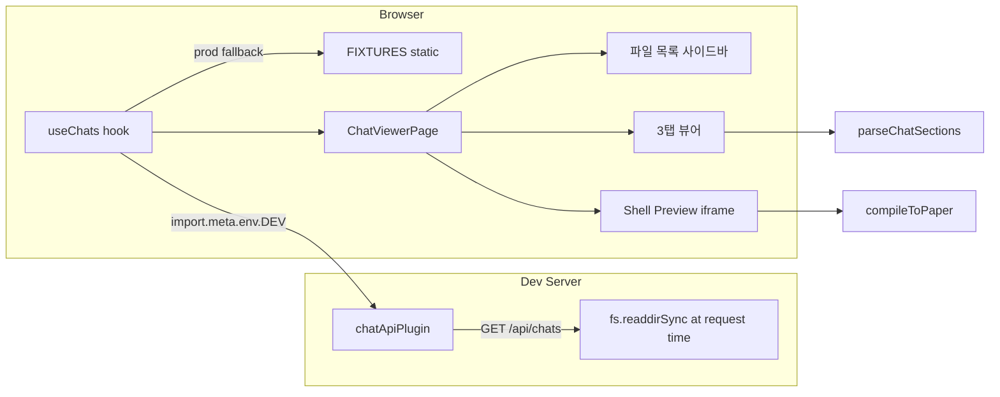

# Implementation Plan: spec-09-03

## 📋 Branch Strategy

- 신규 브랜치: `spec-09-03-studio-runtime` (브랜치 이름 = spec 디렉토리 이름, `feature/` prefix 없음)
- 시작 지점: `phase-09-gen-design-live` (base branch)
- 첫 task 가 브랜치 생성을 수행함

## 🛑 사용자 검토 필요

> [!IMPORTANT]
> - [ ] `pnpm dev` 스크립트에서 `fixtures:gen` 제거 — dev 서버 시작 시 더 이상 자동 생성되지 않음. `fixtures.generated.ts`는 `pnpm build` 와 테스트에서만 사용됨. 동의 여부 확인.
> - [ ] `#/chats` 신규 라우트 추가 — 기존 `#/spec` 는 그대로 유지되므로 영향 없음.

## 🎯 핵심 전략 (Core Strategy)

### 아키텍처 컨텍스트



### 주요 결정

| 컴포넌트 | 전략 | 이유 |
|:---:|:---|:---|
| **동적 fetch** | Vite `configureServer` 플러그인 + `fetch('/api/chats')` | dev-only, prod에는 노출 없음. 별도 Express 서버 불필요 |
| **prod fallback** | `import.meta.env.DEV` 분기 → FIXTURES | 기존 CI/테스트 fixtures 계속 동작. 빌드 안정성 유지 |
| **섹션 파싱** | 정규식 (`## 💬 Narrative` 등 헤더로 분기) | peggy parser 없이 단순 추출. chat.md 문법 변경에 독립 |
| **shell preview** | `compileToPaper(shellText + '\n' + sceneText)` | 기존 컴파일러 재활용. 합산 텍스트 → HTML 즉시 렌더 |
| **3탭 UI** | 단순 state 기반 (`activeTab` useState) | 외부 탭 라이브러리 의존 없음 |
| **파일 목록 그룹** | scene / component / shell 순 정렬 | 자연스러운 탐색 순서 |

### 📑 ADR 후보

- [x] 없음

## 📂 Proposed Changes

### [API] Vite dev server plugin

#### [MODIFY] `studio/vite.config.ts`

`chatApiPlugin()` 인라인 플러그인 추가:
```typescript
function chatApiPlugin(): Plugin {
  return {
    name: 'chat-api',
    configureServer(server) {
      server.middlewares.use('/api/chats', (_req, res) => {
        // chats/ + playground/chats/ 스캔 → JSON 반환
      });
    },
  };
}
```

#### [MODIFY] `studio/package.json`

`"dev"` 스크립트에서 `pnpm fixtures:gen &&` 제거:
```json
"dev": "vite"
```
(`"build"`는 그대로 유지: `"pnpm fixtures:gen && ..."`)

### [NEW] `studio/src/features/chat-viewer/`

#### `parseChatSections.ts`

```typescript
export interface ChatSections {
  narrative: string;
  structure: string;
  history: string;
}
export function parseChatSections(text: string): ChatSections
```
정규식으로 `## 💬 Narrative` / `## 🏗 Structure` / `## 📝 History` 섹션 추출.

#### `useChats.ts`

```typescript
export interface ChatEntry {
  id: string;          // relPath (예: playground/chats/scenes/login.chat.md)
  name: string;        // 파일 basename sans .chat.md
  fileType: 'scene' | 'component' | 'shell';
  text: string;        // 전체 chat.md 텍스트
  source: string;      // 'chats' | 'playground'
}
export function useChats(): { chats: ChatEntry[]; loading: boolean; error: string | null }
```
DEV: `fetch('/api/chats')`, PROD: `FIXTURES` 변환.

#### `ChatViewerPage.tsx`

2-pane 레이아웃:
- 왼쪽: 파일 목록 (scene / component / shell 그룹)
- 오른쪽: 탭 뷰어 + Shell Preview

#### `__tests__/parseChatSections.test.ts`

단위 테스트 (~10 케이스): 정상 섹션 / 섹션 없음 / 이모지 헤더 변형 처리.

#### `__tests__/chatApiHandler.test.ts`

`chatApiPlugin` 내부의 `scanChats(root)` 유틸 함수 단위 테스트 (~6 케이스): tmpdir 패턴.

### [MODIFY] `studio/src/lib/router.ts`

`"chats"` 라우트 추가:
```typescript
export type StudioRoute = "spec" | "new" | "design" | "tokens" | "export" | "playground" | "chats";
```

### [MODIFY] `studio/src/App.tsx`

```tsx
{route === "chats" && <ChatViewerPage />}
```
내비게이션에 "Chats" 링크 추가.

## 🧪 검증 계획

### 단위 테스트 (필수)
```bash
cd studio && pnpm test src/features/chat-viewer/__tests__
```

### 전체 회귀
```bash
cd studio && pnpm test
```

### 수동 검증 시나리오

1. `pnpm dev` (fixtures:gen 없이 시작) → Studio 정상 로딩 확인
2. `#/chats` 이동 → playground/chats 파일 목록 표시 확인
3. `login.chat.md` 클릭 → Narrative / Structure / History 탭 전환 확인
4. Shell Preview → AppShell + LoginScene 합성 HTML 렌더링 확인
5. 새 `scenes/test.chat.md` 추가 → 새로고침 후 목록에 노출 확인

## 🔁 Rollback Plan

- `vite.config.ts` 플러그인 제거 + `package.json` dev 스크립트 원복
- `ChatViewerPage` 관련 파일 삭제, `router.ts` + `App.tsx` 변경 되돌리기
- 기존 `#/spec` 등 다른 라우트 영향 없음

## 📦 Deliverables 체크

- [x] task.md 작성
- [ ] 사용자 Plan Accept 받음
- [ ] (실행 후) 모든 task 완료
- [ ] (실행 후) walkthrough.md / pr_description.md ship
