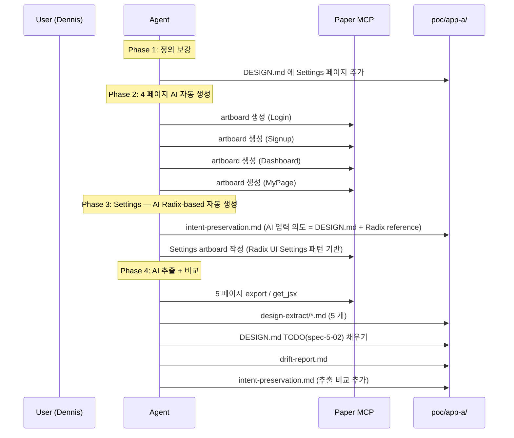

# Implementation Plan: spec-5-02

## 📋 Branch Strategy

- 신규 브랜치: `spec-5-02-app-a-paper-design` (이미 main 에서 분기됨, 브랜치 이름 = spec 디렉토리 이름)
- 시작 지점: `main` (`7e20736` — spec-5-01 머지 시점)
- **첫 task 는 housekeeping**: spec-5-01 ship 잔재 정리 + 거버넌스 문서 갱신 (phase-5.md 의 spec-5-02 정의 + queue.md Icebox) 을 첫 commit 에 묶는다. PLANNING 단계에서 이미 working tree 에 변경이 있으므로 첫 commit 으로 흡수.

## 🛑 사용자 검토 필요 (User Review Required)

> 본 Plan 을 Accept 하기 전에 사용자가 명시적으로 확인해야 할 항목들.

> [!IMPORTANT]
> - [ ] **Settings 페이지 신설 결정 (2026-04-27 사용자 결정)**: 기존 4 페이지 + Settings 1 페이지로 본 spec 범위 확정. spec-5-01 DESIGN.md 의 Page Map 에 추가됨.
> - [ ] **Phase 4 이월 과제 분할 처리 (2026-04-27 사용자 결정)**: 원본 의도 보존 사이클은 spec-5-02 흡수, LoginPage variant / DashboardPage drift 는 Icebox 이전.
> - [ ] **DESIGN.md 의 직접 수정 허용**: spec-5-01 산출물인 `poc/app-a/DESIGN.md` 를 본 spec 에서 수정 (Settings 추가 + TODO 채우기). spec 산출물의 "확장" 이지 "재작성" 이 아님을 명시.
> - [ ] **AI 베이스 일관성 — Designer 인적 단계 제거 (2026-05-02 사용자 결정)**: Settings 도 AI 자동 생성. *원본* 정의를 *Designer 의도* → *AI 입력 의도 (DESIGN.md + Radix UI reference)* 로 변경. 측정 본질 (입력→출력→재추출 보존도) 은 유지.

> [!WARNING]
> - [ ] **단일 PR 부담**: 5 페이지 + drift 표 + 의도 보존 표 + DESIGN.md 보강. 수행 도중 부담이 명백해지면 첫 측정 후 분할 (예: Settings + Login 1차, 나머지 2차) 을 사용자와 재정렬.
> - [ ] **Paper MCP 의존**: 본 spec 은 Paper MCP 가 안정 동작한다는 전제. 안정성 이슈 발생 시 즉시 STOP → 사용자 보고.
> - [ ] **Radix reference 의 외부성**: Radix UI Settings 패턴은 외부 reference. AI 가 토큰을 그대로 베끼지 않고 DESIGN.md 의 TaskFlow 토큰을 적용하는지가 핵심 — Radix 의 *layout/구조 패턴* 만 흡수하고 *토큰* 은 DESIGN.md 를 따라야 함.

## 🎯 핵심 전략 (Core Strategy)

### 아키텍처 컨텍스트



### 주요 결정

| 컴포넌트 | 전략 | 이유 |
|:---:|:---|:---|
| **Settings 정의** | spec-5-01 DESIGN.md 의 Page Map 에 직접 추가 (별도 파일 X) | 단일 진실 원천 유지. 추후 spec-5-03 에서 React 구현 시 같은 DESIGN.md 만 보면 됨. |
| **모두 AI 자동 생성** | 4 페이지 + Settings 모두 AI 자동 생성 | AI 베이스 시스템 일관성. *원본* 정의를 *Designer* → *AI 입력 의도 (DESIGN.md + Radix reference)* 로 재정의. drift 측정 + 원본 의도 보존 모두 AI 사이클 안에서 측정 (2026-05-02 사용자 결정). |
| **Settings reference** | Radix UI Settings 패턴 (Switch / Select / Slider / Section + divider / Danger zone) | 외부 layout 패턴만 흡수, 토큰은 DESIGN.md TaskFlow 그대로. 컴포넌트 폭 자극은 Radix 패턴이 명확. |
| **추출 schema** | `schema/design-md-schema.md` 14 섹션 그대로 | 기존 추출 패턴 재사용. Phase 4 의 추출 정합성을 그대로 활용. |
| **표기 정규화** | drift 표에서 정규화 후 비교 | oklch / hex 등 형식 차이는 본질적 drift 가 아님. paper-normalizer 코드화는 phase-6 으로 이월. |
| **DESIGN.md TODO 채우기** | 추출 결과 중 합의된 값 (4 / 5 페이지에서 일관) 만 채움 | 페이지마다 색이 다르면 그것 자체가 drift 신호. 모순값은 finding 으로만 기록. |
| **Settings 컴포넌트 폭** | Toggle / Select / Slider / Section header / Group list 5 종 이상 의도적 포함 | 토큰 자극 폭을 명시적으로 보장. |

## 📂 Proposed Changes

### `backlog/`

#### [MODIFY] `backlog/phase-5.md`
- spec-5-02 항목을 새 정의로 교체 (Settings 추가 / 원본 의도 보존 / Phase 4 이월 분할)
- Task 1 (housekeeping) 에 포함

#### [MODIFY] `backlog/queue.md`
- Icebox 에 `phase-5 이월 follow-ups (2026-04-27 등재)` 섹션 추가 (LoginPage variant 확장 / DashboardPage drift)
- Task 1 (housekeeping) 에 포함

### `poc/app-a/`

#### [MODIFY] `poc/app-a/DESIGN.md`
- §10 Page Map: Settings 행 추가
- §11 Page Specifications: Settings 섹션 추가 (Section / Block / 컴포넌트 매핑)
- §12 Composite Components: SettingsToggleRow / SettingsSelectRow / SettingsSliderRow 등 추가
- §14 i18n References: `settings.*` 키 추가
- §2 / §3 / §4 / §6 / §13 의 `TODO(spec-5-02)` 마커를 Paper 추출값으로 채움 (마지막 단계)

#### [NEW] `poc/app-a/intent-preservation.md`
- Settings 페이지 원본 의도 메모 (Designer 직접 그림 *전*)
- AI 추출 결과와 항목별 비교 표 (Designer 직접 그림 *후*)
- 일치 / 부분 일치 / 불일치 분류 + 손실 패턴 요약

#### [NEW] `poc/app-a/drift-report.md`
- 5 페이지 × N 항목 drift 표 (Section / Block / 컴포넌트 / 토큰 / i18n 키)
- 표기 정규화 전후 비교
- 페이지별 drift 점수 + 패턴 요약

#### [NEW] `poc/app-a/design-extract/auth-login.md`
- Login artboard 의 schema 준수 추출 결과 (14 섹션)

#### [NEW] `poc/app-a/design-extract/auth-signup.md`
- Signup artboard 의 추출 결과

#### [NEW] `poc/app-a/design-extract/dash-overview.md`
- Dashboard artboard 의 추출 결과

#### [NEW] `poc/app-a/design-extract/profile-mypage.md`
- MyPage artboard 의 추출 결과

#### [NEW] `poc/app-a/design-extract/settings-overview.md`
- Settings artboard 의 추출 결과 (Designer 직접 그림 → AI 추출)

#### [MODIFY] `poc/app-a/findings.md`
- "phase-6 입력" 섹션에 paper-normalizer 함수 후보 추가 (drift 측정 중 발견된 반복 패턴)

### `specs/spec-5-02-app-a-paper-design/`

#### [NEW] `walkthrough.md`
- Paper artboard URL 5 개
- drift 표 / 의도 보존 표 핵심 발견사항 요약
- DESIGN.md TODO 채우기 결과

#### [NEW] `pr_description.md`
- 표준 템플릿 준수

### `specs/spec-5-01-app-a-blueprint/`

#### [MODIFY] `specs/spec-5-01-app-a-blueprint/task.md`
- spec-5-01 ship 후처리 체크박스 갱신 (이미 working tree 에 변경 있음 → housekeeping commit 에 흡수)

### Root

#### [MODIFY] `.gitignore`
- 단순 정렬 변경 (이미 working tree 에 변경 있음 → housekeeping commit 에 흡수)

## 🧪 검증 계획 (Verification Plan)

### 단위 테스트 (필수)

본 spec 은 코드 변경이 없는 디자인·문서 산출물 spec 이므로 통상의 단위 테스트는 해당 없음. 대신 schema 정합성 검사를 단위 테스트로 갈음한다.

```bash
# DESIGN.md 의 14 섹션 존재 확인 (부록 포함 15)
grep -c "^## " poc/app-a/DESIGN.md

# design-extract 5 개 파일 모두 14 섹션 (또는 그 이상) 확인
for f in poc/app-a/design-extract/*.md; do echo "$f:"; grep -c "^## " "$f"; done
```

### 통합 테스트 (Integration Test Required = yes)

```bash
# 1. 모든 TODO(spec-5-02) 마커가 채워졌는지 (출력 0 = PASS)
grep -c "TODO(spec-5-02)" poc/app-a/DESIGN.md

# 2. drift-report.md 와 intent-preservation.md 가 비어있지 않은지
wc -l poc/app-a/drift-report.md poc/app-a/intent-preservation.md

# 3. design-extract 5 개 모두 존재
ls poc/app-a/design-extract/*.md | wc -l
```

### 수동 검증 시나리오

1. **DESIGN.md TODO 마커 0 개 확인** — `grep "TODO(spec-5-02)" poc/app-a/DESIGN.md` 결과 없음.
2. **Settings 의 원본 의도 vs 추출 결과 항목별 비교** — `intent-preservation.md` 표에서 의도된 컴포넌트 (Toggle / Select / Slider 등) 가 모두 추출 결과에 존재.
3. **5 페이지 drift 패턴 일관성** — 페이지마다 발생한 drift 가 동일 카테고리 (예: 색 표기 / 그림자 형식) 로 묶이는지.
4. **Paper artboard URL 5 개 walkthrough 기록** — 각 URL 클릭 시 Paper 에서 정상 로드.
5. **paper-normalizer 함수 후보 식별** — `findings.md` 의 "phase-6 입력" 섹션에 후보 ≥ 1 개.

## 🔁 Rollback Plan

- **DESIGN.md 손상 시**: `git checkout origin/main -- poc/app-a/DESIGN.md` 로 spec-5-01 머지 시점으로 복원. Settings 추가분과 TODO 채움은 다시 작업.
- **Paper artboard 작성 중 MCP 이슈**: artboard 가 일부만 작성된 상태에서 멈출 경우 사용자 확인 후 `delete_nodes` 또는 그대로 두기. design-extract 는 미완 페이지 제외.
- **단일 PR 부담 폭발 시**: [WARNING] 항목대로 사용자에게 분할 (예: Settings 단독 PR + 4 페이지 PR) 을 제안. 본 브랜치는 Settings + 측정만 남기고 나머지를 spec-5-02b 로 분리.
- **롤백 시 데이터/상태 영향**: 본 spec 은 산출물이 모두 텍스트 / artboard. 코드·DB 영향 없음.

## 📦 Deliverables 체크

- [ ] task.md 작성 (다음 단계)
- [ ] 사용자 Plan Accept 받음
- [ ] (실행 후) 모든 task 완료
- [ ] (실행 후) walkthrough.md / pr_description.md ship
