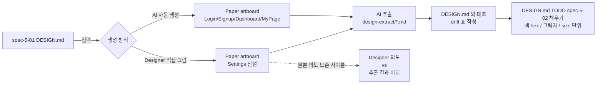

# spec-5-02: 앱 A Paper 시안 + Settings 페이지 신설 + 원본 의도 보존 검증

## 📋 메타

| 항목 | 값 |
|---|---|
| **Spec ID** | `spec-5-02` |
| **Phase** | `phase-5` |
| **Branch** | `spec-5-02-app-a-paper-design` |
| **상태** | Planning |
| **타입** | Research (왕복 drift 측정) + Feature (Paper 시안 산출물) |
| **Integration Test Required** | yes (DESIGN.md ↔ Paper 왕복 drift 측정 = 통합 테스트 성격) |
| **작성일** | 2026-04-27 |
| **소유자** | Dennis |

## 📋 배경 및 문제 정의

### 현재 상황

- **spec-5-01 산출물**: `poc/app-a/DESIGN.md` (앱 A "TaskFlow") + `REQUIREMENTS.md` 가 main 에 머지됨. 5 개 페이지 정의 (`auth-login` / `auth-signup` / `dash-overview` / `profile-mypage` / `common-error`) + 컴포넌트 / 토큰 / i18n 키 마련.
- **DESIGN.md 의 미충족 항목**: 색 정확 hex, 그림자값, 정확한 size 단위가 `TODO(spec-5-02)` 마커로 남아 있음. Paper 시안에서 채우는 것이 본 spec 의 책무로 미리 선언됨 (`DESIGN.md` L33 / L89 / L143 / L181 / L341 / L458).
- **Phase 4 회고에서 이월된 부채**: "원본 의도 보존 검증 (W2 부분 흡수)" — Designer 가 직접 디자인한 산출물이 AI 추출 → DESIGN.md 사이클을 통과해도 의도가 보존되는지 미측정.
- **Paper MCP 의 검증 폭 부족**: spec-4-02 / 4-03 에서 page variant (LoginPage page-form 등) 만 부분 검증. modal / bottom-sheet 같은 variant 와 데이터 집약 페이지는 미측정 영역. 다만 본 spec 은 **"기존 페이지 재활용 ❌, 새 페이지에서 다양한 컴포넌트·토큰 활용"** 방향으로 결정 (2026-04-27, 사용자) → variant·DashboardPage drift 는 Icebox 로 이월.

### 문제점

1. **원본 의도 보존이 검증되지 않은 채 spec-5-03 (React 구현) 으로 넘어가면 위험**: Designer 가 그린 디자인의 정확한 의도가 AI 추출 → DESIGN.md → React 코드 사이클을 통과하면서 어디서 손실되는지 측정점이 없으면 phase-5 의 "토큰만 바꾸면 브랜딩이 바뀐다" 가설 자체가 신뢰성을 잃는다.
2. **DESIGN.md 의 시각 디자인 정확값이 비어 있음**: 색 hex / 그림자 / size 단위가 미정인 채로는 Paper 시안 ↔ React 코드 시각적 일치도(spec-5-03 검증 포인트)를 객관적으로 측정할 수 없다.
3. **기존 4 페이지(Login / Signup / Dashboard / MyPage) 는 Phase 2 / 3 에서도 유사 패턴이 다뤄졌다**: 동일 패턴의 반복 검증으로는 토큰·컴포넌트의 폭 (특히 form-heavy 입력 컴포넌트군) 을 자극하기 어렵다. 새로운 종류의 페이지가 필요.

### 해결 방안 (요약)

5 개 페이지의 Paper artboard 를 모두 **AI 자동 생성**으로 작성한다. Settings 신설 페이지는 **Radix UI Settings 패턴** (Switch / Select / Slider / Section + divider / Danger zone) 을 reference 로 활용해 토큰·컴포넌트 자극 폭을 확보한다. 각 페이지에서 추출한 `design-extract/*.md` 를 DESIGN.md 와 대조해 항목별 drift 표를 만들고, DESIGN.md 의 `TODO(spec-5-02)` 마커를 Paper 추출값으로 채운다.

**원본 의도 보존 검증** 의 *원본* 정의 — Settings 의 경우 *AI 입력 의도* (DESIGN.md §11/§12 의 Settings 정의 + Radix UI Settings 패턴 reference) 가 AI 생성 → AI 재추출 사이클을 통과해 보존되는지를 측정한다 (사용자 결정 2026-05-02: AI 베이스 시스템 일관성 위해 Designer 인적 단계 제거).

## 📊 개념도

## 🎯 요구사항

### Functional Requirements

1. **Paper artboard 작성 (5 페이지)**: `auth-login` / `auth-signup` / `dash-overview` / `profile-mypage` / 신설 `settings-overview` 를 Paper MCP 로 작성. 각 페이지의 artboard URL 을 walkthrough 에 기록.
2. **신설 Settings 페이지의 정의 보강**: spec-5-01 DESIGN.md 의 Page Map (L204) 와 Page Specifications (L214~) 에 Settings 페이지 (`settings-overview`, `/settings`) 를 추가. Section / Block / Composite / i18n 키까지 schema 준수.
3. **AI 자동 생성 (4 페이지)**: DESIGN.md 입력 → Paper MCP 로 Login / Signup / Dashboard / MyPage artboard 생성. 결과를 사람이 시각 검수하되 의도적 보정은 최소화 (drift 의 자연 측정).
4. **AI Radix-based 자동 생성 (Settings 1 페이지)**: AI 가 **Radix UI Settings 패턴** (Switch / Select / Slider / Section + divider / Danger zone, label 좌·control 우, group header + description) 을 reference 로 Paper 에 SettingsPage 를 작성. Toggle / Select / Slider / Section header / Group list / Danger Button 등 다양한 입력·구성 컴포넌트를 의도적으로 포함.
5. **AI 추출 (5 페이지)**: 모든 artboard 를 AI 가 `poc/app-a/design-extract/{page}.md` 로 추출. schema (`schema/design-md-schema.md`) 준수.
6. **DESIGN.md TODO 채우기**: 추출 결과로 색 hex / 그림자 / 정확한 size 단위를 DESIGN.md 에 반영. `TODO(spec-5-02)` 마커는 모두 제거.
7. **원본 의도 보존 사이클 비교 (Settings)**: AI 입력 의도 (DESIGN.md Settings 정의 + Radix UI Settings 패턴 reference) 를 사전에 메모로 명시 → AI 가 Paper 에 작성 → AI 추출 결과와 항목별 일치 / 부분 일치 / 불일치 표 작성. `poc/app-a/intent-preservation.md` 에 기록.
8. **drift 측정 결과 표**: 5 페이지 × N 항목의 drift 표 (Section / Block / 컴포넌트 / 토큰 / i18n 키 단위) 를 `poc/app-a/drift-report.md` 로 작성.

### Non-Functional Requirements

1. **schema 준수**: `design-extract/*.md` 는 모두 `schema/design-md-schema.md` 14 섹션 구조 준수.
2. **표기 정규화**: Paper export 결과에서 oklch ↔ hex / rgba ↔ 8-hex / padding 단일 ↔ block-inline / fontFamily fallback 등 표기 차이는 별도 정규화 단계로 흡수. drift 표에서는 정규화 후 비교.
3. **단일 명령 원칙**: Paper MCP / git / sdd 명령은 한 번에 하나씩 호출 (agent.md §6.4).
4. **재사용 가능 함수 후보 식별**: 정규화 / 비교 시 발견된 반복 패턴은 `poc/app-a/findings.md` 의 "phase-6 입력" 섹션에 후보로 기록 (실제 코드화는 phase-6).

## 🚫 Out of Scope

- **React 코드 구현** — `spec-5-03` 에서 처리 (`poc/app-a/src/`).
- **`tokens.json` / `i18n/en.json` 실파일 생성** — `spec-5-03` 에서 처리. 본 spec 은 DESIGN.md 의 표 / 마크다운 갱신까지만.
- **앱 B 토큰·i18n 교체 검증** — `spec-5-04` 의 책무.
- **LoginPage modal / bottom-sheet variant 확장** — Icebox 이전 (queue.md `phase-5 이월 follow-ups`).
- **DashboardPage 왕복 drift** — Icebox 이전 (동일).
- **Settings 페이지의 인터랙션 / state 머신** — 본 spec 은 시각 디자인 + DESIGN.md 정의까지. state 동기화는 `spec-5-03`.
- **paper-normalizer 유틸리티 코드화** — 함수 후보만 식별. 코드화는 phase-6.

## 🔍 Critique 결과 (선택)

미실행. 본 spec 의 범위 결정 과정에서 사용자와 두 차례 정렬을 거쳤고 (새 페이지 의미 명확화 + Phase 4 이월 과제 처리), 외부 critique 가 추가하는 가치보다 즉시 실행이 더 가치있다고 판단. 필요 시 Plan Accept 전에 `/hk-spec-critique` 호출 가능.

## ✅ Definition of Done

- [ ] 5 페이지 Paper artboard URL 기록 (walkthrough)
- [ ] `poc/app-a/DESIGN.md` 의 Settings 페이지 정의 추가 (Page Map + Page Spec + Composite + i18n 키)
- [ ] `poc/app-a/DESIGN.md` 의 `TODO(spec-5-02)` 마커 0 개 (모두 채워짐)
- [ ] `poc/app-a/design-extract/*.md` 5 개 (schema 14 섹션 준수)
- [ ] `poc/app-a/drift-report.md` 5 페이지 × N 항목 drift 표
- [ ] `poc/app-a/intent-preservation.md` (또는 `findings.md` 흡수) — Settings 원본 의도 vs 추출 결과 비교 표
- [ ] (단위 테스트 해당 없음 — 산출물 검증은 통합 테스트로 갈음)
- [ ] (Integration Test Required = yes) drift 표 / 의도 보존 표가 모두 작성되고 합리적 결론이 도출됨 (= 통합 테스트 PASS 기준)
- [ ] `walkthrough.md` 와 `pr_description.md` 작성 및 ship commit
- [ ] `spec-5-02-app-a-paper-design` 브랜치 push 완료
- [ ] 사용자 검토 요청 알림 완료
