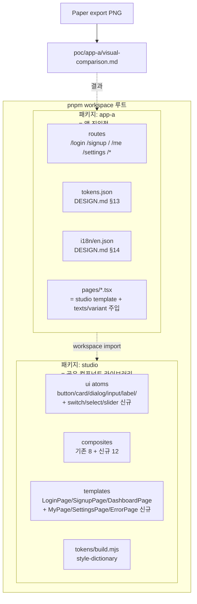

# Implementation Plan: spec-5-03

## 📋 Branch Strategy

- 신규 브랜치: `spec-5-03-app-a-react-impl` (브랜치 이름 = spec 디렉토리 이름, `feature/` prefix 없음)
- 시작 지점: `main`
- 첫 task 는 브랜치 생성 (단, alignment 단계에서 §10.1 재발 방지 차원으로 이미 생성됨 → task 1 에서 [-] 처리하고 사유 명시)

## 🛑 사용자 검토 필요 (User Review Required)

> [!IMPORTANT]
> - [ ] **pnpm workspace 도입 결정** — 기존 root 디렉토리 (단일 `studio/` + `poc/`) 구조에서 root `pnpm-workspace.yaml` + 패키지별 `package.json` 구조로 전환. studio 의 기존 lockfile / scripts 는 그대로 유지하되 root 에서 `pnpm --filter` 로 통합 호출.
> - [ ] **studio 보강 범위** — `LoginPageTexts.socialApple/Kakao` → `socialGoogle/socialGithub` 로 교체는 **breaking change** (Phase 2 산출물 인터페이스 변경). 호출 측이 아직 없으므로 영향은 0 이지만, 이후 phase-2 산출물 재사용 시 호환성 추적 필요.
> - [ ] **Settings 페이지의 base-ui Switch / Select / Slider 도입** — 기존 ui atoms 에 없는 새 컴포넌트군. Phase 2 의 atom 패턴 (button / card / dialog / input / label) 과 동일 구조 (variants + ref forwarding) 로 작성.

> [!WARNING]
> - [ ] **Paper export 수집 방식** — Paper MCP `get_screenshot` 으로 5 페이지 + error 1 종 PNG 저장하거나, 사용자 manual export. 본 spec 은 MCP 호출로 진행 (재현 가능). 저장 위치: `poc/app-a/visual/paper/{page-id}.png`.
> - [ ] **dev 서버 스크린샷 도구** — 자동화 없이 dev 서버 + 사용자 스크린샷. 또는 `vite preview` 빌드 후 Playwright 같은 헤드리스로 캡처. 본 spec 은 MCP 호출 가능 시 자동, 불가 시 manual. 저장 위치: `poc/app-a/visual/render/{page-id}.png`.
> - [ ] **시각 일치도 등급 기준** — ✅ (Paper 의도 그대로 재현) / ⚠️ (의도 일부 손실 — spacing / radius / 정렬 어긋남, 실용 가능) / ❌ (시각 의도 명백히 다름 — 색상 / 레이아웃 / 컴포넌트 missing). 픽셀 단위 측정은 하지 않음.

## 🎯 핵심 전략 (Core Strategy)

### 아키텍처 컨텍스트



### 주요 결정

| 컴포넌트 | 전략 | 이유 |
|:---:|:---|:---|
| **monorepo** | pnpm workspace 도입 (`pnpm-workspace.yaml`), 패키지 = `studio`, `poc/app-a` | studio = 공유 라이브러리, app-a / app-b = 앱 진입점 분리. spec-5-04 의 "토큰 + i18n 만 교체" 가설은 이 구조에서 자연스러움 |
| **studio** | 기존 templates 보강 (props 추가형 + i18n 키 SSOT 정렬) + 신규 (MyPage/SettingsPage/ErrorPage 등) | DESIGN.md = SSOT. 보강 범위 최소화로 Phase 2 산출물 보존 |
| **신규 ui atoms** | `@base-ui/react` (이미 의존성 존재) 의 Switch / Select / Slider 를 wrapper 패턴으로 export | shadcn/base-ui 패턴 일관성. Tailwind class + variants for hover/focus/disabled |
| **tokens** | DESIGN.md §13 → `poc/app-a/tokens.json` (style-dictionary 호환) → `studio/tokens/build.mjs` 가 처리 → CSS 변수 생성 | studio 가 빌드 단계 보유. app-a 는 toks.json 만 제공하면 됨 |
| **i18n** | `poc/app-a/i18n/en.json` 정적 import → 라우트별 `texts` props 주입. i18n 라이브러리 미도입 (앱 A 는 단일 언어) | YAGNI. spec-5-04 에서 ko 추가 시 라이브러리 도입 검토 |
| **라우터** | `react-router-dom` 도입 (vite + React 표준). `/login /signup / /me /settings /*` | 표준. catch-all 로 ErrorPage 404 |
| **시각 비교** | Paper MCP `get_screenshot` (artboard 별) ↔ dev 서버 사용자 스크린샷. 페이지별 정성 등급 + 차이 원인 분류 | phase-5 SC #4 충족. 자동화는 spec-5-05 회고 |
| **테스트** | vitest + @testing-library/react. studio 기존 패턴 (`templates/types.test.ts`) 답습 | 일관성. Phase 2 의 테스트 인프라 그대로 |

## 📂 Proposed Changes

### Workspace 설정

#### [NEW] `pnpm-workspace.yaml`

```yaml
packages:
  - 'studio'
  - 'poc/app-a'
```

#### [NEW] `package.json` (root)

루트 package.json 미존재 → 신규 작성. workspace 통합 스크립트 (편의):
```json
{
  "name": "design-monorepo",
  "private": true,
  "scripts": {
    "studio:dev": "pnpm --filter studio dev",
    "app-a:dev": "pnpm --filter app-a dev",
    "test": "pnpm -r test",
    "build": "pnpm -r build",
    "lint": "pnpm -r lint"
  }
}
```

#### [MODIFY] `studio/package.json`

`"name": "studio"` 그대로. 외부 노출이 필요하면 `"name": "@design/studio"` 로 변경 가능 (본 spec 은 `studio` 유지하고 app-a 가 `"studio": "workspace:*"` 의존).

### studio 보강 (DESIGN.md SSOT 정렬)

#### [MODIFY] `studio/src/components/templates/types.ts`

- `LoginPageTexts`: `socialApple` / `socialKakao` → `socialGoogle` / `socialGithub`. `forgotPassword`, `signupPrompt` 키 검증.
- `SignupPageTexts`: `socialGoogle` / `socialGithub` 추가 (현재 없음). `loginPrompt` / `loginLink` / `termsAgreement` 검증.
- `DashboardPageTexts`: DESIGN.md §14 dash 키와 정렬 (`activeTasks` / `done` / `overdue` / `members` / `quickAction.newTask` 등).
- 신규: `MyPageTexts`, `SettingsPageTexts`, `ErrorPageTexts` 인터페이스 추가.

#### [MODIFY] `studio/src/components/templates/LoginPage/*`

- `LoginForm` social 버튼 google/github 매핑 반영.
- variant `modal` 의 width 480px / radius 16px / elevation-modal 적용 (DESIGN.md §11 §6).

#### [MODIFY] `studio/src/components/templates/SignupPage/*`

- split-screen 레이아웃 적용 (DESIGN.md §11 auth-signup).

#### [MODIFY] `studio/src/components/templates/DashboardPage/*`

- 4 종 StatCard (Active Tasks / Done / Overdue / Members), trend variant 정합성 확인.
- ActivityTable 4 컬럼 (Task / Assignee / Status / Updated) 확인.

### studio 신규 templates

#### [NEW] `studio/src/components/templates/MyPage/`

```
MyPage.tsx          — page variant, shell layout (Sidebar + main)
index.ts            — export
MyPage.test.tsx     — texts/variant 테스트
```

#### [NEW] `studio/src/components/templates/SettingsPage/`

```
SettingsPage.tsx    — page variant, shell layout
                      섹션: NotificationGroup / AppearanceGroup / LanguageGroup / AccountGroup
index.ts
SettingsPage.test.tsx
```

#### [NEW] `studio/src/components/templates/ErrorPage/`

```
ErrorPage.tsx       — page variant, centered-card layout
                      변형: variant '404' | '500'
index.ts
ErrorPage.test.tsx
```

### studio 신규 composites

각 composite 는 `studio/src/components/composites/{Name}/{Name}.tsx + index.ts + {Name}.test.tsx` 패턴.

- `ProfileHeader` — 아바타 + 이름 + 역할
- `ProfileInfoCard` — 이메일 / 가입일 / 팀 (Card 기반)
- `ActivitySummary` — 작업 / 댓글 / 완료율 요약
- `AvatarUpload` — 아바타 변경 영역
- `SettingsHeader` — 페이지 제목 + 검색
- `SettingsGroup` — 그룹 제목 + 행 배열 wrapper
- `SettingsToggleRow` — Label + HelperText + Switch
- `SettingsSelectRow` — Label + Select
- `SettingsSliderRow` — Label + ValueDisplay + Slider
- `ErrorIcon` — 404/500 아이콘 (lucide-react: AlertTriangle / FileSearch / ServerCrash)
- `ErrorMessage` — 코드 + 한 줄 설명
- `HomeButton` — Primary Button "Back to Home"

### studio 신규 ui atoms

#### [NEW] `studio/src/components/ui/switch.tsx`

base-ui `<Switch.Root />` wrapper. Tailwind variants: `hover` / `focus` / `disabled` / `checked` 4 state. radius full, knob 그림자 (`elevation-knob`).

#### [NEW] `studio/src/components/ui/select.tsx`

base-ui `<Select.Root />` wrapper. trigger / popup / item / indicator. radius `--radius-md`, focus ring primary.

#### [NEW] `studio/src/components/ui/slider.tsx`

base-ui `<Slider.Root />` wrapper. track / range / handle. handle 그림자 (`elevation-handle`).

### app-a 패키지

#### [NEW] `poc/app-a/package.json`

```json
{
  "name": "app-a",
  "private": true,
  "type": "module",
  "scripts": {
    "dev": "vite",
    "build": "tsc -b && vite build",
    "preview": "vite preview",
    "test": "vitest run",
    "lint": "eslint ."
  },
  "dependencies": {
    "studio": "workspace:*",
    "react": "^19.2.4",
    "react-dom": "^19.2.4",
    "react-router-dom": "^7.x"
  },
  "devDependencies": {
    "@types/react": "^19.2.14",
    "@types/react-dom": "^19.2.3",
    "@vitejs/plugin-react": "^6.0.1",
    "typescript": "~6.0.2",
    "vite": "^8.0.4",
    "vitest": "^4.1.4"
  }
}
```

#### [NEW] `poc/app-a/vite.config.ts`, `tsconfig.json`, `index.html`

vite + React 19 + tailwind 4 표준 셋업. studio 의 vite/tsconfig 답습.

#### [NEW] `poc/app-a/tokens.json`

DESIGN.md §13 의 14+ color / 8 typography / 10 spacing / 4 radius / 5 elevation 토큰을 style-dictionary 호환 JSON.

#### [NEW] `poc/app-a/i18n/en.json`

DESIGN.md §14 의 60+ 키. namespace `{page}.{section}.{element}.{property}`.

#### [NEW] `poc/app-a/src/`

```
main.tsx           — ReactDOM.createRoot
App.tsx            — RouterProvider + 글로벌 토큰 import
routes.tsx         — Route 정의
pages/login.tsx    — <LoginPage variant="modal" texts={...} />
pages/signup.tsx
pages/dashboard.tsx
pages/mypage.tsx
pages/settings.tsx
pages/error.tsx
hooks/useTexts.ts  — i18n/en.json 에서 namespace 별로 추출
```

#### [NEW] `poc/app-a/visual/paper/*.png`, `poc/app-a/visual/render/*.png`

Paper MCP / 사용자 스크린샷.

#### [NEW] `poc/app-a/visual-comparison.md`

페이지 6 종 비교 표.

### Spec / Ship 산출물

#### [NEW] `specs/spec-5-03-app-a-react-impl/walkthrough.md`, `pr_description.md`

Ship 단계.

## 🧪 검증 계획 (Verification Plan)

### 단위 테스트 (필수)

```bash
# studio
pnpm --filter studio test

# app-a
pnpm --filter app-a test

# 통합
pnpm -r test
```

각 신규 template / composite / atom 마다 다음 케이스 최소:
- 기본 렌더링 (texts / variant 전달 → 화면에 표시)
- variant 변경 (있는 경우)
- 인터랙션 (Switch on/off, Select 선택, Slider 값 변경)

### 통합 테스트 (Integration Test Required = no)

본 spec 은 통합 테스트 없음. phase-5 통합 시나리오 1 ("앱 A E2E") 은 phase-ship 단계에서 종합 검증.

### 수동 검증 시나리오

1. **`pnpm install`** — workspace 셋업 후 root + studio + app-a 의존성 설치 PASS.
2. **`pnpm --filter app-a dev`** — dev 서버 기동, http://localhost:5173 접속 가능.
3. **각 라우트 접근** — `/login`, `/signup`, `/`, `/me`, `/settings`, `/nonexistent` (404) 모두 정상 렌더링.
4. **상호작용 검증** — Settings 의 Switch 토글, Select 변경, Slider 드래그가 시각적으로 반응. Login 의 input focus 시 primary ring 표시. Button hover 시 색 변화.
5. **토큰 적용 확인** — DevTools 에서 CSS 변수 (`--color-primary` 등) 가 DESIGN.md §13 정확값과 일치.
6. **i18n 적용 확인** — 각 페이지 텍스트가 `en.json` 에서 옴. hardcode 없음.
7. **visual-comparison.md 검토** — Paper export 와 dev 스크린샷 6 페이지 일치도 등급 부여, 차이 원인 분류 작성.

## 🔁 Rollback Plan

- **pnpm workspace 도입 실패 시**: 루트 `pnpm-workspace.yaml` 제거 + studio 의 단독 lockfile 유지. app-a 는 별도 디렉토리 단독 npm/pnpm 으로 분리. Phase 2 산출물에 영향 없음.
- **studio 보강이 기존 templates 깨면**: 변경한 props 를 optional 로 분리. breaking 한 키 (예: socialGoogle/Github) 만 spec-5-04 에서 마이그레이션.
- **시각 비교가 무의미한 결과**: Paper export 와 렌더링이 너무 다르면 spec-5-05 회고에서 원인 분석. 본 spec 은 차이 자체를 산출물로 인정.

## 📦 Deliverables 체크

- [ ] task.md 작성 (다음 단계)
- [ ] 사용자 Plan Accept (`/hk-plan-accept`)
- [ ] (실행 후) 모든 task 완료
- [ ] (실행 후) walkthrough.md / pr_description.md ship + push + PR 생성
