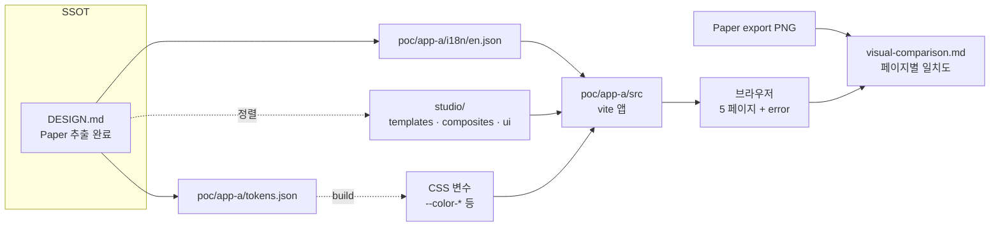

# spec-5-03: 앱 A React 구현 및 시각적 일치도 검증

## 📋 메타

| 항목 | 값 |
|---|---|
| **Spec ID** | `spec-5-03` |
| **Phase** | `phase-5` |
| **Branch** | `spec-5-03-app-a-react-impl` |
| **상태** | Planning |
| **타입** | Feature |
| **Integration Test Required** | no |
| **작성일** | 2026-05-02 |
| **소유자** | Dennis |

## 📋 배경 및 문제 정의

### 현재 상황

- **spec-5-01 (Merged)** 산출물: `poc/app-a/DESIGN.md`, `poc/app-a/REQUIREMENTS.md`. Blueprint → 5 페이지 + 토큰 / i18n / 컴포넌트 명세.
- **spec-5-02 (Merged)** 산출물: Paper artboard 5 페이지 (Login / Signup / Dashboard / MyPage / Settings) + `poc/app-a/design-extract/*.md` (5 파일) + `poc/app-a/drift-report.md` + `poc/app-a/intent-preservation.md`. DESIGN.md 의 spec-5-02 마커 전부 채움 (정확 hex / shadow / 단위).
- **studio/** (Phase 2 산출물): vite + React 19 + Tailwind 4 + base-ui + shadcn 셋업. `studio/tokens/build.mjs` 토큰 빌드 파이프라인 포함. 기존 templates: `LoginPage`, `SignupPage`, `DashboardPage`. 기존 composites: `LoginForm`, `SignupForm`, `DashboardHeader`, `Sidebar`, `StatCard`, `ActivityTable`, `BrandHeader`, `SocialAuthBlock`. 기존 ui atoms: `button`, `card`, `dialog`, `input`, `label`.

### 문제점

1. DESIGN.md (Blueprint + Paper 추출 결과) 가 React 코드로 실증되지 않음 — phase-5 통합 시나리오 1 ("Blueprint → DESIGN.md → Paper → React") 의 마지막 단계 부재.
2. studio 기존 templates 가 DESIGN.md (앱 A) 정의와 일부 mismatch (예: `LoginPageTexts.socialApple/Kakao` ↔ DESIGN.md `google/github`). DESIGN.md SSOT 와 정합성 미확보.
3. **MyPage / SettingsPage / ErrorPage** 미구현. 관련 composites (`ProfileHeader`, `ProfileInfoCard`, `ActivitySummary`, `AvatarUpload`, `SettingsHeader`, `SettingsGroup`, `SettingsToggleRow/SelectRow/SliderRow`, `ErrorIcon`, `ErrorMessage`, `HomeButton`) 와 ui atoms (`Switch`, `Select`, `Slider`) 도 없음.
4. `poc/app-a/tokens.json`, `poc/app-a/i18n/en.json` 부재 — DESIGN.md §13 토큰 / §14 i18n 키 (60+) 가 코드 자원으로 변환되지 않음.
5. **시각적 일치도 미측정** — Paper 시안 ↔ React 렌더링 비교 표 없음. phase-5 success criteria #4 미충족.
6. 재사용성 가설 (phase-5 SC #2~3, "토큰 + i18n 만 교체") 의 토대 (앱 A) 부재 → spec-5-04 (앱 B) 진행 불가.

### 해결 방안 (요약)

DESIGN.md 를 SSOT 로 (1) studio 의 기존 templates / composites / atoms 를 보강·신규 작성하고, (2) `poc/app-a/` 에 별도 vite 앱을 두며 pnpm workspace 로 studio 를 path import 하여, (3) 5 페이지 + 에러 페이지를 라우팅 / 토큰 / i18n 과 함께 렌더링하고, (4) Paper export 와 dev 서버 스크린샷의 페이지별 비교 표 (`poc/app-a/visual-comparison.md`) 로 시각적 일치도를 정성 평가한다.

## 📊 개념도

## 🎯 요구사항

### Functional Requirements

1. **pnpm workspace 셋업** — root `pnpm-workspace.yaml` 에 `studio`, `poc/app-a` 등록. `poc/app-a` 가 `studio` 를 workspace 의존으로 import 가능.
2. **DESIGN.md SSOT 정렬 — 기존 studio templates 보강**:
   - `LoginPage`: `LoginPageTexts` 의 `socialApple/Kakao` → `socialGoogle/socialGithub` 로 교체. `forgotPassword`, `signupPrompt`, `signupLink` 키 정합성 확인.
   - `SignupPage`: `socialGoogle/Github`, `loginPrompt/Link`, `termsAgreement` 정합성 확인.
   - `DashboardPage` / `DashboardHeader` / `StatCard` / `ActivityTable`: DESIGN.md §11 dash-overview 와 §12 composite 정의에 맞춰 props / variant 정합성 확인.
3. **신규 templates** (`studio/src/components/templates/`):
   - `MyPage` (variant: page, layout: shell)
   - `SettingsPage` (variant: page, layout: shell)
   - `ErrorPage` (variant: page, layout: centered-card)
4. **신규 composites** (`studio/src/components/composites/`):
   - `ProfileHeader`, `ProfileInfoCard`, `ActivitySummary`, `AvatarUpload`
   - `SettingsHeader`, `SettingsGroup`, `SettingsToggleRow`, `SettingsSelectRow`, `SettingsSliderRow`
   - `ErrorIcon`, `ErrorMessage`, `HomeButton`
5. **신규 ui atoms** (`studio/src/components/ui/`):
   - `Switch`, `Select`, `Slider` — base-ui 기반 (이미 `@base-ui/react` 의존성 존재)
6. **`poc/app-a/tokens.json`** — DESIGN.md §13 의 정확값 (color 14+ / typography 8 / spacing 10 / radius 4) 을 style-dictionary 호환 JSON 으로 작성. `studio/tokens/build.mjs` 와 호환되어 CSS 변수 자동 생성.
7. **`poc/app-a/i18n/en.json`** — DESIGN.md §14 의 60+ 키, namespace `{page}.{section}.{element}.{property}` 컨벤션, default 영어 텍스트.
8. **`poc/app-a/` vite 앱 구성**:
   - 라우터: `/login`, `/signup`, `/`, `/me`, `/settings`, `/*` (catch-all → ErrorPage 404)
   - 토큰 import (CSS 변수) + i18n 키 → `texts` props 주입
   - studio templates 를 workspace import
   - 모든 페이지가 dev 서버에서 정상 렌더링
9. **`poc/app-a/visual-comparison.md`** — 페이지 6 종 (5 페이지 + error) 의 Paper export 와 dev 스크린샷을 게재한 표. 각 페이지에 대해:
   - 일치도 정성 등급 (✅ 일치 / ⚠️ 부분 / ❌ 불일치)
   - 차이점 목록 (간결, 1~3 줄)
   - 차이의 원인 분류 (DESIGN.md 누락 / studio 패턴 차이 / 토큰 미적용 / 정상 차이)
10. **단위 테스트** — 신규 templates / composites / atoms 각각 vitest + @testing-library/react 로 텍스트 / variant / 인터랙션 핵심 테스트. Phase 2 의 기존 테스트 패턴 (`templates/types.test.ts` 등) 따름.
11. **상호작용 state** — hover / focus / disabled 가 모든 interactive 컴포넌트 (Button / Input / Switch / Select / Slider) 에서 토큰 (Primary / Border / Ring) 을 사용해 시각적으로 표현.

### Non-Functional Requirements

1. **빌드 / lint / 테스트 PASS**: `pnpm --filter studio {test,build,lint}` 와 `pnpm --filter app-a {test,build,lint}` (있는 경우) 모두 통과.
2. **Backward compat**: studio 기존 templates 의 보강은 props 추가형 (optional) 우선. breaking change 시 본 문서에 명시.
3. **토큰 일관성**: tokens.json 의 키가 DESIGN.md §13 의 CSS 변수명 (`--color-primary` 등) 과 1:1 변환 가능.
4. **i18n 컨벤션**: namespace `{page}.{section}.{element}.{property}` 준수. DESIGN.md §14 에 정의되지 않은 키 신설 시 DESIGN.md 갱신.
5. **Node / pnpm**: `.node-version` (Node 24+), corepack pnpm. `npm` 사용 금지 (CLAUDE.md).

## 🚫 Out of Scope

- 한국어 / 다국어 지원 — 본 spec 은 `en` 만. ko 는 spec-5-04 에서 추가하여 "i18n 만 교체" 가설 검증.
- 다크 테마 / dark variant — DESIGN.md "기본 테마 light, 지원 테마 [light]". dark 는 후속 spec.
- 자동 visual regression (Playwright + chromatic / 픽셀 diff) — 수동 정성 비교만. 자동화 필요성은 spec-5-05 (회고) 에서 평가.
- 백엔드 API / 실 데이터 — 모든 페이지는 mock 텍스트·데이터로 정적 렌더링.
- LoginPage modal → bottom-sheet variant 자동 전환 — Icebox phase-5 이월 항목 (`backlog/queue.md`).
- DashboardPage 데이터 집약 페이지 왕복 drift 측정 — 동일 Icebox 항목.
- 컴포넌트 / variant / props 식별자의 한국어화 — 코드는 영어 유지 (기술 용어).
- 추가 페이지 (settings detail / dashboard tasks subpage 등) — DESIGN.md 5 페이지 + error 한정.
- Storybook 도입 — Phase 2/3 에서 미도입 결정 유지.

## 🔍 Critique 결과 (선택)

> 본 spec 은 `/hk-spec-critique` 권장 (phase-4 회고 부채 A4 — Research / PoC spec 은 critique 기본 수행). Plan Accept 전 사용자가 critique 호출 여부 결정.

## ✅ Definition of Done

- [ ] 모든 단위 테스트 PASS (`pnpm --filter studio test` + `pnpm --filter app-a test`)
- [ ] `pnpm --filter studio build` + `pnpm --filter app-a build` PASS
- [ ] dev 서버 (`pnpm --filter app-a dev`) 에서 6 페이지 (5 + error) 모두 정상 렌더링 (수동 확인)
- [ ] `poc/app-a/tokens.json` + `poc/app-a/i18n/en.json` 작성 + DESIGN.md SSOT 정합
- [ ] `poc/app-a/visual-comparison.md` 작성 — 6 페이지 일치도 / 차이 / 원인
- [ ] `walkthrough.md` + `pr_description.md` 작성 + ship commit
- [ ] `spec-5-03-app-a-react-impl` 브랜치 push + PR 생성 (target: `main`)
- [ ] 사용자 검토 요청 알림
