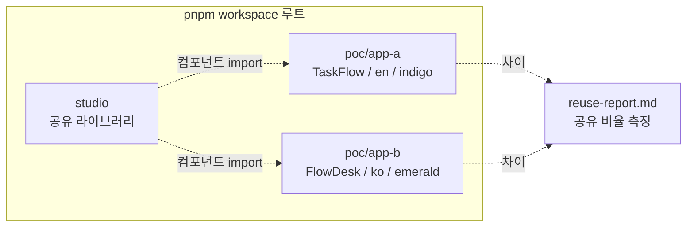

# spec-5-04: 앱 B 재사용성 검증 (토큰 + i18n 만 교체)

## 📋 메타

| 항목 | 값 |
|---|---|
| **Spec ID** | `spec-5-04` |
| **Phase** | `phase-5` |
| **Branch** | `spec-5-04-app-b-reusability` |
| **상태** | Planning |
| **타입** | Feature |
| **Integration Test Required** | no |
| **작성일** | 2026-05-05 |
| **소유자** | Dennis |

## 📋 배경 및 문제 정의

### 현재 상황

- **spec-5-03 (Merged)** 산출물: `studio/` (공유 컴포넌트 라이브러리, 12 신규 composites + 3 신규 templates + 3 ui atoms), `poc/app-a/` (TaskFlow 앱, vite 8 + React 19 + tailwind 4 + base-ui + react-router 7, tokens.json + i18n/en.json + 6 라우트), `pnpm-workspace` 셋업.
- **`poc/app-a/visual-comparison.md`** 의 토큰 미적용 0 건 — 토큰 SSOT 정렬 성공으로 확인됨.
- **studio templates** 는 `texts` props 와 CSS 변수 (토큰) 를 통해서만 시각·언어 표현. 컴포넌트 코드에 hardcoded 색·문자 없음 (가설).

### 문제점

1. phase-5 의 success criteria 중 **#2 (앱 B 가 앱 A 와 동일 구조, 토큰/i18n 만 교체) 와 #3 (공유 코드 비율 80%+) 가 미검증**. spec-5-03 까지는 앱 A (단일) 만 있어 가설 실증 불가.
2. studio 컴포넌트 라이브러리의 **재사용성** 이 가설일 뿐 측정되지 않음. "토큰 + i18n 만 교체" 라는 minimum 변경으로 다른 앱이 만들어지는지 확인 필요.
3. studio 의 hardcoded 색·문자 (있다면) 를 발견할 기회 — 본 spec 에서 식별되어야 phase-5 회고 (spec-5-05) 의 입력이 됨.

### 해결 방안 (요약)

`poc/app-b/` 에 신규 패키지를 만들고, **studio 코드 / poc/app-a 페이지 구조를 재활용**하여 (1) 다른 토큰 셋 (`tokens.json` — emerald + 다른 액센트), (2) 다른 i18n (`i18n/ko.json` — 한국어), (3) 다른 브랜드명 (TaskFlow → FlowDesk / 플로우데스크) 을 적용한 앱을 렌더링한다. 라우팅 / 페이지 컴포넌트 코드는 app-a 의 그것을 **거의 그대로 복제** (텍스트 / 토큰 import 만 다름) 하여 "변경 폭" 을 최소화하고, 공유 코드 비율을 LOC 기반으로 측정한다.

## 📊 개념도

## 🎯 요구사항

### Functional Requirements

1. **`poc/app-b/` 신규 vite 패키지** — workspace 의 새 패키지로 등록 (`pnpm-workspace.yaml` 갱신). 의존성과 셋업은 `poc/app-a/` 패턴 답습 (vite + React + tailwind + base-ui + react-router + studio workspace import).
2. **`poc/app-b/tokens.json`** — DTCG 형식. **color 만 변경**, radius / spacing / font / elevation 은 app-a 와 동일.
   - Primary: indigo `#4F46E5` → **emerald `#059669`** (또는 동급의 다른 hue)
   - Accent: teal `#0EA5B7` → 다른 보조 색
   - 나머지 (text / surface / status) 는 동일 — 의미 일관성 유지
3. **`poc/app-b/i18n/ko.json`** — DESIGN.md §14 의 60+ 키 모두 한국어 번역. namespace 컨벤션 동일.
4. **`poc/app-b/src/` 페이지 구조** — `poc/app-a/src/` 와 동일 라우트 (`/login`, `/signup`, `/`, `/me`, `/settings`, `/*`). 페이지 컴포넌트 코드는 app-a 로부터 **복제 후 i18n / 브랜드명만 변경**.
5. **앱 B 의 브랜드명** — `FlowDesk` (en 표기) / `플로우데스크` (ko 표기). i18n `app.name` 에 한국어로.
6. **검증** — `pnpm --filter app-b dev` 기동 시 6 라우트 모두 정상 렌더링, 한국어 텍스트 + emerald primary 색 표시.
7. **`poc/app-b/reuse-report.md`** — 공유 코드 비율 측정:
   - studio 라이브러리 LOC (재사용)
   - poc/app-a 의 LOC (앱 A 고유)
   - poc/app-b 의 LOC (앱 B 고유)
   - 공유 비율 = `studio_LOC / (studio_LOC + appa_LOC + appb_LOC)` 또는 `(공통)/(전체)` 형식
   - 80%+ 목표 충족 여부
   - **발견된 hardcode** (있다면) 목록 → spec-5-05 회고 입력
8. **단위 테스트** — app-b 에도 라우트 smoke test (`/login`, `/signup`, `/`, `/me`, `/settings`, `/*`) 추가, 한국어 텍스트 검증.

### Non-Functional Requirements

1. **빌드 / 테스트 PASS**: `pnpm -r {test,build}` 모두 통과.
2. **studio 변경 최소화**: 가설 검증을 위해 studio 의 컴포넌트 코드는 변경하지 않음. **변경이 필요하면 그 자체가 핵심 발견** (hardcoded 색·문자 식별) — 별도 chore 로 처리.
3. **app-a 변경 최소화**: app-a 의 페이지 / 토큰 / i18n 은 본 spec 에서 변경하지 않음.
4. **i18n 키 정합**: `ko.json` 의 모든 키가 `en.json` 과 1:1 매칭 (key 누락 / 추가 0).
5. **빌드 산출물 분리**: app-a / app-b 의 dist 가 독립적.

## 🚫 Out of Scope

- studio 컴포넌트의 hardcoded 색·문자 수정 — **발견은 spec scope, 수정은 spec-x 또는 spec-5-05 입력**.
- app-a 의 토큰 / i18n 재정렬 — 본 spec 에서는 app-a 그대로.
- 다크 테마 / dark variant — phase-5 전체 미지원.
- 다양한 토큰 변형 (radius / typography 등) — color 만으로 검증의 minimum 충족.
- 자동 visual regression 도입 — spec-5-05 회고에서 평가.
- AST 기반 공유 비율 측정 — LOC 단순 측정으로 PoC 충족.
- visual-comparison.md (Paper 시안 ↔ render) — 본 spec 은 재사용성 측정이지 시각 정확성 검증이 아님 (앱 B 의 Paper 시안 자체가 없음).
- 신규 페이지 추가 — 동일 6 라우트 (5 + error) 셋.

## 🔍 Critique 결과 (선택)

> 본 spec 은 phase-5 회고 부채 A4 ("Research/PoC spec 은 critique 기본") 상 critique 권장. Plan Accept 전 사용자 결정.

## ✅ Definition of Done

- [ ] 모든 단위 테스트 PASS (`pnpm -r test` — studio + app-a + app-b)
- [ ] `pnpm -r build` PASS
- [ ] dev 서버 (`pnpm --filter app-b dev`) 에서 6 라우트 모두 한국어 + emerald 색으로 렌더링
- [ ] `poc/app-b/{tokens.json,i18n/ko.json}` 작성 + en.json 키와 1:1 정합
- [ ] `poc/app-b/reuse-report.md` 작성 (LOC 측정 + 80%+ 충족 여부 + hardcode 발견 목록)
- [ ] `walkthrough.md` + `pr_description.md` 작성 + ship commit
- [ ] `spec-5-04-app-b-reusability` 브랜치 push + PR 생성 (target: `main`)
- [ ] 사용자 검토 요청 알림
