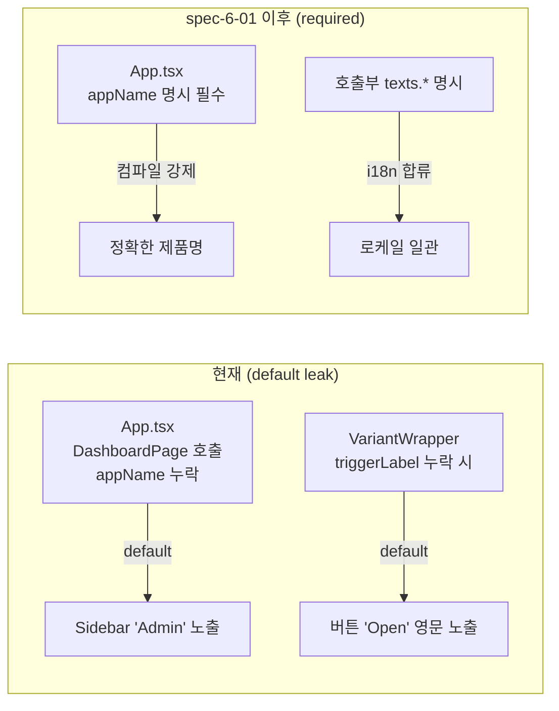

# spec-6-01: Studio API 정합화 (hardcode 제거 + Sidebar/body bg 토큰 매핑)

## 📋 메타

| 항목 | 값 |
|---|---|
| **Spec ID** | `spec-6-01` |
| **Phase** | `phase-6` |
| **Branch** | `spec-6-01-studio-api-alignment` |
| **상태** | Planning |
| **타입** | Refactor |
| **Integration Test Required** | no |
| **작성일** | 2026-05-09 |
| **소유자** | Dennis |

## 📋 배경 및 문제 정의

### 현재 상황

- phase-5 PoC 회고 (`docs/poc-retro.md` §3.3 + 2026-05-05 비판적 감사) 에서 Studio 컴포넌트 API 의 hardcode 4 건 (C-01a/b/c/d) + 토큰화 미흡 2 건 (C-05, C-06) 이 P1 ~ P3 부채로 식별됨.
- phase-6 success criteria #6 (Track B) 은 본 spec 의 범위를 "hardcode 4 건 제거 + Sidebar/body bg 토큰 매핑" 으로 명시.
- Studio 본격 개발 (`spec-6-04` 이후) 의 *전제 조건* 으로 정합화가 선행되어야 함.

### 문제점

| ID | 위치 | 통증 |
|---|---|---|
| **C-01a** | `studio/src/components/templates/MyPage/index.tsx:23` (`appName = "TaskFlow"`) | 다른 제품에서 prop 누락 시 사이드바에 `"TaskFlow"` leak (S4-REUSE §2 발견) |
| **C-01b** | `studio/src/components/templates/SettingsPage/index.tsx:34` (`appName = "TaskFlow"`) | C-01a 와 동일한 leak 패턴 (다른 컴포넌트) |
| **C-01c** | `studio/src/components/templates/DashboardPage/index.tsx:15` (`appName = "Admin"`) | 회고가 식별 못한 누수 — 2026-05-05 비판적 감사에서 발견. *다른 default 값* 이라 C-01a/b 와 별개 위험 (영문 leak) |
| **C-01d** | `studio/src/components/templates/VariantWrapper.tsx:20` (`triggerLabel = "Open"`) | 영문 default leak — i18n 격리 가설 위반 케이스 (회고가 표방한 "texts props pattern 으로 i18n 격리" 가설 위반) |
| **C-05** | `studio/src/components/composites/Sidebar/index.tsx:13` (`w-56` = 224 px) | Paper 디자인 240 px 와 16 px magic number 차이 — 토큰 미적용 (S3-WALK §발견) |
| **C-06** | `studio/src/index.css` body 배경 (`bg-background` → `#FFFFFF`) | Paper page ground (`#F8FAFC` = `surface-alt`) 와 시각적 단조로움. body 와 surface 토큰 매핑 어긋남 |

### 해결 방안 (요약)

C-01a/b/c/d 의 default literal 을 모두 제거해 required prop 으로 강제하고 (TypeScript 컴파일 에러로 leak 차단), C-05 는 `--sidebar-width` 토큰 (240 px) 으로 토큰화, C-06 은 studio body 배경을 `bg-surface-alt` 토큰으로 매핑. 호출부 (`App.tsx`) 와 단위 테스트도 함께 갱신.

## 📊 개념도

## 🎯 요구사항

### Functional Requirements

1. **C-01a — MyPage**: `appName?: string` 의 default `"TaskFlow"` 제거 → `appName: string` (required). `MyPageProps` 타입 갱신.
2. **C-01b — SettingsPage**: `appName?: string` default `"TaskFlow"` 제거 → required. `SettingsPageProps` 타입 갱신.
3. **C-01c — DashboardPage**: `appName?: string` default `"Admin"` 제거 → required. `DashboardPageProps` 타입 갱신. **App.tsx 호출부**도 `appName="..."` 명시 추가.
4. **C-01d — VariantWrapper**: `triggerLabel?: string` default `"Open"` 제거 → `triggerLabel: string` (required). 호출부 (`SignupPage`) 는 이미 `triggerLabel={texts.title}` 로 합류 — 변경 없이 컴파일 통과 (i18n 격리 자동 회복).
5. **C-05 — Sidebar width 토큰화**: `templates/assets/tokens/tokens.json` 에 `sidebar.width` (240 px) 추가 → `pnpm tokens` 으로 `--sidebar-width` CSS 변수 자동 생성 → `studio/src/index.css` 의 `@theme inline` 매핑 (또는 동등 위치) 에 합류 → Sidebar 의 `w-56` 을 토큰 기반 utility 로 교체.
6. **C-06 — body bg 매핑**: `studio/src/index.css` 의 body 배경을 `bg-surface-alt` 토큰으로 매핑 (현행 `bg-background` → `bg-surface-alt`). Paper page ground 와 일치.
7. **단위 테스트 갱신**: `Sidebar.test.tsx`, `DashboardPage`/`MyPage`/`SettingsPage`/`VariantWrapper` 관련 기존 테스트가 명시적 prop 추가로 PASS.

### Non-Functional Requirements

1. **TypeScript**: `pnpm typecheck` (또는 `tsc --noEmit`) PASS — required prop 누락 시 컴파일 에러로 강제 차단.
2. **단위 테스트**: `pnpm test` 전수 PASS.
3. **토큰 빌드**: `pnpm tokens` 1 회 실행으로 CSS 변수 갱신 확인 (자동 생성 파일은 commit).
4. **Backward compatibility**: studio repo 외부 사용자 없음 — default 제거 (breaking) 허용. 내부 호출부만 갱신.
5. **Out-of-band 영향 없음**: poc/* 디렉토리는 수정하지 않음.

## 🚫 Out of Scope

- `poc/app-a/src/index.css` 의 body 배경 (회고가 가리키는 C-06 의 다른 적용 위치) — Q3 결정 (a) 따라 studio 본체만 적용. poc/app-a 는 phase-5 archive 단계에서 별도 처리.
- **C-06 의 시맨틱 토큰 정리** (`bg-surface-alt` 신규 정의) — Task 6 진행 중 발견: studio 의 `--background` 값 (`#F8FAFC`) 이 이미 Paper page ground 와 *값 측면* 으로 일치하나, `surface-alt` 토큰 자체가 시스템에 미정의. 시맨틱 토큰 정리는 별도 spec 으로 분리 (queue.md Icebox 등재). 본 spec 에서 Task 7 [-] Passed.
- 시각 회귀 자동화 (Playwright + Paper) — `spec-6-10`.
- 새 토큰 카테고리 추가 (`sidebar.width` 만 추가; 다른 magic number 들은 별도 spec).
- 컴포넌트 인벤토리 확장 (LoginPage variant, DashboardPage variant 등) — 본 spec 은 *정합화* 만.
- Sidebar `--sidebar-width` 외 dimension 토큰화 일반화 — 240 px 1 건만.
- DESIGN.md / DASHBOARD i18n 텍스트 자체의 추가 — 기존 `texts.title` 활용만.

## 🔍 Critique 결과 (선택)

> `/hk-spec-critique` 미실행. phase-4 회고 A4 권장사항 (Research 타입은 강제) 에 해당하지 않는 Refactor 타입이며, 범위가 매우 명확 (6 항목 카탈로그 100 % 매핑) 하여 critique 생략. 사용자가 추가 검토 원하면 Plan Accept 전에 호출 가능.

## ✅ Definition of Done

- [ ] 5 정합화 항목 적용 (C-01a/b/c/d, C-05) + C-06 [-] Passed (값 측면 이미 정합, 시맨틱 토큰 정리는 Icebox)
- [ ] 모든 단위 테스트 PASS (`pnpm test`)
- [ ] TypeScript 통과 (`pnpm typecheck` 또는 `tsc --noEmit`)
- [ ] `pnpm tokens` 빌드 성공 + 자동 생성 CSS 변수 commit
- [ ] `walkthrough.md` 와 `pr_description.md` 작성 및 ship commit
- [ ] `spec-6-01-studio-api-alignment` 브랜치 push 완료
- [ ] PR 생성 (target: `phase-6-studio-v1`)
- [ ] 사용자 검토 요청 알림 완료
