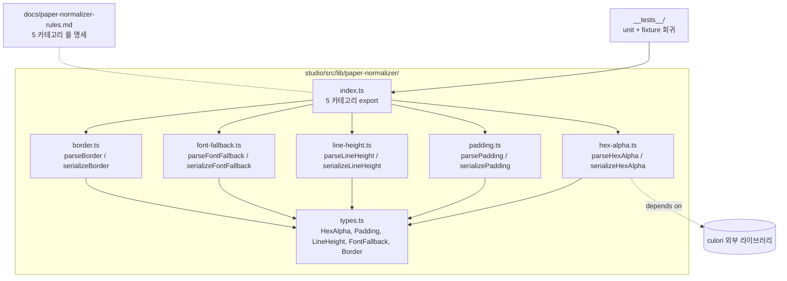

# Implementation Plan: spec-6-02

## 📋 Branch Strategy

- 신규 브랜치: `spec-6-02-paper-normalizer`
- 시작 지점: `phase-6-studio-v1` (phase base — 사용자 메모리 `feedback_phase_branch.md`)
- PR target: `phase-6-studio-v1`
- 첫 task 가 branch 생성 + scaffold commit 수행

## 🛑 사용자 검토 필요 (User Review Required)

> [!IMPORTANT]
> - [ ] **`culori` 의존성 추가**: ~30 KB. 추후 spec-6-07 (토큰 편집기) 에서도 색상 피커 / OKLCH gamut 처리에 재사용 예정. 본 spec 에서 `pnpm add culori @types/culori` 1 회 설치.
> - [ ] **룰 문서 (`docs/paper-normalizer-rules.md`) 의 산출물 위치**: project root `docs/` 하위 — 다른 도구 / agent prompt / Blueprint UI 가 import / 인용 가능. studio repo 한정 아님.
> - [ ] **입력 표기 범위**: 표준 CSS string 한정. DESIGN.md prose 의 자유 표기 (`"padding 28×40 / 40×40"` 등) 추출은 본 spec 범위 외 (Out of Scope).

> [!WARNING]
> - [ ] **OKLCH 정확성**: culori 기본 변환 채택. perceptual gamut mapping 정확성 검증은 별도 research spec 후보 (queue.md Icebox 등재 가능).

## 🎯 핵심 전략 (Core Strategy)

### 아키텍처 컨텍스트



### 주요 결정

| 컴포넌트 | 전략 | 이유 |
|:---:|:---|:---|
| **함수 시그니처** | parse / serialize 페어 (Q1=b) | structured object 가 testability + 정합성 검증 강함. 토큰 편집기 등에서 객체 형태 활용 |
| **에러 처리** | throw on invalid input (Q2=a) | 가장 단순. 호출부 try/catch. Result 패턴은 boilerplate 부담 |
| **color 의존성** | culori (Q3=b) | OKLCH 정확. spec-6-07 에서도 재사용. ~30 KB 가치 있음 |
| **facade** | 5 함수만 export (Q4=a) | 호출 패턴이 명확해질 때 (spec-6-04 이후) 추가 |
| **fixture 검증** | 명시 expected (Q5=a) | 변환 의도가 코드에서 직접 읽힘 (snapshot 은 회귀만 잡고 의도 불명) |
| **commit 분리** | 1 카테고리 = 1 commit (Task 3~7) | constitution §8 + phase-4 회고 W4 |
| **rule 문서 별도 task** | Task 9 = `docs/paper-normalizer-rules.md` | 모든 함수 결정 후 종합 작성 — 사용자 요청: "출 취합 시 이용 가능" |

## 📂 Proposed Changes

### Library

#### [NEW] `studio/src/lib/paper-normalizer/types.ts`

```text
export interface HexAlpha { r: number; g: number; b: number; a: number; }
export interface Padding {
  block: { start: number; end: number };
  inline: { start: number; end: number };
}
export type LineHeight =
  | { value: number; unit: 'px' }
  | { value: number; unit: 'unitless' }
  | { value: number; unit: 'percent' };
export interface FontFallback {
  primary: string;
  fallbacks: string[];
  generic: 'sans-serif' | 'serif' | 'monospace' | null;
}
export interface Border {
  width: number;
  style: 'solid' | 'dashed' | 'dotted' | null;
  color: HexAlpha;
}
```

#### [NEW] `studio/src/lib/paper-normalizer/hex-alpha.ts`

```text
export function parseHexAlpha(input: string): HexAlpha
export function serializeHexAlpha(
  v: HexAlpha,
  format: 'hex' | 'hex-alpha' | 'rgba' = 'hex-alpha',
): string
// culori 활용: oklch(...) input 도 parse 가능
```

#### [NEW] `studio/src/lib/paper-normalizer/padding.ts`

```text
export function parsePadding(input: string): Padding
// Shorthand: "40px", "20px 16px", "8px 16px 12px 24px"
// "padding-inline 14px" — inline-only 케이스도 단순 prefix 매칭
export function serializePadding(
  v: Padding,
  format: 'shorthand' | 'logical' | 'physical' = 'shorthand',
): string
```

#### [NEW] `studio/src/lib/paper-normalizer/line-height.ts`

```text
export function parseLineHeight(input: string): LineHeight
// "24px" / "1.5" / "150%"
export function serializeLineHeight(v: LineHeight): string
// 단위 보존 + 변환 utility:
export function toPx(v: LineHeight, fontSize: number): number
export function toUnitless(v: LineHeight, fontSize: number): number
```

#### [NEW] `studio/src/lib/paper-normalizer/font-fallback.ts`

```text
export function parseFontFallback(input: string): FontFallback
// "'Inter', system-ui, sans-serif" — quote 정규화, fallback 분리, generic 추출
export function serializeFontFallback(v: FontFallback): string
// quote: single quote 강제, generic 누락 시 'sans-serif' 보강
```

#### [NEW] `studio/src/lib/paper-normalizer/border.ts`

```text
export function parseBorder(input: string): Border
// "1px solid #E2E8F0" / "1px #E2E8F0" (style 생략 → null)
export function serializeBorder(v: Border): string
// shorthand 강제, style null 시 'solid' 기본
```

#### [NEW] `studio/src/lib/paper-normalizer/index.ts`

```text
export * from './types';
export * from './hex-alpha';
export * from './padding';
export * from './line-height';
export * from './font-fallback';
export * from './border';
```

### Tests

#### [NEW] `studio/src/lib/paper-normalizer/__tests__/hex-alpha.test.ts` (그리고 카테고리별 4개)

각 카테고리당 정상 3+ / 경계 2+ / round-trip 1+ = 평균 6 ~ 8 case.

#### [NEW] `studio/src/lib/paper-normalizer/__tests__/fixture-regression.test.ts`

`poc/app-a/design-extract/` 5 페이지 에서 발견된 표기 → expected 정규화 결과를 명시 expected 로 검증.

### Rule Specification

#### [NEW] `docs/paper-normalizer-rules.md`

5 카테고리별로:
- **표기 차이 표** (Paper / DESIGN.md / CSS / React)
- **canonical form 정의**
- **변환 예시 (정상 + 경계)**
- **함수 매핑** (`parse*` / `serialize*` 호출 가이드)
- **다른 도구 참조 가이드** (Studio export 시점, Blueprint UI input 정규화 시점, agent prompt 인용 시점)

### Dependency

#### [MODIFY] `studio/package.json`

```text
+ "culori": "^4.x",
"devDependencies": {
+   "@types/culori": "^2.x",
}
```

#### [MODIFY] `studio/pnpm-lock.yaml`

자동 갱신 (commit 포함).

## 🧪 검증 계획 (Verification Plan)

### 단위 테스트 (필수)

```bash
cd studio && pnpm exec vitest run src/lib/paper-normalizer
```

### 타입 체크

```bash
cd studio && pnpm exec tsc --noEmit --ignoreDeprecations 6.0
```

### 통합 테스트 (Integration Test Required = no)

해당 없음.

### 수동 검증 시나리오

1. **fixture 5 페이지 회귀**: `poc/app-a/design-extract/` 의 `auth-login.md` 등에서 발췌한 표기들이 모두 round-trip 동일성 만족.
2. **culori OKLCH 변환**: `parseHexAlpha("oklch(0.7 0.15 250)")` → `{ r, g, b, a }` → `serializeHexAlpha(..., 'hex')` → 표준 hex 결과.
3. **rule 문서 검증**: `docs/paper-normalizer-rules.md` 의 변환 예시들이 실제 코드와 1:1 일치 (수동 점검).

## 🔁 Rollback Plan

- 각 commit 단위 revert 가능 (One Task = One Commit).
- culori 의존성 추가 commit 만 revert 시 다른 카테고리 영향 (hex-alpha 만 깨짐) — 그 commit 만 부분 revert 가능.
- 라이브러리 자체가 다른 코드에서 import 되지 않은 상태 (spec-6-04 이후 합류) → 단독 revert 안전.

## 📦 Deliverables 체크

- [ ] task.md 작성 (다음 단계)
- [ ] 사용자 Plan Accept 받음
- [ ] (실행 후) 10 commit (1 scaffold + 1 dep + 5 카테고리 + 1 fixture + 1 rule doc + 1 ship)
- [ ] (실행 후) walkthrough.md / pr_description.md ship
- [ ] (실행 후) PR URL 보고
