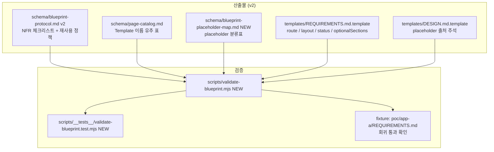

# Implementation Plan: spec-6-03

## 📋 Branch Strategy

- 신규 브랜치: `spec-6-03-blueprint-protocol`
- 시작 지점: `phase-6-studio-v1` (phase base)
- PR target: `phase-6-studio-v1`
- 첫 task = branch + scaffold commit

## 🛑 사용자 검토 필요 (User Review Required)

> [!IMPORTANT]
> - [ ] **기존 phase-5 산출물 호환**: `poc/app-a/REQUIREMENTS.md` 가 새 protocol v2 의 모든 룰을 만족하지 못할 가능성 — validator fail 시 (a) schema 정의 완화 / (b) 산출물 갱신 / (c) 문서화된 예외 처리 중 선택 필요.
> - [ ] **`templateMapping.derivedFrom` 옵션 필드 (F-07)**: schema 변경 — phase-5 산출물에 없는 필드라 validator 가 누락을 무시 처리 (optional).
> - [ ] **`status: implemented` literal 강제 (F-04)**: 기존 산출물의 `✅` / `구현 완료` 표기는 *display* 영역으로 이동 (machine-readable status 와 분리). 마크다운 표 자체는 readability 를 위해 `✅` 유지 가능 — validator 는 YAML 만 검증.

> [!WARNING]
> - [ ] **YAML 키 추가 (F-03 `route` / `layout`)**: 기존 phase-5 의 finalPages YAML 에 키 부재. validator 가 자동 채움 (default `/{id}` / `default`) 또는 *경고만* 처리 — 결정 필요.

## 🎯 핵심 전략 (Core Strategy)

### 아키텍처 컨텍스트



### 주요 결정

| 항목 | 전략 | 이유 |
|---|---|---|
| **status 어휘 (F-04)** | `implemented` literal 강제 (Q1=a) | machine-readable, 표시는 별도 매핑 표 |
| **placeholder 분류 깊이 (F-02)** | placeholder 별 분류 (Q2=b) | spec-6-05 질의서 UI 의 입력 폼 자동 생성 토대 |
| **route / layout (F-03)** | 자동 채움 + override 가능 (Q3=a) | fail-fast 충돌 해소, 작성자 친화 |
| **재사용 정책 (F-07)** | soft 권장 + `derivedFrom` 명시 (Q4=a) | PoC 마찰 ↓, 복제 시 origin 갱신 의무 |
| **검증 (Q5)** | validator + 단위 테스트 + phase-5 회귀 (Q5=b) | schema 변경의 회귀 자동 차단 |
| **F-05 빈 배열** | `none` literal 권장, `[]` 도 허용 | 둘 다 작성자 직관, validator 가 둘 다 통과 |
| **F-06 Template 이름 유추** | kebab-case page id → PascalCase + `Page` 접미 | 단순 규칙, 페이지 카탈로그에 명시 |
| **commit 분리** | 7 gap = 7 commit + validator + ship = 9 commit | One Task = One Commit |

## 📂 Proposed Changes

### Schema

#### [MODIFY] `schema/blueprint-protocol.md` (v2)

- §Step 1.5 NFR — 체크리스트 추가 (성능 / 보안 / 호환성 / 접근성 / i18n / 등 6 항목 minimum)
- §Step 3 출력 — `finalPages[]` 의 `route` / `layout` 명시 필드 + 자동 채움 규칙
- §Output — `templateMapping.status: implemented` literal 강제 + 표시 매핑 표 (✅ / `구현 완료` / `not-implemented` / `❌`)
- §Step 3 추가 — `optionalSections` 빈 배열 표기 (`none` 권장 / `[]` 허용)
- §Output 추가 — `templateMapping.derivedFrom` 옵션 필드 (재사용/복제 정책)
- §재사용 정책 NEW — Phase 2 Template soft 권장 + 복제 시 origin 갱신 의무

#### [MODIFY] `schema/page-catalog.md`

- Template 이름 유추 규칙 명시 (kebab → PascalCase + `Page`)
- 미구현 페이지 카탈로그도 예상 Template 이름 기재
- `status` 표기를 `implemented` / `not-implemented` literal + 표시 매핑

#### [NEW] `schema/blueprint-placeholder-map.md`

`templates/DESIGN.md.template` 의 모든 placeholder 를 *기원* 별로 분류한 표:

```markdown
| Placeholder | 기원 | 설명 | spec-6-05 입력 폼 후보 |
|---|---|---|---|
| `{{primaryColor}}` | 디자인 도구 추출 | Paper variable | color picker |
| `{{appName}}` | Blueprint 출력 | Step 1 응답 | text input |
| `{{customCSS}}` | 수동 입력 | 작성자 직접 | textarea |
| ... | ... | ... | ... |
```

### Templates

#### [MODIFY] `templates/REQUIREMENTS.md.template`

- `finalPages[].route` / `.layout` 자리 추가
- `templateMapping.status: implemented` literal 형식 명시
- `optionalSections: none` (또는 `[]`) 예시 보강

#### [MODIFY] `templates/DESIGN.md.template`

- 각 placeholder 위에 기원 주석 (`<!-- origin: blueprint-output / design-tool / manual -->`) 또는 별도 분류 문서 (`blueprint-placeholder-map.md`) 참조 노트

#### [MODIFY] `templates/AGENT.md.template`

- (필요 시) `componentPath` 추출 규칙에 미구현 Template 이름 유추 규칙 반영

### Scripts

#### [NEW] `scripts/validate-blueprint.mjs`

```text
#!/usr/bin/env node
// 사용법: node scripts/validate-blueprint.mjs <REQUIREMENTS.md>
//
// 검증:
// - finalPages[].status 가 'implemented' | 'not-implemented'
// - finalPages[].route / .layout 존재 (없으면 default 자동 채움 후 경고)
// - finalPages[].optionalSections 가 [] | 'none' | string[]
// - 미구현 Template 이름이 page-catalog 의 유추 규칙 따름
// - templateMapping.derivedFrom 이 있으면 page-catalog 에 origin 존재
// - NFR 섹션 존재 여부 (frontmatter 또는 본문 §NFR)
```

#### [NEW] `scripts/__tests__/validate-blueprint.test.mjs`

- 7 gap 각각의 정상 케이스 + 위반 케이스
- phase-5 산출물 (`poc/app-a/REQUIREMENTS.md`) 통과 회귀

### Fixtures

#### `poc/app-a/REQUIREMENTS.md` (회귀 fixture, 수정 가능성 있음)

새 schema 통과 못하면 (a) schema 완화 / (b) 산출물 갱신 (별도 commit). 후자 결정 시 README 또는 walkthrough 에 사유 기록.

## 🧪 검증 계획 (Verification Plan)

### 단위 테스트 (필수)

```bash
node --test scripts/__tests__/validate-blueprint.test.mjs
```

### 회귀

```bash
node scripts/validate-blueprint.mjs poc/app-a/REQUIREMENTS.md
# 기대: PASS (또는 명시된 경고만)
```

### 수동 검증 시나리오

1. **NFR 누락 케이스**: `validate-blueprint.mjs` 가 NFR 섹션 없는 mock REQUIREMENTS.md 에 대해 fail.
2. **status 비표준 어휘**: `status: ✅` 같은 입력에 대해 fail (machine-readable 값만 통과).
3. **`route` 자동 채움**: `route` 키 없는 입력 → `/{id}` 자동 + 경고.
4. **placeholder 분류표 합치**: `templates/DESIGN.md.template` 의 placeholder 가 모두 `blueprint-placeholder-map.md` 에 등재.

## 🔁 Rollback Plan

- 각 commit 단위 revert. schema 변경은 protocol v2 → v1 으로 되돌림.
- validator 자체가 깨지면 spec 전체 revert + 별도 spec 으로 분할 시도.

## 📦 Deliverables 체크

- [ ] task.md 작성 (다음 단계)
- [ ] 사용자 Plan Accept
- [ ] (실행 후) 9 commit (1 scaffold + 7 gap + validator + ship)
- [ ] (실행 후) walkthrough.md / pr_description.md ship
- [ ] (실행 후) PR URL 보고
