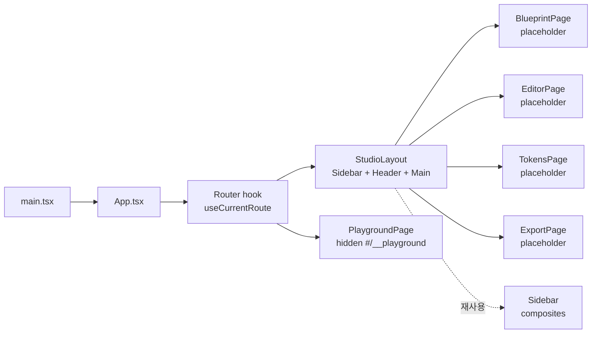

# Implementation Plan: spec-6-04

## 📋 Branch Strategy

- 신규 브랜치: `spec-6-04-studio-app-setup`
- 시작 지점: `phase-6-studio-v1` (phase base)
- PR target: `phase-6-studio-v1`
- 첫 task = branch + scaffold commit

## 🛑 사용자 검토 필요 (User Review Required)

> [!IMPORTANT]
> - [ ] **hash router 자체 구현**: 외부 의존성 0. 단순 4 route 에 적합. 향후 nested / dynamic params 필요 시 react-router 도입 검토.
> - [ ] **Studio shell 의 Sidebar 텍스트 / 아이콘**: `appName="Design Studio"` 기본. 4 nav item (Blueprint / Editor / Tokens / Export) — lucide icons (Wand2 / FileEdit / Palette / Package).
> - [ ] **`studio/DESIGN.md` skeleton 의 prefill 깊이**: tokens.json 기반 §2/3/4/5/13 + lucide-react 명시 §7 + 라우트 §10. 시각 디자인 (§1/6/8/9/11/12/14) 은 TODO. 수동 prefill 분량은 ~150 lines 예상.

> [!WARNING]
> - [ ] **App.tsx 의 기존 playground 토글 코드 격리**: 기능 보존 (`#/__playground` 로 이동). 기존 `pnpm dev` 사용자가 default route (`#/blueprint`) 로 들어가면 LoginPage / DashboardPage 가 안 보임 — README 또는 walkthrough 에 안내.

## 🎯 핵심 전략 (Core Strategy)

### 아키텍처 컨텍스트



### 주요 결정

| 항목 | 전략 | 이유 |
|---|---|---|
| **Router** (Q1) | hash-based 자체 구현 | 외부 의존성 0, 단순 5 route |
| **Playground 보존** (Q2) | `#/__playground` 숨김 route | 개발 중 컴포넌트 시각 확인, production 비노출 |
| **Placeholder 깊이** (Q3) | "Coming soon" + 후속 spec 링크 | 후속 spec 자유도 ↑ |
| **Studio DESIGN.md** (Q4) | 14 섹션 skeleton + 코드 추출 prefill | 의도 보존, 후속 점진 채움 |
| **Test** (Q5) | smoke + router 단위 | 골격 spec, 깊은 테스트 과도 |
| **commit 분리** | 7 작업 = 7 commit + ship = 8 | One Task = One Commit |

## 📂 Proposed Changes

### Router

#### [NEW] `studio/src/lib/router.ts`

```text
export type StudioRoute = 'blueprint' | 'editor' | 'tokens' | 'export' | 'playground';

export const ROUTE_PATHS: Record<StudioRoute, string> = {
  blueprint: '/blueprint',
  editor: '/editor',
  tokens: '/tokens',
  export: '/export',
  playground: '/__playground',
};

export function parseHash(hash: string): StudioRoute {
  const path = hash.replace(/^#/, '') || ROUTE_PATHS.blueprint;
  // entry 검색, 매칭 없으면 blueprint fallback
  const entry = (Object.entries(ROUTE_PATHS) as [StudioRoute, string][])
    .find(([, p]) => p === path);
  return entry ? entry[0] : 'blueprint';
}

export function navigate(route: StudioRoute): void {
  window.location.hash = ROUTE_PATHS[route];
}

// React hook — useState + hashchange listener
export function useCurrentRoute(): StudioRoute { ... }
```

#### [NEW] `studio/src/lib/__tests__/router.test.ts`

- `parseHash` 정상 / fallback / 빈 hash → blueprint
- `parseHash('#/__playground')` → 'playground'
- ROUTE_PATHS 의 모든 키가 StudioRoute union 과 일치

### Layout

#### [NEW] `studio/src/components/layout/StudioLayout.tsx`

```text
import { Sidebar } from "@/components/composites/Sidebar";
import { useCurrentRoute, navigate, type StudioRoute } from "@/lib/router";

const NAV_ITEMS: { route: StudioRoute; label: string }[] = [
  { route: 'blueprint', label: 'Blueprint' },
  { route: 'editor',    label: 'Editor' },
  { route: 'tokens',    label: 'Tokens' },
  { route: 'export',    label: 'Export' },
];

export function StudioLayout({ children }: { children: ReactNode }) {
  const current = useCurrentRoute();
  const activeIndex = NAV_ITEMS.findIndex((it) => it.route === current);
  return (
    <div className="flex h-screen bg-background">
      <Sidebar
        appName="Design Studio"
        navItems={NAV_ITEMS.map((it) => it.label)}
        activeIndex={activeIndex >= 0 ? activeIndex : 0}
        // onNavigate prop 추가 검토 — 클릭 시 navigate(route) 호출
      />
      <main className="flex flex-1 flex-col overflow-auto">
        {children}
      </main>
    </div>
  );
}
```

> Sidebar 의 클릭 핸들링 — 현재 Sidebar 는 `<a href="#">` 링크 사용 (Sidebar/index.tsx). nav 클릭 → hash 변경 → useCurrentRoute 가 update 받도록 onNavigate prop 추가 또는 href 직접 사용. **간단한 방법**: Sidebar 의 `<a href="#">` 를 `<a href={ROUTE_PATHS[route]}>` 로 사용하도록 prop 확장 검토.

### Pages

#### [NEW] `studio/src/features/blueprint/index.tsx`, `editor/`, `tokens/`, `export/`

각 placeholder:

```text
export function BlueprintPage() {
  return (
    <div className="flex flex-1 items-center justify-center p-6">
      <Card className="max-w-md p-6 text-center">
        <h1 className="text-2xl font-semibold">Blueprint</h1>
        <p className="mt-2 text-muted-foreground">Coming soon — spec-6-05 에서 구현</p>
      </Card>
    </div>
  );
}
```

#### [NEW] `studio/src/features/playground/index.tsx`

기존 `App.tsx` 의 page/brand/locale/variant 토글 + LoginPage / DashboardPage 데모 코드를 그대로 이동.

### App / main 통합

#### [MODIFY] `studio/src/App.tsx`

router + StudioLayout 으로 단순화:

```text
import { useCurrentRoute } from "@/lib/router";
import { StudioLayout } from "@/components/layout/StudioLayout";
import { BlueprintPage } from "@/features/blueprint";
import { EditorPage } from "@/features/editor";
import { TokensPage } from "@/features/tokens";
import { ExportPage } from "@/features/export";
import { Playground } from "@/features/playground";

export default function App() {
  const route = useCurrentRoute();
  if (route === 'playground') return <Playground />;
  return (
    <StudioLayout>
      {route === 'blueprint' && <BlueprintPage />}
      {route === 'editor' && <EditorPage />}
      {route === 'tokens' && <TokensPage />}
      {route === 'export' && <ExportPage />}
    </StudioLayout>
  );
}
```

### Sidebar 확장 (필요 시)

#### [MODIFY] `studio/src/components/composites/Sidebar/index.tsx`

`navItems` 의 `<a href="#">` 를 클릭 가능하게 — `onItemClick` prop 또는 nav item 의 href 명시. 현재 Sidebar 는 nav item 이 `string[]` 인데 `{ label, href }` 형태로 확장 또는 별도 prop 으로 nav 처리.

> **간단 경로**: `Sidebar` 자체는 변경 없이, `StudioLayout` 의 Sidebar 호출을 wrapper 로 감싸 클릭 이벤트 가로채기 (event delegation). Sidebar API breaking 회피.

### Documentation

#### [NEW] `studio/DESIGN.md`

14 섹션 skeleton + prefill (§2/3/4/5/7/10/13). tokens.json 에서 추출한 색상/타이포/spacing/radius 와 lucide-react 명시, 라우트 4 + playground 매핑.

## 🧪 검증 계획 (Verification Plan)

### 단위 테스트 (필수)

```bash
cd studio && pnpm exec vitest run
```

### 타입 체크

```bash
cd studio && pnpm exec tsc --noEmit --ignoreDeprecations 6.0
```

### 수동 검증 시나리오

1. `pnpm dev` → 브라우저에서 `localhost:5173` 진입 → default `#/blueprint` 노출, "Coming soon — spec-6-05" 표시.
2. Sidebar 의 `Editor` nav 클릭 → `#/editor` 로 변경 + EditorPage placeholder 노출.
3. URL `#/__playground` 직접 입력 → 기존 page/brand/locale/variant 토글 + LoginPage 노출 (보존 확인).
4. URL `#/foo` 같은 unknown → fallback 으로 BlueprintPage.
5. 브라우저 Back/Forward 시 hash 동기화 확인.

## 🔁 Rollback Plan

- 각 commit 단위 revert. App.tsx 변경이 가장 큰 위험 — playground 코드 격리 자체 commit 단독 revert 가능.
- StudioLayout / 페이지 placeholder 가 깨져도 `#/__playground` 직접 진입으로 기존 데모 동작.

## 📦 Deliverables 체크

- [ ] task.md 작성 (다음 단계)
- [ ] 사용자 Plan Accept
- [ ] (실행 후) 8 commit (1 scaffold + router + layout + pages + playground 격리 + DESIGN.md + smoke + ship)
- [ ] (실행 후) walkthrough.md / pr_description.md ship
- [ ] (실행 후) PR URL 보고
