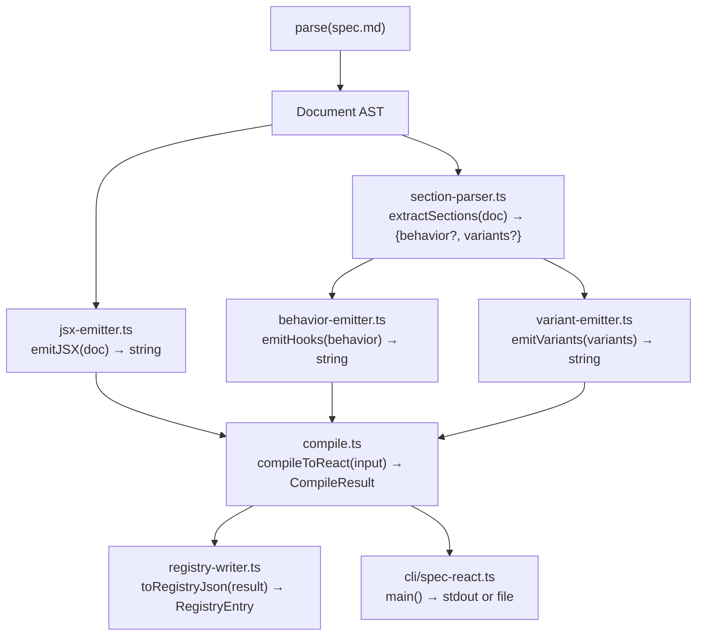

# Implementation Plan: spec-7-05

## 📋 Branch Strategy

- 신규 브랜치: `spec-7-05-react-compiler`
- 시작 지점: `phase-7-design-md` (phase base branch — spec-7-04 머지 완료)
- 첫 task 가 브랜치 생성을 수행함

## 🛑 사용자 검토 필요

> [!IMPORTANT]
> - [ ] **i18n hook 방식**: `useTranslation` (react-i18next) 고정. 프로젝트에 i18next 의존성이 없으면 Task 2 에서 추가해야 함 — 또는 placeholder 방식(`t("key")` 함수 호출만 내보내고 import 생략)으로 대체 가능
> - [ ] **shadcn registry 버전**: `registry:block` 타입 사용 (shadcn 2025-01 stable 형식). `registryDependencies` 에 재사용 컴포넌트 이름을 기재 — catalog.json 과 자동 연동 여부 결정 필요

> [!WARNING]
> - [ ] **## Behavior / ## Variants 파싱**: 현재 spec-7-02 parser 는 이 섹션들을 MarkdownText 로 방출함. React 컴파일러가 MarkdownText 를 재파싱하는 구조는 spec-7-02 parser 확장 없이 가능하지만, spec.md 문법과 분리된 휴리스틱 파싱임 — 향후 parser 에 first-class 섹션 노드 추가 시 breaking change 발생 가능

## 🎯 핵심 전략

### 아키텍처



### 주요 결정

| 결정 사항 | 선택 | 이유 |
|---|---|---|
| **JSX 생성 방식** | 순수 문자열 조작 | react-builder.ts 의 React.createElement 방식은 SSR 렌더링 전용; 정적 파일 출력에는 불필요 |
| **component-registry.ts 재사용** | `import { COMPONENT_REGISTRY }` — 이름 목록만 추출 | DRY; 레지스트리에 등록된 이름만 JSX 에 방출 허용 |
| **i18n 출력** | `{t("key")}` 리터럴 방출 + import 자동 삽입 | 런타임 번역 구조 결정을 컴파일 결과에 명시 |
| **들여쓰기** | 2 space (고정) | spec-7-04 emit.ts 와 동일 규칙 |
| **파일명 규칙** | `kebab-case` (컴포넌트 이름 변환) | shadcn registry 표준 |
| **결정성 보장** | 속성 키 알파벳 정렬 | Map/Object 순서가 엔진마다 다를 수 있으므로 명시 정렬 |

## 📂 Proposed Changes

### [신규] `studio/src/lib/spec-md-compiler/react/`

#### [NEW] `react/jsx-emitter.ts`

```ts
// 핵심 인터페이스
export function emitJSX(
  node: Block,
  indent: number,
  ctx: EmitContext
): string

export interface EmitContext {
  usedI18nKeys: Set<string>    // 수집 → 파일 상단 import 결정
  usedTokenKeys: Set<string>   // 수집 → tokens 조회 코드 결정
  knownComponents: Set<string> // COMPONENT_REGISTRY 키 집합
}
```

- `ComponentInstance` → JSX element (self-closing / paired)
- `Placeholder(i18n)` → `{t("path")}`, ctx.usedI18nKeys.add(path)
- `Placeholder(token)` → `{tokens["path"]}`, ctx.usedTokenKeys.add(path)
- `MarkdownText` → `{/* text */}` (단, ## Behavior / ## Variants 섹션은 section-parser 에서 미리 제거)
- `Comment` → `{/* text */}`

#### [NEW] `react/section-parser.ts`

```ts
export interface BehaviorSpec {
  states: { name: string; type: string; defaultValue: string }[]
  handlers: string[]
  rawUnknown: string[]           // 인식 불가 줄 → TODO stub
}

export interface VariantSpec {
  name: string
  props: Record<string, string>
}

export interface SectionResult {
  behavior: BehaviorSpec | null
  variants: VariantSpec[] | null
  bodyWithoutSections: Block[]   // ## Behavior/Variants 제거된 나머지 body
}

export function extractSections(doc: Document): SectionResult
```

- MarkdownText 를 순회하며 `## Behavior` / `## Variants` 제목 탐지
- 해당 섹션 이후 MarkdownText 의 bullet 줄을 파싱
- `- state: name: Type = default` / `- handler: name` 패턴 인식

#### [NEW] `react/behavior-emitter.ts`

```ts
export function emitHooks(behavior: BehaviorSpec): string
// → "const [name, setName] = useState<Type>(default);\n..."
// → "const handler = () => { /* TODO */ };\n..."
// → "// TODO: <raw unknown>\n"
```

#### [NEW] `react/variant-emitter.ts`

```ts
export function emitVariants(
  variants: VariantSpec[],
  componentName: string
): string
// → "export function <Name>Variants({ variant }: { variant: string }) {\n  switch(variant) { ... }\n}"
```

#### [NEW] `react/registry-writer.ts`

```ts
export interface RegistryEntry {
  name: string
  type: "registry:block"
  registryDependencies: string[]
  files: {
    path: string
    content: string
    type: "registry:component"
  }[]
}

export function toRegistryEntry(
  componentName: string,
  tsxContent: string,
  deps: string[]      // COMPONENT_REGISTRY 에서 실제 사용된 이름들
): RegistryEntry
```

#### [NEW] `react/compile.ts`

```ts
export interface CompileInput {
  text?: string       // spec.md 텍스트
  ast?: Document      // 이미 파싱된 AST (재사용 시)
  componentName: string
}

export interface CompileResult {
  ok: boolean
  tsx?: string        // 생성된 TSX 파일 내용
  registry?: RegistryEntry
  errors: CompileError[]
}

export function compileToReact(input: CompileInput): CompileResult
```

#### [NEW] `react/cli/spec-react.ts`

```ts
// pnpm --filter studio spec-react <file.md> [--out <dir>] [--registry] [--name <name>]
export function parseArgs(argv: string[]): { file: string; out?: string; registry: boolean; name?: string }
export function runCompile(args: ReturnType<typeof parseArgs>): void
```

#### [MODIFY] `studio/package.json`

```json
"spec-react": "tsx --tsconfig tsconfig.app.json src/lib/spec-md-compiler/react/cli/spec-react.ts"
```

### [신규] `studio/src/lib/spec-md-compiler/react/__tests__/`

- `jsx-emitter.test.ts` — 단위 10 case
- `section-parser.test.ts` — 단위 8 case
- `behavior-emitter.test.ts` — 단위 6 case
- `variant-emitter.test.ts` — 단위 6 case
- `registry-writer.test.ts` — 단위 4 case
- `compile.test.ts` — end-to-end 5 case
- `determinism.test.ts` — 28 fixture 결정성 벤치마크

## 🧪 검증 계획

### 단위 테스트

```bash
pnpm --filter studio test src/lib/spec-md-compiler/react/
```

### 전체 회귀

```bash
pnpm --filter studio test
```

### 수동 검증

1. `echo '<Button variant="primary" />' > /tmp/t.md && pnpm --filter studio spec-react /tmp/t.md`
   - 기대: `<Button variant="primary" />` 가 포함된 TSX 출력
2. `pnpm --filter studio spec-react fixtures/LoginPage.spec.md --registry --out /tmp/out/`
   - 기대: `/tmp/out/login-page.tsx` + `/tmp/out/registry.json` 생성

### 통합 테스트 — 결정성 (Integration Test Required = yes)

- 28 fixture spec.md 를 두 번 컴파일 → 출력 해시 100% 일치
- `determinism.test.ts` 내 자동 실행

## 🔁 Rollback Plan

- 신규 디렉토리(`react/`) 만 삭제하면 되므로 기존 코드 영향 없음
- `package.json` 의 `spec-react` 스크립트 제거로 완전 제거 가능

## 📦 Deliverables 체크

- [ ] task.md 작성 (다음 단계)
- [ ] 사용자 Plan Accept 받음
- [ ] (실행 후) 모든 task 완료
- [ ] (실행 후) walkthrough.md / pr_description.md ship
