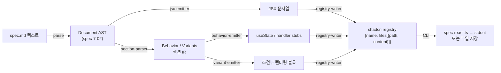

# spec-7-05: spec.md → React 컴파일러

## 📋 메타

| 항목 | 값 |
|---|---|
| **Spec ID** | `spec-7-05` |
| **Phase** | `phase-7` |
| **Branch** | `spec-7-05-react-compiler` |
| **Base Branch** | `phase-7-design-md` |
| **상태** | Planning |
| **타입** | Feature |
| **Integration Test Required** | yes |
| **작성일** | 2026-05-10 |
| **소유자** | dennis |

## 📋 배경 및 문제 정의

### 현재 상황

spec-7-03 은 `spec.md AST → Paper HTML` (SSR) 컴파일러를 완성했다. 동일한 spec.md AST(spec-7-02 parser 출력)를 입력받아 이번에는 **React JSX 파일**을 출력하는 역방향 경로가 필요하다.

현재 `studio/src/lib/spec-md-compiler/paper/` 에는:
- `compile.ts` — `compileToPaper(input) → { html, payload, ast, errors }`
- `component-registry.ts` — 28개 컴포넌트 이름 → React ComponentType 매핑
- `react-builder.ts` — Document → ReactNode[] (SSR 용)
- `i18n-resolver.ts` / `token-resolver.ts` — Placeholder 해석

이 자산들은 *SSR 렌더링*을 위한 것이다. spec-7-05 는 **정적 JSX 텍스트** 출력이 목표이므로 별도 컴파일러를 신설한다.

### 문제점

디자이너가 spec.md 를 작성하거나 spec-7-04 로 자동 추출한 spec.md 가 있어도, 이를 실제 React 코드 파일로 변환하는 경로가 없다. 개발자가 수동으로 코드를 작성해야 하며 spec.md 와 실제 코드 사이의 drift 가 발생한다.

또한 shadcn 의 `npx shadcn add` 배포 체계를 활용하려면 `registry.json` 형식으로 컴포넌트를 출력할 수 있어야 한다.

### 해결 방안 (요약)

spec.md AST 를 입력받아 **결정성 있는(deterministic) React TSX 파일**을 생성하는 컴파일러를 `studio/src/lib/spec-md-compiler/react/` 에 신설한다. 컴포넌트 레지스트리는 spec-7-03 의 `component-registry.ts` 를 그대로 재사용(DRY)하며, 출력은 shadcn registry JSON 형식으로 래핑하여 배포 가능한 상태로 만든다.

## 📊 컴파일 파이프라인

## 🎯 요구사항

### Functional Requirements

1. **JSX 변환** — `ComponentInstance { name, props, tokens?, theme?, children }` → `<Name prop1="v1" prop2={v2} style={...} />` JSX 문자열 생성
   - `props` — `attr="string"` / `attr={42}` / `attr={true}` / `attr={null}`
   - `tokens` — `style={{ "--token-x": "var(--token-x)" }}` 인라인 CSS 변수 매핑
   - `theme` — `data-theme="brand-a"` 속성으로 방출
   - `children` 재귀 처리
2. **i18n Placeholder** — `Placeholder { kind: "i18n", path: "ko.login-input" }` → `{t("ko.login-input")}`. 파일 상단에 `import { useTranslation } from 'react-i18next'` + `const { t } = useTranslation()` hook 자동 추가
3. **token Placeholder** — `Placeholder { kind: "token", path: "semantic.color.primary" }` → `{tokens["semantic.color.primary"]}` (런타임 토큰 조회)
4. **MarkdownText 처리** — `## Behavior` / `## Variants` 제목으로 시작하는 섹션은 section-parser 로 전달; 그 외 MarkdownText 는 JSX comment `{/* <text> */}` 로 방출
5. **Comment 처리** — `Comment` 노드 → `{/* <text> */}`
6. **## Behavior 섹션** — 다음 패턴 인식:
   - `- state: <name>: <type> = <default>` → `const [<name>, set<Name>] = useState<<type>>(<default>)`
   - `- handler: <name>` → `const <name> = () => { /* TODO */ }`
   - 인식 불가 줄 → `// TODO: <원문>` stub comment 로 방출
7. **## Variants 섹션** — `- <VariantName>: <prop>=<value> [, <prop>=<value>]*` 패턴 → 조건부 export:
   - 단일 variant → `if (variant === "<VariantName>") return <.../>` 분기 블록
   - 복수 variant → `export function <ComponentName>Variants()` 래퍼 + `switch(variant)` 분기
8. **shadcn registry 출력** — `{ name, type: "registry:block", registryDependencies, files: [{ path, content, type: "registry:component" }] }` 형식 JSON
9. **결정성** — 동일 AST 입력 → 항상 완전히 동일한 출력 (sort 순서, 공백, 들여쓰기 2 space 모두 고정)
10. **CLI** — `pnpm --filter studio spec-react <spec-file.md> [--out <dir>] [--registry]`
    - `--registry` 없으면 TSX 텍스트만 stdout
    - `--registry` 있으면 `registry.json` + `<name>.tsx` 파일 저장

### Non-Functional Requirements

1. **결정성 100%** — 동일 spec.md 를 두 번 컴파일하면 파일 해시가 완전히 일치해야 한다
2. **spec-7-03 DRY** — `component-registry.ts` 를 import 하여 재사용; 이름 목록을 복사하지 않는다
3. **단방향 (no SSR)** — 본 컴파일러는 React.renderToString 을 사용하지 않는다; 순수 문자열 조작만 사용
4. **Node 호환** — `tsx` 또는 `vitest` 환경에서 실행 가능 (브라우저 API 의존 금지)

## 🚫 Out of Scope

- **런타임 React 렌더링**: spec-7-06 (Studio 재구성) 의 React preview 기능이 담당
- **i18next 실제 번역 파일 생성**: 키 추출만; 번역 JSON 은 별도 워크플로
- **TypeScript 타입 추론**: 생성된 TSX 파일의 prop 타입은 `Record<string, unknown>` 로 고정; 정밀 타입 생성은 후속 spec
- **CSS-in-JS / Tailwind class 생성**: token → CSS 변수 매핑만; Tailwind utility class 생성은 out of scope
- **## Behavior 복잡한 케이스**: async/await, 복수 state 의존, reducer 패턴 — 모두 `// TODO` stub 처리
- **Studio UI 통합**: spec-7-06 에서 담당

## ✅ Definition of Done

- [ ] 모든 단위 테스트 PASS (matcher / emitter / section-parser / registry-writer 각 모듈별)
- [ ] 28-fixture 결정성 벤치마크 PASS (동일 spec.md → 두 번 실행 → 파일 해시 100% 일치)
- [ ] `pnpm --filter studio test` 전체 회귀 PASS
- [ ] `walkthrough.md` 와 `pr_description.md` 작성 및 ship commit
- [ ] `spec-7-05-react-compiler` 브랜치 push 완료
- [ ] 사용자 검토 요청 알림 완료
