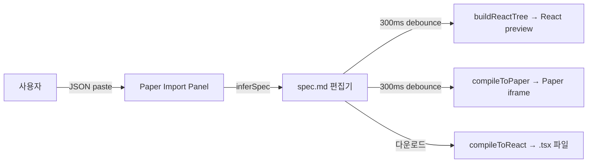

# spec-7-06: Studio 재구성

## 📋 메타

| 항목 | 값 |
|---|---|
| **Spec ID** | `spec-7-06` |
| **Phase** | `phase-7` |
| **Branch** | `spec-7-06-studio-reorg` |
| **Base Branch** | `phase-7-design-md` |
| **상태** | Planning |
| **타입** | Feature / Refactor |
| **Integration Test Required** | yes |
| **작성일** | 2026-05-10 |
| **소유자** | dennis |

## 📋 배경 및 문제 정의

### 현재 상황

현재 Studio 의 5개 라우트:

| 라우트 | 기능 |
|---|---|
| `#/blueprint` | BlueprintWizard — DESIGN.md 섹션 템플릿 생성 마법사 |
| `#/editor` | DesignEditor — DESIGN.md 마크다운 편집기 |
| `#/tokens` | TokensPage — 토큰 뷰어 |
| `#/export` | ExportPage — ZIP export |
| `#/preview` | PreviewPage — fixture 선택 + React(좌) / Paper HTML(우) 비교 |

`#/preview` 는 fixture 를 **선택**해서 보는 읽기 전용 뷰이며, spec.md 를 **직접 편집**하면서 두 결과를 실시간으로 확인하는 경로가 없다.

### 문제점

- spec-7-03/04/05 가 완성되었음에도 Studio UI 에서 이 컴파일러들을 연결하는 경로가 없다
- 디자이너가 Paper tree JSON 을 붙여넣어 spec.md 로 변환(spec-7-04)하고, 그 결과를 즉시 편집 → React/Paper 미리보기하는 **통합 워크플로가 UI 에 없다**
- `#/blueprint` 는 DESIGN.md 마법사인데 phase-7 이후 중심 산출물은 spec.md 이므로 역할 재정의 필요

### 해결 방안 (요약)

신규 `#/spec` 라우트에 spec.md 편집기 + dual preview (React 좌 / Paper 우) 를 만든다. Paper inference import 패널을 통해 Paper tree JSON → spec.md 자동 생성 → 편집 → 미리보기 워크플로를 UI 에서 완결한다. 기존 코드 자산은 모두 유지하고 라우트와 NAV 만 재배치한다.

## 📊 라우트 재구성

```
Before:                        After:
  #/blueprint  Blueprint          #/spec      Spec Editor  ← 신규 (메인)
  #/editor     Editor             #/new       New Spec     ← blueprint 재배치
  #/tokens     Tokens             #/design    Design MD    ← editor 재명명
  #/export     Export             #/tokens    Tokens       ← 유지
  #/preview    Preview            #/export    Export       ← 유지
```



## 🎯 요구사항

### Functional Requirements

1. **`#/spec` — Spec Editor (메인 라우트)**
   - 좌측: spec.md textarea 편집기 (300ms debounce)
   - 우상: React preview — `parse(text)` → `buildReactTree(ast)` → React children 렌더
   - 우하: Paper HTML preview — `compileToPaper(text).html` → `<iframe srcDoc>`
   - 편집기 하단: 파싱/컴파일 에러 메시지 표시
   - "Download TSX" 버튼 → `compileToReact(text).tsx` 파일 다운로드

2. **Paper inference import 패널**
   - 편집기 헤더의 "Import from Paper" 버튼 → JSON textarea 슬라이드 오픈
   - JSON paste 후 "Infer" 클릭 → `inferSpec(tree, catalog)` 실행 → 결과 spec.md 를 편집기에 삽입
   - 신뢰도 요약: `confident N / confirm N / unknown N` 배지 표시

3. **라우트 갱신**
   - `StudioRoute` 타입: `spec`, `new`, `design` 추가
   - `#/blueprint` → `#/new`, `#/editor` → `#/design`, `#/preview` → `#/spec` backward-compat redirect
   - `parseHash` fallback: 등록되지 않은 hash → `spec` (기존 `blueprint`)

4. **NAV 갱신**
   - `NAV_ITEMS`: `[Spec Editor, New Spec, Design MD, Tokens, Export]`
   - `#/new` → 기존 `BlueprintWizard` (라벨만 변경)
   - `#/design` → 기존 `DesignEditor` (라벨만 변경)

### Non-Functional Requirements

1. **기존 feature 파일 보존** — `BlueprintWizard`, `DesignEditor`, `PreviewPage` 파일은 삭제하지 않음. App.tsx 연결만 변경.
2. **React preview 렌더 방식** — `buildReactTree`(기존 paper/react-builder) 로 React children 직접 렌더. `compileToReact` 문자열은 다운로드 전용.
3. **catalog.json 로딩** — `inferSpec` 에 필요한 catalog 는 기존 `studio/src/data/catalog.json` 을 import (없으면 빈 Map)

## 🚫 Out of Scope

- TOKEN.md DTCG-aware 에디터 (현재 TokensPage 유지, 편집 기능은 후속 spec)
- FRONT.md 뷰어 (후속 spec)
- Studio export 내용 확장 (spec/ + FRONT.md 포함)
- 실제 i18next 번역 연동 (React preview 에서 key 그대로 노출)
- spec.md 파일 저장 / 로컬 스토리지 퍼시스트 (브라우저 새로고침 시 초기화)

## ✅ Definition of Done

- [ ] `#/spec` 라우트 — textarea 편집 + React preview + Paper HTML iframe 모두 동작
- [ ] Paper inference import 패널 — JSON paste → spec.md 자동 생성 동작
- [ ] `#/new`, `#/design` redirect 동작 (기존 `#/blueprint`, `#/editor` hash 에서 redirect)
- [ ] 전체 회귀 테스트 PASS (`pnpm --filter studio test`)
- [ ] `walkthrough.md` / `pr_description.md` ship
- [ ] `spec-7-06-studio-reorg` 브랜치 push + PR 생성
