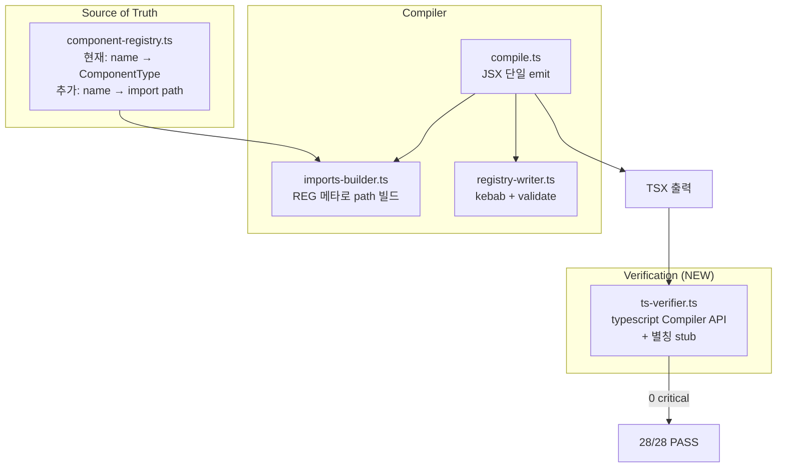

# Implementation Plan: spec-7-10

## 📋 Branch Strategy

- 신규 브랜치: `spec-7-10-react-compiler-correctness` (브랜치 = spec 디렉토리 이름, `feature/` prefix 없음)
- 시작 지점: **`phase-7-design-md`** (phase base branch — phase-7 의 다른 spec 들과 동일 패턴)
- 첫 task (Task 0) 가 브랜치 생성을 수행

## 🛑 사용자 검토 필요 (User Review Required)

> [!IMPORTANT]
> - [ ] **컴파일러 시맨틱 변경 범위**: C2 의 JSX 이중 emit 수정은 *유일한 시맨틱 변경*. 기존 fixture 의 `expected/*.tsx` 와 `__snapshots__` 가 갱신될 가능성 — 갱신 사유는 walkthrough 에 명시.
> - [ ] **shadcn registry deps 형식**: `Button` → `button` (kebab) 으로 직렬화. 외부 shadcn registry 와의 충돌 가능성 (예: 같은 이름이지만 다른 패키지) 은 phase-8 검증 사항.
> - [ ] **함수명-import 충돌 회피**: root 컴포넌트 (`<LoginPage />` 만 본문에 있는 경우) 에서 `LoginPage` import 생략. 즉 생성된 페이지 템플릿 TSX 가 *컴포지션 위주* 가 아닌 *재호출 형태* 가 됨. 기대 동작 합의 필요.

> [!WARNING]
> - [ ] **in-process tsc 진단의 모듈 해소 한계**: `@/components/...` 별칭 + 외부 패키지 (`react`, `clsx`, etc.) 는 stub 처리. 미해소 import 자체는 error 가 아니지만 *잘못된 import* 는 잡지 못함. 별칭 매핑은 통합 테스트 setup 에 포함.
> - [ ] **fixture 갱신 영향**: 28-fixture 의 `expected/*.tsx` 가 갱신되면 결정성 테스트는 그대로 (라인 단위 비교) 통과. 단, snapshot 갱신은 **검토 후 의도된 변경** 임을 명시.

## 🎯 핵심 전략 (Core Strategy)

### 아키텍처 컨텍스트



### 주요 결정

| 컴포넌트 | 전략 | 이유 |
|:---|:---|:---|
| **컴포넌트 메타** | `component-registry.ts` 에 `COMPONENT_IMPORT_PATHS` 단일 export — `Record<name, importPath>`. import 문 위치와 동일 진실. | 이미 import 문에 적힌 정보를 *추출* 하는 것뿐 — 추가 메타 동기화 부담 없음. catalog.json 은 "어휘 정의" 의 진실, registry 는 "studio 내부 매핑" 의 진실 — 역할 분리 유지. |
| **JSX emit** | `bodyContent` 를 `hookLines` 만으로 변경. `jsxBody` 는 return 안에만. | 의도된 시맨틱 회복. C2 본질. |
| **registry deps** | `toKebabCase(componentName)` 로 변환. `validateShadcnRegistryItem` 을 `compile.ts` 에서 호출, 실패 시 `result.ok = false` + error stage="compile". | shadcn 표준 준수. validator 가 이미 존재 — 호출만 추가. |
| **함수명 충돌** | `componentName === <root tag>` 인 단일-루트일 때 그 컴포넌트만 import 제외. 다중 사용은 전과 동일. | C9 의 페이지 템플릿 케이스 (사용자가 `LoginPage.spec.md` 에 `<LoginPage />` 를 넣는 경우) 에 한정. |
| **TSX 진단** | `typescript.createProgram` + `getPreEmitDiagnostics`. virtual file system + `paths` 별칭 stub + 외부 모듈 stub 으로 구성. | 외부 의존성 0 — 이미 devDep 로 typescript 존재. spec-7-09 가 회피했던 "tsc 실행" 의 in-process, 결정적 형태. |
| **fake-pass 정정** | `compile.test.ts` 의 i18n 테스트가 `t("ko.submit")` 호출 + 함수 본문 내 위치를 단언. | 주석 매칭 회피 + 실제 구문 단언. |
| **TS6133 정리** | `_msg` 로 prefix 또는 단순 삭제 (사용 의도 0 인 경우). | TypeScript 의 표준 idiom. |

## 📂 Proposed Changes

### [registry/메타]

#### [MODIFY] `studio/src/lib/spec-md-compiler/paper/component-registry.ts`
- 추가 export `COMPONENT_IMPORT_PATHS: Record<string, string>` — Tier 2 = `@/components/ui/{lowercase}`, composites = `@/components/composites/{PascalCase}`, templates = `@/components/templates/{PascalCase}`. 동일 파일의 import 문에서 *추출* 또는 명시적으로 동기 선언.

```ts
export const COMPONENT_IMPORT_PATHS: Record<string, string> = {
  Button: "@/components/ui/button",
  ActivitySummary: "@/components/composites/ActivitySummary",
  // ... 28 entries 1:1 with COMPONENT_REGISTRY
  LoginPage: "@/components/templates/LoginPage",
  // ...
};
```

### [컴파일러]

#### [MODIFY] `studio/src/lib/spec-md-compiler/react/imports-builder.ts`
- 인자 시그니처 변경: `buildImports(ctx, usedComponents, options?: { excludeName?: string })`.
- 각 컴포넌트의 import path 를 `COMPONENT_IMPORT_PATHS` 에서 lookup. 미등록은 fallback 으로 `@/components/ui/{lowercase}` (경고 + 호환성 유지).
- `excludeName` 일치 시 그 컴포넌트 import 생략.

#### [MODIFY] `studio/src/lib/spec-md-compiler/react/compile.ts`
- 라인 72-91 재구성:
  - `bodyContent = hookLines` (jsxBody 제외).
  - return statement 에 `jsxBody` 한 번만 emit.
- root 단일 사용 컴포넌트 검출 → `buildImports(..., { excludeName: input.componentName })` 전달.
- `validateShadcnRegistryItem` 호출 → 실패 시 `result.ok = false`, errors push.

#### [MODIFY] `studio/src/lib/spec-md-compiler/react/registry-writer.ts`
- `toRegistryEntry` 의 `registryDependencies` 에 `deps.map(toKebabCase).sort()` 적용.
- `validateShadcnRegistryItem` (이미 export 된 경우 그대로 사용; 없으면 신규 추가 — `name` kebab + `registryDependencies` kebab 단언).

### [테스트]

#### [NEW] `studio/src/lib/spec-md-compiler/react/__tests__/imports-builder.directory.test.ts`
- Button → `@/components/ui/button`, LoginForm → `@/components/composites/LoginForm`, LoginPage → `@/components/templates/LoginPage`.
- `excludeName` 옵션 동작 테스트.

#### [NEW] `studio/src/lib/spec-md-compiler/react/__tests__/jsx-single-emit.test.ts`
- 컴파일 결과의 `<>...</>` 블록 *바깥* (함수 body) 에 `<Button` 등 JSX 가 등장하지 않음을 단언.
- `<Button` 의 출현 횟수 = jsxBody 내 횟수와 동일.

#### [MODIFY] `studio/src/lib/spec-md-compiler/react/__tests__/registry-writer.test.ts`
- 기대 출력의 deps 를 kebab-case 로 갱신.
- 신규 케이스: 입력에 PascalCase 가 들어와도 결과는 kebab.
- `validateShadcnRegistryItem` 호출 단언.

#### [MODIFY] `studio/src/lib/spec-md-compiler/react/__tests__/compile.test.ts`
- i18n 테스트: `expect(result.tsx).toMatch(/\bt\(\s*['"]ko\.submit['"]\s*\)/)` 로 강화 (주석 매칭 회피).

#### [MODIFY] `studio/src/lib/spec-md-compiler/react/__tests__/cli.test.ts`
- TS6133 정리 (line 1: `vi`, `beforeEach` 삭제 또는 사용).

#### [MODIFY] `studio/src/lib/spec-md-compiler/react/__tests__/imports-builder.test.ts`
- TS6133 정리 (line 8: `components` 사용 또는 삭제).

#### [MODIFY] `studio/src/lib/paper-inference/cli/paper-to-spec.ts`
- TS6133 정리 (line 66: `msg` 사용 또는 삭제 — 호출부 검사 후).

#### [NEW] `studio/src/lib/spec-md-compiler/react/__tests__/ts-diagnose.test.ts`
- 28-fixture 모두에 대해 typescript Compiler API 로 진단 — 0 critical error.
- virtual fs + `paths` 별칭 (`@/components/*`) stub + 외부 모듈 stub.
- ship 조건 = 28 PASS.

### [인프라]

#### [NEW] `studio/src/lib/spec-md-compiler/react/__tests__/utils/ts-verifier.ts`
- `verifyTsx(tsx: string): { ok: boolean; diagnostics: ts.Diagnostic[] }`.
- `ts.createProgram` + `LanguageServiceHost` (또는 `CompilerHost`) 가상화. 외부/별칭 모듈은 빈 모듈 stub.
- 진단 분류: critical (syntax, JSX malformed, duplicate identifier) vs benign (unresolved external module).

## 🧪 검증 계획 (Verification Plan)

### 단위 테스트 (필수)
```bash
cd studio && pnpm test src/lib/spec-md-compiler/react
```

### 통합 테스트 (Integration Test Required = yes)
```bash
# 28-fixture in-process TS 진단
cd studio && pnpm test src/lib/spec-md-compiler/react/__tests__/ts-diagnose.test.ts

# 빌드 통과 (TS6133)
pnpm --filter studio build
```

### 수동 검증 시나리오
1. `cd studio && pnpm spec-react ../spec/login-page.spec.md` → 결과 TSX 의 첫 import 라인이 `@/components/templates/LoginPage` 가 아닌, root 단일 사용이므로 *생략* 되어 있어야 함. 함수 body 안에는 `useState` 등 hook 만, return 안에 `<LoginPage ... />` 형태.
2. `cd studio && pnpm spec-react ../spec/login-form.spec.md --registry` → 출력 registry.json 의 `registryDependencies` 가 `["button", "social-auth-block"]` 등 kebab-case.
3. `pnpm --filter studio build` → exit 0.

## 🔁 Rollback Plan

- 모든 변경은 한 PR 내. 머지 후 문제 발견 시 `git revert <merge-commit>` 한 줄.
- 기존 fixture 의 `expected/*.tsx` 가 갱신된다면, snapshot 갱신 commit 을 분리 (revert 시 영향 최소화).

## 📦 Deliverables 체크

- [ ] task.md 작성 (다음 단계)
- [ ] 사용자 Plan Accept 받음
- [ ] (실행 후) 모든 task 완료
- [ ] (실행 후) walkthrough.md / pr_description.md ship
