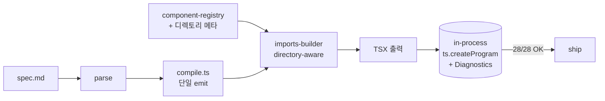

# spec-7-10: React 컴파일러 정합성 (생성 TSX 가 실제 빌드 통과)

## 📋 메타

| 항목 | 값 |
|---|---|
| **Spec ID** | `spec-7-10` |
| **Phase** | `phase-7` |
| **Branch** | `spec-7-10-react-compiler-correctness` |
| **상태** | Planning |
| **타입** | Fix |
| **Integration Test Required** | yes (in-process `typescript` API 진단으로 28-fixture 0 error) |
| **작성일** | 2026-05-10 |
| **소유자** | dennis |

## 📋 배경 및 문제 정의

### 현재 상황

- `phase-7` 9 spec 모두 Merged (PR #45 open).
- `spec-7-09 (react-compiler-quality)` 가 Opus 감사 C1/C2/C4/C5 를 처리했다고 보고하고 PR 본문에 "결정성 100% / 28-fixture PASS / shadcn registry 형식 완료" 기재.
- 그러나 phase-ship 직전 독립 Opus 감사가 **생성된 TSX 가 실제 컴파일 불가** 임을 발견.

### 문제점

| ID | 위치 | 내용 |
|---|---|---|
| **C1** | `studio/src/lib/spec-md-compiler/react/imports-builder.ts:14-16` | 모든 컴포넌트를 `@/components/ui/{lowercase}` 로 import. 실제 28개 중 27개는 `composites/` (PascalCase) 또는 `templates/` (PascalCase) 디렉토리 → 모든 import 경로 깨짐 |
| **C2** | `studio/src/lib/spec-md-compiler/react/compile.ts:72-91` | `jsxBody` 가 함수 body (`bodyContent`) 와 return statement 양쪽에 *동시에* emit. JSX 는 statement 가 될 수 없으므로 첫 블록은 syntax error |
| **C6** | `studio/src/lib/spec-md-compiler/react/registry-writer.ts:23-32` | `registryDependencies` 에 PascalCase 컴포넌트명 그대로 직렬화. shadcn registry 는 kebab-case slug 또는 URL 만 허용 → `npx shadcn add` 해석 불가 |
| **C7** | `paper-to-spec.ts:66`, `react/__tests__/cli.test.ts:1`, `react/__tests__/imports-builder.test.ts:8` | TS6133 unused 변수 4건 → `pnpm --filter studio build` 실패. PR 본문은 "672 checks PASS" 만 기재, 빌드 미언급 |
| **C9** | `spec-react` CLI 출력 (페이지 템플릿) | `LoginPage.spec.md` 컴파일 시 `export function LoginPage()` + `import { LoginPage } from '@/components/templates/LoginPage'` → 동일 스코프 이름 충돌 (TS2451). 7 page 템플릿 모두 발생 |
| **C3 부속** | `react/__tests__/tsx-validity.test.ts:21,60-74` | TSX 유효성 테스트가 `BANNED_IMPORTS` substring 매치 + 단순 brace balance 만 확인 — 실제 syntax 검증 0. C2 를 잡지 못함 |
| **C4 부속** | `react/__tests__/compile.test.ts:21` | `expect(result.tsx).toContain("useTranslation")` 가 *주석* `// i18n: replace with your project's t() or useTranslation hook` 로 통과 — fake-pass |

### 해결 방안 (요약)

1. `component-registry` 에 컴포넌트별 *디렉토리 메타* 를 단일 진실로 노출하고, `imports-builder` 가 그 메타로 정확한 import path 를 빌드.
2. `compile.ts` 의 JSX 이중 emit 제거 — `hookLines` 는 함수 body, `jsxBody` 는 return 안에만.
3. `registry-writer` 가 deps 를 kebab-case 로 변환 + 기존 `validateShadcnRegistryItem` 을 컴파일러가 실제로 호출.
4. 함수명과 import 가 충돌하면 (root 컴포넌트 케이스) 해당 import 를 *생략*.
5. TS6133 4건 정리 → 빌드 통과.
6. **외부 검증**: 28-fixture 컴파일 결과 TSX 를 `typescript.transpileModule` + `getPreEmitDiagnostics` 로 in-process 진단 (외부 프로젝트 의존성 0). syntax / 미해소 식별자 / 잘못된 JSX 를 잡고, ship 조건 = 0 critical error.
7. fake-pass 테스트 정정 — `t("ko.submit")` 호출 단언으로 강화.

## 📊 개념도

## 🎯 요구사항

### Functional Requirements

1. **import 경로 정확성**: `Button` → `@/components/ui/button`, `LoginForm` → `@/components/composites/LoginForm`, `LoginPage` → `@/components/templates/LoginPage` (component-registry 의 실제 import path 와 1:1 일치).
2. **JSX 단일 emit**: 생성 TSX 의 함수 body 에 `hookLines` 만, return 안에 `jsxBody` 만 — 중복 0.
3. **registry kebab-case**: `registryDependencies` 모든 항목 kebab-case (`login-form`, `dashboard-page`). `validateShadcnRegistryItem` 가 컴파일 후 실제 호출되어 실패 시 `result.ok = false`.
4. **함수명 충돌 회피**: `componentName` 과 동일한 이름의 컴포넌트가 root 로 사용된 경우 그 컴포넌트 import 생략.
5. **TS6133 0 건**: `pnpm --filter studio build` 통과.
6. **in-process TSX 진단**: 28-fixture 컴파일 결과를 typescript Compiler API 로 검증 → 0 error (단, 미해소 외부 모듈은 stub 처리).
7. **fake-pass 테스트 정정**: i18n 테스트가 주석으로 fake-pass 되지 않도록 `t(...)` 호출 단언으로 강화.

### Non-Functional Requirements

1. **결정성 보존**: 출력 TSX 의 라인 단위 결정성 100% 유지 (28-fixture 2회 실행 동일).
2. **회귀 0**: 기존 PASS 테스트 유지.
3. **외부 의존성 0**: in-process 검증이 `typescript` 패키지만 사용 (이미 devDependency).
4. **CI 멱등성**: 테스트가 repo 루트에 산출물 write 금지 (W2 본 spec 범위 밖이지만 신규 파일에서는 준수).

## 🚫 Out of Scope

- **C5 (paper-inference self-referential 벤치)** — phase-8 별도 spec.
- **C8 (paper-normalizer / paper-sync production 통합)** — phase-8 첫 우선순위.
- **W2 (테스트 부수효과 — 기존 `react-compile-report.md` / `bench-report.md` write)** — phase-8.
- **W3 Tailwind CDN 외부 참조** — phase-8.
- **W5 catalog Tier 2 보강 (`<Input>` 등 미등재)** — phase-8 어휘 spec.
- **W9 `docs/handbook.md`** — `spec-x-handbook` 별도 PR.
- **W10 외부 디자이너 alpha** — phase-ship hard gate, 본 spec 종료 후 사용자 진행.
- **컴파일러 시맨틱 변경** — C2 의 *중복 제거* 외 의미 변경 없음. 기존 expected fixture 갱신은 의도 합의 후만.

## 🔍 Critique 결과

본 spec 은 phase-7 ship 전 독립 Opus 감사 보고서에 기반함. 추가 `/hk-spec-critique` 는 선택.

## ✅ Definition of Done

- [ ] 모든 단위 테스트 PASS (기존 + 신규)
- [ ] **`pnpm --filter studio build` 통과** (TS6133 0 건)
- [ ] **28-fixture in-process tsc 진단 0 critical error** (Integration Test)
- [ ] 결정성 테스트 28-fixture 그대로 통과
- [ ] `walkthrough.md` 와 `pr_description.md` 작성 및 ship commit
- [ ] `spec-7-10-react-compiler-correctness` 브랜치 push 완료
- [ ] PR 생성 + 사용자 검토 요청
