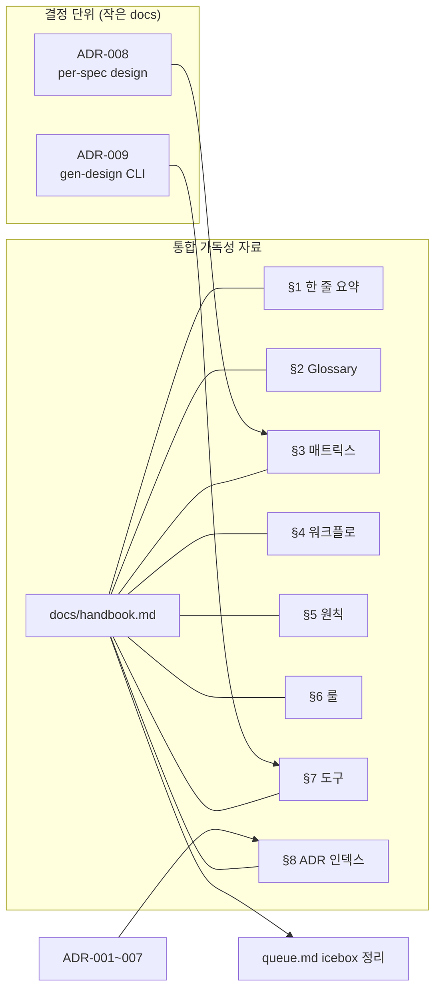

# Implementation Plan: spec-7-11

## 📋 Branch Strategy

- 신규 브랜치: `spec-7-11-docs-handbook`
- 시작 지점: **`phase-7-design-md`** (phase base branch)
- 첫 task 가 브랜치 생성

## 🛑 사용자 검토 필요 (User Review Required)

> [!IMPORTANT]
> - [ ] **ADR-008 결정 방향**: 옵션 B (글로벌 직접 편집) 로 미리 합의 — phase-7 진행 동안 마찰 없었음. 옵션 A 로 뒤집을 trigger 도 명시 (다중 spec 동시 진행 시).
> - [ ] **ADR-009 명령군 도입 시점**: 5 명령 모두 *지금 만들지 않음*. ADR 은 *설계 + 도입 시점 기준* 기록만. 가장 먼저 필요한 명령 (`lint global`) 의 phase-8 후보 명시.
> - [ ] **handbook §3 매트릭스 형식**: 표 (행=정보 종류, 열=글로벌/스펙로컬/혼합) — 신규 정보 종류 추가 시 *table 의 해당 행만* 갱신하는 컨벤션 명시.

> [!WARNING]
> - [ ] **ADR 형식 통일성**: 기존 ADR-001~007 의 양식 (상태/날짜/의사결정자/연관/컨텍스트/결정/대안/결과 + 후속 액션) 정확히 따름. 임의 섹션 추가 금지.
> - [ ] **메모리 정리**: handbook 작성 후 `memory/project_handbook_pending.md` 의 description 을 "완료" 로 갱신 또는 메모리 자체 제거. 사용자 약속 미이행 → 이행 전환 기록.

## 🎯 핵심 전략 (Core Strategy)

### 아키텍처 컨텍스트

### 주요 결정

| 항목 | 전략 | 이유 |
|:---|:---|:---|
| **ADR 작성 순서** | ADR-008 → ADR-009 → handbook 순. handbook 이 두 ADR 의 결정을 *참조* | handbook 이 ADR 의 *결과* 를 기록. 거꾸로 작성하면 placeholder 채우기 |
| **ADR-008 결정** | 옵션 B (글로벌 직접 편집) | phase-7 9 spec 동안 마찰 없음. 옵션 A 의 자동 생성 부담 vs 옵션 B 의 글로벌 편집 단순함 |
| **ADR-009 명령군** | 단일 CLI `studio/scripts/gen-design.ts` 시작점, 5 명령 분리 | 별도 kit 분리는 *여러 프로젝트 재사용 가치* 명백할 때까지 보류 (phase-7 의 단일 프로젝트 검증으로는 부족) |
| **handbook §4 워크플로 시나리오** | "Profile Page 추가" — 신규 페이지 1 개 시나리오 | spec/ 에 없는 fixture 인 점이 *신규 디자이너 경험* 을 시뮬레이션. login-page 등 기존 fixture 사용 시 사후 합리화 위험 |
| **handbook §3 매트릭스 행 구성** | 행 = (DESIGN.md 본문 / TOKEN.md 토큰 / FRONT.md 매핑 / spec.md 컴포넌트 / assets / catalog.json / variants), 열 = (글로벌 / 스펙로컬 / 혼합) | ADR-008 의 *디렉토리 결정* 과 직교 — *정보 종류별* 진실 |
| **icebox 정리 방식** | 항목 자체 *제거* + done 섹션 footer 에 "spec-7-11 에서 처리" 1줄 기록 | 항목을 남겨두면 future drift. 처리 history 는 git log 가 진실 |
| **handbook 기록 시점** | spec-7-11 commit 시점 = phase-7 spec 10/10 + spec-7-11 = 11 + ADR-008/009 추가 | 살아있는 handbook 의 *첫 스냅샷*. 다음 phase 에서 재갱신 (살아있음의 의미) |

## 📂 Proposed Changes

### [의사결정 기록]

#### [NEW] `docs/decisions/ADR-008-per-spec-design-files.md`
- 양식: ADR-007 와 동일
- 컨텍스트: phase-7 9 spec 진행 중 *spec dir 안에 design 파일* vs *글로벌 직접 편집* 의 패턴 관찰
- 옵션:
  - A. spec dir 안에 자동 생성 (sdd 또는 gen-design init)
  - B. 글로벌 직접 편집, PR diff 가 슬라이스
- 결정: **B**
- 이유: 자동 생성은 빈 파일이 차곡 쌓이는 부담 + 글로벌 ↔ 슬라이스 동기화 매 spec 마다 체크 필요. 글로벌 직접 편집은 *한 곳* 에서 진실 유지.
- Reconsider trigger: 다중 spec 동시 진행 시 글로벌 충돌 발생 → 그 시점에 ADR-008-revised
- 후속 액션: handbook §3 매트릭스 의 *디렉토리 컬럼* 에 결정 반영

#### [NEW] `docs/decisions/ADR-009-gen-design-cli.md`
- 양식: ADR-007 와 동일
- 컨텍스트: handbook §7 의 5 명령 (`merge` / `extract react` / `extract paper` / `diff` / `lint global`) — 각자 책임 / 입출력 / 도입 시점 결정 필요
- 옵션:
  - A. 별도 `gen-design-kit/` (harness-kit 형제) 분리 — 여러 프로젝트 재사용
  - B. 단일 CLI `studio/scripts/gen-design.ts` — 본 프로젝트 안
- 결정: **B (단일 CLI)**, 추후 A 로 승격 trigger = 두번째 프로젝트가 동일 도구 필요할 때
- 5 명령 표:

  | 명령 | 책임 | 입력 → 출력 | 도입 시점 |
  |---|---|---|---|
  | `merge` | spec.md 슬라이스 → 글로벌 SSOT 누적 | `specs/spec-X-Y/*.md` → `templates/{DESIGN,TOKEN,FRONT}.md` | phase-8 (ADR-008 옵션 B 면 *수동 글로벌 편집* 으로 대체 가능 — 즉 명령 자체가 *옵션 A 도입 시* 만 필요) |
  | `extract react` | catalog.json + 컴포넌트 → React 패키지 | `studio/src/components/` → `dist/registry/` | phase-9 (외부 shadcn 설치 검증) |
  | `extract paper` | spec.md → Paper tree | `*.spec.md` → `tree.json` | spec-7-03 의 `compileToPaper` 가 부분 충족 — CLI 화 미완 |
  | `diff` | 글로벌 vs 코드 비교 | `templates/*` vs `studio/` → 차이 보고 | phase-8 후보 |
  | `lint global` | catalog ↔ DESIGN/FRONT/spec.md 정합 | `templates/*` + `spec/*.spec.md` → 0 issue | **phase-8 첫 실용 명령** (가장 즉시 가치) |

#### [NEW] `docs/handbook.md`
- 8 섹션 — 위 spec.md 의 Functional Requirements §3 참고
- 다이어그램: §1, §3, §4 에 mermaid 1개씩 (총 3 개)
- 분량: 약 500-800 줄 (한국어, 코드 블록 포함)

### [icebox 정리]

#### [MODIFY] `backlog/queue.md`
- "phase-7 진행 중 follow-ups (2026-05-10 등재)" 섹션의 3 항목 (handbook / per-spec design / gen-design) 제거
- 같은 섹션 마지막에 1줄 footer: `> 위 3 항목 spec-7-11 에서 처리 완료 (PR #N).` (spec-7-11 ship 후 PR 번호 채움)

## 🧪 검증 계획 (Verification Plan)

### 단위 테스트
- 본 spec 은 코드 변경 0 → 단위 테스트 없음.
- 회귀 안전 확인: `cd studio && pnpm test` 가 그대로 통과 (724/724 PASS 유지).

### 수동 검증 시나리오

1. **handbook 자체-완결성 (reading test)**: 신규 디자이너 페르소나로 handbook 만 읽고 `spec/sample-page.spec.md` 형식의 새 spec.md 한 페이지 작성 가능한지 검토 → 누락 정보 발견 시 보완
   - 기대 결과: 4시간 안에 `<Button variant="primary">{{i18n.x.y}}</Button>` 정도 작성 가능
2. **ADR 링크 정합성**: handbook §8 의 모든 ADR 링크가 `docs/decisions/ADR-NNN-{slug}.md` 실재 파일과 매칭 → 9 개 (ADR-001~009)
3. **icebox 동기화**: `backlog/queue.md` 의 "phase-7 진행 중 follow-ups" 섹션에서 3 항목 제거 + footer 1줄
4. **ADR-008/009 형식 일치**: ADR-007 와 같은 섹션 구조 (상태/날짜/의사결정자/연관/컨텍스트/결정/대안/결과 + 후속)

## 🔁 Rollback Plan

- 모든 변경은 한 PR 내 (`docs/handbook.md`, `docs/decisions/ADR-008.md`, `docs/decisions/ADR-009.md`, `backlog/queue.md`)
- 머지 후 문제 발견 시 `git revert <merge-commit>` 한 줄
- 코드 변경 0 → revert 영향 0

## 📦 Deliverables 체크

- [ ] task.md 작성 (다음 단계)
- [ ] 사용자 Plan Accept 받음
- [ ] (실행 후) 모든 task 완료
- [ ] (실행 후) walkthrough.md / pr_description.md ship
- [ ] (실행 후) memory `project_handbook_pending.md` 정리
