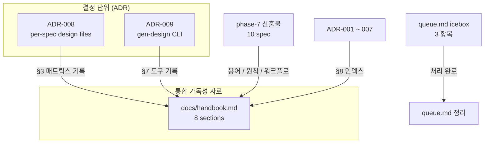

# spec-7-11: docs/handbook.md + ADR-008/009 (per-spec design 정책 + gen-design 명령군)

## 📋 메타

| 항목 | 값 |
|---|---|
| **Spec ID** | `spec-7-11` |
| **Phase** | `phase-7` |
| **Branch** | `spec-7-11-docs-handbook` |
| **상태** | Planning |
| **타입** | Docs |
| **Integration Test Required** | no (코드 변경 0, 문서 전용) |
| **작성일** | 2026-05-10 |
| **소유자** | dennis |

## 📋 배경 및 문제 정의

### 현재 상황

phase-7 (10/10 spec Merged) 이 spec.md grammar + Paper/React 컴파일러 + Studio 3-panel + Figma adapter PoC 까지 완성. ADR-001 ~ ADR-007 이 매 결정마다 추가됨. 그러나 phase 진행 중 다음 follow-up 들이 icebox 에 *기록만 되고 처리되지 않은 상태* 로 잔존:

| 항목 | 위치 | 등재일 |
|---|---|---|
| `docs/handbook.md` 작성 (8 섹션) | `backlog/queue.md:40-48` | 2026-05-10 |
| per-spec 로컬 design 파일 도입 결정 (옵션 A vs B) | `backlog/queue.md:49` | 2026-05-10 |
| `gen-design` 명령군 도입 시점 | `backlog/queue.md:50` | 2026-05-10 |

phase-7 ship 직전 독립 Opus 감사가 W9 (handbook 미작성) 를 *phase done 조건 미충족* 으로 지적. 메모리 (`project_handbook_pending.md`) 도 PR #38 머지 후 별도 PR 작성을 사용자와 합의된 약속으로 기록.

### 문제점

1. **handbook 부재 → 외부 디자이너 alpha 불가능** — 작업 시작 가이드가 없어 phase-7 의 W10 (외부 alpha + 정성 피드백) 진행이 막힘.
2. **합의된 결정의 *공식 기록* 부재** — per-spec 로컬 design 디렉토리 정책, gen-design 명령군 설계 — 두 결정 모두 phase-7 동안 *암묵적 합의* 상태였으나 ADR 로 명문화되지 않음. 다음 phase 에서 재논의 비용 발생 위험.
3. **세 항목의 의존성** — handbook §3 (아키텍처 매트릭스) = per-spec design 결정의 *기록 매체*, handbook §7 (도구) = gen-design 명령군의 *기록 매체*. 따로 처리하면 handbook 두 번 손대는 churn.

### 해결 방안 (요약)

- **ADR-008**: per-spec 로컬 design 파일 정책 — 옵션 A (자동 생성) vs B (글로벌 직접 편집) → 결정 기록.
- **ADR-009**: gen-design 명령군 (`merge` / `extract react` / `extract paper` / `diff` / `lint global`) 설계 + 도입 시점.
- **`docs/handbook.md`** 8 섹션 — 두 ADR 의 *결정 결과* 를 §3, §7 에 통합 + 나머지 섹션 (글로서리 / 워크플로 / 원칙 / 룰 / ADR 인덱스) 작성.
- **`backlog/queue.md`** icebox 의 3 항목 처리 완료 표시.

## 📊 개념도

## 🎯 요구사항

### Functional Requirements

1. **`docs/decisions/ADR-008-per-spec-design-files.md`**:
   - 컨텍스트: phase-7 spec 별 디렉토리 (`specs/spec-7-X-X/`) 가 spec/plan/task 만 보유. DESIGN.md 슬라이스 / FRONT.md 매핑 / 토큰 변경 / assets 가 글로벌 (`templates/DESIGN.md` 등) 에 통합되거나 spec 안에 흩어짐.
   - 옵션 A: 각 spec dir 안에 `DESIGN.md` / `FRONT.md` / `TOKEN.md` / `assets/` 자동 생성 (sdd 또는 별도 CLI)
   - 옵션 B: 글로벌 직접 편집, PR diff 가 슬라이스
   - 결정: **B (글로벌 직접 편집)** — phase-7 9 spec 동안 옵션 B 가 마찰 적었음. 다중 spec 동시 진행 시 옵션 A 재검토 (Reconsider trigger 명시).
2. **`docs/decisions/ADR-009-gen-design-cli.md`**:
   - 컨텍스트: handbook §7 의 5 명령 — `merge`, `extract react`, `extract paper`, `diff`, `lint global` — 의 책임 / 인터페이스 정의 필요.
   - 결정: 단일 CLI `studio/scripts/gen-design.ts` 로 시작. 별도 `gen-design-kit/` 분리는 *여러 프로젝트 재사용 가치 보일 때* 까지 유보.
   - 5 명령 각각의 책임 / 입출력 / 도입 시점 (phase-8 후보 / 단순 lint 부터) 표로 정리.
3. **`docs/handbook.md`** 8 섹션:
   1. 한 줄 요약 + 시각 다이어그램 (Paper → 점진적 spec → 글로벌 SSOT → 한번에 React 추출)
   2. **Glossary** — SSOT 4 문서 (DESIGN/TOKEN/FRONT/spec-md) + 2 디렉토리 (templates/ specs/) / Tier 1-3 / L1-L4 variant / canonical / round-trip
   3. **아키텍처 매트릭스** — *"이 정보는 글로벌? 스펙 로컬?"* 표 — ADR-008 결정 반영
   4. **디자이너 일주일 워크플로** — Profile Page 추가 시나리오 (Day 1: Paper → Day 2: spec.md → Day 3: 컴파일 → Day 4-5: 통합)
   5. **원칙** — 글로벌 SSOT 점진 누적 / 스펙 로컬 = delta / vocabulary-first / raw color 금지
   6. **룰** — One Task = One Commit / 한국어 산출물 / PascalCase 컴포넌트 / ADR-for-결정
   7. **도구** — sdd CLI (harness-kit) + gen-design 명령군 — ADR-009 결정 반영
   8. **ADR 인덱스** — ADR-001 ~ ADR-009 의 1줄 요약 + 결정 history 타임라인
4. **`backlog/queue.md`** icebox 정리: 위 3 항목 처리 완료 표시 (실행 후 항목 자체를 제거 또는 "처리됨 (spec-7-11)" 마크).

### Non-Functional Requirements

1. **코드 변경 0**: 본 spec 은 *문서 전용*. studio/ 또는 packages/ 변경 금지.
2. **ADR 양식 준수**: 기존 ADR-001 ~ 007 의 양식 (상태/날짜/의사결정자/연관/컨텍스트/결정/대안/결과) 그대로 따름.
3. **handbook 자체-완결성**: 신규 디자이너가 handbook *만* 읽고 첫 spec.md 작성까지 도달 가능해야 함. 외부 ADR 참조는 §8 인덱스로만.
4. **링크 정합성**: handbook 의 모든 ADR 참조가 실제 파일 경로 + 절 번호 매칭.

## 🚫 Out of Scope

- **gen-design 명령군의 실제 *구현*** — ADR-009 는 *결정 + 인터페이스 정의*. 실제 CLI 스크립트 구현은 phase-8 후보.
- **per-spec 로컬 design 파일의 마이그레이션** — ADR-008 가 옵션 B 로 결정하면 마이그레이션 0 건. 옵션 A 로 결정해도 본 spec 에서 마이그레이션 안 함.
- **외부 디자이너 alpha** — handbook 작성 후 phase-ship 전 사용자 트랙 (W10).
- **harness-kit upstream `phase-ship.md` 템플릿 부재** (queue.md C4) — 별도 트랙.
- **메모리 정리** — handbook 작성 시점에 `project_handbook_pending.md` 메모리는 *완료* 처리. 이는 본 spec 의 ship 커밋이 아닌 walkthrough 의 메타 정리.

## 🔍 Critique 결과

phase-7 ship 전 Opus 감사 보고서에서 W9 으로 명시. 본 spec 자체는 추가 critique 불필요 — 문서 전용 / 새 결정 0 (기존 합의 *기록* 만).

## ✅ Definition of Done

- [ ] `docs/decisions/ADR-008-per-spec-design-files.md` 생성 (양식 준수)
- [ ] `docs/decisions/ADR-009-gen-design-cli.md` 생성 (양식 준수)
- [ ] `docs/handbook.md` 8 섹션 모두 채움
- [ ] handbook 의 모든 ADR 링크 실재 파일과 매칭 (수동 검증)
- [ ] `backlog/queue.md` icebox 의 3 항목 처리 완료 표시
- [ ] `walkthrough.md` 와 `pr_description.md` ship commit
- [ ] `spec-7-11-docs-handbook` 브랜치 push 완료
- [ ] PR 생성 + 사용자 검토 요청
