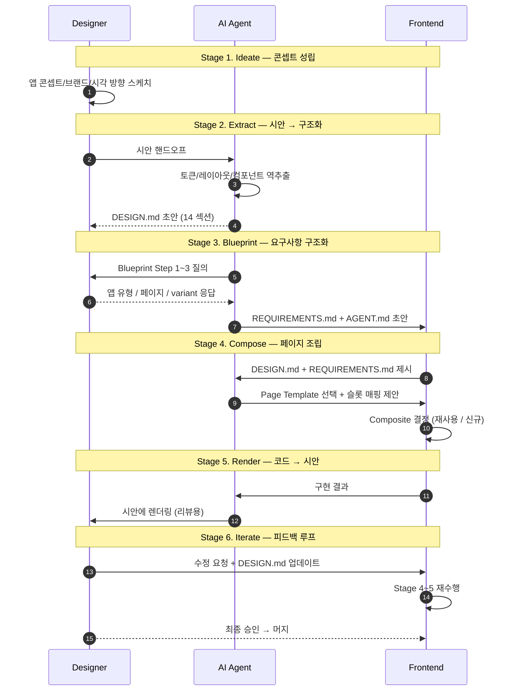

# 협업 Flow 프로토콜

> Designer · Frontend · AI Agent 3 역할이 Phase 1~3 산출물 위에서
> **6 단계 (Ideate → Extract → Blueprint → Compose → Render → Iterate)** 를 순회하며
> 디자인과 코드를 왕복 (round-trip) 시키는 협업 규칙.

본 문서는 "누가 · 언제 · 어떤 도구로 · 무엇을 만드는가" 의 단일 진입점이다.
구체 도구 구현 (Paper MCP / Figma / Tokens Studio) 은 본문에서 **중립 명칭** 으로만 지칭하고 [부록 A](#부록-a-도구-매핑) 에 분리한다.

## 독자와 읽는 순서

| 독자 | 권장 시작점 |
|---|---|
| 처음 온 **Designer** | §2 역할 정의 → §3 6 단계 개요 → §4.1 Ideate |
| 처음 온 **Frontend 엔지니어** | §2 역할 정의 → §4.4 Compose → §5 Phase 1~3 매핑 |
| **AI Agent** (자기 역할 인지) | §2 AI Agent 항목 → §4 각 단계의 "AI 책임" 문단 |
| 후속 spec 착수자 (spec-4-02 / spec-4-03 등) | §4 각 단계의 **PoC 훅** 표기 → §5 매핑 표 |

---

## 1. 본 프로토콜의 범위

### 하는 일

- Phase 1~3 산출물 (tokens / Page Template / Blueprint) 위에서 **재현 가능한 협업 순서** 를 정의
- Designer / Frontend / AI Agent 의 **책임 경계** 를 한 문서에 못 박음
- 도구가 교체되더라도 프로토콜 본문은 불변하도록 **추상 인터페이스** 를 노출
- 후속 PoC spec (`spec-4-02` Paper MCP / `spec-4-03` Figma 동기화) 이 검증할 **훅 앵커** 를 명시

### 하지 않는 일

- 특정 도구 (Paper / Figma) 의 API 호출 방법 — [`../integrations/`](../integrations/) 참조
- 구현 예제 — [`./e2e-demo-loginpage.md`](./e2e-demo-loginpage.md) 의 구체 시나리오를 본 프로토콜이 정의한다
- 자동화 스크립트 / 파이프라인 — Studio v1 (phase-6) 범위

---

## 2. 3 역할 정의

### 2.1 Designer (시각 책임자)

| 항목 | 값 |
|---|---|
| **핵심 책임** | 브랜드/시각 시스템 결정, 시안 제작, 최종 시각 승인 |
| **주 산출물** | Paper/Figma 시안, 토큰 방향성, 승인 판정 |
| **기본 도구** | 시안 도구 (구현: Paper / Figma) |
| **주 입력** | 제품 요구, 브랜드 가이드, 사용자 피드백 |
| **협업 접점** | Stage 1 주도 · Stage 2 공급자 · Stage 5 리뷰어 · Stage 6 승인자 |

### 2.2 Frontend 엔지니어 (구현 책임자)

| 항목 | 값 |
|---|---|
| **핵심 책임** | Page Template 선택/조합, Composite 구현, 코드 품질 |
| **주 산출물** | React 컴포넌트, 테스트, PR |
| **기본 도구** | Studio (React 19 + TS + Tailwind), Page Template 라이브러리 |
| **주 입력** | DESIGN.md, REQUIREMENTS.md, AGENT.md |
| **협업 접점** | Stage 4 주도 · Stage 5 공급자 · Stage 6 반영 실행 |

### 2.3 AI Agent (프로세스 에이전트)

> 본 시스템의 차별점. AI 는 도구가 아니라 **1 급 역할** 로 배치된다.
> 이유: DESIGN.md 작성, Blueprint 질의 실행, 도구 왕복 등 **구조화 작업의 1 차 수행자** 가 AI 이기 때문.

| 항목 | 값 |
|---|---|
| **핵심 책임** | 시안 ↔ DESIGN.md 변환, Blueprint 질의 실행, Template 조합 제안, 코드↔시안 왕복 |
| **주 산출물** | DESIGN.md 초안, REQUIREMENTS.md 초안, Template 매핑 제안, Paper 렌더링 |
| **기본 도구** | 시안 도구 MCP (read/write), Blueprint 프로토콜, Page Template 카탈로그 |
| **주 입력** | 시안, 사람 응답, 기존 코드 |
| **협업 접점** | Stage 2 주도 · Stage 3 주도 · Stage 4 보조 · Stage 5 주도 |

> [!NOTE]
> 한 사람이 여러 역할을 겸할 수 있다 (예: 1 인 개발자는 Designer + Frontend 겸임).
> 그러나 **역할 구분 자체는 유지** 한다 — hand-off gate 에서 "어느 역할의 승인을 받아야 하는가" 가 명확해야 한다.

---

## 3. 6 단계 개요

각 단계는 **한 번의 hand-off gate** 를 가진다. 게이트를 통과해야 다음 단계로 진행.

---

## 4. 단계 상세

### 4.1 Stage 1. Ideate — 콘셉트 성립

#### 목적
브랜드 정체성과 시각 방향을 **정성적으로 고정** 시킨다. 이 단계의 결과는 Stage 2 의 "무엇을 시안으로 만들 것인가" 의 근거가 된다.

#### 입출력

| 구분 | 내용 |
|---|---|
| **입력** | 제품 기획, 브랜드 가이드 (외부), 경쟁 제품 리서치 |
| **출력** | 브랜드 키워드 (3~5 개), 시각 방향성 메모, 레퍼런스 시안 (핀보드) |
| **주 역할** | Designer |
| **2차 역할** | (없음) |
| **도구** | 시안 도구 (스케치/무드보드 용도) |

#### Done 기준
- [ ] 브랜드 키워드가 3~5 개로 수렴
- [ ] 참고 시안 최소 5 개 수집
- [ ] "만들 앱의 첫 인상" 을 한 문장으로 적을 수 있음

#### PoC 훅
- 해당 없음 (순수 인간 작업, 자동화 대상 아님)

---

### 4.2 Stage 2. Extract — 시안 → 구조화 

#### 목적
Stage 1 의 시안을 **기계 판독 가능한 DESIGN.md (14 섹션)** 로 변환한다. 이 단계는 본 시스템의 핵심 — 사람이 만든 그림을 AI 가 읽을 수 있는 구조로 바꾸는 지점.

#### 입출력

| 구분 | 내용 |
|---|---|
| **입력** | Paper/Figma 시안 (1 페이지 이상) |
| **출력** | `DESIGN.md` (14 섹션 — [schema/design-md-schema.md](../../schema/design-md-schema.md) 참조) |
| **주 역할** | AI Agent |
| **2차 역할** | Designer (추출 결과 정확성 검수) |
| **도구** | **시안 읽기 도구** (구현: Paper MCP `get_computed_styles`, `get_node_info`, `get_font_family_info`. 부록 A 참조) |

#### 수행 순서 (AI)
1. 시안의 루트 노드 / 아트보드 식별
2. 전역 토큰 추출 — 색상 팔레트, 타이포, 간격, 그림자 등
3. 반복 패턴 식별 — 공통 컴포넌트 후보 (LogoBlock, InputGroup 등)
4. 섹션 1~9 (필수) 채움, 섹션 10~14 (확장) 는 데이터 있는 항목만 채움
5. `schema/design-md-schema.md` 의 각 섹션 필수 항목 만족 여부 자체 검증

#### Done 기준
- [ ] DESIGN.md 섹션 1~9 필수 항목 모두 채움
- [ ] 색상 / 타이포 값이 시안과 일치 (샘플 3 건 수동 대조)
- [ ] Designer 가 "브랜드 의도가 보존되었다" 라고 승인
- [ ] **색공간 정규화 표기 명시** — 시안 도구 저장값 (보통 sRGB hex) 로 확정. `oklch(...)` 원본이 필요하면 별도 메타에 보관 (역방향 복원은 다대일이라 손실 가능) — spec-4-02 검증.

#### PoC 훅
- **`hook-paper-extract`** → spec-4-02 + spec-4-03 검증 **완료 (2026-04-22)**. Paper 의 **저장 결정론은 강하게 증명** (spec-4-03 실험 A/B — 부분 업데이트 안정성 + 2 독립 세션 14/15 exact match). **원본 의도 보존** 은 Phase 5 PoC 이월. [spec-4-02 report](../../specs/spec-4-02-paper-mcp-roundtrip/report.md) · [spec-4-03 report](../../specs/spec-4-03-paper-roundtrip-rigor/report.md).

---

### 4.3 Stage 3. Blueprint — 요구사항 구조화

#### 목적
"무엇을 만들 앱인가" 를 **구조화된 질의** 로 수렴시킨다. Stage 2 의 DESIGN.md (시각) 와 Stage 3 의 REQUIREMENTS.md (기능) 는 직교 — 시각만 있고 기능이 없는 시안, 기능만 있고 시각이 없는 요구사항은 모두 무효.

#### 입출력

| 구분 | 내용 |
|---|---|
| **입력** | 제품 기획 (자연어), DESIGN.md (Stage 2 산출) |
| **출력** | `REQUIREMENTS.md`, `AGENT.md` ([templates/](../../templates/) 참조) |
| **주 역할** | AI Agent |
| **2차 역할** | Designer (앱 유형 / 페이지 선택 응답) |
| **도구** | **Blueprint 질의 프로토콜** (구현: [schema/blueprint-protocol.md](../../schema/blueprint-protocol.md) — Step 1 앱 유형 → Step 1.5 NFR → Step 2 페이지 → Step 3 variant) |

#### 수행 순서 (AI)
1. Blueprint 프로토콜 Step 1: 앱 유형 제시 (SaaS / E-commerce / Social / Content / Utility / Custom)
2. Step 1.5: NFR 일괄 확인 (인증 / i18n / 테마)
3. Step 2: [page-catalog.md](../../schema/page-catalog.md) 의 추천 세트 로드 + 확인/조정
4. Step 3: 페이지별 variant / 필수·선택 섹션 확정
5. 결과 YAML → `templates/{REQUIREMENTS,AGENT}.md.template` 치환 (Fill Executor direct-fill)

#### Done 기준
- [ ] REQUIREMENTS.md 메타 + Page Specifications 완성
- [ ] Template 매핑 표 (page-catalog ✅/⬜ 기반) 포함
- [ ] AGENT.md 의 `{{meta.name}}` `{{componentPath}}` 치환 완료

#### PoC 훅
- 없음 (프로토콜 자체는 순수 문서 — Fill Executor 정확도는 Phase 5 PoC 에서 벤치마크)

---

### 4.4 Stage 4. Compose — 페이지 조립

#### 목적
DESIGN.md (시각) × REQUIREMENTS.md (기능) 를 **실제 React 컴포넌트** 로 조립한다. Phase 2 Page Template 아키텍처 (Atoms / Composites / Templates) 의 어느 계층을 쓸지 결정하는 지점.

#### 입출력

| 구분 | 내용 |
|---|---|
| **입력** | DESIGN.md, REQUIREMENTS.md, AGENT.md |
| **출력** | React 컴포넌트 (Templates 사용 또는 신규 Composite), 단위 테스트 |
| **주 역할** | Frontend |
| **2차 역할** | AI Agent (Template 선택 + 슬롯 매핑 제안) |
| **도구** | Studio (React 19 + TS + Tailwind), Page Template 라이브러리, [schema/design-component-mapping.md](../../schema/design-component-mapping.md) |

#### 수행 순서
1. AI: REQUIREMENTS.md 의 각 페이지 → page-catalog 의 Template 매핑 상태 확인 (✅/⬜)
2. AI: ✅ 페이지 → 기존 Template (예: `LoginPage`) + variant + 슬롯 매핑 제안
3. AI: ⬜ 페이지 → 유사 Template 에서 유도 또는 신규 Template 제안 (이 경우 별도 spec 승격 대상)
4. Frontend: AI 제안을 승인 / 조정. Composite 신규 생성 여부 결정
5. Frontend: 코드 작성 + 단위 테스트 + 타입 체크

#### Done 기준
- [ ] 모든 페이지가 Template 또는 신규 Composite 로 매핑
- [ ] 단위 테스트 PASS
- [ ] Tailwind 클래스가 토큰 기반 (`--color-primary` 등)
- [ ] Storybook / isolation view 에서 각 Template 이 렌더링됨

#### PoC 훅
- 없음 (Phase 2 에서 이미 검증됨 — LoginPage / SignupPage / DashboardPage 사례)

---

### 4.5 Stage 5. Render — 코드 → 시안 

#### 목적
구현된 React 컴포넌트를 **시안 도구에 역투사** 하여 Designer 가 "내가 의도한 것이 맞는가" 를 한눈에 비교할 수 있게 한다. 단방향 (디자인 → 코드) 만 있던 전통 워크플로우의 공백.

#### 입출력

| 구분 | 내용 |
|---|---|
| **입력** | React 컴포넌트 (Stage 4 산출), 렌더링 대상 props |
| **출력** | 시안 도구의 아트보드 (스크린샷 또는 라이브 노드) |
| **주 역할** | AI Agent |
| **2차 역할** | Frontend (props / 테스트 데이터 제공), Designer (리뷰) |
| **도구** | **시안 쓰기 도구** (구현: Paper MCP `write_html`, `create_artboard`, `update_styles`. 부록 A 참조) |

#### 수행 순서 (AI)
1. Frontend 로부터 렌더링 대상 컴포넌트 + props 수신
2. 컴포넌트를 HTML / inline-style 로 직렬화 (또는 Storybook 스냅샷)
3. 시안 도구에 신규 아트보드 생성
4. HTML 기반 렌더링 (Paper MCP 의 `write_html`) 또는 스크린샷 업로드
5. 원본 Stage 2 시안 옆에 나란히 배치 → Designer 가 diff 확인

#### Done 기준
- [ ] 구현된 페이지가 시안 도구 아트보드로 존재
- [ ] 원본 시안과 나란히 배치 (차이점 시각 비교 가능)
- [ ] 렌더링 자동화율 측정 (수동 보정 비율 기록)
- [ ] **렌더 전 폰트 가용성 확인** — `get_font_family_info` 로 픽스처 폰트 확인. `system-ui` 같은 abstract family 는 구체 family (예: Inter) 로 명시 매핑 — spec-4-02 검증.
- [ ] **Review Checkpoint 6 항** — spacing / typography / contrast / alignment / clipping / repetition (Paper MCP guide 기준).

#### PoC 훅
- **`hook-paper-render`** → spec-4-02 검증 **완료 (2026-04-22)**. 정방향 자동화는 HTML + inline CSS 로 11 호출에 LoginPage 완성. **단서**: 렌더링 자체는 재현 가능하나, Designer 가 의도한 시각 품질 만족 여부는 Review Checkpoint 로 별도 판정 필요 (spec-4-02 는 self-review). [spec-4-02 report](../../specs/spec-4-02-paper-mcp-roundtrip/report.md).

---

### 4.6 Stage 6. Iterate — 피드백 루프 

#### 목적
Designer 가 Stage 5 결과를 보고 **수정 요청 → 반영 → 재검토** 의 루프를 돌린다. 이 루프가 빠르게 돌지 않으면 전체 시스템의 가치는 0.

#### 입출력

| 구분 | 내용 |
|---|---|
| **입력** | Stage 5 의 시안 도구 아트보드 + Designer 코멘트 |
| **출력** | 업데이트된 DESIGN.md / 코드 / 시안 (모두 동기화), 최종 승인 또는 추가 iterate |
| **주 역할** | Designer (판정), Frontend (반영), AI Agent (동기화) |
| **2차 역할** | (모두 1 차) |
| **도구** | 시안 도구 (코멘트), Studio (코드 수정), **토큰 동기화 도구** (구현: Figma Variables API / Tokens Studio. 부록 A 참조) |

#### 수행 순서
1. Designer: 시안 도구에서 코멘트 작성 또는 시안 직접 수정
2. AI: 수정된 시안을 다시 Stage 2 로 넣어 DESIGN.md delta 산출
3. AI: DESIGN.md delta 가 토큰 변화면 → 토큰 동기화 도구로 `tokens.json` 업데이트 (왕복 확인)
4. Frontend: 변경된 DESIGN.md / tokens.json 을 Stage 4 에 재투입
5. AI: Stage 5 재실행 → Designer 재리뷰
6. 반복. 최종 승인 시 Designer 가 "승인" 표시 → Frontend 가 PR merge

#### Done 기준
- [ ] 모든 Designer 코멘트가 해결됨 (resolved)
- [ ] DESIGN.md · tokens.json · 코드 세 축이 서로 일관 (drift 0)
- [ ] Designer 최종 승인 기록 (코멘트 또는 issue close)

#### PoC 훅
- **`hook-figma-token-sync`** → spec-4-03 에서 검증. `tokens.json ↔ Figma Variables` 왕복 정확도 (목표: 동일 hash)

---

## 5. Phase 1~3 산출물 매핑

본 프로토콜의 각 단계는 Phase 1~3 산출물을 소비 / 생산한다.

| Phase | 산출물 | 생성 단계 | 소비 단계 |
|---|---|---|---|
| Phase 1 | `studio/` (React 19 + TS + Tailwind) | — (부트스트랩) | Stage 4 Compose |
| Phase 1 | `tokens.json` 파이프라인 | Stage 6 Iterate | Stage 2 Extract / Stage 4 Compose |
| Phase 1 | [schema/design-md-schema.md](../../schema/design-md-schema.md) (14 섹션) | — (스펙) | Stage 2 Extract (출력 스키마) |
| Phase 2 | `LoginPage / SignupPage / DashboardPage` Templates | — | Stage 4 Compose (선택 대상) |
| Phase 2 | 3계층 아키텍처 (Atoms / Composites / Templates) | — (아키텍처) | Stage 4 Compose |
| Phase 3 | [schema/page-catalog.md](../../schema/page-catalog.md) (18 페이지) | — (카탈로그) | Stage 3 Blueprint (참조) |
| Phase 3 | [schema/blueprint-protocol.md](../../schema/blueprint-protocol.md) | — (프로토콜) | Stage 3 Blueprint (실행) |
| Phase 3 | `templates/{DESIGN,REQUIREMENTS,AGENT}.md.template` | — (템플릿) | Stage 3 Blueprint (Fill) |
| Phase 3 | `templates/assets/{i18n,tokens}/` | — (리소스) | Stage 4 Compose (import) |
| Phase 3 | [schema/design-component-mapping.md](../../schema/design-component-mapping.md) | — (명세) | Stage 4 Compose (매핑) |

---

## 부록 A. 도구 매핑

본 프로토콜의 추상 도구 인터페이스가 현 Anthropic 환경에서 어떻게 구현되는지.
다른 도구 (Sketch / Builder.io / Zeplin 등) 가 추가될 때 본 부록에만 행을 추가하면 본문은 불변.

### A.1 시안 읽기 도구 (Stage 2 Extract)

| 추상 기능 | Paper MCP | Figma REST / MCP |
|---|---|---|
| 아트보드 나열 | `get_basic_info` | `GET /v1/files/:key` |
| 노드 계층 조회 | `get_tree_summary`, `get_children` | `GET /v1/files/:key/nodes` |
| 노드 상세 / 스타일 | `get_node_info`, `get_computed_styles` | `GET /v1/files/:key/nodes` |
| 스크린샷 | `get_screenshot` | `GET /v1/images/:key` |
| JSX 추출 | `get_jsx` | Dev Mode (수동) |
| 폰트 정보 | `get_font_family_info` | `GET /v1/files/:key/text-styles` |

> 상세: [`../integrations/paper-mcp.md`](../integrations/paper-mcp.md), [`../integrations/figma-sync.md`](../integrations/figma-sync.md)

### A.2 시안 쓰기 도구 (Stage 5 Render)

| 추상 기능 | Paper MCP | Figma |
|---|---|---|
| 아트보드 생성 | `create_artboard` | 수동 / 플러그인 |
| HTML 기반 노드 쓰기 | `write_html` | 플러그인 필요 (공식 API 제한적) |
| 노드 복제 / 속성 갱신 | `duplicate_nodes`, `update_styles`, `rename_nodes` | 플러그인 / 수동 |
| 텍스트 업데이트 | `set_text_content` | `PUT` (플러그인) |
| 작업 완료 마킹 | `finish_working_on_nodes` | — |

> Paper MCP 는 현 환경의 기본 쓰기 경로. Figma 쓰기는 공식 API 제한으로 **플러그인 의존** — spec-4-03 에서 Tokens Studio 경로를 탐색한다.

### A.3 토큰 동기화 도구 (Stage 6 Iterate)

| 추상 기능 | Figma (직접) | Tokens Studio | Paper (참고) |
|---|---|---|---|
| tokens.json → 디자인 도구 | REST Variables API (Enterprise 한정) | GitHub/GitLab 동기화 | (대상 아님) |
| 디자인 도구 → tokens.json | REST Variables API | Tokens Studio export | — |
| W3C DTCG 호환 | 부분 | ✅ | — |
| Rate limit 리스크 | 중 | 낮음 | — |

> 상세: [`../integrations/figma-sync.md`](../integrations/figma-sync.md)

---

## 부록 B. 관련 문서

| 문서 | 역할 | 본 프로토콜과의 관계 |
|---|---|---|
| [`schema/design-md-schema.md`](../../schema/design-md-schema.md) | DESIGN.md 14 섹션 스펙 | Stage 2 출력 스키마 |
| [`schema/blueprint-protocol.md`](../../schema/blueprint-protocol.md) | Blueprint 질의 프로토콜 | Stage 3 실행 절차 |
| [`schema/page-catalog.md`](../../schema/page-catalog.md) | 18 페이지 카탈로그 | Stage 3 / 4 참조 |
| [`schema/design-component-mapping.md`](../../schema/design-component-mapping.md) | DESIGN ↔ Component 매핑 | Stage 4 조립 규칙 |
| [`./e2e-demo-loginpage.md`](./e2e-demo-loginpage.md) | LoginPage E2E 구현 사례 | 본 프로토콜의 구체 실행 예시 |
| [`./design-code-mapping.md`](./design-code-mapping.md) | 시각 디자인 → 코드 매핑 지침 | Stage 4 상세 기법 |
| [`../integrations/paper-mcp.md`](../integrations/paper-mcp.md) | Paper MCP 24 도구 reference | Stage 2 / 5 구현 |
| [`../integrations/figma-sync.md`](../integrations/figma-sync.md) | Figma Variables 동기화 | Stage 2 / 6 구현 |
| [`../integrations/stitch-mcp.md`](../integrations/stitch-mcp.md) | Stitch MCP (대안 시안 도구) | Stage 2 대체 경로 |

---

## 변경 이력

| 날짜 | 변경 | 근거 |
|---|---|---|
| 2026-04-21 | 초판 | spec-4-01 협업 Flow 프로토콜 |
