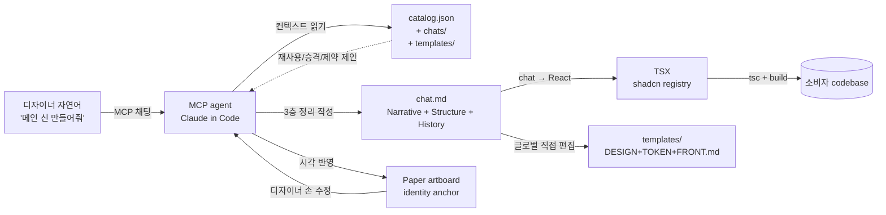
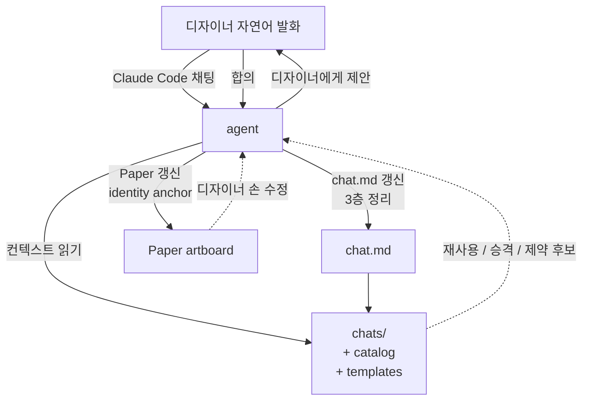

# gen-design Handbook

> **살아있는 핸드북** — 본 프로젝트의 *지금 이 순간* 의 진실. 매 phase 종료 시 갱신.
> **버전**: phase-8 spec-08-01 rename 후 (2026-05-10).
> **읽는 순서**: §1 → §2 → §3 → §4 (5분 안에 *왜* + *무엇* 파악) → §5-§7 (구체 룰 + 도구) → §8 (history).
> **이 문서만 읽고도** 신규 디자이너가 첫 chat.md 작성까지 도달 가능해야 함 — 그게 self-contained 의 의미.
>
> **어휘 변경 (spec-08-01)**: 디자이너가 작성하는 산출물 = *chat.md* (이전 *chat.md*). 디렉토리 = `chats/` / `fixtures/chats/` / `playground/chats/`. 화면 단위 컴포넌트 = `*Scene` (이전 `*Page`). harness-kit 의 *spec* (작업 흔적) 과 구분.

---

## §1 한 줄 요약 + 시각

> **gen-design** = 디자이너가 *자연어로 말하면* MCP agent 가 *3층 chat.md* (Narrative + Structure + History) 로 정리해주고, Paper 에서 시각화되고 React (shadcn + Tailwind) 코드로 *결정적으로* 컴파일되는, **designer-publisher 페어 도구**.

핵심 흐름:



> **흐름의 핵심**: *디자이너 자연어* 가 *입력*, *agent 의 정리* 가 *출력*, *Paper visual* 이 *시각 거울*, *글로벌 SSOT 직접 편집* 이 *영구 기록*. chat.md 는 *살아있는 소통 채널 + 명령 + 부산물* (재편집 가능).

**4 축 어휘 정합** — 본 프로젝트의 *real & defensible* 차별화 portion:

```
[디자이너 작성]   chat.md 의 <Component variant="x">
        ≡
[Paper 시각]      Paper 노드 이름 + 컴포넌트 인스턴스 + layer-name 식별자
        ≡
[React 출력]      shadcn/ui 컴포넌트 + 프로젝트 composites
        ≡
[LLM 학습]        shadcn 이름은 LLM 훈련 데이터에 풍부
```

위 4 축이 *같은 어휘로 통일* 되어 있어 *결정적 변환* 이 수학적으로 가능. (시장에서 본 프로젝트만)

---

## §2 Glossary

### SSOT 4 문서 + 3 디렉토리

| 이름 | 위치 | 역할 |
|---|---|---|
| **DESIGN.md** | `templates/DESIGN.md` | 페이지 / 화면 구조 + 인터랙션 명세. Stitch 0.1 superset. *narrative + 결정 근거*. |
| **TOKEN.md** | `templates/TOKEN.md` | 토큰 narrative + `tokens.json` (DTCG 1.0 strict) 결정 근거. |
| **FRONT.md** | `templates/FRONT.md` | *컴파일 룰북* + 3-tier 어휘 카탈로그 narrative + Paper 매핑 + shadcn 관리 룰. |
| **chat.md** | `chats/{scenes,components}/<x>.chat.md` | DESIGN.md 의 *machine-readable instance* — 한 scene/component 의 *살아있는 소통 채널* (재편집 가능, 명령 + 부산물 동시). 3층 구조 (Narrative + Structure + History). |
| **assets/** | `templates/assets/` | 이미지 / 폰트 / 아이콘 / `tokens/tokens.json` (binary + machine-readable). |
| **chats/** | `chats/{scenes,components}/` | *정식 산출물* — 사용자 의뢰로 누적되는 영구 chat.md. |
| **playground/chats/** | `playground/chats/{scenes,components}/` | *도그푸딩* 작업 영역 — 디자이너가 자유롭게 실험. 채택 시 chats/ 로 승격. |
| **fixtures/chats/** | `fixtures/chats/{scenes,components}/` | *회귀 게이트* — 28 chat.md fixture (변치 않음). 컴파일러 결정성 + ts-diagnose 보장. |

> *결정*: 위 7 위치가 *모든 입력의 SSOT*. studio React 코드 / Paper 캔버스 / 빌드 결과물 모두 이 SSOT *파생*.

### chat 의 3층 구조

chat.md 는 *3 섹션* 구조 — agent 가 자연어 input 을 정리해 출력하는 영구 형식:

| 층 | 역할 | 예 |
|---|---|---|
| **💬 Narrative** | 디자이너 의도 (자연어 정제) — *왜* / *무엇* / *어떤 결* | "디자인 툴의 빈 상태 안내. mineral 톤. CTA 단일." |
| **🧩 Structure** | 4축 형식 (machine-readable 컴포넌트 트리) — *어떻게 (구조)* | `<EmptyState variant="muted">...</EmptyState>` |
| **📜 History** | 변경 이력 (시간축) — *언제 / 누가 / 왜 변경* | "2026-05-10 CTA copper → muted slate (사유: 절제 강화)" |

> 디자이너는 *"이렇게 만들어줘"* 자연어로 말함. agent 가 *"네, Narrative 에 의도 정리, Structure 에 컴포넌트, History 에 이번 변경 한 줄"* 자동 정리.

### scene / component / shell

- **scene** — *화면전환 최대 단위*. 한 scene = 하나의 페이지/뷰 (`LoginScene`, `DashboardScene`, `ProfileScene`). 디렉토리 `chats/scenes/`.
- **component** — scene 의 *부분*. shadcn Tier 2 (`Button`) 또는 본 프로젝트 Tier 3 composite (`LoginForm`, `EmptyState`). 디렉토리 `chats/components/`.
- **shell** — *모든 scene 공통 외각* (BrandHeader / AppFooter 등). 글로벌 1 개 (`chats/_shell.chat.md`). 각 scene 의 frontmatter 에 `shell: { inherit: true, exclude: [...] }` 로 opt-in/out.

### agent (도서관 사서)

**agent** = Claude Code in MCP environment. 디자이너의 *자연어 의도* 를 받아 *형식화* 하는 매개자. 단순 변환기가 아니라 *도서관 사서*:

- 매 chat 갱신 시 `chats/` + `catalog.json` + `templates/{DESIGN,FRONT,TOKEN}.md` *컨텍스트 읽기*
- *재사용 후보* 능동 제안 (예: "EmptyState 가 이미 catalog 에 있어요, 그대로 쓸까요?")
- *글로벌 승격* 휴리스틱 (예: "BrandHeader / AppFooter 가 2+ scene 공통 — shell 로 승격할까요?")
- *제약 대화* (예: "login scene 은 보통 헤더 없이 풋터만, 어떻게 할까요?")

→ 자세한 약속은 §5 P6 (도서관 사서 원칙).

### Paper layer-name 식별성 컨벤션

Paper artboard / 주요 frame 의 layer-name 에 식별자 박기 — *반복 가능성 + 부분 수정* 의 anchor:

```
EmptyState [chat:components/empty-state]
LoginScene [chat:scenes/login]
```

→ paper-inference 가 layer-name 을 파싱 → *어느 chat 의 갱신* 인지 결정. 자세한 룰은 §6 R7.

### 어휘 Tier (3-tier)

| Tier | 정의 | 예시 | 어디서 정의 |
|---|---|---|---|
| **Tier 1** | ARIA 1.3 roles (시맨틱) | `button`, `dialog`, `menu`, ... 93 개 | `studio/src/lib/vocabulary/tier1-aria.ts` |
| **Tier 2** | shadcn UI primitives | `Button` (현재 1 개, phase-7 ship 시점) | `studio/src/components/ui/` (lowercase 파일) |
| **Tier 3** | 본 프로젝트 composites + templates | `LoginForm`, `DashboardScene`, ... 27 개 | `studio/src/components/{composites,templates}/` (PascalCase 파일) |

**합계**: 28 컴포넌트 (Tier 2: 1 + Tier 3: 27). catalog 진실 = `studio/src/lib/vocabulary/catalog/catalog.json`.

### Variant L1-L4 (ADR-004 D-3)

| Layer | 의미 | 예시 |
|---|---|---|
| **L1 named** | cva variants 의 *첫 axis* | `variant=primary`, `variant=secondary` |
| **L2 multi-axis** | cva 의 *2+ axis* | `size=md`, `tone=warning` |
| **L3 theme** | brand-a / brand-b CSS `data-theme` | `<html data-theme="brand-b">` |
| **L4 prop** | 동적 prop / state | `disabled={isLoading}` |

### Canonical / Round-trip

- **Canonical 표기**: paper-normalizer 가 정의 — `oklch()` ↔ hex, `rgba()` ↔ 8-digit hex, `padding: 16` ↔ `paddingBlock: 16; paddingInline: 16`. 같은 의미를 *한 가지* 표기로 정규화.
- **Round-trip**: chat.md → Paper → chat.md 순환 시 *동일* 산출. canonical 의 보장 조건.

---

## §3 아키텍처 매트릭스 — 정보의 위치

> 매 정보 종류마다 *진실의 위치* + *변동 빈도* + *변경 슬라이스 표현* 결정.
> ADR-008 (옵션 B) 가 *글로벌 직접 편집* 정책. *변경 슬라이스 시각화* = PR diff.
> 단 chat 흐름의 *자동 정리* (gen-design merge) 는 spec-08-08 후보 — 현재는 수동.

### 정보 종류 × 위치

| 정보 종류 | 진실의 위치 | 변동 빈도 | 변경 슬라이스 표현 | 비고 |
|---|---|---|---|---|
| **DESIGN.md 본문** (scene/화면 narrative) | `templates/DESIGN.md` | 매 spec PR | PR diff | 각 PR 의 해당 섹션만 갱신 |
| **TOKEN.md 토큰** | `templates/TOKEN.md` + `templates/assets/tokens/tokens.json` | 가끔 | PR diff | DTCG 1.0 strict 형식 |
| **FRONT.md 매핑/룰** | `templates/FRONT.md` | 매 spec PR | PR diff | 어휘 추가 / shadcn 룰 / 4 layer variant 운영 |
| **chat.md (정식 산출물)** | `chats/{scenes,components}/<x>.chat.md` | 매일 (도그푸딩 누적) | 신규 파일 또는 diff | 외부 디자이너 의뢰 / 사용 사례 누적 |
| **chat.md (도그푸딩)** | `playground/chats/{scenes,components}/` | *매우 자주* | 신규/삭제 자유 | 채택 시 chats/ 로 승격, 미채택은 정리 |
| **chat.md (회귀 fixture)** | `fixtures/chats/{scenes,components}/<x>.chat.md` | *거의 안 변함* | drift 발생 시 fixture 갱신 spec | 컴파일러 결정성 + ts-diagnose 게이트 |
| **assets** (이미지/폰트/아이콘) | `templates/assets/` | 가끔 | binary diff | git LFS 없음 — 작은 자산만 |
| **catalog (machine-readable)** | `studio/src/lib/vocabulary/catalog/catalog.json` | 자동 (cva extractor) | studio 코드 변경 시 `pnpm vocab` 재실행 | *수동 편집 금지* — 컴포넌트 코드가 진실 |
| **variants 정의** | 각 컴포넌트의 `cva()` 코드 | 매 컴포넌트 PR | studio 코드 diff | catalog 추출 시 자동 반영 |
| **결정 (ADR)** | `docs/decisions/ADR-NNN-{slug}.md` | 큰 결정 시 신규 | 신규 파일 | 한 결정 = 한 ADR. 영구 기록 |
| **shell (글로벌 외각)** | `chats/_shell.chat.md` | 가끔 (승격 시) | diff | 모든 scene 의 기본 외각. 각 scene 의 frontmatter 로 opt-in/out |

### 디렉토리 결정 (ADR-008 — 옵션 B 유지)

- *harness-kit* spec dir (`specs/spec-X-Y-{slug}/`) 안에는 **spec.md / plan.md / task.md / walkthrough.md / pr_description.md** 만 (작업 흔적).
- *디자인 도구* 의 design 슬라이스 파일 (per-spec DESIGN.md / FRONT.md / TOKEN.md / assets/) 은 *생성하지 않음*. 글로벌 직접 편집.
- *변경 슬라이스의 시각적 표현* = PR diff 자체.
- **Reconsider trigger** (ADR-008 D-4): 분기당 3+ 글로벌 머지 충돌 / alpha 3+ 명 피드백 / spec 의 design 변경 단위 다양화 — *Hybrid* (ADR-010) 가 일부 trigger 해소. 잔여는 ADR-010 의 자체 trigger 로 재논의.

### 가변성 등급 — 3 정도

| 등급 | 위치 | 변동 | 정책 |
|---|---|---|---|
| **🪨 고정** (회귀) | `fixtures/chats/` | 거의 안 변함 | 컴파일러 게이트 — drift 시 신규 fixture spec |
| **🌊 변동** (정식 산출물) | `chats/` | 도그푸딩 / 사용자 의뢰 누적 | 매 PR 마다 다이얼로그 통한 갱신 |
| **💨 가변** (도그푸딩) | `playground/chats/` | *매우 자주* (실험 / 폐기) | git tracked 이지만 commit 정책 느슨 |

→ 3 등급의 분리가 *디자이너의 자유* 와 *시스템의 안정* 을 동시에 보장.

### chat 승격 / shell 승격 정책 (ADR-010)

ADR-010 (*Hybrid*) 가 chat 흐름의 *자동 제안* 과 ADR-008 의 *글로벌 직접 편집* 정신을 결합:

- **제안 자동** — agent (도서관 사서, P6) 가 매 chat 갱신 시 컨텍스트 (chats/ + catalog + templates/) 읽고 *재사용 / 승격 / 정리* 후보 능동 제시
- **실행 수동** — 디자이너 *합의* 후 git mv / 글로벌 SSOT 갱신 / commit
- **`gen-design merge` 명령 = 조력자** (`spec-08-08` 도입 예정):
  1. 휴리스틱 후보 제시 (예: *"BrandHeader 가 3 scene 에 공통 — shell 승격 후보"*)
  2. 변경 *preview* (어떤 파일 어디로, frontmatter 갱신)
  3. 디자이너 *confirm* 후 실행
  4. 각 파일 atomic commit

→ ADR-010 의 5 D-항목 자세히 보려면 [`docs/decisions/ADR-010-chat-promotion-policy.md`](decisions/ADR-010-chat-promotion-policy.md).

---

## §4 디자이너 일주일 워크플로 — Profile Scene 추가 시나리오

> 신규 디자이너가 `<ProfileScene>` 을 추가하는 *5 일 시나리오*. agent 매개 흐름 (PoC 검증) + ADR-006 (Paper-first) 기반.

### agent 매개 흐름의 시각

매 작업의 *기본 패턴* 은 다음과 같음:



핵심: 디자이너는 *말만 함*. agent 가 *컨텍스트 읽고* + *제안* + *형식 정리* 한다. *Paper 손 수정* 은 다음 발화 때 *반영해줘* 로 역방향 sync.

### Day 1 — Paper 에서 시각 의도 표현

> **환경**: 디자이너 = Claude Code in MCP environment with Paper MCP. *Studio 의 Paper preview 패널* 은 phase-9 후보 (현재는 디자이너 본인이 Paper MCP 직접 사용).

```
디자이너 → Claude Code:
  "Profile Scene 만들 거야. Avatar + 정보 카드 + 통계 3 개 + 편집/로그아웃 CTA."

Agent:
  - chats/components/ 읽기 → Avatar 후보 검색
  - catalog 매칭 → AvatarUpload (Tier 3) 발견
  - 디자이너에게 제안:
    "AvatarUpload 가 catalog 에 있어요. 사용 OK? StatCard 도 발견 — 재사용?"
  - 합의 후:
    1) Paper artboard 신규 (1440×900, layer-name: "ProfileScene [chat:scenes/profile]")
    2) AvatarUpload 영역 / ProfileInfoCard / StatCard × 3 / 액션 버튼 그리기
    3) 각 주요 frame layer-name 에 식별자 박기
```

**산출물**: Paper artboard `[chat:scenes/profile]` + 자식 frame 들의 layer-name 식별자.

> 📁 살아있는 예시: [`playground/chats/components/empty-state.chat.md`](../playground/chats/components/empty-state.chat.md) — PoC 의 EmptyState 가 동일 패턴으로 작성됨.

### Day 2 — agent 가 자연어 의도 정리

```
디자이너:
  "이 신의 의도 정리해줘. mineral 톤. 정보 + 통계 + 액션 의 균형."

Agent:
  - Paper artboard 21X-0 의 트리 읽기 (get_jsx + get_computed_styles)
  - 자연어 의도 + 구조 분석 → 3층 chat.md 작성:

    playground/chats/scenes/profile.chat.md:
      ---
      type: scene
      name: ProfileScene
      identity: chats/scenes/profile
      shell: { inherit: true }
      ---
      # ProfileScene
      ## 💬 Narrative
      사용자 본인 정보 + 활동 통계 + 액션 진입.
      mineral 톤 — 정보 / 통계 / 액션 의 3 영역 호흡 균등.
      ## 🧩 Structure
      <ProfileScene>
        <AvatarUpload />
        <ProfileInfoCard />
        <StatCard variant="compact" /> × 3
        <Button variant="primary">{{i18n.ko.profile.edit}}</Button>
      </ProfileScene>
      ## 📜 History
      - 2026-05-X 초안 — Paper inference + 자연어 의도 정리
```

> 📁 살아있는 예시: [`playground/chats/scenes/main.chat.md`](../playground/chats/scenes/main.chat.md) — main scene 도 동일 패턴으로 작성됨.

### Day 3 — chat.md 확정 + Paper 검증 (양방향)

```
디자이너:
  "통계 카드 첫 번째는 강조하고 싶어. variant=highlighted 로 바꿔줘."

Agent:
  - chat.md Structure 의 첫 StatCard variant 갱신
  - Paper artboard 갱신 (해당 frame)
  - History 1줄 추가: "2026-05-X 첫 StatCard variant=highlighted (사유: 강조)"
  - Paper preview 보고 디자이너 *확인* 또는 *재수정 요청*
```

(역방향): 디자이너가 Paper 에서 직접 텍스트 / variant 수정 → 다음 발화에 *"Paper 변경분 반영해줘"* → agent 가 inferChat diff 모드 (spec-08-06 후보) 로 chat.md 갱신.

**산출물**: 완성된 `chats/scenes/profile.chat.md` (playground 에서 chats 로 *승격* 시점).

### Day 4 — 글로벌 SSOT 직접 편집 (ADR-008 옵션 B)

신규 컴포넌트 / 토큰 / i18n 키가 추가됐다면 *글로벌* 파일 직접 갱신:

1. `templates/DESIGN.md` 의 §11 (scene 트리) 에 *ProfileScene* 섹션 추가
2. `templates/TOKEN.md` 에 신규 토큰 narrative (예: *"Profile 통계 카드 강조 색은 mineral 의 copper 강 톤"*)
3. `templates/assets/tokens/tokens.json` 에 DTCG 형식 토큰 추가 → studio 가 CSS 변수 자동 빌드
4. `templates/assets/i18n/ko.json` 에 새 키 (`profile.edit`, `profile.logout`, etc.)
5. `templates/FRONT.md` 의 §2 어휘 카탈로그에 *Profile* 컨텍스트 사용 사례 entry

> 📁 살아있는 예시: [`playground/chats/_shell.chat.md`](../playground/chats/_shell.chat.md) — shell 의 글로벌 승격 사례.

### Day 5 — 검증 + 통합 (PR)

```bash
# 1. 컴파일 검증
pnpm chat-react chats/scenes/profile.chat.md
# → React TSX 출력 확인 (shadcn registry 형식)

# 2. 회귀 검증
cd studio && pnpm test
# → 725/725 PASS (단 fixture 변경 있다면 expected 갱신)

# 3. 빌드 검증
pnpm --filter studio build
# → exit 0

# 4. (phase-8 추후) lint
pnpm gen-design lint
# → 0 issue (catalog ↔ DESIGN/FRONT/chats 정합)

# 5. PR 생성 — agent 또는 사용자
git push -u origin spec-X-Y-profile-scene
gh pr create --base phase-08-chat-agent-flow ...
```

**리뷰**: PR diff = *내가 추가한 글로벌 SSOT 슬라이스 + chats/scenes/profile.chat.md*. ADR-008 옵션 B 의 현현 — 변경된 *영역* 만 한눈에.

> 📁 살아있는 예시: [`playground/chats/scenes/login.chat.md`](../playground/chats/scenes/login.chat.md) — login scene 의 shell.exclude 처리 사례 (헤더 빠진 풋터만).

---

## §4.5 새 컴포넌트 추가 워크플로 — EmptyState 사례 연구

> §4 가 *기존 컴포넌트 재사용* 시나리오라면, §4.5 는 *catalog 미등재 신규 컴포넌트* 추가 흐름.
> 사례 = `EmptyState` (PoC 출처).

### 언제 새 컴포넌트가 필요한가?

자연어 발화 시 agent 가 *catalog 매칭 실패* 를 보고:

```
디자이너: "디자인 툴의 빈 상태 알림을 만들고 싶어. 아이콘 + 헤드라인 + 본문 + CTA."

Agent:
  - chats/components/ 검색 → "empty-state" 부재
  - catalog.json 검색 → EmptyState 부재
  - 디자이너에게 알림:
    "EmptyState 가 catalog 미등재. 신규 컴포넌트 추가가 필요해 보여요.
     - 옵션 A: 새 component 로 등록 (vocabulary-first)
     - 옵션 B: 기존 Button + Card + Heading 조합으로 표현 (패턴 인라인)
     - 옵션 C: 잠시 chat.md 만 작성 (catalog 등재는 나중)"
```

### 결정: vocabulary-first (P3 적용)

새 *재사용 가능* 패턴이면 *어휘로 등록* 이 표준:

### 단계 1: chat.md 작성 (catalog hint 포함)

```markdown
---
type: component
name: EmptyState
identity: chats/components/empty-state
catalog:
  tier: 3
  family: composites
  status: new            # 🚨 신규 — catalog.json 미등재
paper:
  layerNameAnchor: "[chat:components/empty-state]"
created: 2026-05-X
---

# EmptyState

## 💬 Narrative
디자인 툴의 *빈 상태* 안내. 절제된 환영. mineral 톤.

## 🧩 Structure
<EmptyState variant="muted">
  <EmptyState.Icon name="upload-cloud" />
  <EmptyState.Headline>{{i18n.ko.emptyState.headline}}</EmptyState.Headline>
  <EmptyState.Body>{{i18n.ko.emptyState.body}}</EmptyState.Body>
  <Button variant="primary">{{i18n.ko.emptyState.cta}}</Button>
</EmptyState>

## 📜 History
- 2026-05-X 초안 — Paper artboard 에서 추출.
```

> 📁 실제 PoC 결과: [`playground/chats/components/empty-state.chat.md`](../playground/chats/components/empty-state.chat.md)

### 단계 2: studio 컴포넌트 코드 (cva 패턴)

```tsx
// studio/src/components/composites/EmptyState/index.tsx
import { cva, type VariantProps } from "class-variance-authority";
import { Button } from "@/components/ui/button";

const emptyStateVariants = cva(
  "flex flex-col items-center justify-center gap-5 p-12 text-center",
  {
    variants: {
      variant: {
        muted: "bg-surface-alt text-text-primary",
        error: "bg-destructive/10 text-destructive",
        success: "bg-success/10 text-success",
      },
    },
    defaultVariants: { variant: "muted" },
  },
);

export interface EmptyStateProps extends VariantProps<typeof emptyStateVariants> {
  children?: React.ReactNode;
}

export function EmptyState({ variant, children }: EmptyStateProps) {
  return <div className={emptyStateVariants({ variant })}>{children}</div>;
}
EmptyState.Icon = /* ... */;
EmptyState.Headline = /* ... */;
EmptyState.Body = /* ... */;
```

### 단계 3: catalog 자동 갱신

```bash
pnpm --filter studio vocab
```

cva extractor 가 EmptyState 의 `variant: muted | error | success` axis 를 *자동 추출* → `catalog.json` 업데이트:

```json
{
  "tiers": {
    "tier3Project": {
      "composites": [
        // ... 기존
        {
          "name": "EmptyState",
          "axes": [
            { "name": "variant", "values": ["muted", "error", "success"] }
          ]
        }
      ]
    }
  }
}
```

→ `templates/FRONT.md` / `DESIGN.md` / `DESIGN.stitch.md` 도 `pnpm vocab` 으로 함께 갱신.

### 단계 4: chat.md 의 frontmatter `status` 갱신

```diff
- status: new
+ status: existing
```

### 단계 5: scenes 에서 재사용

이제 다른 scene (Login / Main / etc.) 에서 `<EmptyState variant="muted">...</EmptyState>` 자유 사용 가능. agent 도 이후 매칭에서 EmptyState 인식.

### 결정 기록 (선택)

만약 새 컴포넌트가 *아키텍처 결정* (예: 새 base-ui 의존성, 새 a11y 패턴) 동반이면 → ADR 작성 (P5).
*시각 / 형식 결정* (mineral 톤 채택 등) 이면 → chat.md History 만으로 충분.

---

## §5 원칙

### P1: 글로벌 SSOT 점진 누적

`templates/{DESIGN,TOKEN,FRONT}.md` + `chats/*.chat.md` 가 *지금* 의 진실. spec PR 마다 *글로벌 슬라이스* 를 변경. 누적은 git history 가 자동 보존.

### P2: 스펙 로컬 = delta

spec dir (`specs/spec-X-Y/`) 안에는 *변경의 의도* (spec.md / plan.md / task.md / walkthrough.md / pr_description.md) 만. 글로벌 진실의 *복제* 는 0.

### P3: vocabulary-first

새 컴포넌트가 필요하면 *먼저* catalog 에 등재 → 컴포넌트 코드 작성 (cva extractor 가 catalog 자동 갱신) → chat.md 에서 사용. *어휘 → 코드 → 사용* 순서 엄수.

### P4: raw color 금지

생성/작성되는 모든 색상은 *토큰 참조* (`{{token.semantic.color.primary}}`) 만. raw `#` / `rgb()` / `oklch()` 는 *원본 토큰 값* 의 location 에만 (즉 `tokens.json`). canonical 표기는 paper-normalizer 가 정규화.

### P5: 결정 = ADR

architectural / cross-cutting 결정은 ADR 로. *2 줄 commit message* 가 아닌 *한 ADR 파일*. ADR-001 ~ ADR-009 (+ ADR-010 spec-08-05 작성 예정) 가 결정 history.

### P6: agent 는 도서관 사서

매 chat 갱신 시 agent 는 *컨텍스트* (chats/ + catalog + templates) 를 읽고 *능동 제안*:

- *재사용 후보* — "EmptyState 가 이미 catalog 에 있어요"
- *글로벌 승격* — "BrandHeader / AppFooter 가 2+ scene 공통, shell 로 승격할까요?"
- *제약 대화* — "login scene 은 보통 헤더 없이, 어떻게?"
- *어휘 검증* — "Login*Page* 라는 이름은 catalog 에 없어요. *LoginScene* 의도?"

agent 는 *단순 변환기* 가 아니라 *살아있는 디자인 시스템 도서관 사서*. 디자이너의 발화를 *형식* 으로 옮기되, *기존 자산* 의 *재사용 / 정리* 를 능동적으로 가이드.

> 자세한 PoC 검증: 3 세션 시뮬레이션 결과 — `playground/chats/` 6 파일이 이 패턴의 산물.

### P7: chat 은 살아있다

chat.md 는 *동결된 산출물* 이 아니라 *진행 중인 채팅의 정제본*:

- 디자이너 자연어 입력 → agent 정리 → 3층 출력
- 재편집 가능 (다음 발화 시 다시 갱신)
- *명령 + 부산물 동시* — "이렇게 만들어줘" 가 명령, "이렇게 만들었습니다" 의 정제본이 부산물
- History 섹션 = 채팅의 *시간축 흔적*

→ harness-kit 의 *spec* (작업 흔적, 동결) 과 본질적으로 다른 산출물. 같은 스펙 (`chats/scenes/login.chat.md`) 을 *재 편집* 할 수 있어야 함이 핵심.

---

## §6 룰

### R1: One Task = One Commit

constitution §8. 매 task 가 한 commit. *"몇 task 를 묶어서"* 금지. commit subject 에 SPEC ID 포함 (`feat(spec-7-X-Y): ...`).

### R2: 한국어 산출물

spec / plan / task / walkthrough / pr_description / phase / 채팅 = *한국어*. 코드 / 파일 경로 / 표준 기술 용어 / 거버넌스 문서 (constitution.md, agent.md) = 영어 허용. 한국어 쓰기는 *사용자와의 명확한 의사소통* 의 전제.

### R3: PascalCase 컴포넌트

Tier 2 (shadcn ui): 컴포넌트 *심볼* PascalCase, 파일은 `lowercase.tsx` (예: `Button` from `button.tsx`).
Tier 3 (composites/templates): 심볼 + 파일 *모두 PascalCase* (예: `LoginForm.tsx`).
catalog / chat.md / Paper 노드명 = *심볼 PascalCase 그대로*.

### R4: ADR-for-결정

새 결정은 ADR. 작은 결정은 chat.md 의 `## 결정 기록` (walkthrough). cross-cutting / architectural 결정만 ADR.

### R5: chat.md grammar

- 컴포넌트 인스턴스: `<Component variant="x" attr={value}>{children}</Component>`
- i18n placeholder: `{{i18n.ko.path}}` (1급 시민)
- token placeholder: `{{token.semantic.color.primary}}`
- `## Behavior` (state / events) / `## Variants` (L1-L4 변형 선언) 섹션
- frontmatter 미사용 (현재). 향후 도입 시 chat-md grammar 갱신 필수

#### 카피로 시작하는 minimal chat.md 예시

```markdown
# LoginScene

<LoginScene>
  <BrandHeader>
    <h1>{{i18n.ko.login.welcome}}</h1>
  </BrandHeader>
  <LoginForm>
    <Button variant="primary">{{i18n.ko.login.submit}}</Button>
    <Button variant="ghost">{{i18n.ko.login.signupHint}}</Button>
  </LoginForm>
</LoginScene>

## Behavior
- state: isLoading: boolean = false
- on submit: setIsLoading(true)

## Variants
- Default: 기본
- WithSocial: SocialAuthBlock 추가
```

위 예시가 작동하는 fixture: `fixtures/chats/scenes/login.chat.md` 참고. 28 fixture 모두 결정성 + ts-diagnose PASS.

### R6: shadcn 관리

- shadcn primitive 추가 시 `pnpm dlx shadcn@latest add <name>` → `studio/src/components/ui/<lowercase>.tsx` 자동 생성
- catalog 등재 = cva extractor 자동 반영 (수동 편집 0)
- 컴포넌트 변형은 *cva variants* 만 — 임의 prop 으로 분기 금지

### R7: Paper layer-name 식별성 컨벤션

Paper artboard / 주요 frame 의 layer-name 에 *식별자* 박기:

```
ProfileScene [chat:scenes/profile]      ← scene
EmptyState [chat:components/empty-state] ← component
```

규칙:
- **artboard 단위**: scene 또는 *재사용 가능한 component* 의 root frame 만 식별자 박음
- **inner frame 단위**: 명시 안 함 (트리 구조가 식별)
- **포맷**: `{Display Name} [chat:{type}/{slug}]` — 사람 가독성 + 기계 파싱 동시
- **type**: `scenes` 또는 `components` 만 (chats/ 디렉토리 분류와 일치)
- **slug**: kebab-case, chats/ 안 파일명과 1:1 (예: `chats/scenes/login.chat.md` ↔ `[chat:scenes/login]`)

→ 이 컨벤션이 *반복 가능성 + 부분 수정* 의 anchor. paper-inference (spec-08-03 후) 가 layer-name 파싱 → *어느 chat 의 갱신* 인지 결정.

> 📁 PoC 사례: [`playground/chats/components/empty-state.chat.md`](../playground/chats/components/empty-state.chat.md) 의 frontmatter `paper.layerNameAnchor` 필드. Paper artboard 21E-0 의 layer-name = `EmptyState [chat:components/empty-state]`.

---

## §7 도구

### sdd CLI (harness-kit)

| 명령 | 역할 |
|---|---|
| `bash .harness-kit/bin/sdd status` | 현 phase / spec / 상태 / drift 점검 |
| `sdd phase new <slug> [--base]` | 신규 phase 시작 |
| `sdd spec new <slug>` | 신규 spec 시작 (현 phase 안) |
| `sdd plan accept` | Plan Accept — Strict Loop 진입 |
| `sdd ship` | spec 종료 — phase.md spec 표 자동 갱신 |
| `sdd phase done` | phase 완료 처리 |
| `sdd archive [--dry-run]` | 완료 spec 디렉토리 정리 |

### gen-design CLI (ADR-009)

> 단일 CLI `studio/scripts/gen-design.ts` (옵션 B). 진입점: `pnpm gen-design <subcommand>` (또는 `pnpm gd <subcommand>`).
> ADR-009 D-4 의 5 명령 표 (도입 시점 / 우선순위 / 책임 / 입출력) 가 단일 진실.

| 명령 | 책임 | 우선순위 | 도입 시점 |
|---|---|:---:|---|
| `gen-design paper-import` | Paper MCP artboard → `PaperTreeNode` JSON | ⭐ **0** | **phase-8 도그푸딩 첫 게이트** (`spec-08-03`) — 본 명령 없이는 chat 흐름 시작 불가 |
| `gen-design lint` | catalog ↔ DESIGN/FRONT/chat.md 정합 검증 (6 카테고리) | ⭐ 1 | phase-8 (`spec-08-09`) |
| `gen-design diff` | 글로벌 SSOT vs studio 코드 비교 | ⭐ 2 | phase-8 후보 |
| `gen-design paper` | chat.md → Paper tree (`compileToPaper` CLI 화) | ⭐ 3 | phase-8 |
| `gen-design react` | catalog + 컴포넌트 → shadcn registry | ⭐ 4 | phase-9 (외부 shadcn 설치 검증) |
| `gen-design merge` | *조력자* — chat → 글로벌 SSOT + shell 승격 후보 제시 + 변경 preview + 디자이너 confirm | ⭐ 5 | phase-8 후보 (`spec-08-08`) — ADR-010 결정 (Hybrid) 따라 도입 확정 |

### 기존 부분 CLI (phase-7 시점)

| 명령 | 위치 | 역할 |
|---|---|---|
| `pnpm --filter studio paper-to-chat <tree.json>` | `studio/src/lib/paper-inference/cli/` | Paper tree → chat.md (inferSpec) |
| `pnpm --filter studio chat-paper <chat.md>` | `studio/src/lib/chat-md-compiler/paper/cli/` | chat.md → Paper tree (`compileToPaper`) |
| `pnpm --filter studio chat-react <chat.md> [--registry]` | `studio/src/lib/chat-md-compiler/react/cli/` | chat.md → React TSX (`compileToReact`) |
| `pnpm --filter studio test` | (vitest) | 단위 + 통합 테스트 (모든 fixture × 결정성 + ts-diagnose) |
| `pnpm --filter studio build` | (vite) | studio 웹앱 production 빌드 |

> *정책*: 기존 부분 CLI 는 phase-8 의 `gen-design <subcommand>` 통합 진입점 도입 후 *alias* 로 유지하거나 deprecation. 결정은 phase-8 spec 안에서.

---

## §8 ADR 인덱스 — 결정 history 타임라인

| # | ADR | 1줄 요약 | 날짜 |
|---|---|---|---|
| 001 | [Phase Restructure](decisions/ADR-001-phase-restructure.md) | phase-1~5 의 재구성 / 우선순위 결정 | (초기) |
| 002 | [Token Naming Strategy](decisions/ADR-002-token-naming-strategy.md) | 토큰 이름 컨벤션 (semantic.color.{light,dark}.x) | (초기) |
| 003 | [Headless UI Selection](decisions/ADR-003-headless-ui-selection.md) | base-ui/react + shadcn 채택 | (초기) |
| 004 | [Vocabulary Extraction & Variants](decisions/ADR-004-vocabulary-extraction-and-variants.md) | catalog 자동 추출 + L1-L4 variant 시스템 | 2026-04 |
| 005 | [Grammar & IR](decisions/ADR-005-grammar-and-ir.md) | chat.md PEG grammar + AST 설계 | 2026-04 |
| 006 | [Paper-first Workflow](decisions/ADR-006-paper-first-workflow.md) | 디자이너 워크플로 방향 = Paper → chat.md → React (역방향 X) | 2026-05-09 |
| 007 | [FRONT.md Compilation Rulebook](decisions/ADR-007-front-md-compilation-rulebook.md) | SSOT = 4 문서 + 2 디렉토리 / FRONT.md = 컴파일 룰북 | 2026-05-10 |
| 008 | [Per-spec Design Files](decisions/ADR-008-per-spec-design-files.md) | spec dir 안 design 슬라이스 = 생성 안 함 (글로벌 직접 편집) | 2026-05-10 |
| 009 | [gen-design CLI](decisions/ADR-009-gen-design-cli.md) | 단일 CLI `studio/scripts/gen-design.ts` / 5 명령 / phase-8 첫 실용 = lint | 2026-05-10 |
| **010** | **chat 승격 정책** *(작성 예정 — `spec-08-05`)* | ADR-008 옵션 B reconsider — chat 흐름의 자동 정리 (gen-design merge) 필요성 | (TBD) |

### 결정 history 타임라인

```
phase-1  ─┐
phase-2  ─┤  ADR-001 ~ 003 (기반 결정)
phase-3  ─┘
phase-4  ──  ADR-004 (어휘)
phase-5  ──  ADR-005 (grammar)
phase-6  ──  Studio v1 (ADR 신규 0 — 기반 결정 위에 구현)
phase-7  ──  ADR-006 → 007 → 008 → 009  (4 ADR)
                ↑ 디자이너 워크플로 *방향* + SSOT 구조 + 구현 정책
phase-8  ──  ADR-010 (예정 — spec-08-05)
                ↑ ADR-008 reconsider — chat 흐름의 자동 정리 정책
```

---

## 부록

- **vision.md**: `docs/vision.md` — 프로젝트의 *왜* + 페르소나 + 4 축 어휘 정합 차별화. 본 handbook 의 §1 이 vision 의 압축.
- **constitution.md**: `.harness-kit/agent/constitution.md` — 거버넌스 (One Task = One Commit, Plan Accept Gate, etc.).
- **agent.md**: `.harness-kit/agent/agent.md` — 에이전트 운영 절차 (Strict Loop, Idea Capture Gate, etc.).

---

> 이 문서를 읽고도 막히는 지점이 있으면 *그건 handbook 의 결함*. issue 또는 PR 로 보강.
