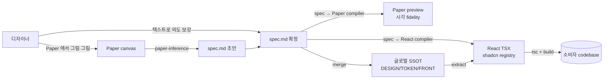

# gen-design Handbook

> **살아있는 핸드북** — 본 프로젝트의 *지금 이 순간* 의 진실. 매 phase 종료 시 갱신.
> **버전**: phase-7 ship 시점 (2026-05-10).
> **읽는 순서**: §1 → §2 → §3 → §4 (5분 안에 *왜* + *무엇* 파악) → §5-§7 (구체 룰 + 도구) → §8 (history).
> **이 문서만 읽고도** 신규 디자이너가 첫 spec.md 작성까지 도달 가능해야 함 — 그게 self-contained 의 의미.

---

## §1 한 줄 요약 + 시각

> **gen-design** = 디자이너가 spec markdown 으로 의도를 적으면, Paper 에서 시각화되고 React (shadcn + Tailwind) 코드로 *결정적으로* 컴파일되는, designer-publisher 페어 도구.

핵심 흐름:



**4 축 어휘 정합** — 본 프로젝트의 *real & defensible* 차별화 portion:

```
[디자이너 작성]   spec.md 의 <Component variant="x">
        ≡
[Paper 시각]      Paper 노드 이름 + 컴포넌트 인스턴스
        ≡
[React 출력]      shadcn/ui 컴포넌트 + 프로젝트 composites
        ≡
[LLM 학습]        shadcn 이름은 LLM 훈련 데이터에 풍부
```

위 4 축이 *같은 어휘로 통일* 되어 있어 *결정적 변환* 이 수학적으로 가능. (시장에서 본 프로젝트만)

---

## §2 Glossary

### SSOT 4 문서 + 2 디렉토리

| 이름 | 위치 | 역할 |
|---|---|---|
| **DESIGN.md** | `templates/DESIGN.md` | 페이지 / 화면 구조 + 인터랙션 명세. Stitch 0.1 superset. *narrative + 결정 근거*. |
| **TOKEN.md** | `templates/TOKEN.md` | 토큰 narrative + `tokens.json` (DTCG 1.0 strict) 결정 근거. |
| **FRONT.md** | `templates/FRONT.md` | *컴파일 룰북* + 3-tier 어휘 카탈로그 narrative + Paper 매핑 + shadcn 관리 룰. |
| **spec.md** | `spec/<x>.spec.md` | DESIGN.md 의 *machine-readable instance* — 한 페이지/컴포넌트의 spec.md grammar (peggy parser) 인스턴스. |
| **assets/** | `templates/assets/` | 이미지 / 폰트 / 아이콘 / `tokens/tokens.json` (binary + machine-readable). |
| **spec/** | `spec/` | spec.md fixture 디렉토리. 28 fixture (phase-7 ship 시점). |

> *결정*: 위 6 가 *모든 입력의 SSOT*. studio React 코드 / Paper 캔버스 / 빌드 결과물 모두 이 SSOT *파생*.

### 어휘 Tier (3-tier)

| Tier | 정의 | 예시 | 어디서 정의 |
|---|---|---|---|
| **Tier 1** | ARIA 1.3 roles (시맨틱) | `button`, `dialog`, `menu`, ... 93 개 | `studio/src/lib/vocabulary/tier1-aria.ts` |
| **Tier 2** | shadcn UI primitives | `Button` (현재 1 개, phase-7 ship 시점) | `studio/src/components/ui/` (lowercase 파일) |
| **Tier 3** | 본 프로젝트 composites + templates | `LoginForm`, `DashboardPage`, ... 27 개 | `studio/src/components/{composites,templates}/` (PascalCase 파일) |

**합계**: 28 컴포넌트 (Tier 2: 1 + Tier 3: 27). catalog 진실 = `studio/src/lib/vocabulary/catalog/catalog.json`.

### Variant L1-L4 (ADR-004 D-3)

| Layer | 의미 | 예시 |
|---|---|---|
| **L1 named** | cva variants 의 *첫 axis* | `variant=primary`, `variant=secondary` |
| **L2 multi-axis** | cva 의 *2+ axis* | `size=md`, `tone=warning` |
| **L3 theme** | brand-a / brand-b CSS `data-theme` | `<html data-theme="brand-b">` |
| **L4 prop** | 동적 prop / state | `disabled={isLoading}` |

### Canonical / Round-trip

- **Canonical 표기**: paper-normalizer 가 정의 — `oklch()` ↔ hex, `rgba()` ↔ 8-digit hex, `padding: 16` ↔ `paddingBlock: 16; paddingInline: 16`. 같은 의미를 *한 가지* 표기로 정규화.
- **Round-trip**: spec.md → Paper → spec.md 순환 시 *동일* 산출. canonical 의 보장 조건.

---

<!-- §3-§8 추가 예정 — Task 4-6 에서 -->
