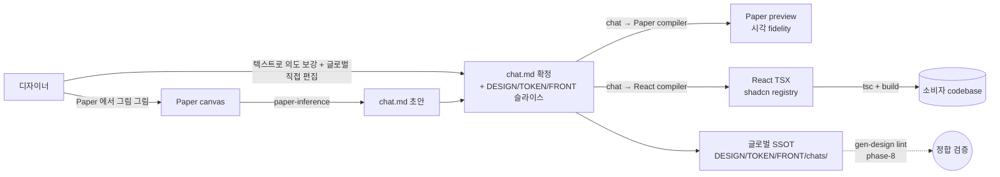

# gen-design Handbook

> **살아있는 핸드북** — 본 프로젝트의 *지금 이 순간* 의 진실. 매 phase 종료 시 갱신.
> **버전**: phase-8 spec-08-01 rename 후 (2026-05-10).
> **읽는 순서**: §1 → §2 → §3 → §4 (5분 안에 *왜* + *무엇* 파악) → §5-§7 (구체 룰 + 도구) → §8 (history).
> **이 문서만 읽고도** 신규 디자이너가 첫 chat.md 작성까지 도달 가능해야 함 — 그게 self-contained 의 의미.
>
> **어휘 변경 (spec-08-01)**: 디자이너가 작성하는 산출물 = *chat.md* (이전 *chat.md*). 디렉토리 = `chats/` / `fixtures/chats/` / `playground/chats/`. 화면 단위 컴포넌트 = `*Scene` (이전 `*Page`). harness-kit 의 *spec* (작업 흔적) 과 구분.

---

## §1 한 줄 요약 + 시각

> **gen-design** = 디자이너가 chat markdown 으로 의도를 적으면, Paper 에서 시각화되고 React (shadcn + Tailwind) 코드로 *결정적으로* 컴파일되는, designer-publisher 페어 도구.

핵심 흐름:



> **흐름의 핵심**: 디자이너의 *chat.md 편집* + *글로벌 SSOT 직접 편집* 이 같은 PR 안에 공존. ADR-008 옵션 B 의 현현. *chats/ 디렉토리 안 design 슬라이스 자동 생성 0*.

**4 축 어휘 정합** — 본 프로젝트의 *real & defensible* 차별화 portion:

```
[디자이너 작성]   chat.md 의 <Component variant="x">
        ≡
[Paper 시각]      Paper 노드 이름 + 컴포넌트 인스턴스
        ≡
[React 출력]      shadcn/ui 컴포넌트 + 프로젝트 composites
        ≡
[LLM 학습]        shadcn 이름은 LLM 훈련 데이터에 풍부
```

위 4 축이 *같은 어휘로 통일* 되어 있어 *결정적 변환* 이 수학적으로 가능. (시장에서 본 프로젝트만)

---

## §2 Glossary

### SSOT 4 문서 + 2 디렉토리

| 이름 | 위치 | 역할 |
|---|---|---|
| **DESIGN.md** | `templates/DESIGN.md` | 페이지 / 화면 구조 + 인터랙션 명세. Stitch 0.1 superset. *narrative + 결정 근거*. |
| **TOKEN.md** | `templates/TOKEN.md` | 토큰 narrative + `tokens.json` (DTCG 1.0 strict) 결정 근거. |
| **FRONT.md** | `templates/FRONT.md` | *컴파일 룰북* + 3-tier 어휘 카탈로그 narrative + Paper 매핑 + shadcn 관리 룰. |
| **chat.md** | `chats/{scenes,components}/<x>.chat.md` | DESIGN.md 의 *machine-readable instance* — 한 scene/component 의 chat.md grammar (peggy parser) 인스턴스. *살아있는 소통 채널* (재편집 가능, 명령 + 부산물). |
| **assets/** | `templates/assets/` | 이미지 / 폰트 / 아이콘 / `tokens/tokens.json` (binary + machine-readable). |
| **fixtures/chats/** | `fixtures/chats/{scenes,components}/` | 회귀 게이트 — 28 chat.md fixture (변치 않음). |
| **playground/chats/** | `playground/chats/{scenes,components}/` | 도그푸딩 작업 영역 — 디자이너가 자유롭게 작성. |

> *결정*: 위 6 가 *모든 입력의 SSOT*. studio React 코드 / Paper 캔버스 / 빌드 결과물 모두 이 SSOT *파생*.

### 어휘 Tier (3-tier)

| Tier | 정의 | 예시 | 어디서 정의 |
|---|---|---|---|
| **Tier 1** | ARIA 1.3 roles (시맨틱) | `button`, `dialog`, `menu`, ... 93 개 | `studio/src/lib/vocabulary/tier1-aria.ts` |
| **Tier 2** | shadcn UI primitives | `Button` (현재 1 개, phase-7 ship 시점) | `studio/src/components/ui/` (lowercase 파일) |
| **Tier 3** | 본 프로젝트 composites + templates | `LoginForm`, `DashboardPage`, ... 27 개 | `studio/src/components/{composites,templates}/` (PascalCase 파일) |

**합계**: 28 컴포넌트 (Tier 2: 1 + Tier 3: 27). catalog 진실 = `studio/src/lib/vocabulary/catalog/catalog.json`.

### Variant L1-L4 (ADR-004 D-3)

| Layer | 의미 | 예시 |
|---|---|---|
| **L1 named** | cva variants 의 *첫 axis* | `variant=primary`, `variant=secondary` |
| **L2 multi-axis** | cva 의 *2+ axis* | `size=md`, `tone=warning` |
| **L3 theme** | brand-a / brand-b CSS `data-theme` | `<html data-theme="brand-b">` |
| **L4 prop** | 동적 prop / state | `disabled={isLoading}` |

### Canonical / Round-trip

- **Canonical 표기**: paper-normalizer 가 정의 — `oklch()` ↔ hex, `rgba()` ↔ 8-digit hex, `padding: 16` ↔ `paddingBlock: 16; paddingInline: 16`. 같은 의미를 *한 가지* 표기로 정규화.
- **Round-trip**: chat.md → Paper → chat.md 순환 시 *동일* 산출. canonical 의 보장 조건.

---

## §3 아키텍처 매트릭스 — 정보의 위치

> 매 정보 종류마다 *글로벌* / *스펙로컬* / *혼합* 결정. ADR-008 가 *디렉토리 컬럼* 결정 (옵션 B = 글로벌 직접 편집).
>
> *변경 슬라이스* 의 시각화는 PR diff 가 담당. spec dir 안에 design 슬라이스 파일은 *생성 안 함*.

| 정보 종류 | 진실의 위치 (글로벌) | 변경 슬라이스 표현 | 비고 |
|---|---|---|---|
| **DESIGN.md 본문** (페이지/화면 narrative) | `templates/DESIGN.md` | PR diff | spec PR 마다 해당 섹션만 갱신 |
| **TOKEN.md 토큰** | `templates/TOKEN.md` + `templates/assets/tokens/tokens.json` | PR diff | DTCG 1.0 strict 형식 |
| **FRONT.md 매핑/룰** | `templates/FRONT.md` | PR diff | 어휘 추가 / shadcn 룰 / 4 layer variant 운영 |
| **chat.md 컴포넌트 정의** | `chats/<x>.chat.md` | 신규 파일 또는 diff | 28 fixture (phase-7 시점) |
| **assets** (이미지/폰트/아이콘) | `templates/assets/` | binary diff | git LFS 없음 — 작은 자산만 |
| **catalog (machine-readable)** | `studio/src/lib/vocabulary/catalog/catalog.json` | 자동 생성 (cva extractor) | *수동 편집 금지* — 컴포넌트 코드 변경이 진실 |
| **variants 정의** | 각 컴포넌트의 `cva()` 코드 | studio 코드 diff | catalog 추출 시 자동 반영 |
| **결정 (ADR)** | `docs/decisions/ADR-NNN-{slug}.md` | 신규 파일 | 한 결정 = 한 ADR. 영구 기록 |

### 디렉토리 결정 (ADR-008)

- spec dir (`specs/spec-X-Y-{slug}/`) 안에는 **spec.md / plan.md / task.md / walkthrough.md / pr_description.md** 만.
- design 슬라이스 파일 (DESIGN.md / FRONT.md / TOKEN.md / assets/) 은 *생성하지 않음*.
- *변경 슬라이스의 시각적 표현* = PR diff 자체.
- Reconsider trigger (ADR-008 D-4): 분기당 3+ 글로벌 머지 충돌 / alpha 3+ 명 피드백 / spec 의 design 변경 단위 다양화.

---

## §4 디자이너 일주일 워크플로 — Profile Page 추가 시나리오

> 신규 디자이너가 `<ProfilePage>` 페이지를 추가하는 *5 일 시나리오*. handbook §3 매트릭스 + ADR-006 (Paper-first) 기반.

### Day 1 — Paper 에서 그림 그리기

```
1. Studio 의 Paper preview 패널 열기
2. 기존 LoginPage / DashboardPage 의 Paper 트리를 참조 (좌측 file list)
3. Profile Page 의 *시각적 의도* 를 Paper 캔버스에 자유 배치
   - Avatar 영역 (원형 이미지 + edit 버튼)
   - 사용자 정보 카드 (이름 / 이메일 / 가입일)
   - 활동 통계 (Stat × 3)
   - 액션 버튼 (편집 / 로그아웃)
4. Paper 노드명을 *shadcn 어휘* 로 명명 (LoginForm / StatCard / Button)
   → catalog 안 등재된 컴포넌트 이름과 *exact match*
```

**산출물**: Paper 트리 (저장 시 `tree.json` 으로 export 가능).

### Day 2 — `paper-inference` 로 chat.md 초안 추출

```bash
pnpm --filter studio paper-to-chat /tmp/profile-page.tree.json --output playground/chats/scenes/profile.chat.md
```

`inferSpec` 알고리즘이:
- Paper 노드명 → catalog Tier 2/3 매칭 (90%+ 신뢰도 시 confident)
- variant axis (이미 cva 정의) → chat.md 의 `variant=...` 속성으로 회복
- 미매칭 노드 → `[unknown]` 마크

**산출물**: `chats/profile-page.chat.md` 초안 (30 줄 정도).

### Day 3 — chat.md 확정 + Paper preview 검증

1. Studio 의 spec editor 패널에서 `profile-page.chat.md` 열기
2. `[unknown]` / `[low confidence]` 항목 직접 보정 — catalog 의 정확한 컴포넌트 이름으로 교체
3. i18n placeholder 추가 — `{{i18n.ko.profile.title}}` 형태
4. token placeholder 추가 — `{{token.spacing.section}}` 형태
5. **Paper preview 패널** 에서 `compileToPaper` 결과 확인 — 의도와 시각 결과 fidelity 검토
6. **React preview 패널** 에서 `compileToReact` 결과 확인 — 출력 TSX 의 구조

**산출물**: 완성된 `chats/profile-page.chat.md` + `templates/DESIGN.md` 의 §11 (페이지 트리) 에 Profile Page 항목 추가.

### Day 4 — i18n + 토큰 narrative 정리

1. `templates/TOKEN.md` 에 신규 토큰 추가 시 — 결정 근거 narrative 작성 (예: "Profile 통계 카드 간격은 spacing.md 가 적합").
2. 신규 토큰은 `templates/assets/tokens/tokens.json` 에 DTCG 형식으로 추가 → studio 가 자동으로 CSS 변수 빌드.
3. `templates/FRONT.md` 의 §2 어휘 카탈로그에 신규 컴포넌트 사용 entry 추가 (LoginForm, StatCard 등의 *Profile Page 컨텍스트* 사용 사례).
4. `templates/assets/i18n/ko.json` 에 새 키 추가 — `profile.title` / `profile.edit` 등.

### Day 5 — 검증 + 통합

1. **`gen-design lint`** (phase-8 도입 후) — catalog ↔ DESIGN/FRONT/chat.md 정합 검증.
2. `cd studio && pnpm test` — 28-fixture 결정성 + ts-diagnose 모두 PASS.
3. `pnpm --filter studio build` → exit 0.
4. PR 생성 — base = 다음 phase 의 base branch.
   - PR diff = *내가 추가/변경한 글로벌 SSOT 슬라이스* (ADR-008 옵션 B 의 현현).
5. 리뷰어가 PR diff 로 *Profile Page 의 의도* 를 한눈에 파악.

---

## §5 원칙

### P1: 글로벌 SSOT 점진 누적

`templates/{DESIGN,TOKEN,FRONT}.md` + `chats/*.chat.md` 가 *지금* 의 진실. spec PR 마다 *글로벌 슬라이스* 를 변경. 누적은 git history 가 자동 보존.

### P2: 스펙 로컬 = delta

spec dir (`specs/spec-X-Y/`) 안에는 *변경의 의도* (spec.md / plan.md / task.md / walkthrough.md / pr_description.md) 만. 글로벌 진실의 *복제* 는 0.

### P3: vocabulary-first

새 컴포넌트가 필요하면 *먼저* catalog 에 등재 → 컴포넌트 코드 작성 (cva extractor 가 catalog 자동 갱신) → chat.md 에서 사용. *어휘 → 코드 → 사용* 순서 엄수.

### P4: raw color 금지

생성/작성되는 모든 색상은 *토큰 참조* (`{{token.semantic.color.primary}}`) 만. raw `#` / `rgb()` / `oklch()` 는 *원본 토큰 값* 의 location 에만 (즉 `tokens.json`). canonical 표기는 paper-normalizer 가 정규화.

### P5: 결정 = ADR

architectural / cross-cutting 결정은 ADR 로. *2 줄 commit message* 가 아닌 *한 ADR 파일*. ADR-001 ~ ADR-009 가 결정 history.

---

## §6 룰

### R1: One Task = One Commit

constitution §8. 매 task 가 한 commit. *"몇 task 를 묶어서"* 금지. commit subject 에 SPEC ID 포함 (`feat(spec-7-X-Y): ...`).

### R2: 한국어 산출물

spec / plan / task / walkthrough / pr_description / phase / 채팅 = *한국어*. 코드 / 파일 경로 / 표준 기술 용어 / 거버넌스 문서 (constitution.md, agent.md) = 영어 허용. 한국어 쓰기는 *사용자와의 명확한 의사소통* 의 전제.

### R3: PascalCase 컴포넌트

Tier 2 (shadcn ui): 컴포넌트 *심볼* PascalCase, 파일은 `lowercase.tsx` (예: `Button` from `button.tsx`).
Tier 3 (composites/templates): 심볼 + 파일 *모두 PascalCase* (예: `LoginForm.tsx`).
catalog / chat.md / Paper 노드명 = *심볼 PascalCase 그대로*.

### R4: ADR-for-결정

새 결정은 ADR. 작은 결정은 chat.md 의 `## 결정 기록` (walkthrough). cross-cutting / architectural 결정만 ADR.

### R5: chat.md grammar

- 컴포넌트 인스턴스: `<Component variant="x" attr={value}>{children}</Component>`
- i18n placeholder: `{{i18n.ko.path}}` (1급 시민)
- token placeholder: `{{token.semantic.color.primary}}`
- `## Behavior` (state / events) / `## Variants` (L1-L4 변형 선언) 섹션
- frontmatter 미사용 (현재). 향후 도입 시 chat-md grammar 갱신 필수

#### 카피로 시작하는 minimal chat.md 예시

```markdown
# Login Page

<LoginPage>
  <BrandHeader>
    <h1>{{i18n.ko.login.welcome}}</h1>
  </BrandHeader>
  <LoginForm>
    <Button variant="primary">{{i18n.ko.login.submit}}</Button>
    <Button variant="ghost">{{i18n.ko.login.signupHint}}</Button>
  </LoginForm>
</LoginPage>

## Behavior
- state: isLoading: boolean = false
- on submit: setIsLoading(true)

## Variants
- Default: 기본
- WithSocial: SocialAuthBlock 추가
```

위 예시가 작동하는 fixture: `chats/login-page.chat.md` 참고. 28 fixture 모두 결정성 + ts-diagnose PASS.

### R6: shadcn 관리

- shadcn primitive 추가 시 `pnpm dlx shadcn@latest add <name>` → `studio/src/components/ui/<lowercase>.tsx` 자동 생성
- catalog 등재 = cva extractor 자동 반영 (수동 편집 0)
- 컴포넌트 변형은 *cva variants* 만 — 임의 prop 으로 분기 금지

---

## §7 도구

### sdd CLI (harness-kit)

| 명령 | 역할 |
|---|---|
| `bash .harness-kit/bin/sdd status` | 현 phase / spec / 상태 / drift 점검 |
| `sdd phase new <slug> [--base]` | 신규 phase 시작 |
| `sdd spec new <slug>` | 신규 spec 시작 (현 phase 안) |
| `sdd plan accept` | Plan Accept — Strict Loop 진입 |
| `sdd ship` | spec 종료 — phase.md spec 표 자동 갱신 |
| `sdd phase done` | phase 완료 처리 |
| `sdd archive [--dry-run]` | 완료 spec 디렉토리 정리 |

### gen-design CLI (ADR-009)

> 단일 CLI `studio/scripts/gen-design.ts` (옵션 B). 진입점: `pnpm gen-design <subcommand>` (또는 `pnpm gd <subcommand>`).
> ADR-009 D-4 의 5 명령 표 (도입 시점 / 우선순위 / 책임 / 입출력) 가 단일 진실.

| 명령 | 책임 | 우선순위 | 도입 시점 |
|---|---|:---:|---|
| `gen-design lint` | catalog ↔ DESIGN/FRONT/chat.md 정합 검증 (6 카테고리) | ⭐ 1 | **phase-8 첫 spec** (`spec-8-01-gen-design-lint`) |
| `gen-design diff` | 글로벌 SSOT vs studio 코드 비교 | ⭐ 2 | phase-8 후보 |
| `gen-design paper` | chat.md → Paper tree (`compileToPaper` CLI 화) | ⭐ 3 | phase-8 |
| `gen-design react` | catalog + 컴포넌트 → shadcn registry | ⭐ 4 | phase-9 (외부 shadcn 설치 검증) |
| `gen-design merge` | chat.md 슬라이스 → 글로벌 SSOT 누적 | (보류) | ADR-008 옵션 A 도입 시까지 — 영구 보류 가능 |

### 기존 부분 CLI (phase-7 시점)

| 명령 | 위치 | 역할 |
|---|---|---|
| `pnpm --filter studio paper-to-chat <tree.json>` | `studio/src/lib/paper-inference/cli/` | Paper tree → chat.md (inferSpec) |
| `pnpm --filter studio chat-paper <chat.md>` | `studio/src/lib/chat-md-compiler/paper/cli/` | chat.md → Paper tree (`compileToPaper`) |
| `pnpm --filter studio chat-react <chat.md> [--registry]` | `studio/src/lib/chat-md-compiler/react/cli/` | chat.md → React TSX (`compileToReact`) |
| `pnpm --filter studio test` | (vitest) | 단위 + 통합 테스트 (모든 fixture × 결정성 + ts-diagnose) |
| `pnpm --filter studio build` | (vite) | studio 웹앱 production 빌드 |

> *정책*: 기존 부분 CLI 는 phase-8 의 `gen-design <subcommand>` 통합 진입점 도입 후 *alias* 로 유지하거나 deprecation. 결정은 phase-8 spec 안에서.

---

## §8 ADR 인덱스 — 결정 history 타임라인

| # | ADR | 1줄 요약 | 날짜 |
|---|---|---|---|
| 001 | [Phase Restructure](decisions/ADR-001-phase-restructure.md) | phase-1~5 의 재구성 / 우선순위 결정 | (초기) |
| 002 | [Token Naming Strategy](decisions/ADR-002-token-naming-strategy.md) | 토큰 이름 컨벤션 (semantic.color.{light,dark}.x) | (초기) |
| 003 | [Headless UI Selection](decisions/ADR-003-headless-ui-selection.md) | base-ui/react + shadcn 채택 | (초기) |
| 004 | [Vocabulary Extraction & Variants](decisions/ADR-004-vocabulary-extraction-and-variants.md) | catalog 자동 추출 + L1-L4 variant 시스템 | 2026-04 |
| 005 | [Grammar & IR](decisions/ADR-005-grammar-and-ir.md) | chat.md PEG grammar + AST 설계 | 2026-04 |
| 006 | [Paper-first Workflow](decisions/ADR-006-paper-first-workflow.md) | 디자이너 워크플로 방향 = Paper → chat.md → React (역방향 X) | 2026-05-09 |
| 007 | [FRONT.md Compilation Rulebook](decisions/ADR-007-front-md-compilation-rulebook.md) | SSOT = 4 문서 + 2 디렉토리 / FRONT.md = 컴파일 룰북 | 2026-05-10 |
| 008 | [Per-spec Design Files](decisions/ADR-008-per-spec-design-files.md) | spec dir 안 design 슬라이스 = 생성 안 함 (글로벌 직접 편집) | 2026-05-10 |
| 009 | [gen-design CLI](decisions/ADR-009-gen-design-cli.md) | 단일 CLI `studio/scripts/gen-design.ts` / 5 명령 / phase-8 첫 실용 = lint | 2026-05-10 |

### 결정 history 타임라인

```
phase-1  ─┐
phase-2  ─┤  ADR-001 ~ 003 (기반 결정)
phase-3  ─┘
phase-4  ──  ADR-004 (어휘)
phase-5  ──  ADR-005 (grammar)
phase-6  ──  Studio v1 (ADR 신규 0 — 기반 결정 위에 구현)
phase-7  ──  ADR-006 → 007 → 008 → 009  (4 ADR)
                ↑ 디자이너 워크플로 *방향* + SSOT 구조 + 구현 정책
```

---

## 부록

- **vision.md**: `docs/vision.md` — 프로젝트의 *왜* + 페르소나 + 4 축 어휘 정합 차별화. 본 handbook 의 §1 이 vision 의 압축.
- **constitution.md**: `.harness-kit/agent/constitution.md` — 거버넌스 (One Task = One Commit, Plan Accept Gate, etc.).
- **agent.md**: `.harness-kit/agent/agent.md` — 에이전트 운영 절차 (Strict Loop, Idea Capture Gate, etc.).

---

> 이 문서를 읽고도 막히는 지점이 있으면 *그건 handbook 의 결함*. issue 또는 PR 로 보강.
