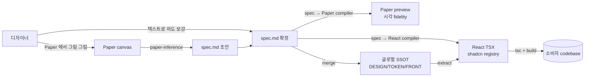

# gen-design Handbook

> **살아있는 핸드북** — 본 프로젝트의 *지금 이 순간* 의 진실. 매 phase 종료 시 갱신.
> **버전**: phase-7 ship 시점 (2026-05-10).
> **읽는 순서**: §1 → §2 → §3 → §4 (5분 안에 *왜* + *무엇* 파악) → §5-§7 (구체 룰 + 도구) → §8 (history).
> **이 문서만 읽고도** 신규 디자이너가 첫 spec.md 작성까지 도달 가능해야 함 — 그게 self-contained 의 의미.

---

## §1 한 줄 요약 + 시각

> **gen-design** = 디자이너가 spec markdown 으로 의도를 적으면, Paper 에서 시각화되고 React (shadcn + Tailwind) 코드로 *결정적으로* 컴파일되는, designer-publisher 페어 도구.

핵심 흐름:



**4 축 어휘 정합** — 본 프로젝트의 *real & defensible* 차별화 portion:

```
[디자이너 작성]   spec.md 의 <Component variant="x">
        ≡
[Paper 시각]      Paper 노드 이름 + 컴포넌트 인스턴스
        ≡
[React 출력]      shadcn/ui 컴포넌트 + 프로젝트 composites
        ≡
[LLM 학습]        shadcn 이름은 LLM 훈련 데이터에 풍부
```

위 4 축이 *같은 어휘로 통일* 되어 있어 *결정적 변환* 이 수학적으로 가능. (시장에서 본 프로젝트만)

---

## §2 Glossary

### SSOT 4 문서 + 2 디렉토리

| 이름 | 위치 | 역할 |
|---|---|---|
| **DESIGN.md** | `templates/DESIGN.md` | 페이지 / 화면 구조 + 인터랙션 명세. Stitch 0.1 superset. *narrative + 결정 근거*. |
| **TOKEN.md** | `templates/TOKEN.md` | 토큰 narrative + `tokens.json` (DTCG 1.0 strict) 결정 근거. |
| **FRONT.md** | `templates/FRONT.md` | *컴파일 룰북* + 3-tier 어휘 카탈로그 narrative + Paper 매핑 + shadcn 관리 룰. |
| **spec.md** | `spec/<x>.spec.md` | DESIGN.md 의 *machine-readable instance* — 한 페이지/컴포넌트의 spec.md grammar (peggy parser) 인스턴스. |
| **assets/** | `templates/assets/` | 이미지 / 폰트 / 아이콘 / `tokens/tokens.json` (binary + machine-readable). |
| **spec/** | `spec/` | spec.md fixture 디렉토리. 28 fixture (phase-7 ship 시점). |

> *결정*: 위 6 가 *모든 입력의 SSOT*. studio React 코드 / Paper 캔버스 / 빌드 결과물 모두 이 SSOT *파생*.

### 어휘 Tier (3-tier)

| Tier | 정의 | 예시 | 어디서 정의 |
|---|---|---|---|
| **Tier 1** | ARIA 1.3 roles (시맨틱) | `button`, `dialog`, `menu`, ... 93 개 | `studio/src/lib/vocabulary/tier1-aria.ts` |
| **Tier 2** | shadcn UI primitives | `Button` (현재 1 개, phase-7 ship 시점) | `studio/src/components/ui/` (lowercase 파일) |
| **Tier 3** | 본 프로젝트 composites + templates | `LoginForm`, `DashboardPage`, ... 27 개 | `studio/src/components/{composites,templates}/` (PascalCase 파일) |

**합계**: 28 컴포넌트 (Tier 2: 1 + Tier 3: 27). catalog 진실 = `studio/src/lib/vocabulary/catalog/catalog.json`.

### Variant L1-L4 (ADR-004 D-3)

| Layer | 의미 | 예시 |
|---|---|---|
| **L1 named** | cva variants 의 *첫 axis* | `variant=primary`, `variant=secondary` |
| **L2 multi-axis** | cva 의 *2+ axis* | `size=md`, `tone=warning` |
| **L3 theme** | brand-a / brand-b CSS `data-theme` | `<html data-theme="brand-b">` |
| **L4 prop** | 동적 prop / state | `disabled={isLoading}` |

### Canonical / Round-trip

- **Canonical 표기**: paper-normalizer 가 정의 — `oklch()` ↔ hex, `rgba()` ↔ 8-digit hex, `padding: 16` ↔ `paddingBlock: 16; paddingInline: 16`. 같은 의미를 *한 가지* 표기로 정규화.
- **Round-trip**: spec.md → Paper → spec.md 순환 시 *동일* 산출. canonical 의 보장 조건.

---

## §3 아키텍처 매트릭스 — 정보의 위치

> 매 정보 종류마다 *글로벌* / *스펙로컬* / *혼합* 결정. ADR-008 가 *디렉토리 컬럼* 결정 (옵션 B = 글로벌 직접 편집).
>
> *변경 슬라이스* 의 시각화는 PR diff 가 담당. spec dir 안에 design 슬라이스 파일은 *생성 안 함*.

| 정보 종류 | 진실의 위치 (글로벌) | 변경 슬라이스 표현 | 비고 |
|---|---|---|---|
| **DESIGN.md 본문** (페이지/화면 narrative) | `templates/DESIGN.md` | PR diff | spec PR 마다 해당 섹션만 갱신 |
| **TOKEN.md 토큰** | `templates/TOKEN.md` + `templates/assets/tokens/tokens.json` | PR diff | DTCG 1.0 strict 형식 |
| **FRONT.md 매핑/룰** | `templates/FRONT.md` | PR diff | 어휘 추가 / shadcn 룰 / 4 layer variant 운영 |
| **spec.md 컴포넌트 정의** | `spec/<x>.spec.md` | 신규 파일 또는 diff | 28 fixture (phase-7 시점) |
| **assets** (이미지/폰트/아이콘) | `templates/assets/` | binary diff | git LFS 없음 — 작은 자산만 |
| **catalog (machine-readable)** | `studio/src/lib/vocabulary/catalog/catalog.json` | 자동 생성 (cva extractor) | *수동 편집 금지* — 컴포넌트 코드 변경이 진실 |
| **variants 정의** | 각 컴포넌트의 `cva()` 코드 | studio 코드 diff | catalog 추출 시 자동 반영 |
| **결정 (ADR)** | `docs/decisions/ADR-NNN-{slug}.md` | 신규 파일 | 한 결정 = 한 ADR. 영구 기록 |

### 디렉토리 결정 (ADR-008)

- spec dir (`specs/spec-X-Y-{slug}/`) 안에는 **spec.md / plan.md / task.md / walkthrough.md / pr_description.md** 만.
- design 슬라이스 파일 (DESIGN.md / FRONT.md / TOKEN.md / assets/) 은 *생성하지 않음*.
- *변경 슬라이스의 시각적 표현* = PR diff 자체.
- Reconsider trigger (ADR-008 D-4): 분기당 3+ 글로벌 머지 충돌 / alpha 3+ 명 피드백 / spec 의 design 변경 단위 다양화.

---

## §4 디자이너 일주일 워크플로 — Profile Page 추가 시나리오

> 신규 디자이너가 `<ProfilePage>` 페이지를 추가하는 *5 일 시나리오*. handbook §3 매트릭스 + ADR-006 (Paper-first) 기반.

### Day 1 — Paper 에서 그림 그리기

```
1. Studio 의 Paper preview 패널 열기
2. 기존 LoginPage / DashboardPage 의 Paper 트리를 참조 (좌측 file list)
3. Profile Page 의 *시각적 의도* 를 Paper 캔버스에 자유 배치
   - Avatar 영역 (원형 이미지 + edit 버튼)
   - 사용자 정보 카드 (이름 / 이메일 / 가입일)
   - 활동 통계 (Stat × 3)
   - 액션 버튼 (편집 / 로그아웃)
4. Paper 노드명을 *shadcn 어휘* 로 명명 (LoginForm / StatCard / Button)
   → catalog 안 등재된 컴포넌트 이름과 *exact match*
```

**산출물**: Paper 트리 (저장 시 `tree.json` 으로 export 가능).

### Day 2 — `paper-inference` 로 spec.md 초안 추출

```bash
pnpm --filter studio paper-to-spec /tmp/profile-page.tree.json --output spec/profile-page.spec.md
```

`inferSpec` 알고리즘이:
- Paper 노드명 → catalog Tier 2/3 매칭 (90%+ 신뢰도 시 confident)
- variant axis (이미 cva 정의) → spec.md 의 `variant=...` 속성으로 회복
- 미매칭 노드 → `[unknown]` 마크

**산출물**: `spec/profile-page.spec.md` 초안 (30 줄 정도).

### Day 3 — spec.md 확정 + Paper preview 검증

1. Studio 의 spec editor 패널에서 `profile-page.spec.md` 열기
2. `[unknown]` / `[low confidence]` 항목 직접 보정 — catalog 의 정확한 컴포넌트 이름으로 교체
3. i18n placeholder 추가 — `{{i18n.ko.profile.title}}` 형태
4. token placeholder 추가 — `{{token.spacing.section}}` 형태
5. **Paper preview 패널** 에서 `compileToPaper` 결과 확인 — 의도와 시각 결과 fidelity 검토
6. **React preview 패널** 에서 `compileToReact` 결과 확인 — 출력 TSX 의 구조

**산출물**: 완성된 `spec/profile-page.spec.md` + `templates/DESIGN.md` 의 §11 (페이지 트리) 에 Profile Page 항목 추가.

### Day 4 — i18n + 토큰 narrative 정리

1. `templates/TOKEN.md` 에 신규 토큰 추가 시 — 결정 근거 narrative 작성 (예: "Profile 통계 카드 간격은 spacing.md 가 적합").
2. 신규 토큰은 `templates/assets/tokens/tokens.json` 에 DTCG 형식으로 추가 → studio 가 자동으로 CSS 변수 빌드.
3. `templates/FRONT.md` 의 §2 어휘 카탈로그에 신규 컴포넌트 사용 entry 추가 (LoginForm, StatCard 등의 *Profile Page 컨텍스트* 사용 사례).
4. `templates/assets/i18n/ko.json` 에 새 키 추가 — `profile.title` / `profile.edit` 등.

### Day 5 — 검증 + 통합

1. **`gen-design lint`** (phase-8 도입 후) — catalog ↔ DESIGN/FRONT/spec.md 정합 검증.
2. `cd studio && pnpm test` — 28-fixture 결정성 + ts-diagnose 모두 PASS.
3. `pnpm --filter studio build` → exit 0.
4. PR 생성 — base = 다음 phase 의 base branch.
   - PR diff = *내가 추가/변경한 글로벌 SSOT 슬라이스* (ADR-008 옵션 B 의 현현).
5. 리뷰어가 PR diff 로 *Profile Page 의 의도* 를 한눈에 파악.

---

<!-- §5-§8 추가 예정 — Task 5-6 에서 -->
