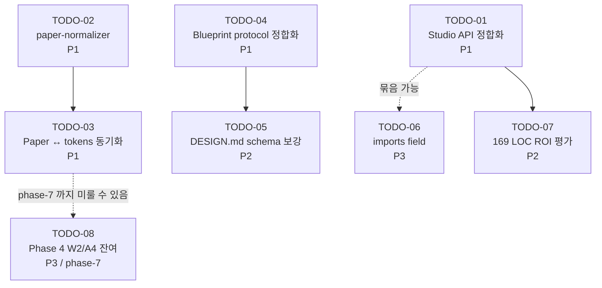

# Phase-5 PoC 파이프라인 회고

> 작성: 2026-05-05 / 작성자: Dennis + Agent (Opus 4.7) / 입력 spec: spec-5-01 ~ spec-5-04 + phase-4 부채 (W2/W4/C4/A4)
> 본 문서는 phase-5 의 누적 발견을 정리하여 phase-6 (Studio v1) 의 입력으로 제공한다.

---

## §0. 메타

### 0.1 입력 산출물 인덱스

본 회고가 인용하는 phase-5 산출물 일람. 모든 인용은 아래 파일들에서 확인 가능.

| 출처 ID | 경로 | 역할 |
|---|---|---|
| `S1-WALK` | `specs/spec-5-01-app-a-blueprint/walkthrough.md` | spec-5-01 (Blueprint) 진행 기록 |
| `S2-WALK` | `specs/spec-5-02-app-a-paper-design/walkthrough.md` | spec-5-02 (Paper 시안) 진행 기록 |
| `S2-DRIFT` | `poc/app-a/drift-report.md` | Paper 시안 ↔ DESIGN.md drift 측정 |
| `S2-FIND` | `poc/app-a/findings.md` | F-01 ~ F-10 발견 카탈로그 (spec-5-01/02 누적) |
| `S3-WALK` | `specs/spec-5-03-app-a-react-impl/walkthrough.md` | spec-5-03 (React 구현) 진행 기록 |
| `S3-VIS` | `poc/app-a/visual-comparison.md` | Paper ↔ React 시각 비교 |
| `S4-WALK` | `specs/spec-5-04-app-b-reusability/walkthrough.md` | spec-5-04 (앱 B 재사용성) 진행 기록 |
| `S4-REUSE` | `poc/app-b/reuse-report.md` | LOC + hardcode + 토큰 차이 측정 |
| `P4-DEBT` | `backlog/queue.md` (icebox 섹션) | phase-4 회고 부채 W2/W4/C4/A4 |

### 0.2 검증 방식

- 모든 카탈로그 항목 (§2) 은 위 출처에서 인용. 추측 / 일반론 없음.
- LOC / 측정 수치는 phase-5 spec 의 산출물 인용 — 새 측정 없음.
- 출처 컬럼은 grep 으로 spot-check 가능.

### 0.3 phase-5 success criteria 충족 현황

| # | 기준 | 결과 | 근거 |
|---|---|---|---|
| 1 | 앱 A 의 Blueprint → DESIGN.md → Paper → React 전 과정 완주 | ✅ | spec-5-01 ~ spec-5-03 모두 Merged |
| 2 | 앱 B 가 토큰/i18n 만 교체로 부팅 | ✅ | spec-5-04 Merged, S4-WALK |
| 3 | 앱 A↔B 공유 코드 비율 80%+ | ✅ | S4-REUSE §1.3 — 코드 87.1%, 데이터 포함 79.8% |
| 4 | 디자인 시안 ↔ React 시각 일치도 검증 | ✅ | S3-VIS — 토큰 미적용 0 건 |

---

## §1. 단계별 회고 표

> 각 단계별 "잘된 점 / 깨진 점 / 다음 액션" 컬럼.
> Foundation / Token / Page Template / Blueprint / 협업 Flow 5 단계.

### 1.1 Foundation (pnpm workspace + vite + tooling)

| 잘된 점 | 깨진 점 | 다음 액션 |
|---|---|---|
| pnpm workspace 3-package 구조 (`studio` + `poc/app-a` + `poc/app-b`) — 새 앱 추가 시 1 줄 등록 (S4-WALK Task 1) | studio 의 `@/` self-reference alias 가 across-package import 에서 약함 — vite alias array + regex 로 우회 (S3-WALK §발견) | studio 가 Node `imports` field (`#components/*`) 사용 검토 — phase-6 todo 후보 |
| vite 8 + React 19 + Tailwind 4 + base-ui + react-router 7 stack 통합 PASS, 빌드 시간 < 200ms | studio source 가 다른 패키지 컨텍스트에서 contextual type 손실 (`(next) => ...` 의 implicit any) — explicit `(next: boolean)` 으로 명시 (S3-WALK) | TS strict mode + cross-package usage 시 contextual type 보전 가이드라인 정립 |
| TDD Red/Green 패턴 + One Task = One Commit 모두 phase-5 4 spec 에서 엄격 준수 (phase-4 W4 부채 absorb) | 자동 visual regression 미도입 — Paper PNG ↔ React PNG 비교는 사람 눈만 (S3-WALK §발견 9~10) | Playwright + paper-mcp screenshot 으로 자동화 평가 (phase-6) |
| `pnpm -r build` / `pnpm -r test` 단일 명령으로 monorepo 전체 검증 — studio 115 + app-a 5 + app-b 5 (S4-WALK §3.1) | Paper MCP `get_screenshot` 이 base64 응답 — 디스크 저장 ad-hoc (S3-WALK §발견) | paper-mcp 자체 개선 또는 wrapper 유틸 — phase-6 todo |

### 1.2 Token (DTCG + style-dictionary 5 + CSS 변수)

| 잘된 점 | 깨진 점 | 다음 액션 |
|---|---|---|
| `tokens.json` (DTCG) → style-dictionary → `_tokens.css` → React `@theme inline` 자동 파이프라인 구축 (S3-WALK Task 5, S4-WALK Task 3) | Paper ↔ tokens.json 양방향 동기화 부재 — 디자이너가 hex 손으로 옮겨 적음 (회고 자체 발견) | paper-tokens-sync 도구 평가 — phase-6 todo (ROI 큼) |
| `pnpm --filter app-X tokens` 1 명령으로 토큰 변경 즉시 반영 — color-only 변경으로 새 제품 부팅 검증 (S4-REUSE §3.3) | Sidebar `w-56` (224px) vs Paper 240px — 16px magic number, 토큰화 안 됨 (S3-WALK §발견) | studio Sidebar width 토큰화 (`--sidebar-width`) — phase-6 todo |
| 50 토큰 중 13 만 변경 (color 만, 26%) 으로 다른 브랜드 부팅 — radius/spacing/font/elevation 100% 보존 (S4-REUSE §3) | `bg-background` 가 `#FFFFFF` 인데 Paper 는 page ground `#F8FAFC` (surface-alt) — 토큰 매핑 미흡 (S3-WALK §발견) | `body { @apply bg-surface-alt }` 매핑 — phase-6 todo |
| `--radius-sm` 자체 참조 같은 사용처 없는 dead code 는 있으나 빌드 영향 없음 (Task 3 검증) | DESIGN.md → tokens.json 수동 transcribe — hex / size / shadow 모두 손으로 (F-02, F-08) | `paper-normalizer` 라이브러리 단독 spec 으로 promote (F-08) — phase-6 P1 |

### 1.3 Page Template (12 composites + 3 templates + texts props)

| 잘된 점 | 깨진 점 | 다음 액션 |
|---|---|---|
| `texts` props pattern 으로 i18n 격리 — 컴포넌트 코드 변경 0 으로 한국어/영어 모두 가능 (S4-WALK §3.4) | studio MyPage / SettingsPage 의 `appName = "TaskFlow"` 기본값 hardcode 2 건 (S4-REUSE §2) | default 제거 → required prop 으로 강제 (phase-6 P1) |
| 12 composites + 3 templates (LoginPage / SignupPage / DashboardPage / MyPage / SettingsPage / ErrorPage) Phase 2 산출물 그대로 재활용 | DashboardPage `ActivityRowData` 의 의미 모델 drift — user/action (Phase 2) vs task/assignee (DESIGN.md, app-a/b) (S3-WALK §발견 + S3-VIS) | `ActivityRowData` 의미 정합 또는 generic 4-column 으로 명시 (phase-6) |
| spec-5-04 의 169 LOC (App.tsx/main.tsx/useTexts/login/signup/error) 가 app-a/b 사이 사실상 동일 — 추출 가능 신호 (S4-REUSE §1.2) | `SocialAuthBlock` 4 props 인터페이스가 앱 별 provider 셋 표현에 어색 — `providers: Array<{provider, label}>` 가 더 generic (S3-WALK §발견) | SocialAuthBlock providers 배열 patterned API — phase-6 |
| ErrorPage / SettingsPage / MyPage 신규 추가 (spec-5-03) — 기존 4 페이지에서 부족한 form-heavy 컴포넌트 자극 | DESIGN.md §12 Composite 9 종 미정의 (BrandPanel / ProfileChip / DangerZone 등) — F-09 (S2-FIND) | DESIGN.md §12 보강 또는 schema 자체 개선 (phase-6) |

### 1.4 Blueprint (DESIGN.md SSOT + REQUIREMENTS.md)

| 잘된 점 | 깨진 점 | 다음 액션 |
|---|---|---|
| DESIGN.md 14 섹션 schema (visual-theme / color / typography / spacing / radius / shadow / icon / motion / state / page-map / page-spec / composite / token-map / i18n-key) 가 안정적으로 유지됨 (S1-WALK) | DESIGN.md placeholder 가 Blueprint 출력만으로는 채워지지 않음 — 50%+ placeholder 가 디자인 도구 추출에 의존 (F-02) | DESIGN.md 를 `DESIGN.intent.md` + `DESIGN.visual.md` 로 분할 검토 (phase-6) |
| REQUIREMENTS.md 의 페이지 카탈로그 + Template 매핑이 spec-5-03 React 구현 단계 입력으로 즉시 활용됨 | `route` / `layout` 기본값 규칙은 있으나 출력 YAML 키 부재 — fail-fast 와 충돌 (F-03) | Step 3 출력 YAML 에 `finalPages[].route/layout` 명시 필드 추가 (phase-6) |
| Blueprint protocol 의 Step 1 / 1.5 / 2 / 3 모두 spec-5-01 에서 실측 (F-01 모순 발견 직후 즉시 보강) | spec.md 가 protocol Step 1.5 (NFR) 누락 — F-01 (S2-FIND) | spec 템플릿에 protocol 단계 체크리스트 추가 (phase-6) |
| DESIGN.md §14 i18n 키 모델 — page.section.element.property hierarchy 가 73 키 1:1 영/한 매핑에 충분 (S4-REUSE §4) | i18n 키 모델이 flat 카피 — 추출 결과 70+ 새 키 (helper / value / action) 발견, 4-part hierarchy 로 확장 필요 — F-10 | i18n schema 4-part `{page}.{section}.{element}.{slot}` 확장 (phase-6) |

### 1.5 협업 Flow (Paper MCP + DESIGN.md + AI 에이전트)

| 잘된 점 | 깨진 점 | 다음 액션 |
|---|---|---|
| Paper artboard 5 페이지 작성 → design-extract MD 5 본 추출 → DESIGN.md TODO 채우기 → React 구현 4 단계 사이클 완주 (S2-WALK + S3-WALK) | Paper ↔ tokens 단방향 — tokens.json 변경 시 Paper artboard 자동 갱신 안 됨 (회고 자체 발견) | paper-tokens-sync 또는 Paper Variable 자동 업데이트 평가 (phase-6 P1 후보) |
| Paper → DESIGN.md → tokens.json → React 의 단방향 흐름은 자동화 잘 됨 (style-dictionary 부분만 자동, 나머지는 사람) | Paper 시안 ↔ DESIGN.md 사이 표기 정규화 (hex alpha / padding / lineHeight / font fallback / border) ad-hoc — F-08 | `paper-normalizer` 라이브러리 단독 spec — phase-6 P1 |
| 의도 보존 사이클 검증 — Designer 가 직접 그린 Settings 페이지 → AI 추출 → DESIGN.md 보강 → React 구현 (drift 측정 가능) (S2-WALK + S2-DRIFT) | Phase 2 Template 의 PoC 재사용/복제 정책 부재 — F-07 (S2-FIND) | phase-5.md / phase-6.md 에 Template 활용 정책 명시 |
| Phase 4 의 6 단계 프로토콜 중 Stage 3 Blueprint / Stage 4 Compose 는 PoC 에 흡수 측정 (P4-DEBT W2 partial) | Stage 5 (review) / Stage 6 (handoff) 는 미측정 — phase-4 W2 부채 부분 잔존 | phase-6 또는 phase-7 에서 Stage 5/6 측정 spec 검토 |

---

## §2. 발견사항 카탈로그

> hardcode / drift / gap / duplication / 도구 한계 누적.
> 출처는 §0.1 인덱스의 ID + 파일/라인. 우선순위 P1/P2/P3 의 근거는 1 줄.

### 2.1 카탈로그 (12 항목)

| # | 출처 | 분류 | 위치 | 영향 | 권장 액션 | 우선순위 (근거) |
|---|---|---|---|---|---|---|
| **C-01** | S4-REUSE §2 | hardcode | `studio/src/components/templates/MyPage/index.tsx:23` `appName = "TaskFlow"` | app-b 가 prop 누락 시 사이드바에 "TaskFlow" 누수 | default 제거 → required prop | **P1** (다른 제품 누수 즉발 위험) |
| **C-02** | S4-REUSE §2 | hardcode | `studio/src/components/templates/SettingsPage/index.tsx:34` `appName = "TaskFlow"` | C-01 과 동일 (SettingsPage 사이드바) | C-01 과 동일 | **P1** (C-01 과 한 spec 으로 묶음) |
| **C-03** | S4-REUSE §1.2 / §1.3 | duplication | `poc/app-a/src/{App,main}.tsx`, `useTexts.ts`, `pages/{login,signup,error}.tsx` 와 `poc/app-b/` 의 동일 위치 — 169 LOC 사실상 동일 | 새 앱 추가 시 169 LOC 복제 의무 — N 앱이면 169 × N | shared template 또는 codegen 추출 — ROI 평가 후 결정 | **P2** (현재 N=2, ROI 모호; N=3 시 재평가) |
| **C-04** | S3-WALK §발견 / S3-VIS | drift | `studio/src/components/molecules/ActivityTable/types.ts` 의 `ActivityRowData` (user/action/status/time) vs `poc/app-a/DESIGN.md §14` (task/assignee/status/updated) | 같은 4-column 구조의 의미 모델 차이 — 데이터 매핑 시 매번 인지 부담 | generic 4-column 으로 명시 + 의미는 앱별 i18n 라벨에 위임 | **P2** (운영 영향 작지만 학습 곡선) |
| **C-05** | S3-WALK §발견 | hardcode | `studio/src/components/organisms/Sidebar/index.tsx` `w-56` (224px) vs Paper 240px | 16 px magic number — 토큰 미적용 | `--sidebar-width` 토큰 또는 prop | **P3** (시각 영향 작음) |
| **C-06** | S3-WALK §발견 | hardcode | `poc/app-a/src/index.css` `body { @apply bg-background }` (`#FFFFFF`) vs Paper page ground `#F8FAFC` (surface-alt) | Paper 와 page background 불일치 — 시각적 단조로움 | `body { @apply bg-surface-alt }` 매핑 | **P3** (시각 영향 작음, 토큰 매핑 1 줄) |
| **C-07** | S3-WALK §발견 / S2-FIND F-08 | gap | Paper export / DESIGN.md ↔ React/CSS 표기 차이 5 카테고리 (hex alpha / padding / lineHeight / font fallback / border) | 매번 ad-hoc 변환 — 일관성 / 유지보수 부담 | `paper-normalizer` 라이브러리 단독 spec | **P1** (phase-6 의 핵심 자동화 입력) |
| **C-08** | S2-FIND F-09 | gap | DESIGN.md §12 Composite 9 종 미정의 (BrandPanel / Checkbox / ProfileChip / ProgressBar / OutlineDangerButton / AvatarUploadCard / SettingsInfoRow / SettingsActionRow / DangerZone) | spec-5-03 React 구현 시 ad-hoc 컴포넌트 생성 위험 (실제 발생) | DESIGN.md §12 schema + 9 종 정의 | **P2** (다음 PoC 또는 phase-6 입력) |
| **C-09** | S2-FIND F-10 | gap | DESIGN.md §14 i18n 키 모델이 flat — 추출 결과 70+ 새 키 (helper/value/action) 발견 | 슬롯 단위 매핑 규칙 부재 → 한국어 i18n 추가 시 인적 부담 (실제 spec-5-04 에서 73 키 손 매핑) | i18n schema 4-part `{page}.{section}.{element}.{slot}` + slot enum | **P2** (앱 N=3 시 부담 가중) |
| **C-10** | S2-FIND F-01 ~ F-07 | gap (protocol) | `schema/blueprint-protocol.md`, `templates/{DESIGN,REQUIREMENTS,AGENT}.md.template`, `schema/page-catalog.md` | Blueprint 작성 시 매번 ad-hoc 결정 (NFR 누락 / 어휘 불일치 / 빈 배열 처리 등) | F-01~F-07 의 처리 제안을 phase-6 protocol 정합화 spec 으로 통합 | **P1** (phase-6 의 모든 Blueprint 작성 영향) |
| **C-11** | S3-WALK §발견 | gap | `studio/package.json` 의 export — `@/` self-reference + vite alias array regex 우회 | studio 가 다른 패키지에서 import 시 컨텍스트 부담 — 현재 우회 가능하나 이상적이지 않음 | Node `imports` field (`#components/*`) 표준 도입 | **P3** (현재 우회 동작, 마이그레이션 비용 있음) |
| **C-12** | 본 회고 자체 발견 / S3-WALK §발견 | gap (도구) | Paper MCP `get_screenshot` 응답 base64 + Paper ↔ tokens 단방향 동기화 부재 | 자동 visual regression 어려움 + 디자이너가 토큰 변경 시 Paper 시안 수동 갱신 | (1) screenshot disk-save wrapper, (2) paper-tokens-sync 평가 | **P1** (디자이너 비용 직격) |

### 2.2 분류 요약

| 분류 | 개수 | 항목 |
|---|---:|---|
| hardcode | 4 | C-01, C-02, C-05, C-06 |
| duplication | 1 | C-03 |
| drift | 1 | C-04 |
| gap (schema/protocol) | 4 | C-08, C-09, C-10, C-11 |
| gap (도구/자동화) | 2 | C-07, C-12 |
| **합계** | **12** | |

### 2.3 우선순위 분포

| 우선순위 | 개수 | 항목 |
|---|---:|---|
| **P1** | 5 | C-01, C-02, C-07, C-10, C-12 |
| **P2** | 4 | C-03, C-04, C-08, C-09 |
| **P3** | 3 | C-05, C-06, C-11 |
| **합계** | **12** | |

> P1 의 공통 특징: (a) 다른 제품/사용자에게 즉시 누수, (b) phase-6 자동화의 입력 또는 (c) 디자이너 작업 비용 직격.
> P3 는 시각/구조 영향이 작거나 현재 우회 동작 — 다음 phase 입력 정도.

---

## §3. Phase-6 todo 리스트

> §2 의 12 항목을 phase-6 단위 작업으로 묶고 ROI 추정.
> 각 todo 의 우선순위는 본 spec 의 *권장* — 최종 확정은 phase-6 alignment 시 사용자 결정.

### 3.1 todo 일람

#### **TODO-01: Studio API 정합화 (hardcode 제거 + drift 정리)**

- **포함 카탈로그 항목**: C-01, C-02, C-05, C-06 (4 hardcode)
- **동기**: studio 가 "다른 제품에 누수 없이 재사용 가능" 한 라이브러리가 되려면 모든 product-specific default 제거 필요. C-01/02 는 phase-6 시작 직후 즉시 해결되어야 함 (다음 PoC 가 또 다른 누수 발견하기 전에).
- **예상 산출물**: studio MyPage / SettingsPage 의 `appName` required, Sidebar `--sidebar-width` 토큰화, app-a body bg `surface-alt` 매핑
- **예상 spec 수**: 1 spec
- **의존성**: 없음 (즉시 시작 가능)
- **ROI 권장 우선순위**: **P1** — 변경 폭 작고, 다른 P1 자동화 (TODO-02/03) 의 전제 조건

#### **TODO-02: paper-normalizer 라이브러리 단독 spec**

- **포함 카탈로그 항목**: C-07 (F-08)
- **동기**: phase-6 의 자동 코드 생성에서 모든 Paper → React 변환이 동일 규칙으로 동작하려면 단일 함수 라이브러리 필수. F-08 의 5 카테고리 (`normalizeHexAlpha`, `normalizePadding`, `normalizeLineHeight`, `normalizeFontFallback`, `normalizeBorder`) 가 시드.
- **예상 산출물**: `studio/src/lib/paper-normalizer/` (5+ 함수 + 단위 테스트), spec-5-02 의 design-extract 5 파일을 회귀 fixture 로
- **예상 spec 수**: 1 spec
- **의존성**: 없음 (입력 fixture 는 spec-5-02 산출물이 이미 있음)
- **ROI 권장 우선순위**: **P1** — phase-6 의 다른 자동화 (TODO-04, TODO-05) 의 빌딩 블록

#### **TODO-03: Paper ↔ tokens 자동 동기화 평가**

- **포함 카탈로그 항목**: C-12 (단방향성 + screenshot 도구 한계)
- **동기**: 현재 tokens.json → React 만 자동, Paper 시안은 수동 갱신. 새 브랜드 / 토큰 변경 시 디자이너 비용 직격 (회고 §1.5). 평가 결과에 따라 phase-7 으로 미룰 수 있음.
- **예상 산출물**: 평가 보고서 (`docs/paper-tokens-sync-eval.md`) — Paper Variable API 실용성 + tokens.json → Paper 동기화 가능성. 가능하면 PoC 도구 1 개 작성.
- **예상 spec 수**: 1 spec (평가만) 또는 2 spec (평가 + PoC)
- **의존성**: TODO-02 (paper-normalizer) 가 일부 사용 가능 — 토큰 표기 정규화 공유
- **ROI 권장 우선순위**: **P1** — 디자이너 비용 직격, phase-7 의 협업 자동화 핵심

#### **TODO-04: Blueprint protocol 정합화**

- **포함 카탈로그 항목**: C-10 (F-01 ~ F-07)
- **동기**: 7 개 protocol gap (NFR 누락 / placeholder mismatch / route 기본값 / status 어휘 / optional 빈 배열 / Template 이름 유추 / Phase 2 활용 정책) 모두 다음 Blueprint 작성 시 ad-hoc 결정 부담. 한 번에 정합 처리.
- **예상 산출물**: `schema/blueprint-protocol.md` 개정 v2, `templates/*.template` 갱신, 새 Blueprint 작성 가이드
- **예상 spec 수**: 1 ~ 2 spec (schema + template 개정)
- **의존성**: 없음 (다음 PoC 또는 production app 작성 전에 완료되어야 가치)
- **ROI 권장 우선순위**: **P1** — 다음 모든 Blueprint 작성에 효과 누적

#### **TODO-05: DESIGN.md schema 보강 (§12 Composite + §14 i18n 4-part)**

- **포함 카탈로그 항목**: C-08, C-09 (F-09, F-10)
- **동기**: §12 Composite 9 종 미정의 → React 구현 시 ad-hoc 컴포넌트 / §14 flat i18n → 슬롯 매핑 인적 부담. 두 schema 변경은 모두 DESIGN.md 본문 영향이 커서 묶어 처리.
- **예상 산출물**: `templates/DESIGN.md.template` v2, 9 종 Composite 정의 부록, i18n slot enum
- **예상 spec 수**: 1 spec
- **의존성**: TODO-04 와 일부 중첩 (template 개정) — 함께 또는 직후
- **ROI 권장 우선순위**: **P2** — 영향은 크나 즉발 위험 없음 (현재 ad-hoc 으로 동작)

#### **TODO-06: studio API 모듈 경계 (Node imports field)**

- **포함 카탈로그 항목**: C-11
- **동기**: studio `@/` self-reference 가 across-package import 에 약함. 현재 vite alias array regex 로 우회 가능하나 이상적이지 않음. 새 PoC 추가 시 동일 우회 반복 부담.
- **예상 산출물**: `studio/package.json` `imports` field 추가, alias 우회 코드 제거, 가이드 갱신
- **예상 spec 수**: 1 spec
- **의존성**: TODO-01 과 함께 처리 가능 (studio 변경)
- **ROI 권장 우선순위**: **P3** — 현재 우회 동작, 마이그레이션 비용 있음. TODO-01 묶을 때만 P2 격상

#### **TODO-07: 169 LOC 중복 ROI 평가**

- **포함 카탈로그 항목**: C-03
- **동기**: app-a/b 의 169 LOC 동일 — 추출 가치 / 비용 평가. 현재 N=2 라 ROI 모호하나, N=3 시 506 LOC 가 됨. 평가만 본 todo 에서, 추출 자체는 결과에 따라.
- **예상 산출물**: `docs/duplication-roi-eval.md` 또는 phase-6 의 spec 형태로
- **예상 spec 수**: 1 spec (평가 + 권장)
- **의존성**: TODO-01 (`appName` required) 완료 후 — required prop 패턴이 추출 가능 형태에 영향
- **ROI 권장 우선순위**: **P2** — 즉발 위험 없으나 N 증가 시 부담 가중

#### **TODO-08: Phase 4 W2/A4 잔여 측정**

- **포함 카탈로그 항목**: 없음 (phase-4 부채 §4 평결 결과 입력)
- **동기**: phase-4 W2 의 Stage 5/6 (review/handoff) 미측정 + A4 critique 미실행 잔존. phase-6 또는 phase-7 에서 측정 spec 으로 처리.
- **예상 산출물**: phase-6 또는 phase-7 의 1 spec (측정 보고서)
- **예상 spec 수**: 0 (이번 phase-6 가 아닌 후속 phase) — 본 todo 는 *기록* 용
- **의존성**: phase-6 의 협업 자동화 (TODO-03 등) 완료 후
- **ROI 권장 우선순위**: **P3** — phase-7 후보로 보존

### 3.2 의존 관계 그래프

### 3.3 phase-6 권장 진행 순서

**1 차 라운드 (P1 묶음, 약 4 spec)**:
1. TODO-01 (studio API 정합화) — 즉시
2. TODO-02 (paper-normalizer) — TODO-01 과 병렬 가능
3. TODO-04 (Blueprint protocol) — TODO-02 와 병렬 가능
4. TODO-03 (Paper ↔ tokens 동기화 평가) — TODO-02 산출물 활용

**2 차 라운드 (P2, 1~2 spec)**:
5. TODO-05 (DESIGN.md schema) — TODO-04 직후
6. TODO-07 (169 LOC ROI) — TODO-01 직후

**phase-7 보존 (P3)**:
7. TODO-06 (imports field) — TODO-01 묶음 시 동시 처리 가능
8. TODO-08 (W2/A4 잔여) — phase-7

---

## §4. Phase-4 회고 부채 평결

> W2/W4/C4/A4 각 항목에 phase-5 결과로 평결 (yes/absorbed/transformed/open).

(Task 5 에서 채움)

---

## 부록 A. 인용 인덱스 (citation map)

각 카탈로그 항목이 어떤 spec 의 어떤 파일에서 어떤 사실을 인용하는지 사전 매핑.
Task 3 작성 시 grep 검증을 위한 인덱스로 활용.

### A.1 spec-5-01 입력

- F-01 ~ F-07 (`gap`, `placeholder-mismatch`, `ambiguity`) → `S2-FIND` §F-01 ~ §F-07
  - F-01: protocol Step 1.5 (NFR) 누락
  - F-02: DESIGN.md placeholder 가 Blueprint 출력만으로 안 채워짐
  - F-03: route/layout 기본값 규칙 vs YAML 키 부재 충돌
  - F-04: Template status 어휘 3 종 불일치 (✅ / implemented / 구현 완료)
  - F-05: optionalSections 빈 배열 표시 규약 부재
  - F-06: 미구현 Template 이름 유추 규칙 없음
  - F-07: Phase 2 Template PoC 재사용/복제 정책 없음

### A.2 spec-5-02 입력

- F-08 ~ F-10 → `S2-FIND` §F-08 ~ §F-10
  - F-08: paper-normalizer 함수 5 카테고리 (color alpha / padding / lineHeight / font fallback / border)
  - F-09: DESIGN.md §12 Composite 9 종 미정의
  - F-10: i18n 키 모델 확장 (flat 카피 → 구조화 슬롯)
- Paper ↔ DESIGN.md drift → `S2-DRIFT`
- 5 페이지 design-extract → `poc/app-a/design-extract/{auth-login,auth-signup,dash-overview,profile-mypage,settings-overview}.md`

### A.3 spec-5-03 입력

- `S3-WALK §발견 사항`:
  - SocialAuthBlock 4 props 인터페이스의 generic 부족 (providers 배열로 개선 후보)
  - studio 의 `@/` self-reference alias 가 across-package import 에 약함 (Node `imports` field 후보)
  - Sidebar w-56 (224px) vs Paper 240px — 16px magic number, 토큰화 미흡
  - body bg `#FFFFFF` vs Paper page ground `#F8FAFC` — `bg-surface-alt` 매핑 후보
  - DashboardPage `ActivityRowData` 의 의미 모델 drift (user/action vs task/assignee)
  - Paper MCP `get_screenshot` 응답이 base64 — 디스크 저장 어려움 → visual regression 자동화 영향

### A.4 spec-5-04 입력

- `S4-REUSE §2`:
  - H-1: `studio/src/components/templates/MyPage/index.tsx:23` `appName = "TaskFlow"` 기본값
  - H-2: `studio/src/components/templates/SettingsPage/index.tsx:34` `appName = "TaskFlow"` 기본값
- `S4-REUSE §1.3`: 재사용 비율 87.1% (코드) / 79.8% (데이터 포함)
- `S4-REUSE §1.2`: 169 LOC 구조 동일 (App.tsx, main.tsx, useTexts.ts, login/signup/error)
- `S4-WALK §6 회고`:
  - studio 의 `texts` props pattern 정상 작동 (한국어/영어 모두)
  - 토큰 파이프라인 색 변경 격리 (50 중 13 만 변경)
  - vite alias array + regex 패턴 다른 패키지 재사용 잘 됨
- 본 spec 의 자체 발견 (spec-5-05 작성 중):
  - **Paper ↔ tokens 양방향 동기화 부재** — tokens.json → React 만 자동, Paper 는 끊겨 있음

### A.5 phase-4 부채 입력

`P4-DEBT` (`backlog/queue.md` icebox):
- W2: 6 단계 프로토콜 4 단계 미실측 (Stage 3/4 Phase 5 PoC 흡수 측정)
- W4: One Task = One Commit 위반 재발 방지 (spec-4-02 commit 2242e89 가 Task 4+5 통합)
- C4: phase-ship.md 템플릿 harness-kit 0.5.0 부재
- A4: critique 미실행 (spec-4-01/02/03 모두)

---

> Task 2~5 진행 시 §1~§4 채움.
> 본 문서는 spec-5-05 의 단일 산출물 — 분할하지 않음.
