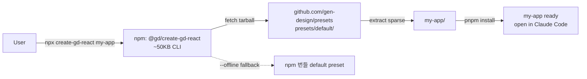

# spec-11-01: `create-gd-react` npm 패키지 + GitHub-hosted default preset

## 📋 메타

| 항목 | 값 |
|---|---|
| **Spec ID** | `spec-11-01` |
| **Phase** | `phase-11` |
| **Branch** | `spec-11-01-create-gd-react-scaffold` |
| **상태** | Planning |
| **타입** | Feature |
| **Integration Test Required** | yes |
| **작성일** | 2026-05-22 |
| **소유자** | dennis |

## 📋 배경 및 문제 정의

### 현재 상황

phase-11 전체 진입로의 *첫 단계*. 현재 새 사용자 (디자이너) 가 gen-design 을 처음 만나면:

- `git clone gen-design` → 거대한 monorepo 진입 → 어디서 시작할지 모름
- `studio/` 는 *우리가 개발하는 도구* 이지 *사용자의 React 프로젝트* 가 아님
- `npm install` 만으로 동작하는 sample 프로젝트 부재
- handbook.md 가 길어서 *5분 안에* "내 React 프로젝트 만들어줘" 가 안 됨

### 문제점

- 진입 마찰이 *너무 크다*. 디자이너 1인 alpha 도 어려운 상태
- 우리가 *고정 surface (shadcn / Tailwind / cn / cva / FRONT.md)* 라고 정한 것들이 실제로는 *그들이 셋업* 해야 함 — 약속 위반
- React stack 결정 (state / http / router / sentry / env / pre-check / i18n / form / test) 이 산재 → 일관된 적용 불가

### 해결 방안 (요약)

`npx create-gd-react <name>` 한 줄로 *모든 결정이 박힌 React 프로젝트* 가 생성. npm package 는 가볍게 (fetcher), 실제 템플릿은 GitHub preset repo (`gen-design/presets`) 에서 fetch. 첫 phase 는 `default` preset (Vite + React 19 + shadcn + 모든 stack) 1종만 publish.

## 📊 아키텍처

## 🎯 요구사항

### Functional Requirements

1. `npx create-gd-react <name>` 실행 → `<name>` 디렉토리 생성 → GitHub preset fetch → 후처리 → `pnpm install` 완료
2. `--preset <name>` 옵션 지원 (기본값 `default`) — preset repo 의 `presets/<name>/` 추출
3. `--offline` 옵션 — 네트워크 미사용, npm package 안 fallback default preset 사용
4. `--no-install` 옵션 — `pnpm install` 건너뜀 (CI / 빠른 검증)
5. 후처리: `package.json` `name` 치환, `README.md` `{{project-name}}` placeholder 치환, `.gd/memory/MEMORY.md` 초기 인덱스 생성
6. 네트워크 실패 시 친절한 한국어 안내: "github.com 접근 불가 — `--offline` 로 재시도하세요"
7. 이미 존재하는 디렉토리에 대한 동작: 비어있지 않으면 `--force` 없이는 거부
8. preset repo (`gen-design/presets`) 의 `presets/default/` 가 다음을 포함:
   - `package.json` (Vite 7 + React 19 + 모든 stack deps — phase-11.md §🎨 명세 그대로)
   - `vite.config.ts`, `tsconfig.json`, `tsconfig.app.json`, `tsconfig.node.json`
   - `tailwind.config.ts`, `postcss.config.js`, `components.json`
   - `src/main.tsx`, `src/router.tsx`, `src/scenes/welcome.tsx` (sample), `src/components/ui/` (shadcn 기본 5종: button, card, input, label, separator), `src/lib/utils.ts`, `src/lib/sentry.ts`, `src/lib/logger.ts`, `src/api/client.ts`, `src/config/env.ts`, `src/i18n/index.ts` + locales, `src/styles/globals.css`
   - `chats/_shell.chat.md`, `chats/scenes/welcome.chat.md`
   - `templates/FRONT.md`, `templates/DESIGN.md`, `templates/TOKEN.md`, `templates/assets/tokens/tokens.json`
   - `.claude/skills/gd-{start,chat,token,design}.md` (4종 — 본 spec 은 placeholder, 실제 본문은 spec-11-02)
   - `.gd/memory/MEMORY.md` (인덱스 placeholder)
   - `.gitignore` (`node_modules`, `dist`, `.env.local` 등)
   - `lefthook.yml` (pre-commit / pre-push)
   - `.eslintrc.cjs` (flat config 형식, eslint 9), `.prettierrc.json`
   - `README.md` (phase-11.md §scaffold README.md 구성 그대로)

### Non-Functional Requirements

1. `npx create-gd-react` CLI 코드 자체는 *외부 의존성 최소* (kleur / prompts 정도만, ~50KB 압축)
2. preset fetch: GitHub tarball 직접 다운로드 + tar 추출 — git clone 의존 X
3. 후처리는 *idempotent* — 같은 디렉토리 재실행 가능 (force 시)
4. 첫 실행 → ready 까지 *5초* (preset fetch + 후처리만, install 제외)
5. preset repo 의 `default/` 가 단독으로 `pnpm install && pnpm dev` 가능해야 함 (no extra step)

## 🚫 Out of Scope

- 추가 preset (`saas-dashboard`, `landing`) — 이번 phase 는 `default` 만
- `@gd/cli` 분리 publish — preset 의 devDep 으로 *기존 studio repo* 의 코드를 일단 *vendored copy* 로 사용 (실 분리는 phase-12 후보)
- `.claude/skills/` 본문 (spec-11-02 의 일)
- `gd doctor` 구현 (spec-11-03 의 일)
- npm publish 자체 (이번 spec 은 *local 검증* 까지 — 실 publish 는 phase-11 끝에서 사용자 승인 후)
- `--preset next-app-router` (phase-12 후보)

## 📑 ADR 후보

- [x] ADR 가치 있는 결정 있음 → 후보 한 줄 요약: `ADR-011-create-gd-react-stack` (type: decision — Vite + React 19 + zustand + jotai + TanStack Query + ky + Sentry + consola + @env-kit + lefthook + react-i18next + react-hook-form + zod 등 React stack 일괄 고정)
- [ ] 없음

## ✅ Definition of Done

- [ ] `packages/create-gd-react/` npm 패키지 코드 작성 + 단위 테스트
- [ ] preset repo `gen-design/presets` 신규 + `presets/default/` 전체 콘텐츠 commit
- [ ] 로컬 `npm link` 또는 `pnpm pack` 으로 `npx <tarball> my-test` 동작 검증 (수동)
- [ ] 통합 테스트: `node packages/create-gd-react/dist/cli.js test-output --offline` → `test-output/` 가 `pnpm install && pnpm typecheck && pnpm build` 통과
- [ ] `--offline` fallback 동작 확인
- [ ] 네트워크 실패 시뮬레이션 (`HARNESS_OFFLINE_TEST=1`) — 친절한 오류 메시지 확인
- [ ] `walkthrough.md` 와 `pr_description.md` 작성 및 ship commit
- [ ] `spec-11-01-create-gd-react-scaffold` 브랜치 push 완료
- [ ] 사용자 검토 요청 알림 완료
