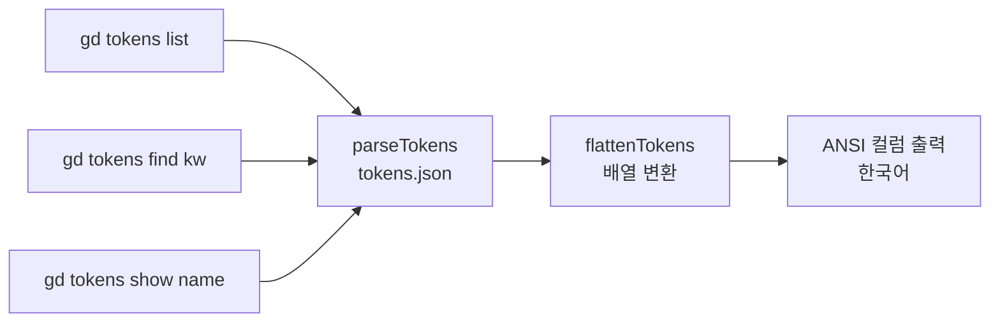

# spec-12-03: gd tokens 조회 명령

## 📋 메타

| 항목 | 값 |
|---|---|
| **Spec ID** | `spec-12-03` |
| **Phase** | `phase-12` |
| **Branch** | `spec-12-03-gd-tokens-query` |
| **상태** | Planning |
| **타입** | Feature |
| **Integration Test Required** | no |
| **작성일** | 2026-05-23 |
| **소유자** | dennis |

## 📋 배경 및 문제 정의

### 현재 상황

`tokens.json` (DTCG 형식, 35 토큰 — color 29 / radius 3 / fontFamily 3) 이 preset 에 존재하며, `gd doctor` 가 내부적으로 파싱해 토큰 정합을 검증한다. 그러나 디자이너가 "지금 어떤 토큰이 있는가?" 를 직접 조회할 CLI 진입점이 없다.

### 문제점

- 디자이너가 chat.md 를 작성할 때 토큰 이름을 외워야 함 (v4 retro #2)
- `gd-chat.md` §5.5 checklist 3단계(토큰 후보 확인)를 수행할 도구가 없어 대화 깊이 강화의 실효성이 낮아짐
- light/dark 값을 나란히 확인할 방법이 없어 다크모드 색상 검토 불편

### 해결 방안 (요약)

`gd tokens` 서브명령 3종 (`list` / `find` / `show`) 을 `packages/gd-cli/` 에 추가한다. tokens.json 을 DTCG 형식으로 파싱해 ANSI 정렬 컬럼 + 한국어 출력 (doctor 와 동일 패턴) 으로 표시한다.

## 📊 개념도

## 🎯 요구사항

### Functional Requirements

1. **`gd tokens list`** — 전체 토큰 카테고리별 목록. 토큰마다: 이름 / type / light 값 / dark 값 / 설명.
2. **`gd tokens list --category <color|radius|fontFamily>`** — 특정 카테고리만 필터 출력.
3. **`gd tokens find <keyword>`** — 이름 또는 `$description` 에 keyword 포함 시 매칭 행 출력.
4. **`gd tokens show <name>`** — 단일 토큰 상세: CSS 변수명(`--name`) / light / dark / type / 설명.
5. **`--tokens-root <path>`** — tokens.json 탐색 기준 경로 지정 (기본: `templates/assets/tokens`).
6. **`--help`** — 각 서브명령 사용법 출력.
7. **종료 코드**: 0 (성공) / 1 (파싱 실패·이름 없음) / 2 (사용법 위반).
8. **토큰 수 ≥ 24** 출력 보장 (phase-12 성공 기준).

### Non-Functional Requirements

1. 출력 언어: 한국어 (doctor 와 동일 패턴).
2. ANSI 색상: `NO_COLOR` 또는 non-TTY 환경에서 자동 off (`process.stdout.isTTY`).
3. 추가 외부 의존성 없음 — Node.js 내장(`fs`, `path`) 만 사용.
4. 기존 명령 (`react`, `doctor`, `lint` 등) regression 없음.

## 🚫 Out of Scope

- tokens.json 편집 / 토큰 추가 CLI
- CSS 변수 렌더링 미리보기
- 프로젝트 커스텀 확장 토큰 섹션 분리 (→ 필요 시 후속)
- gd-chat.md 내 자동 토큰 추천 (→ spec-12-04 대상)

## 📑 ADR 후보

- [x] 없음

## ✅ Definition of Done

- [ ] 단위 테스트 PASS (`cd packages/gd-cli && pnpm test`)
- [ ] `gd tokens list` 출력 토큰 수 ≥ 35
- [ ] `gd tokens find primary` → `primary` / `primary-foreground` 포함 출력
- [ ] `gd tokens show background` → light/dark/type/description 모두 출력
- [ ] 기존 테스트 (186 PASS) regression 없음
- [ ] `walkthrough.md` 와 `pr_description.md` 작성 및 ship commit
- [ ] `spec-12-03-gd-tokens-query` 브랜치 push 완료
- [ ] 사용자 검토 요청 알림 완료
