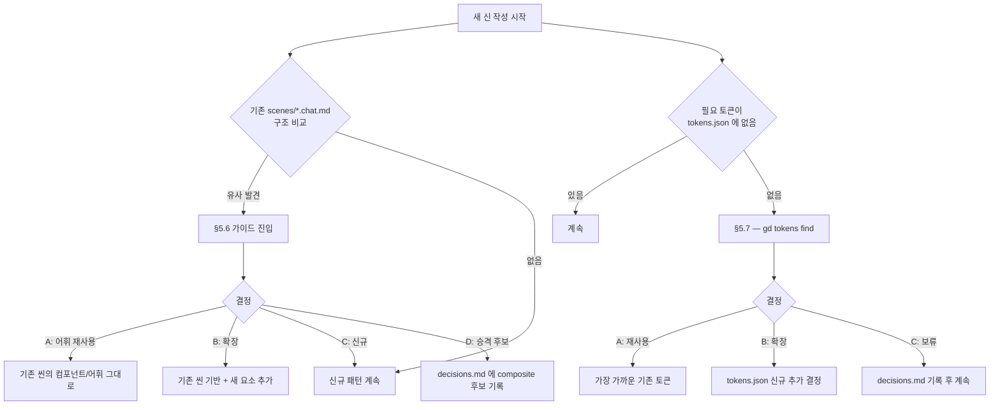

# spec-12-04: 비슷한 화면 발견 + 토큰 재사용 vs 확장 결정 가이드

## 📋 메타

| 항목 | 값 |
|---|---|
| **Spec ID** | `spec-12-04` |
| **Phase** | `phase-12` |
| **Branch** | `spec-12-04-similar-scenes-and-token-reuse` |
| **상태** | Planning |
| **타입** | Feature |
| **Integration Test Required** | no |
| **작성일** | 2026-05-23 |
| **소유자** | dennis |

## 📋 배경 및 문제 정의

### 현재 상황

`gd-chat.md` §5.5 checklist 3단계에 "비슷한 화면 발견 → 어휘 재사용 안내" 라는 한 줄이 있으나, 구체적인 탐지 기준·비교 방법·결정 가이드가 없다. 토큰 재사용 vs 확장 결정 역시 언급만 있고 결정 흐름이 정의되어 있지 않다.

v5 시뮬레이션에서 StatCard가 3→4회 등장해 자연스럽게 decisions.md 에 기록됐으나, 이 과정이 *에이전트 재량* 에 의존했다 — 다른 에이전트나 다른 세션에서는 놓칠 수 있다.

### 문제점

- "비슷한 화면" 탐지 기준 없음 → 에이전트마다 다른 행동
- 토큰이 부족할 때 "재사용 / 확장 / 보류" 중 어떤 기준으로 결정하는지 가이드 없음
- decisions.md 의 "재사용 vs 확장" 결정 entry 형식 미표준화 → phase-12 성공 기준 ≥1 entry 자동 생성 검증 불가

### 해결 방안 (요약)

`gd-chat.md` 에 두 섹션을 추가한다: §5.6 (비슷한 화면 발견 + 재사용/확장/신규/승격 4-옵션 결정 가이드) + §5.7 (토큰 재사용 vs 확장 결정 가이드, `gd tokens find` 연동). §10 decisions.md 패턴에 두 결정 유형의 entry 템플릿을 추가한다. §11/§12 도 맞춰 보강.

## 📊 개념도

## 🎯 요구사항

### Functional Requirements

1. **§5.6 비슷한 화면 발견 가이드** (NEW) — `gd-chat.md` 에 추가:
   - 탐지 기준: 기존 `chats/scenes/*.chat.md` 의 Structure 최상위 컴포넌트 + 주요 Form 필드 비교
   - 유사도 판정: 최상위 컴포넌트 동일 + Form 필드 ≥50% 겹침 → "유사 신 발견"
   - 4-옵션 결정 가이드: (A) 어휘 재사용 / (B) 확장 / (C) 신규 패턴 / (D) composite 승격 후보
   - decisions.md entry 자동 기록

2. **§5.7 토큰 재사용 vs 확장 결정 가이드** (NEW) — `gd-chat.md` 에 추가:
   - 트리거: Structure 작성 중 tokens.json 에 없는 색/반경/폰트 필요 시
   - `gd tokens find <keyword>` 로 후보 검색 안내
   - 3-옵션: (A) 가장 가까운 기존 토큰 재사용 / (B) tokens.json 확장 / (C) 보류 + decisions.md 기록

3. **§5.5 checklist 항목 3 강화** — §5.6 참조로 업데이트

4. **§10 decisions.md 패턴 보강** — 유사 신 결정 entry 템플릿 + 토큰 재사용 결정 entry 템플릿 추가

5. **§11 안티 패턴 추가**:
   - "기존 씬과 유사한데 비교 없이 신규 패턴 사용" → §5.6 강제
   - "토큰 없다고 바로 신규 정의" → §5.7 먼저

6. **§12 종료 조건 강화** — 5.6/5.7 체크 항목 추가

7. **v5 시뮬레이션 검증** — 새 씬(예: 계정 설정) 작성 시 §5.6·§5.7 가 실제로 동작하는지 확인, decisions.md entry ≥1 자동 생성

### Non-Functional Requirements

1. 기존 §5.5 flow 훼손 없음 (spec-12-02 변경 보존)
2. gd-chat.md 증가 분 ≤ 80 줄 (현재 402 → ≤ 482)
3. 추가 외부 의존성 없음 — `gd tokens find` 는 spec-12-03 에서 추가된 명령 활용

## 🚫 Out of Scope

- doctor CLI 에 "미결정 stuck 진단" 체크 추가 (→ spec-x 또는 후속)
- 자동 유사도 계산 알고리즘 (CLI/코드) — 에이전트가 직접 읽어서 비교
- tokens.json 실제 편집 자동화

## 📑 ADR 후보

- [x] 없음 — 스킬 문서 내부 결정, cross-spec 영향 없음

## ✅ Definition of Done

- [ ] `gd-chat.md` §5.6 / §5.7 추가, §5.5·§10·§11·§12 업데이트
- [ ] v5 시뮬 — 새 씬 작성 시 §5.6 유사 신 발견 flow 동작 확인
- [ ] v5 시뮬 — decisions.md 에 "재사용 vs 확장" entry ≥1 자동 기록 확인
- [ ] `gd-chat.md` 총 행수 ≤ 482
- [ ] `walkthrough.md` 와 `pr_description.md` 작성 및 ship commit
- [ ] `spec-12-04-similar-scenes-and-token-reuse` 브랜치 push 완료
- [ ] 사용자 검토 요청 알림 완료
