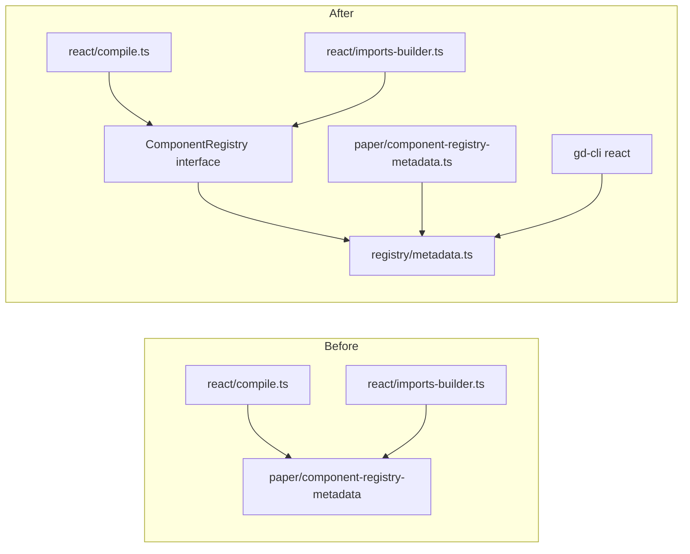

# spec-12-07: ComponentRegistry 플러그인 인터페이스 — react 컴파일러 paper 의존 분리

> ⚠️ **DEFERRED (구현 보류)** — 문서만 작성 완료, 구현 미착수.
> 재개 조건: 외부 alpha 커스텀 컴포넌트 요청 or npm 외부 publish 시 경로 문제 발생.
> icebox 참조: `backlog/queue.md` → "spec-12-07 이월" 섹션.

## 📋 메타

| 항목 | 값 |
|---|---|
| **Spec ID** | `spec-12-07` |
| **Phase** | `phase-12` |
| **Branch** | `spec-12-07-pluginarch` (미생성) |
| **상태** | **Deferred** |
| **타입** | Refactor |
| **Integration Test Required** | no |
| **작성일** | 2026-05-23 |
| **소유자** | dennis |

## 📋 배경 및 문제 정의

### 현재 상황

`studio/src/lib/chat-md-compiler/react/` 의 React 컴파일러가 두 파일에서 `paper/` 디렉토리를 직접 import 한다:

```
react/imports-builder.ts  → ../paper/component-registry-metadata (lookupImportPath)
react/compile.ts          → ../paper/component-registry-metadata (registeredNames)
```

`component-registry-metadata.ts` 자체는 순수한 문자열 매핑 (`Record<string, string>`) 으로 Paper 런타임 의존이 없다. 그러나 `paper/` 디렉토리 안에 위치함으로써 아키텍처 상 React 컴파일러 = Paper 의존처럼 보인다.

### 문제점

1. **디렉토리 결합**: 손으로 작성하는 디자이너 (Paper 미사용) 도 컴파일러가 `paper/` 모듈을 필요로 하는 것처럼 보인다 — 실제 실행엔 문제 없지만 아키텍처 의도가 불명확.
2. **테스트 불투명**: React 컴파일러 단위 테스트가 Paper 메타데이터에 묵시적으로 의존 — 다른 컴포넌트 셋으로 테스트하려면 파일을 건드려야 한다.
3. **확장 차단**: 향후 프로젝트별 컴포넌트 추가 (사용자 커스텀 컴포넌트) 나 다른 카탈로그 사용이 불가능.
4. **외부 publish 장벽**: `gd-cli` 가 외부 npm 패키지로 publish 될 때 `studio/src/lib/chat-md-compiler/paper/` 경로 의존이 남아 있으면 경로 해소 문제 발생.

### 해결 방안 (요약)

`ComponentRegistry` 인터페이스를 정의하고 `component-registry-metadata.ts` 를 `paper/` 외부(`registry/` 모듈)로 이동. React 컴파일러 함수들이 레지스트리를 매개변수로 받아 의존성 주입(DI) 방식으로 동작하도록 리팩터링. gd-cli `react` 커맨드가 기본 레지스트리를 주입. gd-start.md 에 디자인 도구 선택 단계 추가.

## 📊 개념도



## 🎯 요구사항

### Functional Requirements

1. `ComponentRegistry` 인터페이스 정의 — `lookupImportPath(name)` + `registeredNames()` 두 메서드
2. `studio/src/lib/chat-md-compiler/registry/` 신규 모듈 — 기존 메타데이터 이동 (`metadata.ts`)
3. `react/compile.ts` + `react/imports-builder.ts` — `ComponentRegistry` 를 매개변수로 받도록 시그니처 변경 (DI)
4. `paper/component-registry-metadata.ts` — `registry/metadata.ts` re-export 형태로 유지 (하위 호환)
5. `gd-cli react` 커맨드 — 기본 레지스트리를 `registry/metadata.ts` 에서 주입
6. 기존 React 컴파일러 테스트 — 커스텀 레지스트리로 동작 확인 케이스 추가
7. `gd-start.md` — §2 (도구 선택) 단계 추가: Paper / Figma / 손작성 분기 안내

### Non-Functional Requirements

1. 기존 API 하위 호환 — `compile(source, path)` 기본 시그니처 유지, 레지스트리는 선택적 3번째 매개변수
2. `pnpm test` 전체 Pass — 회귀 없음
3. `paper/component-registry-metadata.ts` 의 re-export 로 기존 `paper/` import 경로 계속 동작

## 🚫 Out of Scope

- 실제 npm 패키지 분리 (`@gd/chat-md-core`, `@gd/chat-md-react`, `@gd/chat-md-paper`) — 후속 phase
- Figma 어댑터 구현 — gd-start.md 안내만 추가, 실제 어댑터는 미구현
- 사용자 커스텀 컴포넌트 로딩 (`gd.config.ts`) — 후속 spec-x
- Paper MCP 커맨드 분리 (`gd paper-import`, `gd diff`) — 현재 파일 구조 그대로

## 📑 ADR 후보

- [x] ADR 가치 있는 결정 있음 → 후보: `ADR-010-component-registry-di` (type: decision) — React 컴파일러에 DI 패턴 도입, `paper/` 경계 명문화

## ✅ Definition of Done

- [ ] `ComponentRegistry` 인터페이스 정의 + `registry/metadata.ts` 이동
- [ ] `react/compile.ts`, `react/imports-builder.ts` 시그니처 변경 (DI, 하위 호환)
- [ ] `paper/component-registry-metadata.ts` re-export 유지
- [ ] 기존 + 신규 단위 테스트 전부 PASS (회귀 없음)
- [ ] `gd-start.md` §2 디자인 도구 선택 단계 추가
- [ ] `walkthrough.md` + `pr_description.md` ship commit
