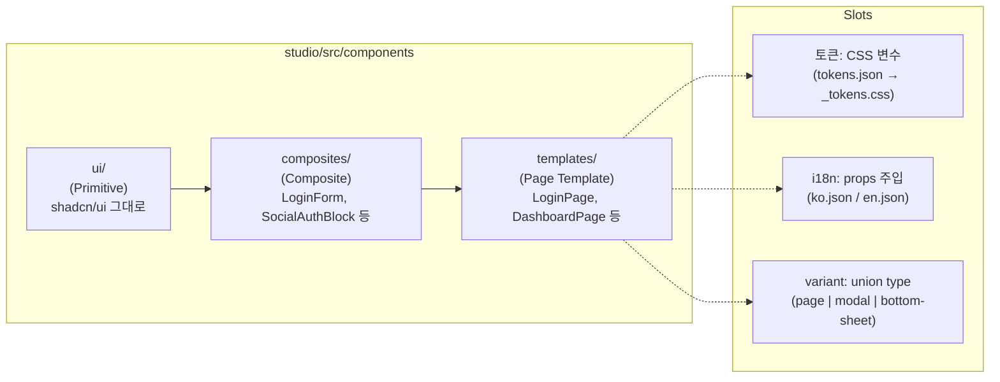

# Implementation Plan: spec-2-001

## 📋 Branch Strategy

- 신규 브랜치: `spec-2-001-page-template-arch`
- 시작 지점: `main`
- 첫 task가 브랜치 생성을 수행함

## 🛑 사용자 검토 필요 (User Review Required)

> [!IMPORTANT]
> - [ ] 디렉토리 구조: `ui/` (Primitive) → `composites/` (Composite) → `templates/` (Page Template) 3단 구조 채택
> - [ ] 슬롯 설계: 토큰은 CSS 변수(기존 파이프라인 활용), i18n은 props 주입, variant는 discriminated union 타입

> [!WARNING]
> - [ ] 기존 `App.tsx`의 하드코딩 LoginPage는 이 Spec에서 변경하지 않음 (spec-2-002에서 교체)

## 🎯 핵심 전략 (Core Strategy)

### 아키텍처 컨텍스트



### 주요 결정

| 컴포넌트 | 전략 | 이유 |
|:---:|:---|:---|
| **토큰 슬롯** | CSS 변수 (기존 파이프라인) | phase-1에서 구축한 `tokens.json → _tokens-*.css` 파이프라인을 그대로 활용. 런타임 교체는 CSS 클래스 전환으로 가능 |
| **i18n 슬롯** | Props 주입 (타입 안전) | 각 Template이 `texts` prop으로 i18n 객체를 받음. AI가 타입을 보고 올바른 텍스트를 생성할 수 있음 |
| **variant 슬롯** | Discriminated union | `variant: "page" \| "modal" \| "bottom-sheet"` — 같은 콘텐츠, 다른 레이아웃 래퍼 |
| **Headless UI** | shadcn/ui(Radix) 확정 | AI 학습 데이터 우위, Tailwind 네이티브 통합, 기존 셋업과의 연속성 → ADR-003 |
| **계층 네이밍** | Primitive / Composite / Page Template | Radix/shadcn 생태계 용어("Primitives")와 일관. Atomic Design(Atom/Molecule/Organism)은 Molecule↔Organism 경계가 모호하고, AI 학습 데이터에서 Primitive가 더 빈번. Composite로 중간 계층을 통합하여 판단 비용 제거 |

## 📂 Proposed Changes

### 아키텍처 문서

#### [NEW] `studio/src/components/ARCHITECTURE.md`
3계층 구조 설명, 각 계층 책임, 디렉토리 규칙, 슬롯 인터페이스 가이드

### 타입 정의

#### [NEW] `studio/src/components/templates/types.ts`
Page Template 공통 타입: `PageTemplateVariant`, `BaseTemplateProps`, 각 Template별 i18n 텍스트 타입

### 디렉토리 구조

#### [NEW] `studio/src/components/composites/` (디렉토리 생성)
Composite 컴포넌트 홈. 이 Spec에서는 빈 디렉토리 + `index.ts` (re-export용)

#### [NEW] `studio/src/components/templates/` (디렉토리 생성)
Page Template 홈. 이 Spec에서는 타입 정의만

### ADR

#### [NEW] `docs/decisions/ADR-003-headless-ui-selection.md`
shadcn/ui(Radix) 확정 결정문. 배경, 비교 기준, 결정 근거, 영향 범위

## 🧪 검증 계획 (Verification Plan)

### 단위 테스트 (필수)
```bash
cd studio && pnpm exec vitest run src/components/templates/types.test.ts
```

- TypeScript 타입 검증: `expectTypeOf` 로 슬롯 인터페이스 타입 안전성 확인
- variant union 타입 exhaustive check

### 수동 검증 시나리오
1. `pnpm build` 성공 — 타입 에러 없음
2. `ARCHITECTURE.md`에서 3계층 구조 + 슬롯 설명 확인
3. ADR-003 존재 및 결정 근거 충분성 확인

## 🔁 Rollback Plan

- 새로 추가된 파일/디렉토리만 삭제하면 원복 (기존 파일 수정 없음)
- `ui/` 디렉토리의 기존 shadcn/ui 컴포넌트는 일체 변경하지 않으므로 영향 없음

## 📦 Deliverables 체크

- [ ] task.md 작성 (다음 단계)
- [ ] 사용자 Plan Accept 받음
- [ ] (실행 후) 모든 task 완료
- [ ] (실행 후) walkthrough.md / pr_description.md archive
