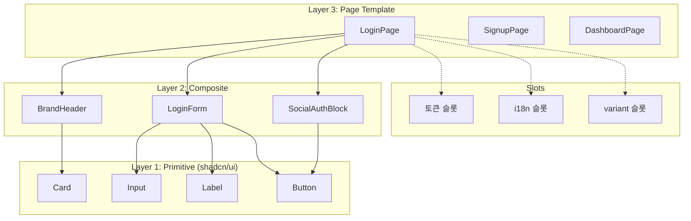

# spec-2-001: Page Template 3계층 아키텍처 설계

## 📋 메타

| 항목 | 값 |
|---|---|
| **Spec ID** | `spec-2-001` |
| **Phase** | `phase-2` |
| **Branch** | `spec-2-001-page-template-arch` |
| **상태** | Planning |
| **타입** | Feature |
| **Integration Test Required** | no |
| **작성일** | 2026-04-14 |
| **소유자** | Dennis |

## 📋 배경 및 문제 정의

### 현재 상황

phase-1에서 shadcn/ui + Tailwind v4 + 토큰 파이프라인을 셋업했다. 현재 `studio/src/components/ui/`에 shadcn/ui Primitive 컴포넌트(Button, Card, Dialog, Input, Label)가 존재하고, `App.tsx`에 LoginPage가 하드코딩되어 있다.

### 문제점

1. **계층 부재**: shadcn/ui는 Primitive(Button, Input)만 제공한다. 페이지 단위 재사용 컴포넌트(LoginPage, DashboardPage)를 매번 처음부터 조립해야 한다.
2. **슬롯 인터페이스 없음**: 현재 App.tsx의 LoginPage는 토큰, i18n, variant(page/modal)를 교체할 수 있는 구조가 아니다. 텍스트가 하드코딩되어 있고, 레이아웃이 고정되어 있다.
3. **AI 생성 가이드 부재**: AI가 Page Template을 생성할 때 따라야 할 구조적 규약이 없다.

### 해결 방안 (요약)

Primitive → Composite → Page Template 3계층 아키텍처를 설계하고, 각 계층의 책임·인터페이스·슬롯(토큰/i18n/variant)을 정의한다. ADR-003로 shadcn/ui(Radix) 확정 결정을 문서화한다.

## 📊 개념도

## 🎯 요구사항

### Functional Requirements

1. **3계층 구조 정의**: Primitive / Composite / Page Template 각 계층의 책임과 경계를 명확히 정의한다
2. **슬롯 인터페이스 설계**: 각 Page Template이 받아야 하는 3가지 슬롯(토큰, i18n, variant) 타입을 TypeScript 인터페이스로 정의한다
3. **디렉토리 컨벤션**: `studio/src/components/` 아래 계층별 디렉토리 구조를 확정한다
4. **ADR-003 작성**: shadcn/ui(Radix) 확정 결정과 그 근거(AI 친화성, 토큰 호환성, 생태계)를 문서화한다
5. **아키텍처 문서 작성**: 위 내용을 `studio/src/components/ARCHITECTURE.md`로 정리한다

### Non-Functional Requirements

1. 기존 shadcn/ui Primitive 컴포넌트(`ui/` 디렉토리)는 수정하지 않는다
2. TypeScript 인터페이스는 phase-2의 후속 Spec(002~004)에서 바로 사용할 수 있어야 한다
3. 설계는 AI 코드 생성에 최적화한다 — 명확한 네이밍, 예측 가능한 구조

## 🚫 Out of Scope

- 실제 Page Template 구현 (spec-2-002, spec-2-003에서 수행)
- 토큰/i18n 교체 동작 검증 (spec-2-004에서 수행)
- 라우팅, 상태 관리, API 연동

## ✅ Definition of Done

- [ ] 3계층 아키텍처 문서(`ARCHITECTURE.md`) 작성
- [ ] TypeScript 슬롯 인터페이스 타입 정의 (`types.ts`)
- [ ] 디렉토리 구조 생성 (빈 디렉토리 + index.ts)
- [ ] ADR-003 작성
- [ ] 단위 테스트 PASS (타입 검증)
- [ ] `walkthrough.md`와 `pr_description.md` 작성 및 archive commit
- [ ] `spec-2-001-page-template-arch` 브랜치 push 완료
- [ ] 사용자 검토 요청 알림 완료
