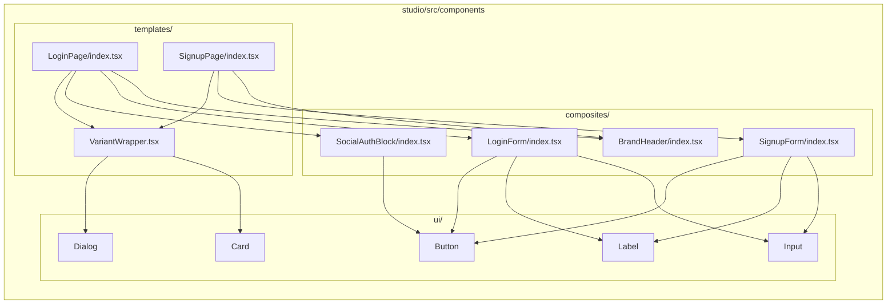

# Implementation Plan: spec-2-002

## 📋 Branch Strategy

- 신규 브랜치: `spec-2-002-auth-templates`
- 시작 지점: `main`
- 첫 task가 브랜치 생성을 수행함

## 🛑 사용자 검토 필요 (User Review Required)

> [!IMPORTANT]
> - [ ] i18n 헬퍼: `ko.json`의 중첩 구조를 `LoginPageTexts` flat 구조로 변환하는 매핑 함수 도입
> - [ ] `App.tsx` 교체: 기존 하드코딩 LoginPage → 새 LoginPage 컴포넌트로 교체

> [!WARNING]
> - [ ] Checkbox, Separator 등 추가 shadcn/ui Primitive가 필요할 수 있음 (shadcn CLI로 추가)

## 🎯 핵심 전략 (Core Strategy)

### 아키텍처 컨텍스트



### 주요 결정

| 컴포넌트 | 전략 | 이유 |
|:---:|:---|:---|
| **VariantWrapper** | variant별 레이아웃 래퍼 공용 컴포넌트 | `page`=Card 중앙 배치, `modal`=Dialog 래핑. 각 Template에서 중복 제거 |
| **i18n 매핑** | `lib/i18n.ts` 헬퍼 함수 | `ko.json` 중첩 구조 → `LoginPageTexts` flat 구조 변환. 타입 안전한 매핑 |
| **테스트** | vitest + @testing-library/react | 컴포넌트 렌더링 + 텍스트 표시 + variant 전환 검증 |

## 📂 Proposed Changes

### Composite 컴포넌트

#### [NEW] `studio/src/components/composites/BrandHeader/index.tsx`
앱 로고 + 제목 + 설명. 토큰 슬롯으로 브랜딩 교체 가능.

#### [NEW] `studio/src/components/composites/LoginForm/index.tsx`
이메일 + 비밀번호 입력 + 제출 버튼. texts prop으로 i18n.

#### [NEW] `studio/src/components/composites/SignupForm/index.tsx`
이름 + 이메일 + 비밀번호 + 비밀번호 확인 + 약관 동의 + 제출 버튼.

#### [NEW] `studio/src/components/composites/SocialAuthBlock/index.tsx`
소셜 로그인 버튼 그룹 (Google, Apple, Kakao). texts prop으로 레이블 교체.

### Page Template

#### [NEW] `studio/src/components/templates/VariantWrapper.tsx`
variant에 따라 Card(page) 또는 Dialog(modal) 래퍼를 적용.

#### [NEW] `studio/src/components/templates/LoginPage/index.tsx`
`LoginPageProps` 구현. BrandHeader + LoginForm + SocialAuthBlock + 링크 조합.

#### [NEW] `studio/src/components/templates/SignupPage/index.tsx`
`SignupPageProps` 구현. BrandHeader + SignupForm + 링크 조합.

### i18n 헬퍼

#### [NEW] `studio/src/lib/i18n.ts`
`ko.json`/`en.json` → `LoginPageTexts`/`SignupPageTexts` 변환 함수.

### App 교체

#### [MODIFY] `studio/src/App.tsx`
하드코딩 프로토타입 → `<LoginPage>` 컴포넌트 사용으로 교체.

## 🧪 검증 계획 (Verification Plan)

### 단위 테스트 (필수)
```bash
cd studio && pnpm exec vitest run
```

- LoginPage 렌더링: texts가 화면에 표시되는지
- SignupPage 렌더링: texts가 화면에 표시되는지
- variant 전환: page → Card 래퍼, modal → Dialog 래퍼
- i18n 헬퍼: ko/en JSON → flat texts 변환 정확성

### 수동 검증 시나리오
1. `pnpm dev` → LoginPage 표시, 기존 프로토타입과 시각적으로 동일
2. variant를 `modal`로 변경 → Dialog 내부 렌더링 확인
3. `pnpm build` → 타입 에러 없이 빌드 성공

## 🔁 Rollback Plan

- 새 파일 삭제 + `App.tsx` git restore로 원복
- 기존 `ui/` 컴포넌트는 수정하지 않으므로 영향 없음

## 📦 Deliverables 체크

- [ ] task.md 작성 (다음 단계)
- [ ] 사용자 Plan Accept 받음
- [ ] (실행 후) 모든 task 완료
- [ ] (실행 후) walkthrough.md / pr_description.md archive
