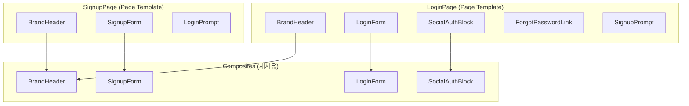

# spec-2-002: Auth 템플릿 구현 (LoginPage + SignupPage)

## 📋 메타

| 항목 | 값 |
|---|---|
| **Spec ID** | `spec-2-002` |
| **Phase** | `phase-2` |
| **Branch** | `spec-2-002-auth-templates` |
| **상태** | Planning |
| **타입** | Feature |
| **Integration Test Required** | no |
| **작성일** | 2026-04-14 |
| **소유자** | Dennis |

## 📋 배경 및 문제 정의

### 현재 상황

spec-2-001에서 3계층 아키텍처(Primitive → Composite → Page Template)와 슬롯 인터페이스(variant, i18n, token)를 설계했다. TypeScript 타입(`LoginPageProps`, `SignupPageProps`)이 정의되어 있고, i18n JSON(`ko.json`, `en.json`)에 login/signup 텍스트가 이미 존재한다. 현재 `App.tsx`에 하드코딩된 LoginPage 프로토타입이 있다.

### 문제점

1. **contract만 있고 구현이 없다**: `LoginPageProps` 타입은 있지만 이를 구현하는 컴포넌트가 없다.
2. **하드코딩된 프로토타입**: `App.tsx`의 LoginPage는 i18n, variant, 컴포넌트 분리가 안 되어 있다.
3. **Composite 계층 부재**: LoginForm, SocialAuthBlock 등 재사용 가능한 중간 컴포넌트가 없다.

### 해결 방안 (요약)

spec-2-001의 contract를 이행하는 LoginPage와 SignupPage를 구현한다. Composite 컴포넌트(LoginForm, SignupForm, SocialAuthBlock, BrandHeader)를 추출하고, i18n texts prop과 variant(page/modal) 슬롯을 적용한다.

## 📊 개념도

## 🎯 요구사항

### Functional Requirements

1. **LoginPage 구현**: `LoginPageProps` contract를 이행. `variant`(page/modal)와 `texts` prop 지원
2. **SignupPage 구현**: `SignupPageProps` contract를 이행. 동일 슬롯 지원
3. **Composite 추출**: BrandHeader, LoginForm, SignupForm, SocialAuthBlock 4개 Composite 컴포넌트
4. **i18n 연결**: 기존 `ko.json`/`en.json`에서 텍스트를 읽어 `texts` prop으로 전달하는 헬퍼
5. **variant 지원**: `page` (전체 화면 중앙 배치), `modal` (Dialog 내부 렌더링)
6. **App.tsx 교체**: 하드코딩 프로토타입을 LoginPage 컴포넌트로 교체

### Non-Functional Requirements

1. 기존 shadcn/ui Primitive(`ui/`)는 수정하지 않는다
2. 토큰 슬롯은 CSS 변수 기반 — 컴포넌트에서 Tailwind 유틸리티만 사용
3. 모든 텍스트는 `texts` prop 경유 — 하드코딩 금지

## 🚫 Out of Scope

- `bottom-sheet` variant (모바일 전용, phase-2 후반 또는 이후 phase에서)
- 폼 검증 로직 / 실제 인증 API 연동
- DashboardPage (spec-2-003에서)
- 토큰 교체 검증 (spec-2-004에서)
- 라우팅

## ✅ Definition of Done

- [ ] LoginPage 컴포넌트 렌더링 테스트 PASS
- [ ] SignupPage 컴포넌트 렌더링 테스트 PASS
- [ ] variant(page/modal) 전환 테스트 PASS
- [ ] i18n texts prop 주입 테스트 PASS
- [ ] `walkthrough.md`와 `pr_description.md` 작성 및 archive commit
- [ ] `spec-2-002-auth-templates` 브랜치 push 완료
- [ ] 사용자 검토 요청 알림 완료
