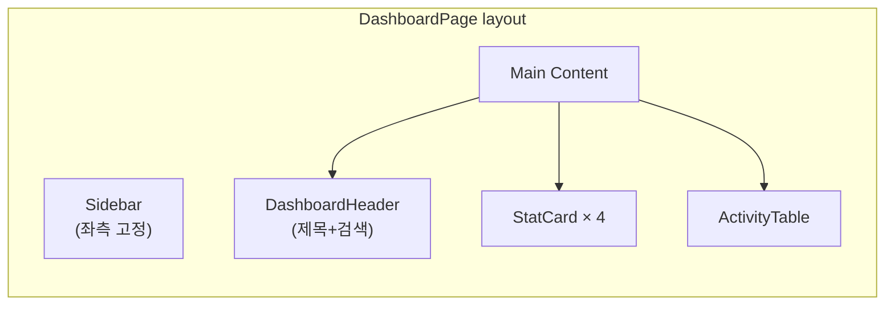

# Implementation Plan: spec-2-003

## 📋 Branch Strategy

- 신규 브랜치: `spec-2-003-dashboard-template`
- 시작 지점: `main`
- 첫 task가 브랜치 생성을 수행함

## 🛑 사용자 검토 필요 (User Review Required)

> [!IMPORTANT]
> - [ ] `DashboardPageTexts` 타입 확장 — 기존 4필드 → StatCard/nav/테이블 헤더 추가 (breaking change, 테스트 수정 필요)
> - [ ] Sidebar 컴포넌트: 단순 nav 리스트로 구현 (라우팅 미포함, 표현만)

> [!WARNING]
> - [ ] 기존 `types.test.ts`의 DashboardPageTexts 테스트가 타입 변경으로 실패할 수 있음 → 함께 수정

## 🎯 핵심 전략 (Core Strategy)

### 아키텍처 컨텍스트



### 주요 결정

| 컴포넌트 | 전략 | 이유 |
|:---:|:---|:---|
| **레이아웃** | Sidebar + Main (CSS Grid) | Paper 디자인이 사이드바 레이아웃. VariantWrapper는 사용하지 않음 — Dashboard는 Card 중앙 배치가 아님 |
| **StatCard** | Composite (Card 기반) | Paper: 라벨 + 큰 숫자 + 변동률. shadcn Card 재사용 |
| **ActivityTable** | Composite (HTML table) | Paper: 4컬럼 테이블. shadcn Table이 없으므로 직접 구현 |
| **Sidebar** | Composite (nav 리스트) | 라우팅 없이 표현만. 아이콘은 lucide-react |
| **데이터** | 정적 mock | 실제 API 연동은 scope 밖 |

## 📂 Proposed Changes

### 타입 확장

#### [MODIFY] `studio/src/components/templates/types.ts`
`DashboardPageTexts` 확장: nav 항목, stat 라벨, 테이블 헤더, 검색 placeholder 등

#### [MODIFY] `studio/src/components/templates/types.test.ts`
확장된 타입에 맞게 테스트 수정

### Composite 컴포넌트

#### [NEW] `studio/src/components/composites/Sidebar/index.tsx`
로고 + 네비게이션 리스트. texts prop으로 nav 항목 이름 주입

#### [NEW] `studio/src/components/composites/DashboardHeader/index.tsx`
페이지 제목 + 검색 input

#### [NEW] `studio/src/components/composites/StatCard/index.tsx`
라벨 + 값 + 변동률 (Card 기반)

#### [NEW] `studio/src/components/composites/ActivityTable/index.tsx`
유저 아바타 + 액션 + 상태 뱃지 + 시간

### Page Template

#### [NEW] `studio/src/components/templates/DashboardPage/index.tsx`
`DashboardPageProps` 구현. Sidebar + Main(Header + StatCards + ActivityTable) 조합

### i18n

#### [MODIFY] `studio/src/i18n/ko.json`, `en.json`
dashboard 섹션 확장: nav, stat 라벨, 테이블 헤더, 검색 등

#### [MODIFY] `studio/src/lib/i18n.ts`
`getDashboardPageTexts()` 헬퍼 추가

## 🧪 검증 계획 (Verification Plan)

### 단위 테스트 (필수)
```bash
cd studio && pnpm exec vitest run
```

- DashboardPage 렌더링: stat 카드 값/라벨 표시, 테이블 행 표시
- StatCard: 라벨 + 값 + 변동률 렌더링
- i18n 헬퍼: ko/en → DashboardPageTexts 변환

### 수동 검증 시나리오
1. `pnpm build` → 타입 에러 없이 빌드 성공
2. `pnpm dev` → DashboardPage 렌더링 확인 (사이드바 + stat cards + 테이블)

## 🔁 Rollback Plan

- 새 파일 삭제 + types.ts/i18n 변경 revert
- Auth 템플릿에 영향 없음

## 📦 Deliverables 체크

- [ ] task.md 작성 (다음 단계)
- [ ] 사용자 Plan Accept 받음
- [ ] (실행 후) 모든 task 완료
- [ ] (실행 후) walkthrough.md / pr_description.md archive
