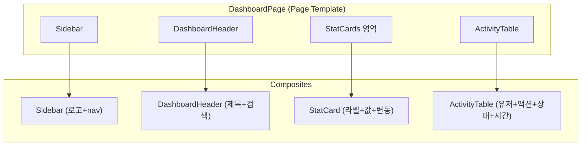

# spec-2-003: Dashboard 템플릿 구현

## 📋 메타

| 항목 | 값 |
|---|---|
| **Spec ID** | `spec-2-003` |
| **Phase** | `phase-2` |
| **Branch** | `spec-2-003-dashboard-template` |
| **상태** | Planning |
| **타입** | Feature |
| **Integration Test Required** | no |
| **작성일** | 2026-04-15 |
| **소유자** | Dennis |

## 📋 배경 및 문제 정의

### 현재 상황

spec-2-001에서 3계층 아키텍처와 슬롯 인터페이스를 설계하고, spec-2-002에서 Auth 템플릿(LoginPage, SignupPage)을 구현했다. `DashboardPageTexts` 타입이 정의되어 있으나 필드가 부족하다. Paper "Dashboard" 아트보드에 상세 디자인이 존재한다.

### 문제점

1. **DashboardPage 구현 없음**: 타입만 존재하고 실제 컴포넌트가 없다.
2. **DashboardPageTexts 부족**: 현재 4개 필드(title, welcomeMessage, overviewSection, recentActivitySection)만 있으나, Paper 디자인에는 StatCard 라벨, 네비게이션, 검색, 활동 테이블 헤더 등이 필요하다.
3. **사이드바 레이아웃 없음**: Auth 템플릿은 중앙 Card 레이아웃이지만, Dashboard는 사이드바 + 메인 콘텐츠 구조가 필요하다.

### 해결 방안 (요약)

Paper Dashboard 디자인을 참고하여 사이드바 레이아웃 + StatCard + Activity 테이블로 구성된 DashboardPage를 구현한다. `DashboardPageTexts` 타입을 확장하고, Composite 컴포넌트(Sidebar, StatCard, ActivityTable)를 추가한다.

## 📊 개념도

## 🎯 요구사항

### Functional Requirements

1. **DashboardPage 구현**: `DashboardPageProps` contract 이행. 사이드바 + 메인 콘텐츠 레이아웃
2. **DashboardPageTexts 확장**: StatCard 라벨, 네비게이션 항목, 활동 테이블 헤더 등 추가
3. **Composite 추가**: Sidebar, DashboardHeader, StatCard, ActivityTable
4. **i18n 연결**: `getDashboardPageTexts()` 헬퍼 + ko.json/en.json 확장
5. **variant 지원**: `page` (사이드바 포함 풀 레이아웃)

### Non-Functional Requirements

1. 기존 Primitive(`ui/`) 수정 금지
2. Auth 템플릿 기존 코드에 영향 없음
3. Paper "Dashboard" 아트보드의 구조를 따르되, 정확한 스타일 매칭은 spec-2-004에서

## 🚫 Out of Scope

- 실제 데이터 바인딩 / API 연동
- 라우팅 (Dashboard ↔ Login 전환)
- Paper 디자인과의 정확한 스타일 매칭 (spec-2-004에서)
- modal / bottom-sheet variant (Dashboard에는 불필요)

## ✅ Definition of Done

- [ ] DashboardPage 렌더링 테스트 PASS
- [ ] StatCard, ActivityTable 렌더링 테스트 PASS
- [ ] i18n texts prop 주입 테스트 PASS
- [ ] `walkthrough.md`와 `pr_description.md` 작성 및 archive commit
- [ ] `spec-2-003-dashboard-template` 브랜치 push 완료
- [ ] 사용자 검토 요청 알림 완료
