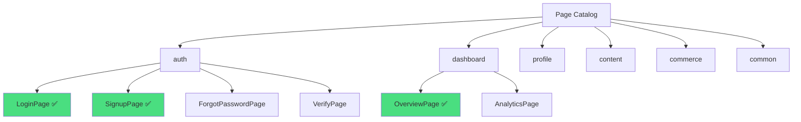

# spec-3-01: 페이지 카탈로그 정의

## 📋 메타

| 항목 | 값 |
|---|---|
| **Spec ID** | `spec-3-01` |
| **Phase** | `phase-3` |
| **Branch** | `spec-3-01-page-catalog` |
| **상태** | Planning |
| **타입** | Feature |
| **Integration Test Required** | no |
| **작성일** | 2026-04-17 |
| **소유자** | Dennis |

## 📋 배경 및 문제 정의

### 현재 상황

Phase 2에서 LoginPage, SignupPage, DashboardPage 3종의 Page Template과 3계층 아키텍처(Primitive → Composite → Page Template)가 완성되었다. 각 Template은 variant(page/modal/bottom-sheet), i18n, token 슬롯을 지원한다.

### 문제점

- 새 앱을 만들 때 "어떤 페이지가 필요한가?"에 대한 체계적 가이드가 없다
- 기존 3종 Template 외에 어떤 페이지 유형이 존재하는지 카탈로그화되어 있지 않다
- 앱 유형(SaaS, E-commerce, Social 등)별로 필요한 페이지 조합이 다르지만, 이를 참조할 문서가 없다
- AI 에이전트가 "이 앱에는 이런 페이지들이 필요합니다"라고 추천하려면 구조화된 카탈로그가 필수다

### 해결 방안 (요약)

앱에서 흔히 사용되는 페이지 유형을 카테고리별로 정리한 **Page Catalog** 문서를 만든다. 각 페이지에 variant, 필수/선택 섹션, 기존 Page Template 매핑 정보를 포함하여 Blueprint 질의서(spec-3-002)의 기초 데이터로 활용한다.

## 📊 개념도 (선택)

## 🎯 요구사항

### Functional Requirements

1. **카테고리 구조**: 최소 6개 카테고리(auth, dashboard, profile, content, commerce, common)로 페이지 유형을 분류한다
2. **페이지 항목**: 각 카테고리에 최소 2종 이상의 페이지를 정의한다
3. **variant 정의**: 각 페이지에 적용 가능한 variant(page/modal/bottom-sheet 등)를 2개 이상 명시한다
4. **섹션 구성**: 각 페이지의 필수 섹션(Composite 단위)과 선택 섹션을 정의한다
5. **Template 매핑**: Phase 2에서 구현된 Template(LoginPage, SignupPage, DashboardPage)이 카탈로그의 어느 항목에 대응하는지 명시한다
6. **앱 유형별 추천 세트**: SaaS, E-commerce, Social, Content, Utility 5개 앱 유형에 대해 권장 페이지 조합을 정의한다

### Non-Functional Requirements

1. 카탈로그는 Markdown 문서로 사람과 AI 모두 읽기 쉬운 구조여야 한다
2. 향후 spec-3-002(질의서)에서 프로그래밍적으로 참조 가능한 구조화된 형식이어야 한다
3. Phase 2의 ARCHITECTURE.md, types.ts와 용어/구조가 일관되어야 한다

## 🚫 Out of Scope

- 카탈로그에 정의된 새 페이지의 실제 코드 구현 (Phase 5 이후)
- Blueprint 질의서 프로토콜 설계 (spec-3-002)
- DESIGN.md/REQUIREMENTS.md 템플릿 작성 (spec-3-003)

## ✅ Definition of Done

- [ ] 6개 이상 카테고리, 각 2종 이상 페이지 정의
- [ ] 각 페이지에 variant 2개 이상, 필수/선택 섹션 정의
- [ ] 기존 Template 3종 매핑 완료
- [ ] 앱 유형별 추천 세트 5종 정의
- [ ] `walkthrough.md`와 `pr_description.md` 작성 및 ship commit
- [ ] `spec-3-01-page-catalog` 브랜치 push 완료
- [ ] 사용자 검토 요청 알림 완료
