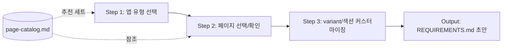

# spec-3-02: Blueprint 질의서 설계

## 📋 메타

| 항목 | 값 |
|---|---|
| **Spec ID** | `spec-3-02` |
| **Phase** | `phase-3` |
| **Branch** | `spec-3-02-blueprint-questionnaire` |
| **상태** | Planning |
| **타입** | Feature |
| **Integration Test Required** | no |
| **작성일** | 2026-04-17 |
| **소유자** | Dennis |

## 📋 배경 및 문제 정의

### 현재 상황

spec-3-01에서 6개 카테고리 18종 페이지 카탈로그(`schema/page-catalog.md`)가 완성되었다. 앱 유형별 추천 세트(SaaS, E-commerce, Social, Content, Utility)도 정의되었다.

### 문제점

- 카탈로그는 "전체 메뉴"일 뿐, 특정 앱에 맞는 페이지 조합을 선택하는 **프로세스**가 없다
- AI 에이전트가 사용자에게 체계적으로 질문하여 앱 요구사항을 도출하는 프로토콜이 없다
- 질의 결과를 REQUIREMENTS.md로 자동 구조화하는 명세가 없다

### 해결 방안 (요약)

앱 기획 시 AI 에이전트가 실행하는 **구조화된 질의서 프로토콜**을 설계한다. 앱 유형 선택 → 페이지 구성 → variant/섹션 커스터마이징 순서로 진행하며, 질의 결과가 REQUIREMENTS.md 초안으로 자동 변환되는 매핑 규칙을 정의한다.

## 📊 개념도 (선택)

## 🎯 요구사항

### Functional Requirements

1. **질의서 프로토콜 문서**: AI 에이전트가 따르는 단계별 질의 흐름을 정의한다
   - Step 1: 앱 유형 선택 (SaaS/E-commerce/Social/Content/Utility/Custom)
   - Step 2: 추천 페이지 세트 확인 + 추가/제거
   - Step 3: 각 선택된 페이지의 variant, 필수/선택 섹션 커스터마이징
2. **질의 응답 형식**: 각 단계의 질문, 선택지, 기본값을 구조화된 형식으로 정의한다
3. **REQUIREMENTS.md 매핑 규칙**: 질의 결과를 REQUIREMENTS.md 구조로 변환하는 규칙을 정의한다
   - 선택된 페이지 → Page Specifications 섹션
   - 선택된 variant → 각 페이지의 variant 속성
   - 선택된 섹션 → 각 페이지의 Component 구성
4. **Page Template 매핑 표 생성 규칙**: REQUIREMENTS.md의 페이지가 기존 Template에 매핑되는 표 자동 생성 규칙

### Non-Functional Requirements

1. 프로토콜은 Markdown 문서로, AI 에이전트가 시스템 프롬프트 또는 참조 문서로 사용할 수 있어야 한다
2. 질의서는 3단계 이내로 완료 가능해야 한다 (과도한 질문 방지)
3. page-catalog.md와 용어/ID 체계가 일관되어야 한다

## 🚫 Out of Scope

- REQUIREMENTS.md 템플릿 파일 자체 작성 (spec-3-003)
- DESIGN.md / AGENT.md 템플릿 작성 (spec-3-003)
- 질의서를 실행하는 코드 구현 (향후 Phase)
- i18n/tokens 리소스 분리 구조 (spec-3-003)

## ✅ Definition of Done

- [ ] 질의서 프로토콜 문서 완성 (3단계 구조)
- [ ] 각 단계의 질문/선택지/기본값 정의
- [ ] REQUIREMENTS.md 매핑 규칙 정의
- [ ] Page Template 매핑 표 생성 규칙 정의
- [ ] `walkthrough.md`와 `pr_description.md` 작성 및 ship commit
- [ ] `spec-3-02-blueprint-questionnaire` 브랜치 push 완료
- [ ] 사용자 검토 요청 알림 완료
