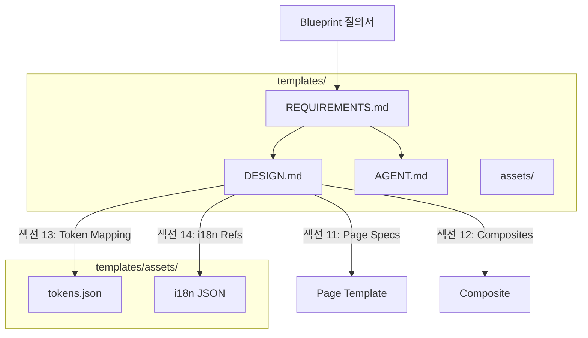

# spec-3-03: 산출물 템플릿 세트 + 리소스 분리

## 📋 메타

| 항목 | 값 |
|---|---|
| **Spec ID** | `spec-3-03` |
| **Phase** | `phase-3` |
| **Branch** | `spec-3-03-template-set` |
| **상태** | Planning |
| **타입** | Feature |
| **Integration Test Required** | no |
| **작성일** | 2026-04-19 |
| **소유자** | Dennis |

## 📋 배경 및 문제 정의

### 현재 상황

- spec-3-01에서 페이지 카탈로그(`schema/page-catalog.md`) 완성
- spec-3-02에서 Blueprint 질의서 프로토콜(`schema/blueprint-protocol.md`) 완성 — REQUIREMENTS.md 출력 구조 정의
- Phase 1에서 DESIGN.md extended schema(`schema/design-md-schema.md`) 정의 (14섹션)
- i18n 리소스가 `studio/src/i18n/`에, tokens가 `studio/tokens/`에 앱 종속 위치

### 문제점

1. **REQUIREMENTS.md 템플릿 부재**: Blueprint 질의서의 출력 규칙은 정의했지만, 실제 템플릿 파일이 없다
2. **AGENT.md 템플릿 부재**: AI 에이전트가 프로젝트에서 따라야 할 지침 템플릿이 없다
3. **DESIGN.md ↔ 컴포넌트 매핑 부재**: DESIGN.md의 섹션(11~14)이 Page Template의 어떤 컴포넌트/슬롯에 매핑되는지 명세가 없다
4. **리소스 앱 종속**: i18n/tokens가 studio 내부에 있어 다른 앱 생성 시 재사용 불가

### 해결 방안 (요약)

DESIGN.md, REQUIREMENTS.md, AGENT.md 3종 템플릿을 `templates/` 디렉토리에 완성하고, i18n/tokens 리소스를 `templates/assets/`로 분리하여 앱 간 재사용 가능한 구조를 만든다. 또한 DESIGN.md 확장 섹션(11~14)과 Page Template 컴포넌트/슬롯 간 매핑 명세를 추가한다.

## 📊 개념도 (선택)

## 🎯 요구사항

### Functional Requirements

1. **REQUIREMENTS.md 템플릿**: spec-3-02의 출력 구조를 기반으로 프로젝트 생성용 템플릿 파일 작성
2. **AGENT.md 템플릿**: AI 에이전트가 프로젝트에서 코드 생성 시 따라야 할 지침 템플릿 작성
3. **DESIGN.md ↔ Component 매핑 명세**: `schema/design-component-mapping.md`로 DESIGN.md 섹션 → Page Template 컴포넌트/슬롯 매핑 정의
4. **리소스 분리 구조 설계**: `templates/assets/` 디렉토리 구조 정의 (i18n JSON, tokens JSON, 이미지)
5. **studio 참조 구조**: studio가 `templates/assets/`를 참조하는 방식 문서화

### Non-Functional Requirements

1. 템플릿은 placeholder 형식으로, Blueprint 결과로 채울 수 있어야 한다
2. Phase 1의 design-md-schema.md와 정합성 유지
3. 매핑 명세는 AI가 DESIGN.md를 읽고 적절한 Template + 토큰 + i18n을 조합할 수 있을 만큼 구체적이어야 한다

## 🚫 Out of Scope

- studio 코드의 실제 import 경로 변경 (Phase 5+ 이후)
- 새 Page Template 코드 구현
- Blueprint 질의서를 실행하는 코드/CLI 구현

## ✅ Definition of Done

- [ ] REQUIREMENTS.md 템플릿 완성
- [ ] AGENT.md 템플릿 완성
- [ ] DESIGN.md ↔ Component 매핑 명세 완성
- [ ] `templates/assets/` 디렉토리 구조 정의
- [ ] `walkthrough.md`와 `pr_description.md` 작성 및 ship commit
- [ ] `spec-3-03-template-set` 브랜치 push 완료
- [ ] 사용자 검토 요청 알림 완료
