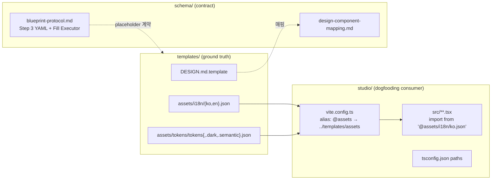

# Implementation Plan: spec-3-04

## 📋 Branch Strategy

- 신규 브랜치: `spec-3-04-ship-fixup`
- 시작 지점: `phase-3-app-blueprint` (phase base branch)
- 첫 task 가 브랜치 생성을 수행함
- PR 타겟: `phase-3-app-blueprint` (머지 시 PR #14 에 자동 반영됨)

## 🛑 사용자 검토 필요 (User Review Required)

> [!IMPORTANT]
> - [ ] **C2 이주 방식 = Vite alias `@assets` + tsconfig paths**. 크로스플랫폼 (Windows 관리자 권한 불필요), IDE/TS 타입체커 1급 지원, pnpm workspace/HMR/Docker 와 충돌 없음. 심볼릭 링크·빌드 복사 방식은 기각 — `templates/assets/README.md` 에 남은 3-옵션 나열도 본 spec 에서 함께 정리.
> - [ ] **C4 schema 정합 방향**: 템플릿 placeholder 를 기준으로 삼고 **질의서 출력 YAML 에 12개 필드를 추가** 하는 방향. 이유: placeholder 쪽을 제거하면 REQUIREMENTS.md 의 정보 밀도가 떨어짐. 질의서는 이미 사람이 답하는 구조이므로 필드 추가가 자연스러움.
> - [ ] **C3 변환 주체**: 기본은 **AI-direct-fill**, 보조로 Handlebars 도구 예시만 제공 (실제 스크립트 추가는 phase-5 PoC 로 이월).

> [!WARNING]
> - [ ] studio 빌드 설정 변경 (vite.config.ts) 이 수반됨 — `pnpm build` 검증 필수
> - [ ] `studio/src/i18n/*.json`, `studio/tokens/*.json` **원본 제거** — 롤백 시 git 복원만이 유일한 방법
> - [ ] PR #14 본문 직접 편집 (gh pr edit) — 이미 받은 승인 상태를 변경하므로 사용자 최종 확인 필요

## 🎯 핵심 전략 (Core Strategy)

### 아키텍처 컨텍스트



### 주요 결정

| 컴포넌트 | 전략 | 이유 |
|:---:|:---|:---|
| **C1 DESIGN.md.template** | Visual System / Component Stylings / Page Specifications / Design Tokens 4섹션 + LoginPage 예시 포함 | `design-component-mapping.md` §11~14 의 섹션 ID 와 1:1 대응. phase-4/5 에서 바로 채워 쓸 수 있는 구조 |
| **C2 이주 방식** | Vite alias `@assets` + tsconfig paths | 크로스플랫폼 / IDE·TS 1급 지원 / pnpm·HMR·Docker 충돌 없음. symlink·빌드 복사는 검토 후보에서 제외 |
| **C3 변환 주체** | AI-direct-fill 기본, Handlebars 예시 보조 | project_vision 의 "AI 가 끝까지 처리" 와 일치. 스크립트 도입은 PoC 단계에서 필요시 |
| **C4 정합 방향** | 질의서 YAML 에 12필드 추가 | 질의서 문항으로 자연스럽게 수집 가능. 템플릿 placeholder 제거는 정보 손실 |
| **부속 FR5** | `gh pr edit #14 --body-file` | PR body 만 편집. 리뷰 상태는 유지 |
| **부속 FR6** | `.harness-uninstall-backup-*` 디렉토리 삭제 + `.gitignore` 패턴 추가 | 한 번 정리 + 재발 방지 |

## 📂 Proposed Changes

### C1: DESIGN.md 템플릿

#### [NEW] `templates/DESIGN.md.template`
Blueprint 결과와 `design-component-mapping.md` §11~14 를 매핑하는 DESIGN.md 의 빈 템플릿.
- Section 1: **Visual System** — palette, typography, spacing scale
- Section 2: **Component Stylings** — 컴포넌트별 토큰 참조 표
- Section 3: **Page Specifications** — 페이지별 Section/Composite 조합 (LoginPage 예시)
- Section 4: **Design Tokens** — `templates/assets/tokens/` 참조 경로 명시
- 헤더에 `{{appName}}`, `{{defaultTheme}}` placeholder (C4 schema 와 정합)

### C2: Dogfooding

#### [NEW] `templates/assets/i18n/ko.json`, `templates/assets/i18n/en.json`
`studio/src/i18n/{ko,en}.json` 내용을 그대로 이주.

#### [NEW] `templates/assets/tokens/tokens.json`, `tokens.dark.json`, `tokens.semantic.json`
`studio/tokens/*.json` 내용을 그대로 이주.

#### [DELETE] `studio/src/i18n/ko.json`, `studio/src/i18n/en.json`
#### [DELETE] `studio/tokens/tokens.json`, `tokens.dark.json`, `tokens.semantic.json`

#### [MODIFY] `studio/vite.config.ts`
`resolve.alias` 에 `@assets` → `path.resolve(__dirname, '../templates/assets')` 추가.

#### [MODIFY] `studio/tsconfig.json` (or `tsconfig.app.json`)
`compilerOptions.paths` 에 `"@assets/*": ["../templates/assets/*"]` 추가.

#### [MODIFY] studio 소스의 import 경로
`from './i18n/ko.json'` → `from '@assets/i18n/ko.json'`
`import ... '../../tokens/tokens.json'` 등도 동일하게 `@assets/tokens/...` 로 변경.
`pnpm tokens` 스크립트(토큰 빌드) 의 입력 경로도 `templates/assets/tokens/` 로 변경.

#### [MODIFY] `studio/package.json`
`tokens` 스크립트가 새 경로를 읽도록 수정 (필요 시).

#### [MODIFY] `templates/assets/README.md`
- "studio 참조 방식 (향후)" 섹션의 3-옵션 나열 (방법 1 심볼릭 링크 / 방법 2 빌드 복사 / 방법 3 Vite alias) 을 **Vite alias 단일 결정** 으로 교체. 심볼릭 링크·빌드 복사 옵션은 기각 근거 1줄씩만 각주로 보존하거나 완전 삭제.
- "현재 상태" 블록의 "실제 파일 이동과 studio import 경로 변경은 향후 Phase에서 수행합니다" 문구를 "본 spec(spec-3-04) 에서 완료" 로 갱신.
- 이주 완료 후 경로 표 상태를 `✓ 완료` 로 표기.

### C3: 변환 주체 명시

#### [MODIFY] `schema/blueprint-protocol.md`
"Step 3 처리 이후" 아래에 **§3.5 변환 실행 주체 (Fill Executor)** 섹션 추가:
- 기본 주체: AI 에이전트 direct-fill. `{{var}}` 는 YAML 값 치환, `{{#each list}}...{{/each}}` 는 list 를 순회하며 블록 렌더링.
- placeholder 해석 규칙: 3 개 예시 (단순 치환 / each 블록 / nested 객체)
- 대체 주체: Handlebars 도구 사용 예시 (1 케이스, `npx handlebars ...`)

### C4: Schema 정합

#### [MODIFY] `schema/blueprint-protocol.md`
Step 3 출력 YAML 예시 (L228-292) 에 누락 12필드 추가:
```yaml
meta:
  appName: "SaaS Dashboard"
  name: "saas-dashboard"          # slug
  pageCount: 4
auth:
  method: email-password
  socialProviders: [google, github]
  sessionStrategy: jwt-refresh
i18n:
  defaultLocale: ko
  supportedLocales: [ko, en]
theme:
  defaultTheme: light
  supportedThemes: [light, dark]
pages:
  - id: auth-login
    category: auth          # ← 페이지별 필드
    name: 로그인
    variant: modal
    ...
    componentPath: "@/components/templates/LoginPage"   # ← 페이지별 필드
```
- 매핑 표 (L218-226) 에 12 행 추가.

#### [MODIFY] `templates/REQUIREMENTS.md.template` / `templates/AGENT.md.template`
placeholder 명이 schema 와 정확히 일치하도록 최소 조정 (중복/오타 제거). 실질적으로 파일 내용은 이미 일치하도록 작성되어 있을 가능성 — 확인만 하고 diff 없을 수 있음.

### FR5: PR #14 body 정직 채점

#### [MODIFY] PR #14 본문 (via `gh pr edit 14 --body-file pr_description.md`)
성공 기준 블록을 아래로 교체:
```
### 성공 기준 달성 (3 PASS / 2 PARTIAL / 2 FAIL)
1. ✅ PASS — 카테고리 개수
1. ⚠️ PARTIAL — variant 2+: 18페이지 중 9개 단일 variant (W3, phase-5 이월)
2. ✅ PASS — 질의서 프로토콜
3. ⚠️→✅ PATCHED (spec-3-04): 변환 주체 명시 + schema 정합
4. ✅ PASS — 매핑 규칙
5. ❌→✅ PATCHED (spec-3-04): DESIGN.md.template 추가
6. ❌→✅ PATCHED (spec-3-04): studio → templates/assets alias 참조
7. ✅ PASS — 매핑 명세
```

### FR6: 잔재 정리

#### [DELETE] `.harness-uninstall-backup-20260417-135520/`
#### [MODIFY] `.gitignore`
`.harness-uninstall-backup-*/` 패턴 추가 (재발 방지).

## 🧪 검증 계획 (Verification Plan)

### 단위 테스트 (필수)

```bash
pnpm --dir studio test
pnpm --dir studio build
```

- studio 의 기존 i18n/tokens 참조 테스트가 alias 경로로도 PASS 해야 함.
- build 가 성공해야 alias 설정 정합성 보장.

### 통합 테스트

- Integration Test Required = no. phase-5 PoC 에서 실제 Blueprint→REQUIREMENTS 변환으로 대체.

### 수동 검증 시나리오

1. **C1 검증**: `cat templates/DESIGN.md.template | head -40` — Visual System 섹션 + `{{appName}}` placeholder 확인.
2. **C2 검증**:
   - `ls templates/assets/i18n/` → `ko.json en.json` 확인
   - `ls templates/assets/tokens/` → `tokens.json tokens.dark.json tokens.semantic.json` 확인
   - `ls studio/src/i18n/` → 비어 있거나 디렉토리 제거됨
   - `pnpm --dir studio dev` 후 브라우저에서 ko/en 라벨 + 토큰 적용 확인
3. **C3 검증**: `grep -n "Fill Executor" schema/blueprint-protocol.md` — 섹션 존재.
4. **C4 검증**: Step 3 YAML 예시에서 `appName`, `componentPath`, `category` 등 12필드 모두 grep 으로 확인.
5. **FR5 검증**: `gh pr view 14 --json body` 출력에 `3 PASS / 2 PARTIAL / 2 FAIL` 문구 포함.
6. **FR6 검증**: `test -d .harness-uninstall-backup-20260417-135520 && echo FAIL || echo OK`.

## 🔁 Rollback Plan

- 모든 변경이 git 안에 있음. 문제 발생 시 `git revert <commit>` 으로 단일 task 단위 되돌리기.
- C2 가 가장 위험 — studio 빌드 실패 시 해당 task 의 commit 만 revert 하면 기존 경로로 즉시 복구.
- PR body 수정은 `gh pr edit 14 --body "<원본>"` 으로 복구 가능 (pr_description.md 에 이전 버전 보관).

## 📦 Deliverables 체크

- [ ] task.md 작성 (다음 단계)
- [ ] 사용자 Plan Accept 받음
- [ ] (실행 후) 모든 task 완료
- [ ] (실행 후) walkthrough.md / pr_description.md ship
- [ ] (실행 후) PR #14 body 업데이트
