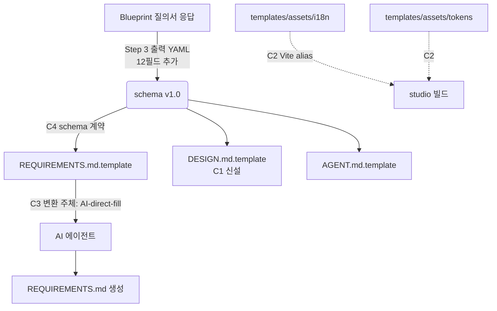

# spec-3-04: Phase-3 Ship Fix-up — Critical 4건 정리 + 정직 채점

## 📋 메타

| 항목 | 값 |
|---|---|
| **Spec ID** | `spec-3-04` |
| **Phase** | `phase-3` |
| **Branch** | `spec-3-04-ship-fixup` |
| **상태** | Planning |
| **타입** | Fix + Refactor + Docs |
| **Integration Test Required** | no |
| **작성일** | 2026-04-19 |
| **소유자** | Dennis |

## 📋 배경 및 문제 정의

### 현재 상황

phase-3 의 3개 spec (3-01 카탈로그 / 3-02 질의서 / 3-03 템플릿 세트) 모두 merge 완료. Phase PR #14 (`phase-3-app-blueprint` → `main`) 가 열려 있고, 본문은 **성공 기준 7/7 ✅** 로 자가 채점됨.

독립 Opus 감사(`/hk-phase-review`) 결과, 실제로는 **3 PASS / 2 PARTIAL / 2 FAIL** 이었음:

| 성공 기준 | 자가 채점 | 감사 결과 | 근거 |
|---|:---:|:---:|---|
| #1 카탈로그 variant 2+ | ✅ | ⚠ PARTIAL | 18페이지 중 9개가 variant 1개뿐 (※ 이 spec 에서는 이월 처리) |
| #3 자동 생성 가능 | ✅ | ⚠ PARTIAL | 변환 엔진/주체 미정의, placeholder 계약 불일치 |
| #5 DESIGN.md+REQ+AGENT 템플릿 | ✅ | ❌ FAIL | `DESIGN.md.template` 자체 부재 |
| #6 studio 가 assets 참조 | ✅ | ❌ FAIL | `templates/assets/**` 빈 `.gitkeep` 만. studio 는 여전히 구 경로 사용 |

본 spec 은 이 중 Critical 4건 (C1~C4) 을 한 번에 정리하여 **정직한 상태로 main 머지** 할 수 있게 한다.

### 문제점

1. **C1 (FAIL)**: `templates/DESIGN.md.template` 부재 — 성공 기준 #5 + `README.md:114` 약속과 불일치. phase-4/5 가 DESIGN.md 작성 가이드를 이 템플릿에서 가져가지 못함.
2. **C2 (FAIL)**: `templates/assets/{i18n,tokens,images}/` 가 빈 `.gitkeep` 만 존재. studio 는 여전히 `studio/src/i18n/`, `studio/tokens/` 를 직접 사용. Dogfooding 미이행.
3. **C3 (PARTIAL)**: `REQUIREMENTS.md.template` 의 Handlebars 식 `{{#each}}` 를 누가 처리하는지 부재. AI-direct-fill 인지 외부 도구인지 불명.
4. **C4 (PARTIAL)**: 템플릿이 요구하는 12개 필드 (`category`, `name`, `appName`, `pageCount`, `authMethod`, `socialProviders`, `sessionStrategy`, `defaultLocale`, `supportedLocales`, `defaultTheme`, `supportedThemes`, `componentPath`) 가 `blueprint-protocol.md` Step 3 출력 YAML 에 없음. 즉시 실행하면 누락 필드 발생.
5. **부속**: PR #14 본문은 여전히 "7/7 ✅" 로 표기됨. W5 (backlog 동기화 commit 누락), W6 (`.harness-uninstall-backup-*` 잔재) 도 phase 마감 전 정리.

### 해결 방안 (요약)

템플릿 누락 보완 (C1), Dogfooding 실행 (C2), 변환 엔진/schema 정합 명시 (C3, C4) 를 한 spec 에 묶어 **phase-3 산출물이 실제로 실행 가능한 상태** 로 만든다. 마지막에 PR #14 본문을 정직한 채점으로 수정하여 `main` 머지 후 후속 phase 가 잘못된 전제를 물려받지 않도록 한다.

## 📊 개념도

## 🎯 요구사항

### Functional Requirements

1. **FR1 (C1)**: `templates/DESIGN.md.template` 파일이 존재하며, Visual System / Component Stylings / Page Specifications / Design Tokens 섹션을 포함한다. `README.md:114` 디렉토리 트리와 일치한다.
2. **FR2 (C2)**: `studio/src/i18n/{ko,en}.json` 와 `studio/tokens/tokens*.json` 의 내용을 `templates/assets/i18n/`, `templates/assets/tokens/` 로 이주한다. studio 는 Vite alias (`@assets`) 를 통해 참조한다. `pnpm build` 와 `pnpm test` 가 PASS 한다.
3. **FR3 (C3)**: `schema/blueprint-protocol.md` 에 "변환 실행 주체 (Fill Executor)" 섹션이 추가되며, 다음을 명시한다:
   - 기본 주체: **AI 에이전트 direct-fill** (사람 개입 없이 질의서 출력 YAML → 템플릿 파일 생성)
   - placeholder 해석 규칙: `{{var}}`, `{{#each list}}...{{/each}}` 처리법 (예시 포함)
   - 대체 주체: Handlebars 스크립트 선택 시 실행 예시
4. **FR4 (C4)**: `schema/blueprint-protocol.md` Step 3 출력 YAML 이 다음 12개 필드를 포함하거나, `REQUIREMENTS.md.template` / `AGENT.md.template` 에서 해당 placeholder 를 제거한다:
   - Meta: `appName`, `name`, `pageCount`
   - Auth: `authMethod`, `socialProviders`, `sessionStrategy`
   - i18n: `defaultLocale`, `supportedLocales`
   - Theme: `defaultTheme`, `supportedThemes`
   - Page: `category` (페이지별), `componentPath` (페이지별)
5. **FR5 (부속)**: PR #14 본문의 성공 기준 블록을 `3 PASS / 2 PARTIAL / 2 FAIL` 로 수정하고, 각 기준별 근거 1 줄씩 명시. PARTIAL/FAIL 기준에 대해 "본 spec 에서 보완 / phase-5 이월" 을 명시.
6. **FR6 (부속)**: `.harness-uninstall-backup-20260417-135520/` 디렉토리 제거 (또는 `.gitignore` 추가). backlog 상태 동기화 commit 누락 문제에 대한 재발 방지 안내는 walkthrough 에 기록.

### Non-Functional Requirements

1. studio 기존 테스트 회귀 없음 (`pnpm test` / `pnpm build` PASS)
2. 기존 schema/templates 문서와 **용어 일관성** 유지 (Composite, Slot, Section 등)
3. 본 spec 범위는 **Critical 4건 + 부속 2건** 으로 한정. W3 variant 보강 등 다른 warning 은 이월.

## 🚫 Out of Scope

- **W3** 카탈로그 variant 2+ 보강 — spec-3-01 회귀, phase-5 PoC 에서 실사용 검증 후 판단
- **W2** spec ID 자릿수 통일 (`spec-3-01` vs `spec-3-001`) — 거버넌스 spec-x 로 별도
- **W8** 매핑 명세 예시 코드 정확도 재검토 — 실제 컴포넌트 명과 1:1 일치 검증은 후속 phase
- `tests/test-phase3-integration.sh` 와 같은 통합 테스트 스크립트 도입 — phase-5 PoC 에서 실제 Blueprint→REQUIREMENTS 변환을 돌릴 때 작성

## 🔍 Critique 결과

- 출처: `/hk-phase-review` 독립 Opus 감사 (phase-3 대상)
- 핵심 발견:
  1. PR #14 본문의 "7/7 ✅" 가 spec 자체 DoD 만 따라간 결과로 phase 성공 기준을 분해하지 않음
  2. `ls templates/` 한 번이면 드러날 DESIGN.md.template 부재가 방치됨
  3. Dogfooding 이 "구조 설계만" 으로 우회됨 — project_vision 의 직접적 후퇴
- 본 spec 에 **반영**: C1~C4 를 FR 로 승격. PR body 정직 채점을 부속 FR 로 포함.
- 본 spec 에 **이월**: W3 variant 보강, W2 ID 자릿수 통일 (Out of Scope 에 명시)

## ✅ Definition of Done

- [ ] FR1~FR6 모두 충족
- [ ] `pnpm --dir studio build` 와 `pnpm --dir studio test` PASS (C2 회귀 검증)
- [ ] PR #14 본문이 정직한 채점으로 갱신됨 (`3 PASS / 2 PARTIAL / 2 FAIL`)
- [ ] `walkthrough.md` 와 `pr_description.md` 작성 및 ship commit
- [ ] `spec-3-04-ship-fixup` 브랜치 push 완료
- [ ] 사용자 검토 요청 알림 완료 (PR #14 업데이트)
