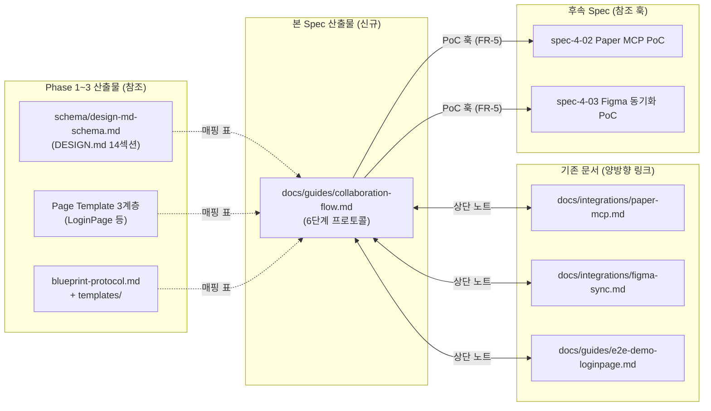

# Implementation Plan: spec-4-01

## 📋 Branch Strategy

- 신규 브랜치: `spec-4-01-collab-flow-protocol` (브랜치 이름 = spec 디렉토리 이름, `feature/` prefix 없음)
- 시작 지점: **`phase-4-collab-flow`** (phase base branch)
- PR 타겟: `phase-4-collab-flow` (phase 완료 시 `phase-4-collab-flow → main` 단일 Phase PR 로 통합)
- 첫 task 가 브랜치 생성을 수행함

## 🛑 사용자 검토 필요 (User Review Required)

> [!IMPORTANT]
> - [ ] **6 단계 명칭** — `Ideate / Extract / Blueprint / Compose / Render / Iterate` 를 최종 단계 이름으로 사용. 한국어 병기는 문서 내 각 절 헤더에서 처리 (예: "Stage 2. Extract — 시안 추출").
> - [ ] **3 역할 구분** — `Designer / Frontend / AI Agent`. AI 를 독립 역할로 명시하는 것은 업계 표준 대비 선도적 선택. 추후 PoC 에서 책임 분리가 실제로 유효함을 입증해야 함.
> - [ ] **문서 위치** — `docs/guides/collaboration-flow.md` (단일 문서). 역할별 분리 문서로 확장 시기는 Phase 5 PoC 이후로 미룸.

> [!WARNING]
> - [ ] **기존 `docs/guides/e2e-demo-loginpage.md` 과의 역할 구분** — e2e 문서는 "LoginPage 라는 구체 사례", 본 프로토콜은 "일반 협업 규칙". 상단 상호 참조 노트로 역할을 명확히 한다.
> - [ ] **phase-4.md 수정 여부** — 본 spec 범위 내에서는 수정하지 않음. spec-4-02 / spec-4-03 방향성 항목에 PoC 훅을 명시적으로 추가하는 것은 해당 spec 진행 시 반영.

## 🎯 핵심 전략 (Core Strategy)

### 아키텍처 컨텍스트



### 주요 결정

| 컴포넌트 | 전략 | 이유 |
|:---:|:---|:---|
| **문서 구조** | 단일 문서, 전문 → 개념도 → 6 단계 상세 → Phase 매핑 표 → 도구 부록 순 | 선형적 리딩. 신규 팀원이 위에서 아래로 한 번에 흡수 가능 |
| **도구 기술** | 본문은 중립 서술, 구체 도구는 부록 | NFR-3 확장성. Paper → 다른 MCP 로 교체 시 본문 불변 |
| **역할 구분** | 3 역할 (Designer / Frontend / AI Agent) | AI 가 1급 역할이 되는 것이 본 시스템의 차별점. 암묵적으로 두면 책임 경계가 무너짐 |
| **각 단계 서술 포맷** | 표 (입력/출력/주 역할/도구) + Done 체크리스트 | 협업 점검 포인트 (hand-off gate) 를 명시적으로 만든다 |
| **PoC 훅** | 앵커 링크 (`<a id="hook-*"></a>`) + 참조 표 | spec-4-02/03 의 `spec.md` 가 특정 훅을 한 줄로 인용 가능하게 함 |
| **cross-link** | 각 관련 문서 상단에 `> [!NOTE]` admonition | GitHub 렌더링에서 시각 구분, 본문 수정 최소화 |

## 📂 Proposed Changes

### 프로토콜 본문

#### [NEW] `docs/guides/collaboration-flow.md`

단일 신규 문서. 대략의 섹션 구성 (최종 결과물은 본문 작성 시 구체화):

```text
1. 서문 — 본 문서의 역할, 독자, 읽는 순서
2. 3 역할 정의 — Designer / Frontend / AI Agent 각자의 책임/도구 기본값
3. 6 단계 개요 — Ideate → Extract → Blueprint → Compose → Render → Iterate 전체 그림
4. 각 단계 상세 (§4.1 ~ §4.6)
   각 절 구성:
   - 목적 (1~2 문장)
   - 입력 (아티팩트 또는 상태)
   - 출력 (아티팩트 또는 상태)
   - 주 역할 (1차 책임자, 2차 지원)
   - 도구 (중립 명칭 + 부록 참조)
   - Done 기준 (체크리스트)
   - PoC 훅 (해당 시 앵커)
5. Phase 1~3 산출물 매핑 표
6. 부록 A: 도구 매핑 (Paper MCP / Figma / Tokens Studio)
7. 부록 B: 관련 문서 (cross-link)
```

### Cross-link 업데이트

#### [MODIFY] `docs/integrations/paper-mcp.md`
최상단 요약 다음에 삽입:
```markdown
> [!NOTE]
> 본 가이드는 [협업 Flow 프로토콜](../guides/collaboration-flow.md) 의 **Stage 2 (Extract)** 와 **Stage 5 (Render)** 에서 활용된다.
```

#### [MODIFY] `docs/integrations/figma-sync.md`
동일한 방식:
```markdown
> [!NOTE]
> 본 가이드는 [협업 Flow 프로토콜](../guides/collaboration-flow.md) 의 **Stage 2 (Extract)** 와 **Stage 6 (Iterate)** 에서 토큰 동기화 루트로 참조된다.
```

#### [MODIFY] `docs/guides/e2e-demo-loginpage.md`
상단에 "본 예시는 collaboration-flow 프로토콜의 **E2E 적용 사례** 이며, 프로토콜 정의는 [collaboration-flow.md](./collaboration-flow.md) 참조" 노트 추가.

### 변경하지 않는 것

- `backlog/phase-4.md` — 본 spec 에서 수정하지 않음. spec-4-02/03 이 착수될 때 각 spec 의 방향성 문단에서 PoC 훅을 명시 참조.
- `schema/*` — 기존 스키마 / 매핑 / 카탈로그는 읽기 전용 참조.
- `templates/*` — 변경 없음.

## 🧪 검증 계획 (Verification Plan)

### 단위 테스트

Docs-only 스펙으로 전통적 단위 테스트는 해당 없음. 대신 다음 정합성 검증을 수행한다.

### 대체 자동 검증

```bash
# 내부 상대 링크 유효성 (끊어진 참조 탐지, NFR-4)
# 프로젝트 기본 markdown 도구가 없으면 수동 검증으로 대체

# 옵션 A: 설치 없이 빠른 수동 grep
grep -Eo "\]\(([^)]+\.md[^)]*)\)" docs/guides/collaboration-flow.md \
  | sort -u

# 옵션 B: markdown-link-check (devDependency 없으면 skip 권장)
# npx --yes markdown-link-check docs/guides/collaboration-flow.md
```

링크 유효성은 Task 내에서 **수동 확인 + 한 차례 grep** 으로 대체한다 (docs-only 범위 가벼움).

### 수동 검증 시나리오

1. **Onboarding 시나리오** — 본 문서만 읽고 신규 디자이너/프론트가 "LoginPage 를 시작 → 코드 배포" 까지의 역할 순서를 재현 설명할 수 있다.
2. **AI Agent 실행 시나리오** — AI 가 `docs/guides/collaboration-flow.md` 를 컨텍스트로 로드했을 때 "지금 나는 Stage 3 Blueprint 실행 중" 을 인식할 수 있다.
3. **PoC 착수 시나리오** — spec-4-02 (Paper MCP) 착수 시, 본 문서에서 "Stage 5 Render 의 도구 훅" 을 한 번의 앵커 참조로 인용 가능하다.
4. **도구 교체 시나리오 (사고 실험)** — Paper MCP 를 다른 MCP 로 교체해도 본문은 수정 없이 부록만 갈아끼우면 된다.

## 🔁 Rollback Plan

- 단독 문서 + 기존 파일 상단 노트만 추가하는 변경이므로:
  - 새 파일 삭제: `git rm docs/guides/collaboration-flow.md`
  - 노트 추가 되돌리기: `git revert <commit>` 또는 Edit 복원
- 외부 시스템 / 빌드 파이프라인 영향 없음
- 데이터 / 상태 변경 없음

## 📦 Deliverables 체크

- [x] spec.md 작성
- [x] plan.md 작성 (이 파일)
- [ ] task.md 작성 (다음 단계)
- [ ] 사용자 Plan Accept 받음
- [ ] (실행 후) 모든 task 완료
- [ ] (실행 후) walkthrough.md / pr_description.md ship
