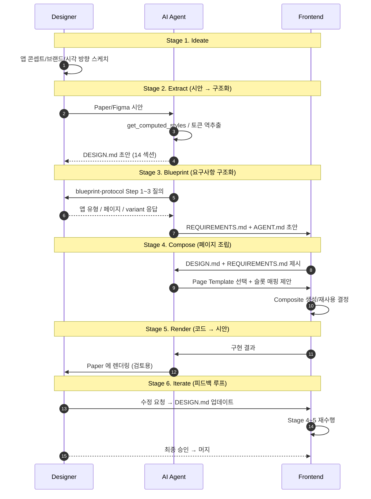

# spec-4-01: 협업 Flow 프로토콜

## 📋 메타

| 항목 | 값 |
|---|---|
| **Spec ID** | `spec-4-01` |
| **Phase** | `phase-4` |
| **Branch** | `spec-4-01-collab-flow-protocol` |
| **Base** | `phase-4-collab-flow` (phase base branch) |
| **상태** | Planning |
| **타입** | Docs |
| **Integration Test Required** | no |
| **작성일** | 2026-04-21 |
| **소유자** | Dennis |

## 📋 배경 및 문제 정의

### 현재 상황

Phase 1~3 에서 다음이 완성되었다:

- **Phase 1 (Foundation)** — tokens.json 파이프라인 / React 19 + TS + Tailwind 스튜디오 / `schema/design-md-schema.md` 14 섹션 스펙
- **Phase 2 (Page Template)** — `LoginPage / SignupPage / DashboardPage` 3계층 (Atoms / Composites / Templates) 아키텍처
- **Phase 3 (App Blueprint)** — `schema/page-catalog.md` 18 페이지 / `schema/blueprint-protocol.md` 3단계 질의 / `templates/{DESIGN,REQUIREMENTS,AGENT}.md.template` 3종 + `templates/assets/` i18n·tokens 리소스 분리 / `schema/design-component-mapping.md` DESIGN ↔ Component 매핑

그러나 이 재료들을 **누가 · 언제 · 어떤 순서로** 사용하는지에 대한 협업 프로토콜은 문서화되어 있지 않다.

### 문제점

1. **역할 공백**: Designer / Frontend 엔지니어 / AI Agent 사이의 책임 경계가 불명확. "DESIGN.md 는 누가 작성하는가? Blueprint 질의는 누가 실행하는가? 코드 리뷰는 누가 주도하는가?" 라는 기초 질문에 답할 근거가 없음.
2. **도구 섬 (Tool Islands)**: Paper MCP, Figma, Studio, Blueprint 프로토콜이 각각 독립된 reference 문서로만 존재. 한 바퀴를 도는 **왕복 플로우 (iterate)** 가 공백이라 실사용 시 재현 불가.
3. **PoC 의 검증 타겟 불명확**: spec-4-02 (Paper MCP 양방향 동기화) / spec-4-03 (Figma 토큰 동기화) 가 "어떤 프로토콜 훅을 검증하는가?" 라는 앵커 없이 착수되면 PoC 합격선이 임의적이 됨.
4. **업계 표준 부재**: Figma Dev Mode 는 "디자인 → 코드" 한 방향만 고려. AI 에이전트가 피드백 루프에 참여하는 프로토콜은 선례가 없음.

### 해결 방안 (요약)

`docs/guides/collaboration-flow.md` 를 **단일 진입점 문서**로 정의한다. Designer / Frontend / AI Agent 3 역할이 **6 단계 (Ideate → Extract → Blueprint → Compose → Render → Iterate)** 를 순회하는 프로토콜을 기술하고, 각 단계의 입력 / 출력 / 역할 / 도구 / Done 기준을 표로 명시한다. 도구는 중립적으로 서술하고 (Paper / Figma 등은 부록), Phase 1~3 산출물은 매핑 표로 연결한다. spec-4-02/03 은 본 문서의 특정 단계를 검증 대상으로 참조한다.

## 📊 개념도

## 🎯 요구사항

### Functional Requirements

1. **FR-1 프로토콜 문서 존재**: `docs/guides/collaboration-flow.md` 가 생성되고, 6 단계 × 3 역할 구조를 포함한다.
2. **FR-2 단계 기술 명세**: 각 단계마다 다음 5 필드가 표/리스트로 명시된다 — `입력 / 출력 / 주 역할 / 도구 / Done 기준 체크리스트`.
3. **FR-3 Phase 1~3 매핑**: Phase 1~3 의 핵심 산출물 (`tokens.json` / `Page Template` / `DESIGN.md.template` / `blueprint-protocol.md` 등) 이 어느 단계의 입력 / 출력인지 매핑 표로 표시된다.
4. **FR-4 도구 중립 서술 + 구체 부록**: 본문은 "시안 도구", "토큰 동기화 도구" 등 추상 명칭 사용. 구체 구현 (Paper MCP / Figma / Tokens Studio) 은 별도 부록 섹션에서 다룬다.
5. **FR-5 PoC 훅 명시**: spec-4-02 (Paper MCP 왕복) 와 spec-4-03 (Figma 토큰 동기화) 가 검증할 단계/훅을 본문에서 **명시적 앵커** 로 노출한다 (예: ``).
6. **FR-6 관련 문서 양방향 링크**: 기존 `docs/integrations/paper-mcp.md`, `docs/integrations/figma-sync.md`, `docs/guides/e2e-demo-loginpage.md` 에 본 프로토콜을 참조하는 상단 노트를 추가한다.

### Non-Functional Requirements

1. **NFR-1 언어**: 본문 한국어 (CLAUDE.md §언어 규약). 기술 용어 / 파일 경로 / 도구명은 영어 허용.
2. **NFR-2 Markdown 호환성**: GitHub Flavored Markdown 문법 준수. 표 / mermaid / `> [!NOTE]` admonition 사용 가능.
3. **NFR-3 확장성**: 새 도구 (예: Sketch, Builder.io 등) 가 추가될 때 본문 수정 없이 **부록에만 추가**로 대응 가능해야 한다.
4. **NFR-4 내부 링크 유효성**: 문서 내 상대 링크 (`../integrations/paper-mcp.md` 등) 가 실제 파일에 연결되어야 한다. 끊어진 링크 0 개.

## 🚫 Out of Scope

- **Paper MCP / Figma 실제 PoC 실행** → spec-4-02, spec-4-03 의 작업 범위
- **새로운 도구 연동 구현** (예: Sketch / Zeplin) → 필요 시 별도 phase/spec
- **역할별 심화 가이드 문서** (`docs/roles/designer.md` 등) → 본 프로토콜 사용 후 필요성이 확인되면 분리 spec
- **자동화 스크립트** (예: "Extract 단계를 자동 실행하는 CLI") → 프로토콜은 사람/AI 실행 순서 정의. 자동화는 Studio v1 (phase-6) 범위
- **기존 Phase 1~3 산출물 변경** → 본 spec 은 참조만, 수정 없음

## 🔍 Critique 결과

미실행 (`/hk-spec-critique` 선택적, 필요 시 Plan Accept 전 실행 가능)

## ✅ Definition of Done

- [ ] `docs/guides/collaboration-flow.md` 생성 — 6단계 × 5필드 (입력/출력/역할/도구/Done) 완비
- [ ] Phase 1~3 산출물 매핑 표 포함
- [ ] 도구 부록 섹션 (Paper MCP / Figma / Tokens Studio) 포함
- [ ] PoC 훅 앵커 (FR-5) 노출
- [ ] `docs/integrations/paper-mcp.md` / `docs/integrations/figma-sync.md` / `docs/guides/e2e-demo-loginpage.md` 에 상단 참조 노트 추가
- [ ] 내부 상대 링크 유효성 수동 확인 (끊어진 링크 0)
- [ ] `walkthrough.md` 와 `pr_description.md` 작성 및 ship commit
- [ ] `spec-4-01-collab-flow-protocol` 브랜치 push 완료 (base = `phase-4-collab-flow`)
- [ ] 사용자 검토 요청 알림 완료
